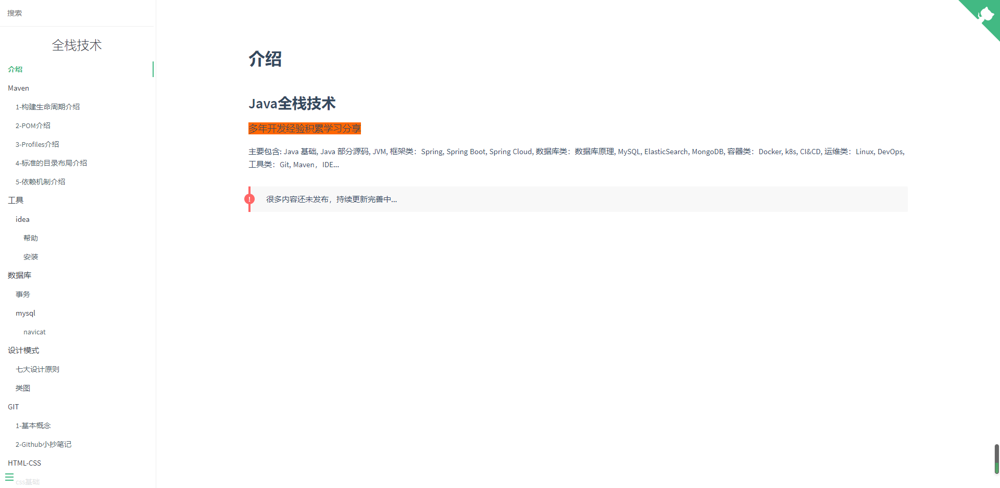

# 项目介绍

## 详细点击进入 [全栈技术首页](https://yaoxingle.github.io/fullstack/#/)



## 内容大纲

* [介绍](https://yaoxingle.github.io/fullstack/#/introduce)
* Java
  * 1-运行你的第一个java程序
    * [1-1入门](https://yaoxingle.github.io/fullstack/#/java/1/1-1入门.md)
    * [1-2启动单文件源代码程序](https://yaoxingle.github.io/fullstack/#/java/1/1-2启动单文件源码程序)
    * [1-3Jshell(Java Shell Tool)](https://yaoxingle.github.io/fullstack/#/java/1/1-3Jshell)
  * 2-了解Java语言
    * [2-1对象、类、接口、包和继承](https://yaoxingle.github.io/fullstack/#/java/2/2-1对象-类-接口-包-集成)
    * 2-2Java语言基础知识
      * [2-2-1创建变量名](https://yaoxingle.github.io/fullstack/#/java/2/2-2-1创建变量名)
      * [2-2-2在程序中创建基本类型变量](https://yaoxingle.github.io/fullstack/#/java/2/2-2-2在程序中创建基本类型变量)
      * [2-2-3在程序中创建数组](https://yaoxingle.github.io/fullstack/#/java/2/2-2-3在程序中创建数组)
      * [2-2-4使用Var类型标识符](https://yaoxingle.github.io/fullstack/#/java/2/2-2-4使用Var类型标识符)
      * [2-2-5运算符](https://yaoxingle.github.io/fullstack/#/java/2/2-2-5运算符)
      * [2-2-6表达式和语句和块](https://yaoxingle.github.io/fullstack/#/java/2/2-2-6表达式和语句和块)
      * [2-2-7控制流语句](https://yaoxingle.github.io/fullstack/#/java/2/2-2-7控制流语句)
      * [2-2-8使用Switch语句进行分支](https://yaoxingle.github.io/fullstack/#/java/2/2-2-8使用Switch语句进行分支)
      * [2-2-9使用Switch表达式进行分支](https://yaoxingle.github.io/fullstack/#/java/2/2-2-9使用Switch表达式进行分支)
    * 2-3使用记录建模不可变数据
    * 2-4类和对象
    * 2-5数字和字符串
    * 2-6继承
    * 2-7接口
    * 2-8泛型
    * 2-9Lambda 表达式
    * 2-10注解
    * 2-11包
    * 2-12表达式匹配
    * 2-13异常
  * 3-精通的API
    * 3-1集合框架
    * 3-2Stream Api
  * 4-组织你的程序
    * 4-1模块
    * 4-2使用JLink创建运行时和应用程序映像
  * 5-了解Jvm
    * 5-1核心JDK工具
    * 5-2监控工具
    * 5-4JPackage
    * 5-5安全工具
    * 5-6故障诊断工具
    * 5-7垃圾回收器
    * 5-8Hotspot中的数据共享
  * jvm
    * [垃圾回收流程](https://yaoxingle.github.io/fullstack/#/java/jvm/flow)
    * [垃圾回收器](https://yaoxingle.github.io/fullstack/#/java/jvm/garbage-collection)
    * [垃圾回收算法](https://yaoxingle.github.io/fullstack/#/java/jvm/algorithm)
    * [类加载过程](https://yaoxingle.github.io/fullstack/#/java/jvm/classloader)
    * [运行时数据区](https://yaoxingle.github.io/fullstack/#/java/jvm/runtimedata)
  * 数据结构
    * [基础](https://yaoxingle.github.io/fullstack/#/java/struct/base)
    * [队列](https://yaoxingle.github.io/fullstack/#/java/struct/queue)
    * [链表](https://yaoxingle.github.io/fullstack/#/java/struct/linked)
    * [栈](https://yaoxingle.github.io/fullstack/#/java/struct/stack)
  * 线程
    * [基础](https://yaoxingle.github.io/fullstack/#/java/thread/base)
    * [多线程](https://yaoxingle.github.io/fullstack/#/java/thread/multi)
    * [线程池](https://yaoxingle.github.io/fullstack/#/java/thread/pool)
* IDEA
* Spring Framework
  * [概述](https://yaoxingle.github.io/fullstack/#/spring-framework/0-overview)
  * 1-Spring-Core
    * 1-1The Ioc Container
      * [1-1-1Spring IoC容器和Bean简介](https://yaoxingle.github.io/fullstack/#/spring-framework/core/1-IoC容器/1-1-1SpringIoC容器和Bean简介)

      * [1-1-2Container概述](https://yaoxingle.github.io/fullstack/#/spring-framework/core/1-IoC容器/1-1-2Container介绍)

      * [1-1-3Bean概述](https://yaoxingle.github.io/fullstack/#/spring-framework/core/1-IoC容器/1-1-3Bean概述)

      * [1-1-4Dependencies概述](https://yaoxingle.github.io/fullstack/#/spring-framework/core/1-IoC容器/1-1-4Dependencies概述)

      * [1-1-5Bean的作用域](https://yaoxingle.github.io/fullstack/#/spring-framework/core/1-IoC容器/1-1-5Bean的作用域)

      * [1-1-6Customizing the Nature of a Bean](https://yaoxingle.github.io/fullstack/#/spring-framework/core/1-IoC容器/1-1-6CustomizingTheNatureofaBean)

      * [1-1-7Bean Definition集成](https://yaoxingle.github.io/fullstack/#/spring-framework/core/1-IoC容器/1-1-7Bean-Definition集成)

      * [1-1-8容器扩展点](https://yaoxingle.github.io/fullstack/#/spring-framework/core/1-IoC容器/1-1-8容器扩展点)

      * [1-1-9基于注解的容器配置](https://yaoxingle.github.io/fullstack/#/spring-framework/core/1-IoC容器/1-1-9基于注解的容器配置)

      * [1-1-10Bean的作用域](https://yaoxingle.github.io/fullstack/#/spring-framework/core/1-IoC容器/1-1-10Dependencies介绍)

      * [1-1-11使用JSR330标准注解](https://yaoxingle.github.io/fullstack/#/spring-framework/core/1-IoC容器/1-1-11使用JSR330标准注解)

      * [1-1-12基于Java代码中容器配置](https://yaoxingle.github.io/fullstack/#/spring-framework/core/1-IoC容器/1-1-12基于Java代码中容器配置)

      * [1-1-13Environment Abstraction](https://yaoxingle.github.io/fullstack/#/spring-framework/core/1-IoC容器/1-1-13EnvironmentAbstraction)

      * [1-1-14注册一个LoadTimeWeaver](https://yaoxingle.github.io/fullstack/#/spring-framework/core/1-IoC容器/1-1-14注册一个LoadTimeWeaver)

      * [1-1-15ApplicationContext的附加功能](https://yaoxingle.github.io/fullstack/#/spring-framework/core/1-IoC容器/1-1-15ApplicationContext的附加功能)

      * [1-1-16BeanFactory](https://yaoxingle.github.io/fullstack/#/spring-framework/core/1-IoC容器/1-1-16BeanFactory)
    * 1-2Resources
    * 1-3Validation,Data Binding,and Type Conversion
    * 1-4Spring Expression Language(SpEL)
    * 1-5Aspect Oriented Programming with Spring
    * 1-6Spring AOP APIS
    * 1-7Null-safety
    * 1-8Data Buffers And Codecs
    * 1-9Logging
    * 1-10附录
  * 2-Testing

    * 2-1简介
    * 2-2单元测试
    * 2-3继承测试
    * 2-4更多资源
  * 3-Data Access

    * 3-1事物管理
    * 3-2DAO Support
    * 3-3JDBC访问数据
    * 3-4R2DBC访问数据
    * 3-5获取自动生成的键
    * 3-6ORM数据访问
    * 3-7Object-XML Mappers
    * 3-8服务
      * 3-8-1
      * 3-8-1
  * 4-Web Servlet

    * 4-1Spring Web MVC

      * 4-1-1DispatcherServlet

      * 4-1-2Filters

      * 4-1-3注解Controllers

      * 4-1-4Functional Endpoints

      * 4-1-5URI 连接

      * 4-1-6异步的请求

      * 4-1-7CORS跨域共享资源

      * 4-1-8Web Security

      * 4-1-9HTTP缓存

      * 4-1-10View技术

      * 4-1-11Mvc Config

      * 4-1-12HTTP/2
    * 4-2REST clients
    * 4-3Testing
    * 4-4WebSockets
    * 4-5其他Web框架
  * 5-Integration 集成

    * 5-1REST Endpoints
    * 5-2Web Services
    * 5-3EJB
    * 5-4JMS
    * 5-5JMX
    * 5-6Email
    * 5-7任务调度
    * 5-9缓存
    * 5-10附录
  * 6-其他语言支持
    * 6-1Kotlin
    * 6-2Apache Grovvy
    * 动态语言支持
  * 7-附录
  * 7-1Spring Properties
* SpringBoot
  * 1入门指南
  * 2-基于SpringBoot开发
  * 3-SpringBoot特性
  * 4-Spring Boot Actuator:生产特性
  * 5-部署SpringBoot程序
  * 6-SpringBoot CLI 脚手架
  * 7-附录
    * 7-1Common Application Properties
    * 7-2Configuration Metadata
    * 7-3Auto-configuration Classes
    * 7-4Test Auto-configuration Annotations
    * 7-5The Executable Jar Format
    * 7-6 依赖版本说明
* GIT
  * [1-基本概念](https://yaoxingle.github.io/fullstack/#/git/1-Git-About)
  * [2-Github小抄笔记](https://yaoxingle.github.io/fullstack/#/git/2-github-cheat-sheet)
* Maven
  * [1-构建生命周期介绍](https://yaoxingle.github.io/fullstack/#/maven/1-Build-Lifecycle)
  * [2-POM介绍](https://yaoxingle.github.io/fullstack/#/maven/2-POM)
  * [3-Profiles介绍](https://yaoxingle.github.io/fullstack/#/maven/3-Profiles)
  * [4-标准的目录布局介绍](https://yaoxingle.github.io/fullstack/#/maven/4-Standard-Directory-Layout)
  * [5-依赖机制介绍](https://yaoxingle.github.io/fullstack/#/maven/5-Dependency)
* Apache
* Nginx
* Mybatis
* 数据库
* 设计模式
  * [七大设计原则](https://yaoxingle.github.io/fullstack/#/designparent/seven-principles)
  * [类图](https://yaoxingle.github.io/fullstack/#/designparent/UML/class-image)
* Html
  * [css基础](https://yaoxingle.github.io/fullstack/#/html-css/css-base)
  * [样式选择器](https://yaoxingle.github.io/fullstack/#/html-css/css-selector)
  * [div](https://yaoxingle.github.io/fullstack/#/html-css/div)
  * [响应式布局](https://yaoxingle.github.io/fullstack/#/html-css/Bootstrap)
  * [bootstrap](https://yaoxingle.github.io/fullstack/#/html-css/Responsive-Layout)
* Css
* Javascript
  * [基础](https://yaoxingle.github.io/fullstack/#/javascript/base)
* SpringCloud
* Redis
  * [基础](https://yaoxingle.github.io/fullstack/#/redis/base)
* Kafka
  * [基础](https://yaoxingle.github.io/fullstack/#/kafka/base)
  * [配置参数](https://yaoxingle.github.io/fullstack/#/kafka/config)
  * [存储机制](https://yaoxingle.github.io/fullstack/#/kafka/storage)


## 如何本地运行

### 快速开始

建议`docsify-cli`全局安装，有助于在本地初始化和预览网站。

```bash
npm i docsify-cli -g
```

### 预览您的网站

运行本地服务器`docsify serve`。您可以在浏览器中预览您的网站`http://localhost:3000`。

```bash
docsify serve docs
```

有关 的更多用例`docsify-cli`，请转到[docsify-cli 文档](https://github.com/docsifyjs/docsify-cli)。