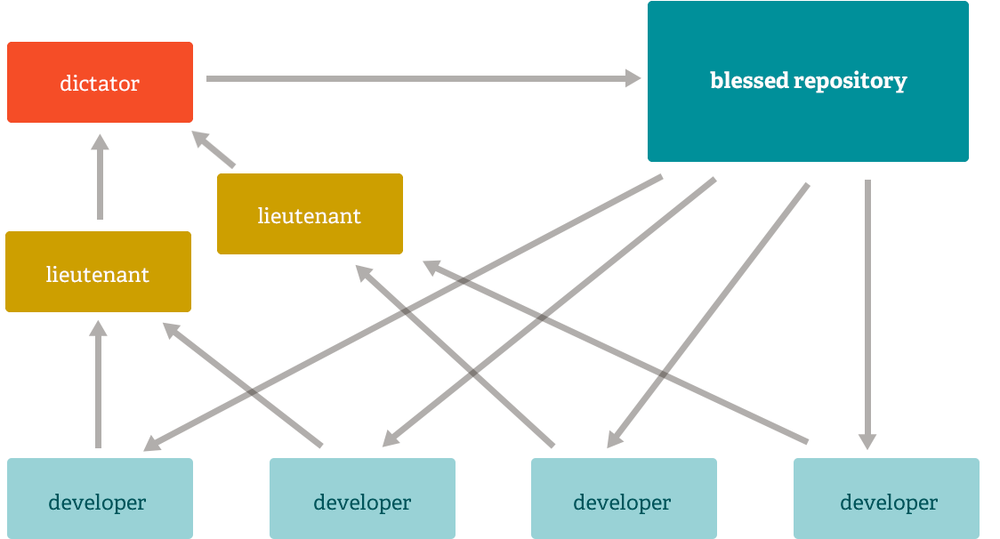

Git是一个免费的、开源的分布式版本控制系统，旨在快速高效地处理从小型到大型的所有项目。

Git很容易学习，占用空间很小，性能非常快。它比配置管理工具(如Subversion、CVS、Perforce和ClearCase)更出色，具有便宜的本地分支、方便的分段区域和多个工作流等特性。

## 1.1分支和合并

真正使它从几乎所有其他 SCM 中脱颖而出的 Git 功能是它的分支模型。

Git 允许并鼓励您拥有多个可以完全相互独立的本地分支。这些开发线的创建、合并和删除只需几秒钟。

这意味着您可以执行以下操作：

- **无摩擦上下文切换**。创建一个分支来尝试一个想法，提交几次，切换回你分支的地方，应用补丁，切换回你正在试验的地方，然后合并它。
- **基于角色的代码行**。拥有一个始终只包含用于生产的分支，另一个将工作合并到其中进行测试，以及几个较小的用于日常工作的分支。
- **基于特征的工作流程**。为您正在处理的每个新功能创建新分支，以便您可以在它们之间无缝地来回切换，然后在该功能合并到主线时删除每个分支。
- **一次性实验**。创建一个分支进行试验，意识到它不会工作，然后删除它 - 放弃工作 - 没有其他人看到它（即使你在此期间推送了其他分支）。

值得注意的是，当您推送到远程存储库时，您不必推送所有分支。您可以选择仅共享一个分支、其中几个分支或全部分支。这往往使人们可以自由地尝试新想法，而不必担心必须计划如何以及何时将其合并或与他人共享。

有一些方法可以使用其他系统来完成其中的一些工作，但所涉及的工作更加困难且容易出错。Git 使这个过程变得异常简单，并且改变了大多数开发人员在学习它时的工作方式。

## 1.2小而快

**Git 很快**。使用 Git，几乎所有操作都在本地执行，这使它在经常需要与某处服务器通信的集中式系统上具有巨大的速度优势。

Git 是为在 Linux 内核上工作而构建的，这意味着它从一开始就必须有效地处理大型存储库。Git 是用 C 编写的，减少了与高级语言相关的运行时开销。从一开始，速度和性能就是 Git 的主要设计目标。

### 对比

让我们看看常见操作如何与 Subversion 相抗衡，Subversion 是一个类似于 CVS 或 Perforce 的常见集中式版本控制系统。*越小越快。*

|  |  |  |  |  |  |
| ------------------------------------------------------------ | ------------------------------------------------------------ | ------------------------------------------------------------ | ------------------------------------------------------------ | ------------------------------------------------------------ | ------------------------------------------------------------ |
| ) | ) | ) |  |  |  |

为了进行测试，在同一可用区中设置了大型 AWS 实例。两台机器上都安装了 Git 和 SVN，将 Ruby 存储库复制到 Git 和 SVN 服务器上，并在两者上执行通用操作。

在某些情况下，命令不完全匹配。在这里，尝试对最小公分母进行匹配。例如，“提交”测试还包括推送 Git 的时间，尽管大多数情况下您实际上不会在提交后立即推送到服务器，因为这两个命令在 SVN 中无法分开。

所有这些时间都以秒为单位。

| 操作         |                                                      | Git  |  SVN   |        |
| ------------ | ---------------------------------------------------- | :--: | :----: | ------ |
| 提交文件 (A) | 添加、提交和推送 113 个修改过的文件 (2164+, 2259-)   | 0.64 |  2.60  | 4倍    |
| 提交图像 (B) | 添加、提交和推送一千个 1 kB 图像                     | 1.53 | 24.70  | 16倍   |
| Diff Current | 与上次提交相比，Diff 187 更改了文件（1664+、4859-）  | 0.25 |  1.09  | 4倍    |
| Diff Recent  | 与 4 次提交的差异（269 次更改/3609+,6898-）          | 0.25 |  3.99  | 16倍   |
| Diff Tags    | 区分两个标签（v1.9.1.0/v1.9.3.0）                    | 1.17 | 83.57  | 71x    |
| Log (50)     | 最近 50 次提交的日志（19 kB 输出）                   | 0.01 |  0.38  | 31倍   |
| Log (全部)   | 所有提交的日志（26,056 次提交 - 9.4 MB 的输出）      | 0.52 | 169.20 | 325倍  |
| Log （文件） | 单个文件的历史记录（array.c – 483 revs）             | 0.60 | 82.84  | 138 倍 |
| Update       | 拉取A 业务的提交 （更改了 113 个文件，2164+，2259-） | 0.90 |  2.82  | 3倍    |
| Blame        | 单个文件的行注释（array.c）                          | 1.91 |  3.04  | 1x     |

请注意，这是 SVN 的最佳情况——一个没有负载的服务器，与客户端机器有千兆连接。如果连接速度较慢，几乎所有这些时间对于 SVN 来说都会更糟，而许多 Git 时间不会受到影响。

很明显，在很多这些常见的版本控制操作中，**Git 比 SVN 快一两个数量级**，即使在 SVN 的理想条件下也是如此。

Git 较慢的一个地方是在初始克隆操作中。在这里，Git 正在下载整个历史记录，而不仅仅是最新版本。如上图所示，对于仅执行一次的操作，它的速度并不慢。

| **Operation** |                                                     | Git* |  Git  |  SVN  |
| ------------- | --------------------------------------------------- | :--: | :---: | :---: |
| Clone         | Git 中的克隆和浅层克隆 (*)  对比  SVN 中的检出      | 21.0 | 107.5 | 14.0  |
| 大小 (MB)     | 克隆/签出后客户端数据和文件的总大小（以 MB 为单位） |      | 181.0 | 132.0 |

值得注意的是，客户端的数据大小非常相似，即使 Git 还拥有项目整个历史记录的每个文件的每个版本。这说明了它在客户端压缩和存储数据的效率。

## 1.3分散式

任何分布式 SCM（包括 Git）的最佳特性之一就是它是分布式的。这意味着不是对源代码的当前提示进行“检出”，而是对整个存储库进行“克隆”。

### 1.3.1多个备份

这意味着即使您使用集中式工作流程，每个用户基本上都拥有主服务器的完整备份。在发生崩溃或损坏的情况下，这些副本中的每一个都可以向上推送以替换主服务器。实际上，除非存储库只有一个副本，否则 Git 不会出现单点故障。

### 1.3.2任何工作流

由于Git的分布式特性和出色的分支系统，可以相对轻松地实现几乎无穷无尽的工作流。

#### 1.3.2.1Subversion-Style Workflow

集中式工作流非常常见，特别是从集中式系统转换过来的人。如果在上次获取之后有人已经推送了，Git将不允许您推送，所以一个集中的模型可以让所有开发人员都推送到相同的服务器上。

#### 1.3.2.2集成管理器工作流

另一个常见的Git工作流涉及集成管理器——一个提交到“幸运的”存储库的人。然后，许多开发人员从该存储库中克隆出来，推送到他们自己的独立存储库中，并要求集成人员将他们的更改拉进来。这是在开源或GitHub存储库中经常看到的开发模型类型。

#### 1.3.2.3独裁者和副官工作流

对于更大规模的项目，像 Linux 内核那样的开发工作流通常是有效的。在这个模型中，一些人（“副官”）负责项目的特定子系统，他们合并与该子系统相关的所有更改。另一个集成者（“独裁者”）可以仅从他/她的副手那里提取更改，然后推送到“有福的”存储库，然后每个人都可以再次从中克隆。

## 1.4数据保障

Git使用的数据模型确保了项目每一个比特的加密完整性。每个文件和提交都被校验和，并在检出时通过校验和检索。除了您输入的位数之外，不可能从Git中得到任何东西。

如果不更改Git存储库中的任何文件、日期、提交消息或任何其他数据，也不可能不更改其后面所有内容的id。这意味着，如果您有一个提交ID，您不仅可以确保您的项目与提交时完全相同，而且可以确保其历史中没有任何更改。

大多数集中式版本控制系统默认不提供这样的完整性。

## 1.4暂存区

与其他系统不同，Git 有一个叫做“暂存区”或“索引”的东西。这是一个中间区域，可以在完成提交之前格式化和审查提交。

Git与其他工具不同的一点是，它可以快速放置一些文件并提交它们，而无需在工作目录中提交所有其他修改过的文件，也不必在提交期间在命令行中列出它们。

这允许您仅暂存已修改文件的部分。在您意识到忘记提交其中一个之前对文件进行两次逻辑上不相关的修改的日子已经一去不复返了。现在，您可以暂存当前提交所需的更改，并暂存下一次提交的其他更改。此功能可根据需要扩展到对文件进行尽可能多的不同更改。

当然，如果您不想要那种控制，Git 也可以很容易地忽略此功能——只需在提交命令中添加一个“-a”，以便将所有文件的所有更改添加到暂存区。

## 1.5免费和开源

Git 在[GNU 通用公共许可证 2.0 版](https://opensource.org/licenses/GPL-2.0)下发布，这是一个 [开源许可证](https://opensource.org/docs/osd)。Git 项目选择使用 GPLv2 来保证您共享和更改自由软件的自由——以确保该软件对其所有用户都是免费的。

但是，我们确实限制使用术语“Git”和 [logs](https://git-scm.com/downloads/logos)以避免混淆。有关详细信息，请参阅我们的[商标](https://git-scm.com/trademark)政策。