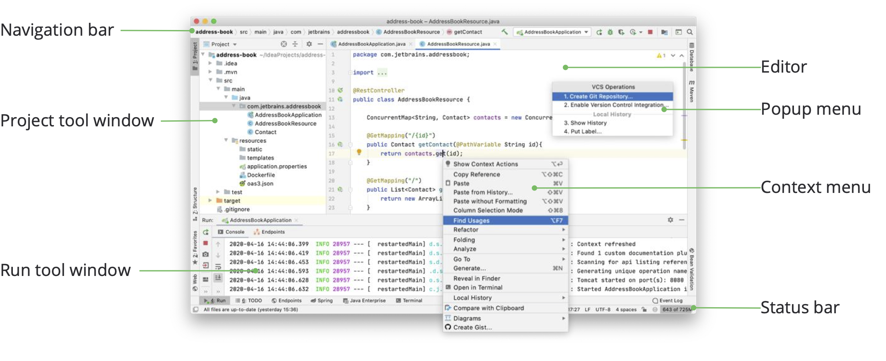
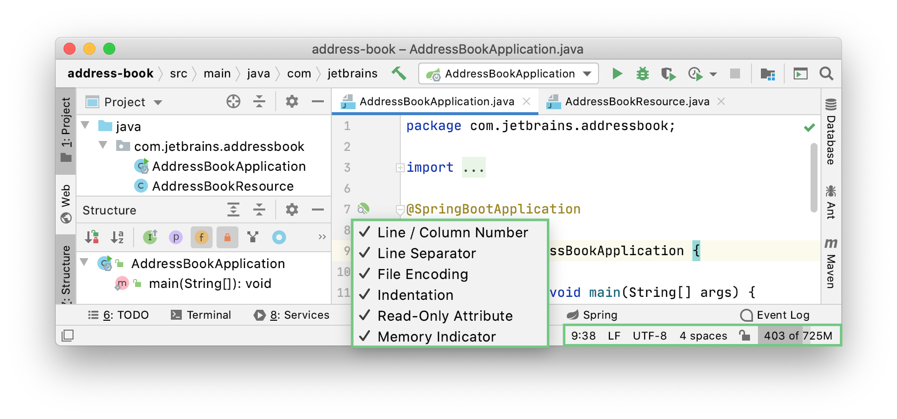
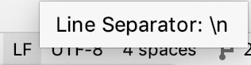

您可以使用

首次运行 IntelliJ IDEA 时，需要执行一些步骤来完成安装、自定义实例并开始使用 IDE。[插件](https://www.jetbrains.com/help/idea/2021.1/managing-plugins.html)、IntelliJ IDEA 版本和配置设置，您的 IDE 的外观和行为可能会有所不同。

## 编辑

选中焦点。Escape

使用editor阅读、编写和探索您的源代码。

## 导航栏

选中焦点： Alt+Home

显示/隐藏: **View | Appearance | Navigation Bar**

顶部的导航栏是[项目工具窗口](https://www.jetbrains.com/help/idea/2021.1/project-tool-window.html) **工作区**工具窗口的快速替代品，您可以在其中导航项目结构并打开文件进行编辑。

> 如果启用了[VCS 集成](https://www.jetbrains.com/help/idea/2021.1/version-control-integration.html)，导航栏中的项目会根据[VCS 文件状态颜色](https://www.jetbrains.com/help/idea/2021.1/file-status-highlights.html)突出显示。

使用导航栏右侧的按钮来build  、run 和debug您的应用程序，访问您的project structure settings，并执行基本的版本控制操作（如果配置了[版本控制集成](https://www.jetbrains.com/help/idea/2021.1/version-control-integration.html)）。它还包含**Run Anything**  （按Ctrl两次）和**Search Everywhere** （按Shift两次)的按钮。

> 默认情况下，带有用于打开和保存文件、撤消和重做操作的按钮的主工具栏是隐藏的。要显示它，请选择**View | Appearance | Toolbar**。

## 状态栏

显示/隐藏：** **View | Appearance | Status Bar****

当您将鼠标指针悬停在主窗口底部状态栏的左侧部分时，会显示最新的事件消息和操作说明。单击状态栏中的消息以在 **Event Log**打开它。当您搜索问题的解决方案或需要将其添加到支持工单或 IntelliJ IDEA 问题跟踪器时，右键单击状态栏中的消息并选择**复制**以粘贴消息文本。

使用快速访问按钮或在 [tool windows](https://www.jetbrains.com/help/idea/2021.1/guided-tour-around-the-user-interface.html#tool-windows) 之间切换并[hide the tool window bars](https://www.jetbrains.com/help/idea/2021.1/tool-windows.html#show_hide_tool_window_bars)。

状态栏还显示后台任务的进度。您可以单击以显示**Background Tasks** 管理器。

状态栏的右侧部分包含指示整个项目和 IDE 状态并提供对各种设置的访问的小部件。根据[插件](https://www.jetbrains.com/help/idea/2021.1/managing-plugins.html)集和配置设置，小部件集可以更改。右键单击状态栏以选择要显示或隐藏的小部件。

| 小工具                                                       | 描述                                                         |
| ------------------------------------------------------------ | ------------------------------------------------------------ |
| **52:11**                                                    | 显示编辑器中当前插入符号位置的行号和列号。单击数字将插入符号移动到特定的行和列。如果在编辑器中选择代码片段，IntelliJ IDEA 还会显示所选片段中的字符数和换行符。 |
|        | 显示用于在当前文件中[换行的行尾](https://www.jetbrains.com/help/idea/2021.1/configuring-line-endings-and-line-separators.html)。单击此小部件可更改行分隔符。 |
|          | 显示用于查看当前文件的[编码](https://www.jetbrains.com/help/idea/2021.1/encoding.html)。单击小部件以使用其他编码。 |
| Column                                                       | 表示为当前编辑器选项卡启用了[列选择模式](https://www.jetbrains.com/help/idea/2021.1/multicursor.html#column_selection)。您可以按Alt+Shift+Insert切换它。 |
|   | 单击以锁定文件以防止编辑（将其设置为只读）或在要编辑文件时将其解锁。 |
|  | 如果启用了[版本控制集成](https://www.jetbrains.com/help/idea/2021.1/version-control-integration.html)，此小部件将显示当前的 VCS 分支。单击它可以[管理 VCS 分支](https://www.jetbrains.com/help/idea/2021.1/manage-branches.html)。 |
|  | 显示当前文件中使用的[缩进样式](https://www.jetbrains.com/help/idea/2021.1/working-with-source-code.html#tabs_indents)。单击以配置当前文件类型的选项卡和缩进设置或禁用当前项目中的缩进检测。 |
|  | 显示 IntelliJ IDEA 在堆内存总量中消耗的内存量。有关详细信息，请参阅[增加 IDE 的内存堆](https://www.jetbrains.com/help/idea/2021.1/increasing-memory-heap.html)。 |

## 工具窗口

显示/隐藏：**View | Tool Windows**

[工具窗口](https://www.jetbrains.com/help/idea/2021.1/tool-windows.html)提供补充编辑代码的功能。例如，“[项目”工具窗口](https://www.jetbrains.com/help/idea/2021.1/project-tool-window.html)向您显示[项目](https://www.jetbrains.com/help/idea/2021.1/project-tool-window.html)的结构，而“[运行”](https://www.jetbrains.com/help/idea/2021.1/run-tool-window.html)工具窗口则显示您运行应用程序时的输出。

默认情况下，工具窗口停靠在主窗口的两侧和底部。您可以[根据需要对它们](https://www.jetbrains.com/help/idea/2021.1/manipulating-the-tool-windows.html)进行[排列](https://www.jetbrains.com/help/idea/2021.1/manipulating-the-tool-windows.html)、取消停靠、调整大小、隐藏等。右键单击工具窗口的标题或单击其排列选项的标题。

您可以[指定快捷方式](https://www.jetbrains.com/help/idea/2021.1/configuring-keyboard-and-mouse-shortcuts.html)以快速访问您经常使用的工具窗口。其中一些默认有快捷方式。例如，要打开 [Project tool window](https://www.jetbrains.com/help/idea/2021.1/project-tool-window.html)，请按Alt+1，要打开 [Terminal](https://www.jetbrains.com/help/idea/2021.1/terminal-emulator.html) tool window工具窗口，请按Alt+F12。要从编辑器跳转到最后一个活动工具窗口，请按F12。

## 上下文菜单

您可以右键单击界面的各种元素以查看当前上下文中可用的操作。例如，在[Project tool window](https://www.jetbrains.com/help/idea/2021.1/project-tool-window.html)右键单击文件以查看与该文件相关的操作，或在编辑器中右键单击以查看适用于当前代码片段的操作。

大多数这些操作也可以从屏幕顶部的主菜单或主窗口执行。带有快捷方式的操作会在操作名称旁边显示快捷方式。

## 弹出菜单

弹出菜单提供对与当前上下文相关的操作的快速访问。以下是一些有用的弹出菜单及其快捷方式：

- `Alt+Insert`打开**生成**弹出窗口以根据上下文生成样板代码。
- `Ctrl+Alt+Shift+T`打开**Refactor This**弹出窗口，其中包含上下文可用的[重构](https://www.jetbrains.com/help/idea/2021.1/refactoring-source-code.html)列表。
- `Alt+Insert`在[Project 工具窗口中](https://www.jetbrains.com/help/idea/2021.1/project-tool-window.html)打开**New**弹出[窗口](https://www.jetbrains.com/help/idea/2021.1/project-tool-window.html)，用于将新文件和目录添加到您的项目中。
- `Alt+``打开**VCS 操作**弹出窗口，其中包含适用于您的[版本控制系统的](https://www.jetbrains.com/help/idea/2021.1/version-control-integration.html)上下文可用操作。

您可以使用常用操作的[快速列表](https://www.jetbrains.com/help/idea/2021.1/customize-actions-menus-and-toolbars.html#configure_quick_lists)创建自定义弹出菜单。

## 主窗口

主窗口包含单个 IntelliJ IDEA 项目的所有信息。您可以在多个窗口中打开多个项目。默认情况下，窗口标题包含项目名称和当前打开文件的名称。如果有多个模块，它还会显示相关模块的名称。

### 在标题中显示完整路径

- 在 **Settings/Preferences**对话框中Ctrl+Alt+S，打开**Appearance & Behavior | Appearance**  并选中**Always show full paths in window header**复选框。

这将显示项目和当前文件的路径。