IntelliJ IDEA 是JVM 语言的**集成开发环境 (IDE)**，旨在最大限度地提高开发人员的生产力。它通过提供巧妙的代码完成、静态代码分析和重构为您完成日常和重复性任务，让您专注于软件开发的光明面，使其不仅富有成效，而且是一种愉快的体验。

## 多平台

IntelliJ IDEA 是一个跨平台的 IDE，可在 Windows、macOS 和 Linux 上提供一致的体验。

## 支持的语言

现代应用程序的开发涉及使用多种语言、工具、框架和技术。IntelliJ IDEA 被设计为 JVM 语言的 IDE，但可以扩展许多插件提供多语言体验。

### JVM 语言

使用 IntelliJ IDEA 开发可编译为JVM字节码的语言的应用程序，即：

- [Java](https://www.oracle.com/java/technologies/javase-downloads.html)
- [Kotlin](https://kotlinlang.org/)
- [Scala](https://www.scala-lang.org/)
- [Groovy](https://groovy-lang.org/)

### 其他语言

与 IntelliJ IDEA 捆绑并且开箱即用的插件增加了对一些最流行语言的支持，即：

- [Python](https://www.jetbrains.com/help/idea/2021.1/python.html) (full [PyCharm](https://www.jetbrains.com/pycharm) functionality)
- [Ruby](https://www.jetbrains.com/help/idea/2021.1/ruby-plugin.html) (full [RubyMine](https://www.jetbrains.com/ruby) functionality)
- [PHP](https://www.jetbrains.com/help/idea/2021.1/php.html) (full [PhpStorm](https://www.jetbrains.com/phpstorm) functionality)
- [SQL](https://www.jetbrains.com/help/idea/2021.1/relational-databases.html) (full [DataGrip](https://www.jetbrains.com/datagrip) functionality)
- [Go](https://www.jetbrains.com/help/idea/2021.1/go-plugin.html) (full [GoLand](https://www.jetbrains.com/go) functionality)
- [JavaScript](https://www.jetbrains.com/help/idea/2021.1/javascript-specific-guidelines.html) (full [WebStorm](https://www.jetbrains.com/webstorm) functionality)
- [TypeScript](https://www.jetbrains.com/help/idea/2021.1/typescript-support.html) (full [WebStorm](https://www.jetbrains.com/webstorm) functionality)
- [CoffeeScript](https://www.jetbrains.com/help/idea/2021.1/coffeescript.html) (full [WebStorm](https://www.jetbrains.com/webstorm) functionality)
- [Thymeleaf](https://www.jetbrains.com/help/idea/2021.1/thymeleaf.html)
- [JSON](https://www.jetbrains.com/help/idea/2021.1/json.html)
- [Markdown](https://www.jetbrains.com/help/idea/2021.1/markdown.html)
- [HTML and XHTML](https://www.jetbrains.com/help/idea/2021.1/editing-html-files.html)
- [XML and XSL](https://www.jetbrains.com/help/idea/2021.1/working-with-xml.html)
- [XPath and XSLT](https://www.jetbrains.com/help/idea/2021.1/xpath-and-xslt-support.html)
- [Velocity and FreeMarker](https://www.jetbrains.com/help/idea/2021.1/template-data-languages.html)
- [Stylesheets](https://www.jetbrains.com/help/idea/2021.1/style-sheets.html) (CSS, Less, Sass)
- [Dart](https://www.jetbrains.com/help/idea/2021.1/dart.html)
- [Erlang](https://www.jetbrains.com/help/idea/2021.1/erlang.html)

C/C++ are not officially supported in IntelliJ IDEA, but you can use [CLion](https://www.jetbrains.com/clion/).

## IntelliJ IDEA 版本

IntelliJ IDEA 分为三个版本：

- **IntelliJ IDEA Ultimate**：JVM、Web 和企业开发的商业版。它包括**社区**版的所有功能，并增加了对其他基于 IntelliJ 平台的 IDE 所关注的语言的支持，以及对各种服务器端和前端框架、应用程序服务器、与数据库的集成和分析的支持工具等。
- **IntelliJ IDEA Community Edition**：基于开源的 JVM 和 Android 开发免费社区版。
- **IntelliJ IDEA Edu**：免费版，包含用于学习 Java、Kotlin 和 Scala 的内置课程、交互式编程任务和作业，以及供教师创建自己的课程和管理教育过程的特殊功能。

## 用户界面

IntelliJ IDEA 提供了一个以编辑器为中心的环境。它遵循您的上下文并自动调出必要的工具，以帮助您将中断开发人员流程的风险降至最低。

### 符合人体工程学的设计和可定制的外观

IntelliJ IDEA 最好的事情之一是它的可调性。您几乎可以配置任何内容：IDE 外观、工具窗口和工具栏的布局、代码突出显示等。您还可以通过多种方式微调编辑器并自定义其行为，以加快导航速度并消除任何使您分心于代码的额外内容。

- 为源代码、控制台输出、调试器信息、搜索结果等配置颜色和字体。您可以从多种预定义的配色方案中进行选择或自定义方案以创建独特的工作环境。
- 如何配置编辑器设置，包括外观、字体、代码格式等。
- 自定义菜单和工具栏，免去在十几个您从未使用过的按钮中寻找操作的烦恼。

### 快捷键实现任何操作

在 IntelliJ IDEA 中，几乎所有操作都有快捷方式，包括在编辑器和各种工具窗口之间进行选择和切换。

使用最有用的快捷键来调用频繁的操作，而无需从编辑器切换焦点，并调整您的键盘映射为您喜欢的命令分配自定义快捷键。

## 导航和搜索

IntelliJ IDEA 不仅在源代码文件中提供了快速导航，而且在整个项目中也提供了快速导航。

值得记住的最有用的快捷方式之一是double Shift打开**Search Everywhere**对话框：开始输入，IntelliJ IDEA 将在属于您项目的所有文件、类和符号中，甚至在 IDE 操作中查找您的搜索字符串.

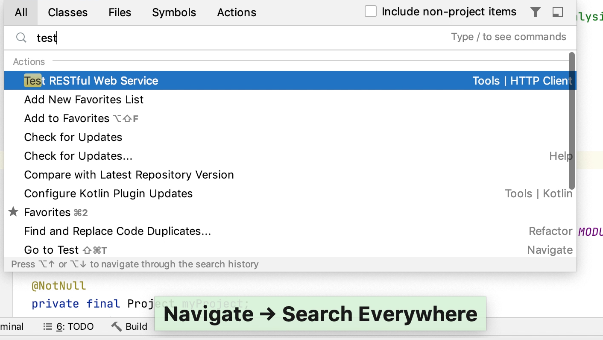

以下是一些最有用的导航快捷方式：

| 行动         | 捷径             |
| ------------ | ---------------- |
| 任何位置搜索 | Double Shift     |
| 定位到文件   | Ctrl+Shift+N     |
| 定位到Class  | Ctrl+N           |
| 定位到符号   | Ctrl+Alt+Shift+N |
| 定位到声明   | Ctrl+B           |

### 最近的文件和位置

通常，您一次处理一小部分文件，并且需要在它们之间快速切换。在**最近的文件**操作是一个真正的节省时间在这里。按Ctrl+E可查看上次访问的文件列表。请注意，您还可以使用此操作打开任何工具窗口：

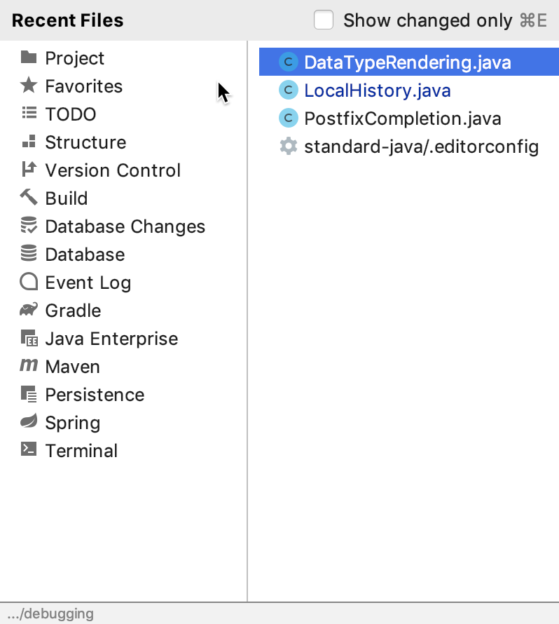

除了跳转到最近的文件外，您还可以快速访问*最近的位置*- 即您上次查看或编辑的代码片段。按Ctrl+Shift+E，您将能够跳转到您最近修改的特定行：

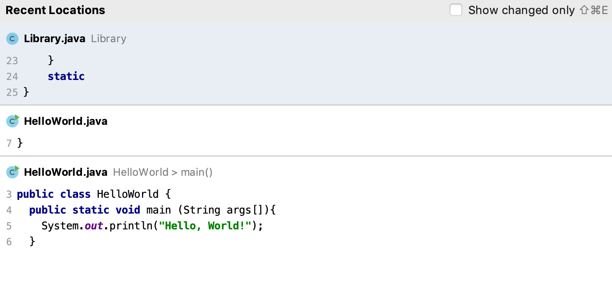

### 文件结构

按下Ctrl+F12可打开文件结构弹出窗口，该窗口为您提供当前文件中使用的所有元素的概览，并让您跳转到其中任何一个：

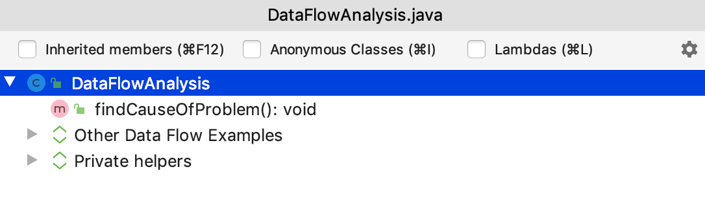

或者，使用**结构工具窗口** Alt+7

### 寻找action

如果您不记得要使用的操作的快捷方式或菜单路径，请按Ctrl+Shift+A并开始键入操作名称：

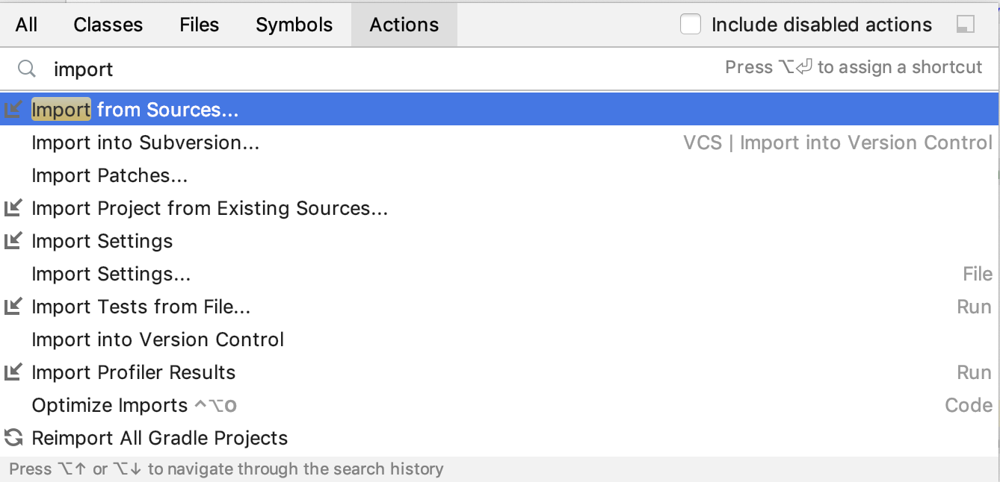

## 编码助手

### 代码补全

IntelliJ IDEA 通过提供上下文感知代码完成来帮助您加快编码过程。

- **Basic completion 基本补全**帮助您补全可见范围内的类、方法、字段和关键字的名称：

  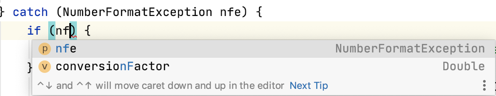

  

- 当 IntelliJ IDEA 可以确定适当的类型时，**Smart completion 智能补全**建议适用于当前上下文的最相关符号：

  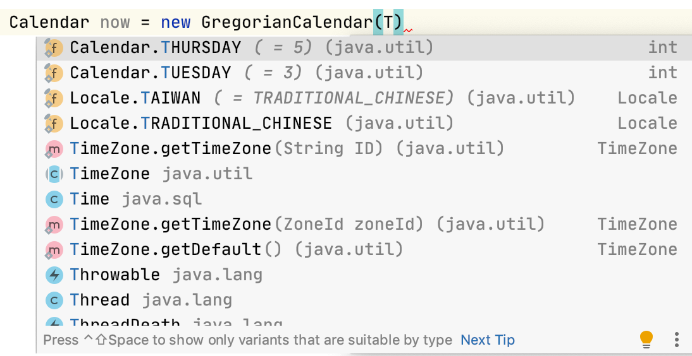

  

### 重构

IntelliJ IDEA 提供了一套全面的自动化代码重构，可显着提高生产力。例如，当您重命名一个类时，IDE 将更新整个项目中对该类的所有引用。

在应用重构之前，您甚至不需要费心选择任何东西。IntelliJ IDEA 足够聪明，可以确定您要重构哪个语句，并且仅在有多种选择时才要求确认。只需按下Ctrl+Alt+Shift+T即可打开当前上下文中可用的重构列表：

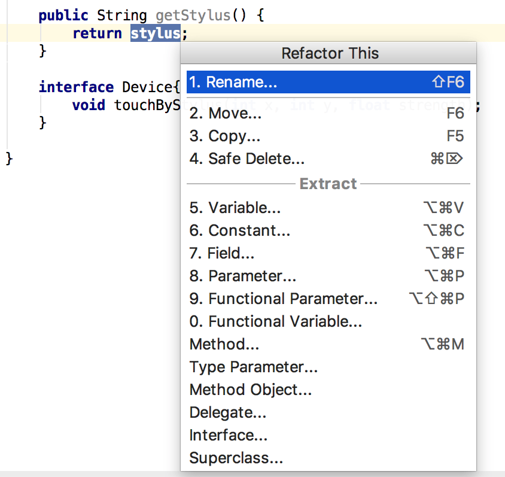

请参阅重构代码小节，了解可用重构的完整列表，以及使用场景和前后示例。

了解一些最有用的重构快捷方式：

| 行动                         | 捷径             |
| ---------------------------- | ---------------- |
| Refactor this                | Ctrl+Alt+Shift+T |
| Rename                       | Shift+F6         |
| 提取变量 Extract variable    | Ctrl+Alt+V       |
| 提取字段 Extract field       | Ctrl+Alt+F       |
| 提取常数 Extract a constant  | Ctrl+Alt+C       |
| 提取方法 Extract a method    | Ctrl+Alt+M       |
| 提取参数 Extract a parameter | Ctrl+Alt+P       |
| 内联Inline                   | Ctrl+Alt+N       |
| 复制 F5                      | F5               |
| 移动 F6                      | F6               |

### 静态代码分析

IntelliJ IDEA的提供了一组检查所内置的静态代码分析工具。它们可以帮助您找到潜在的错误、定位死代码、检测性能问题并改进整体代码结构。

检查不仅可以告诉您问题出在哪里，还可以提供快速修复，帮助您立即解决问题。单击突出显示的代码旁边的红色灯泡，或按下Alt+Enter以选择修复：

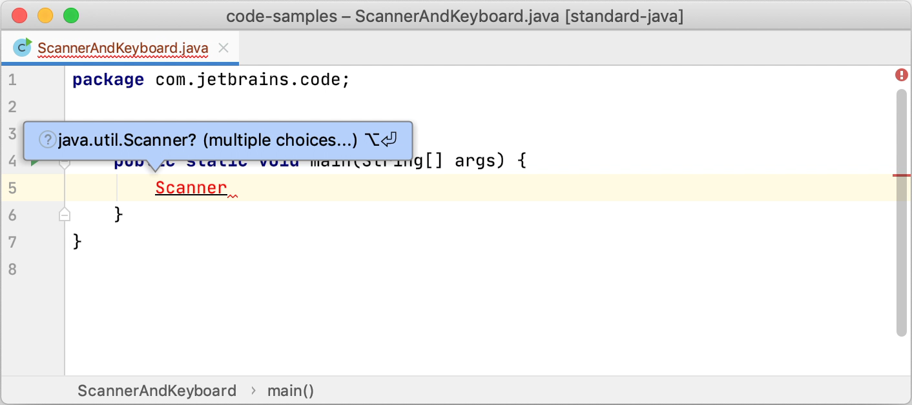

除了快速修复之外，IntelliJ IDEA 还提供意图操作，帮助您将自动更改应用于正确的代码。例如，您可以注入一种语言、添加 Java 注释、添加 JavaDoc、转换 HTML 或 XML 标签等等。要查看意图操作的完整列表，请在****Settings/Preferences****对话框中Ctrl+Alt+S，转到****Editor | Intentions****。

### 代码生成

IntelliJ IDEA 提供了多种方式来生成通用代码结构和重复元素，通过将日常任务委派给 IDE 来帮助您提高工作效率。这包括从预定义或自定义代码模板]生成代码、生成包装器、getter 和 setter]、字符自动配对等。按下Alt+Insert以打开一个弹出窗口，其中包含您可以从插入符号位置生成的可用结构。

## 与开发者工具集成

除了提供智能导航和编码帮助外，IntelliJ IDEA 还集成了基本的开发人员工具，让您可以在 IDE 中调试、分析和版本化应用程序的代码库。

### 调试器

IntelliJ IDEA 提供了一个内置的 JVM 调试器。它使您可以获取和分析运行时信息，这对于诊断问题和深入了解程序的运行方式非常有用。它使您能够：

- 暂停程序执行以使用断点检查其行为。多种类型的断点，连同条件和过滤器，允许您指定应用程序需要暂停的确切时刻。
- 通过修改变量值、计算表达式等来处理程序状态。
- 检查变量值、调用堆栈、线程状态等。
- 控制程序的逐步执行。

### 分析工具

IntelliJ IDEA 提供以下内置分析器工具，可让您探索哪些方法消耗 CPU 时间最多，从而帮助您检测最昂贵的方法并准确了解它们的行为方式：

- Async Profiler：用于Linux和MacOS的工具，可以让你看到内存和CPU资源，究竟如何在你的应用程序分配。
- Java Flight Recorder：一个多平台的工具执行应用程序时收集有关事件的信息在特定时刻的Java虚拟机。
- 在[Java的飞行记录器](https://www.jetbrains.com/help/idea/2021.1/java-flight-recorder.html)：一个多平台的工具执行应用程序时收集有关事件的信息在特定时刻的Java虚拟机。

### 终端

IntelliJ IDEA 包括一个内置终端用于从 IDE 内部使用命令行 shell。例如，如果您习惯于从命令行执行 Git 命令，则可以从终端运行它们，而不是从菜单调用这些操作。

终端与您的默认系统 shell 一起运行，但它也支持许多其他 shell，例如`cmd.exe`、`bash`、`sh`等。

### 构建工具

IntelliJ IDEA 带有功能齐全的[Gradle](https://gradle.org/)和[Maven](https://maven.apache.org/)集成，允许您自动化构建过程、打包、运行测试、部署和其他活动。

当您打开现有的 Gradle 或 Maven 项目或创建一个新项目时，IntelliJ IDEA 会检测并自动下载所有必需的存储库和插件，因此您几乎不需要配置任何内容，只需专注于开发过程。您可以直接从编辑器编辑`build.gradle`和`pom.xml`文件，并配置 IDE 以自动将所有更改同步到构建配置。

### 版本控制

IntelliJ IDEA 提供与最流行的版本控制工具的集成：[Git](https://git-scm.com/)、[Mercurial](https://www.mercurial-scm.org/)、[Perforce](https://www.perforce.com/solutions/version-control)和[Subversion](https://subversion.apache.org/)。

您可以在不离开 IDE 的情况下查看整个项目或单独文件的历史记录、比较文件版本、管理分支，甚至处理 GitHub 拉取请求。

您可以从 VCS 操作弹出窗口快速访问所有 VCS 操作Alt+`：

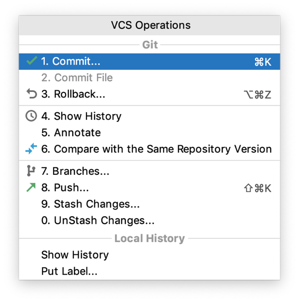

有关如何配置与 VCS 的集成以及执行 VCS 相关操作的说明，请参阅版本控制。

#### 本地历史

即使尚未为您的项目启用版本控制，您仍然可以跟踪对项目的修改，并使用本地历史记录恢复已删除的文件或单独的更改。它充当您的个人版本控制系统，在您编辑代码、运行测试、部署应用程序等时自动记录由各种事件触发的项目修订。

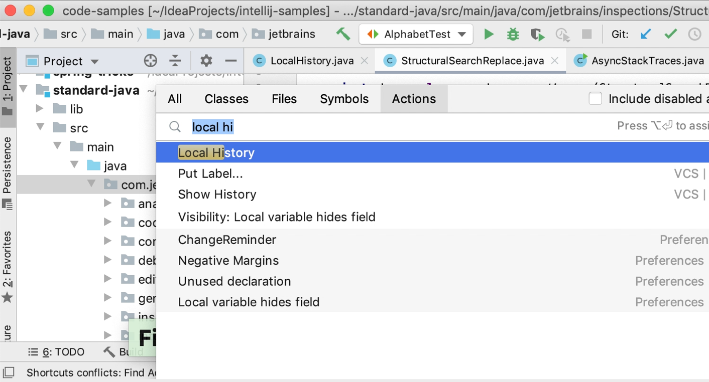

动图