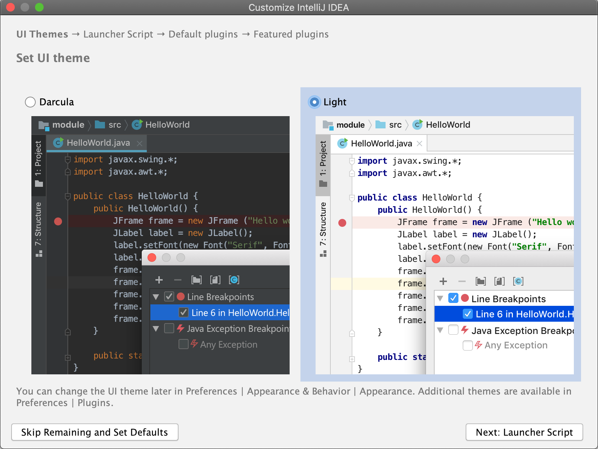
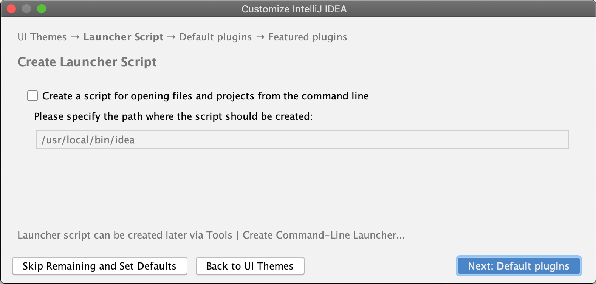
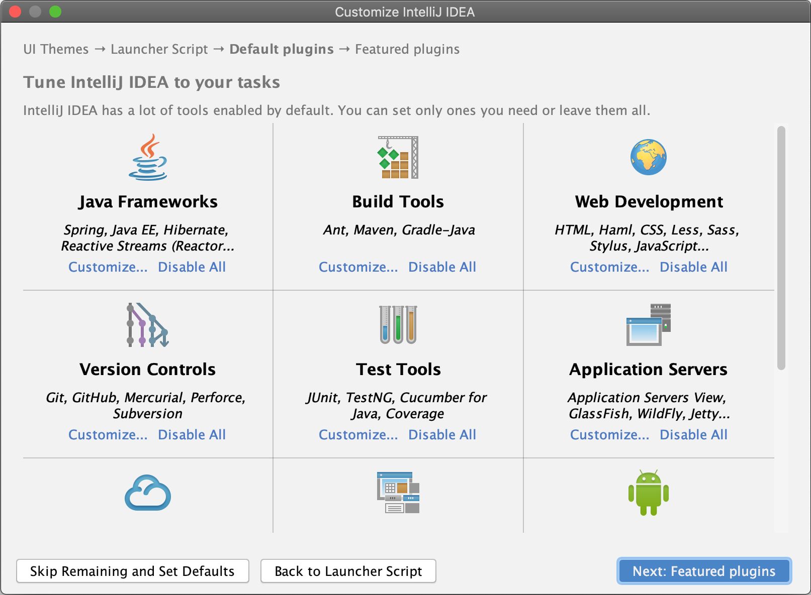
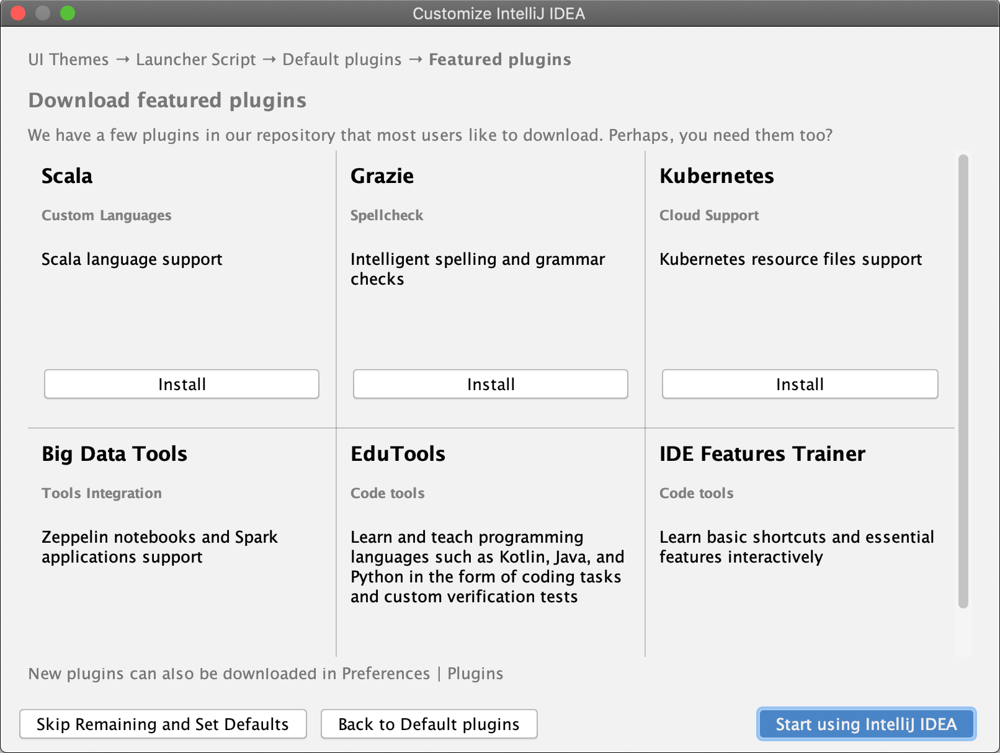
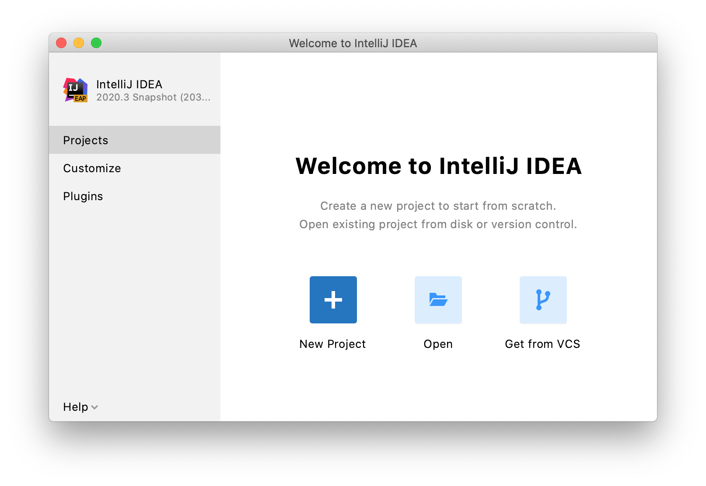

IntelliJ IDEA 是一个跨平台的 IDE，可在 Windows、macOS 和 Linux 操作系统上提供一致的体验。用于运行任何 JetBrains 产品的工具箱应用程序。在独立安装的情况下，运行 IntelliJ IDEA 取决于操作系统：

要运行 IntelliJ IDEA，请在 Windows**开始**菜单中找到它或使用桌面快捷方式。您也可以在**bin**下的安装目录中运行启动程序批处理脚本或可执行文件。

## 选择用户界面主题

选择是否要使用默认的 Darcula 或 Light 主题。

有关更多信息，请参阅[用户界面主题](https://www.jetbrains.com/help/idea/2021.1/user-interface-themes.html)。

## 创建启动脚本

对于**macOS**和**Linux**用户，IntelliJ IDEA 建议创建用于从命令行打开项目和文件的脚本。

**Windows**用户可以运行安装目录中的可执行文件。

有关详细信息，请参阅[命令行界面](https://www.jetbrains.com/help/idea/2021.1/working-with-the-ide-features-from-command-line.html)。

## 禁用不必要的插件

手动安装 IntelliJ IDEA 以管理每个实例和所有配置文件的位置。例如，如果您的策略需要特定的安装位置。**插件**Ctrl+Alt+S下的**设置/首选项**对话框。有关更多信息，请参阅[管理插件](https://www.jetbrains.com/help/idea/2021.1/managing-plugins.html)。

有关更多信息，请参阅首次运行 IntelliJ IDEA**禁用所有****自定义**以禁用组中的单个插件。

## 下载并安装其他插件

在没有任何用户界面的情况下执行静默安装。网络管理员可以使用它在多台机器上安装 IntelliJ IDEA，避免打扰其他用户。**插件**在左侧窗格中，并下载和安装额外的插件[IntelliJ IDEA的插件库](https://plugins.jetbrains.com/idea)。

## 在 IntelliJ IDEA 中启动一个项目

当你点击开始使用IntelliJ IDEA，它会显示欢迎屏幕。

在**欢迎使用 IntelliJ IDEA**对话框中，您可以执行以下操作：

- [创建一个新项目](https://www.jetbrains.com/help/idea/2021.1/new-project-wizard.html)
- [打开一个项目](https://www.jetbrains.com/help/idea/2021.1/import-project-or-module-wizard.html#open-project)
- [从版本控制系统获取项目](https://www.jetbrains.com/help/idea/2021.1/import-project-or-module-wizard.html)