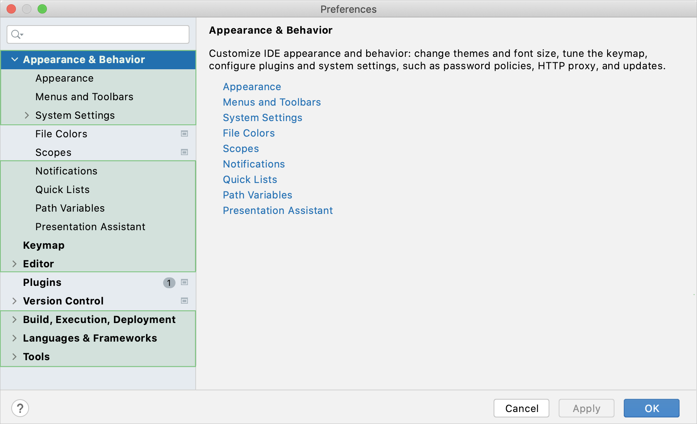

IntelliJ IDEA 允许您在多个级别上配置设置：[模块](https://www.jetbrains.com/help/idea/2021.1/configure-modules.html)级别、[项目](https://www.jetbrains.com/help/idea/2021.1/configure-project-settings.html)级别和全局。

全局设置适用于 IntelliJ IDEA 特定安装或版本的所有项目。此类设置包括 IDE 外观（主题、配色方案、菜单和工具栏）、通知设置、已安装和启用的插件集、调试器设置、代码完成等。

要配置您的 IDE，macOS 请选择**IntelliJ IDEA | Preferences** 或Windows  **File | Settings**。或者按Ctrl+Alt+S或单击工具栏上的 。

**Settings/Preferences**话框中未标有图标的设置是全局的，适用于当前 IntelliJ IDEA 版本的所有现有项目。

## 恢复 IDE 设置

当您恢复默认 IDE 设置时，IntelliJ IDEA 会将您的配置备份到一个目录。您始终可以从此备份恢复您的设置。

### 备份您的设置并恢复默认设置

1. 从主菜单中，选择**File | Manage IDE Settings | Restore Default Settings**.

   或者，按Shift两次并键入`Restore default settings`。

   IntelliJ IDEA 显示一个确认弹出窗口：

   

2. 单击** **Restore and Restart**.**。IDE 将使用默认配置重新启动。

当 IntelliJ IDEA 恢复默认 IDE 设置时，它会创建一个备份目录，其中包含您的配置：

Syntax

**%APPDATA%\JetBrains\<product><version>-backup**

Example

**C:\Users\JohnS\AppData\Roaming\JetBrains\IntelliJIdea2021.1-backup**

### 从备份应用 IDE 设置

1. 从主菜单中，选择**File | Manage IDE Settings | Import Settings**.

2. 在打开的对话框中，指定备份目录的[path](https://www.jetbrains.com/help/idea/2021.1/configuring-project-and-ide-settings.html#backup-dir)并单击**Open**。

   IntelliJ IDEA 显示一个确认弹出窗口。请注意，在您应用备份中的设置后，*这些设置将被*您当前的 IDE 配置*覆盖*。

   除了备份配置目录之外，您还可以从另一个 IntelliJ IDEA 版本或具有先前[[exported settings](https://www.jetbrains.com/help/idea/2021.1/sharing-your-ide-settings.html#import-export-settings)](https://www.jetbrains.com/help/idea/2021.1/sharing-your-ide-settings.html#import-export-settings)的**.zip**文件中选择配置目录。

3. 单击**Restart**以应用备份中的设置并重新启动 IDE。