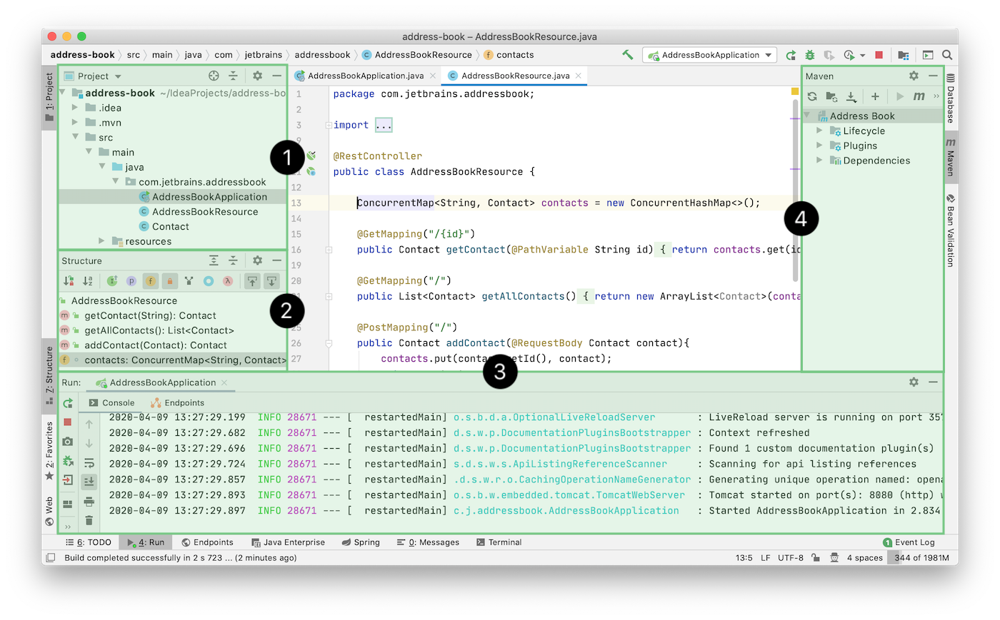
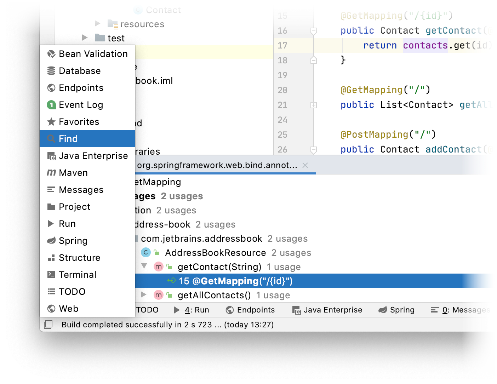
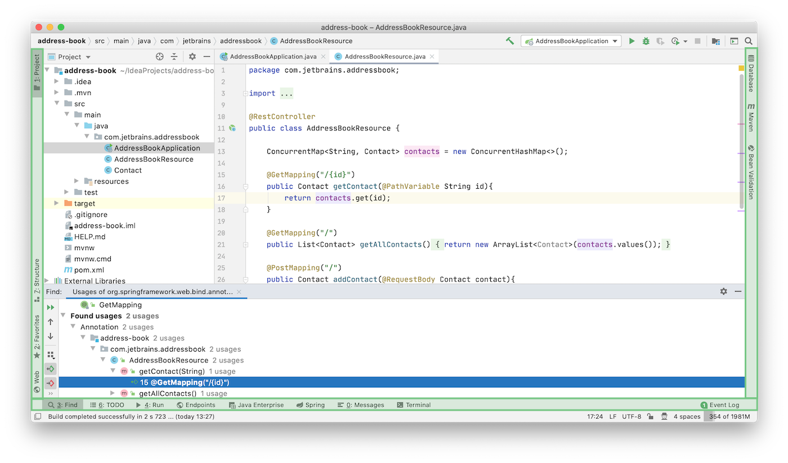
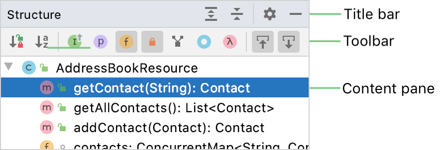
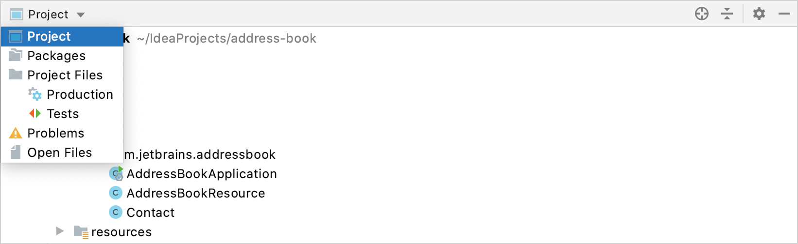
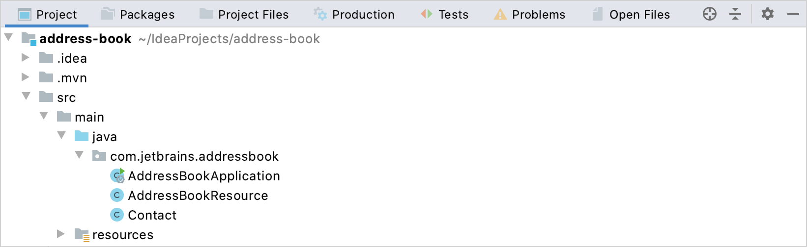

*工具窗口*提供对有用开发任务的访问：查看项目结构、运行和调试应用程序、与版本控制系统和其他外部工具集成、代码分析、搜索和导航等。默认情况下，工具窗口附加到主窗口的底部和侧面。但是，您可以重新排列甚至分离它们以用作单独的窗口，例如，在另一台显示器上。

以下屏幕截图显示了几个占据编辑器周围空间的常用工具窗口：

1. **Project**工具窗口
2. **Structure**工具窗口
3. **Run**工具窗口
4. **Maven**工具窗口

一些工具窗口始终可用（例如，**Project**和**Structure**），一些在启用特定插件或您的项目具有特定结构（例如，**Maven**、**Gradle**和**Spring**）时被激活，还有一些仅在您执行时出现某个操作（例如**Run**、**Debug**和**Find**）。

例如，**Run**工具窗口仅在您运行代码后出现。 它可以从**View | Tool Windows | Run** 或用快捷键Alt+4。只要控制台有一些输出，你不关闭它的所有标签。

### 打开工具窗口

要显示或隐藏工具窗口，请执行以下操作之一：

- 从主菜单中，选择**View | Tool Windows**。

- 使用相应的快捷方式，例如，Alt+1打开项目工具窗口。如果工具窗口没有快捷方式，您可以按照[配置键盘快捷方式中的说明](https://www.jetbrains.com/help/idea/2021.1/configuring-keyboard-and-mouse-shortcuts.html)进行分配。

- 单击工具栏上对应的工具窗口按钮。  

  

- 将鼠标指针悬停在主窗口左下角的快速访问按钮/ 上，然后选择一个工具窗口。

  

### 隐藏活动工具窗口

- 按Shift+Escape或选择**Window | Active Tool Window | Hide Active Tool Window**。Shift+Escape再次按下以显示隐藏的工具窗口。

### 隐藏所有工具窗口

这可以帮助您专注于编辑器。

- 按Ctrl+Shift+F12或主菜单中选择**Window | Active Tool Window | Hide All Windows**。Ctrl+Shift+F12再次按下以显示隐藏的工具窗口。

### 在编辑器和工具窗口之间导航

- 要将焦点从工具窗口更改为编辑器，请按Escape。
- 要将焦点从编辑器更改回最后一个活动工具窗口，请按F12或主菜单中选择**Window | Active Tool Window | Jump to Last Tool Window****。

## 工具窗口栏和按钮

主窗口边缘的工具窗口栏包含用于显示和隐藏工具窗口的按钮。右键单击工具窗口按钮以打开其上下文菜单，您可以在其中更改查看模式并移动工具窗口。您还可以拖动工具窗口按钮以重新排列工具栏上的工具窗口。

### 显示或隐藏工具窗口栏

- 单击主窗口左下角的快速访问按钮可隐藏工具窗口栏。按钮变为，您可以单击它以显示工具窗口栏。
- 或者，从主菜单中**View | Appearance** 选中或取消 **Tool Window Bars** ****。

当工具窗口栏被隐藏时，您可以双击Alt显示隐藏的工具窗口栏。

## 工具窗口组件

通常，所有工具窗口都有一个标题栏、一个工具栏和一个内容窗格。

一些工具窗口也根据其涵盖的功能使用选项卡或标题栏中的下拉选择器进行分隔。选择 **Window | Active Tool Window | Group Tabs**以显示选项卡。禁用此选项以显示下拉菜单。

组选项卡已禁用

启用组选项卡

标题栏包含用于更改查看模式和工具窗口位置的工具窗口选项菜单。您还可以通过右键单击标题栏或工具窗口按钮来访问这些选项。某些工具窗口在此菜单中可以有其他选项，具体取决于功能（例如，对工具窗口中列出的项目进行排序、过滤和分组)。

单击以隐藏工具窗口并使用可能在标题栏上的其他按钮，例如：

- 并展开和折叠工具窗口的内容
-  在工具窗口的编辑器中找到并选择文件

工具窗口工具栏中的操作通常也可在主菜单和上下文菜单中使用。其中一些也可以使用默认快捷方式执行。您可以按照[配置键盘快捷](https://www.jetbrains.com/help/idea/2021.1/configuring-keyboard-and-mouse-shortcuts.html)键中的说明为操作分配快捷[键](https://www.jetbrains.com/help/idea/2021.1/configuring-keyboard-and-mouse-shortcuts.html)。

对于所有显示树状结构的工具窗口（例如，项目工具窗口），您可以在树视图中显示标记缩进级别的垂直线，并帮助您更好地了解项目中组件的层次结构。要显示这些行，请在 **Appearance and Behavior | Appearance** 上启用**Show tree indent guides**。