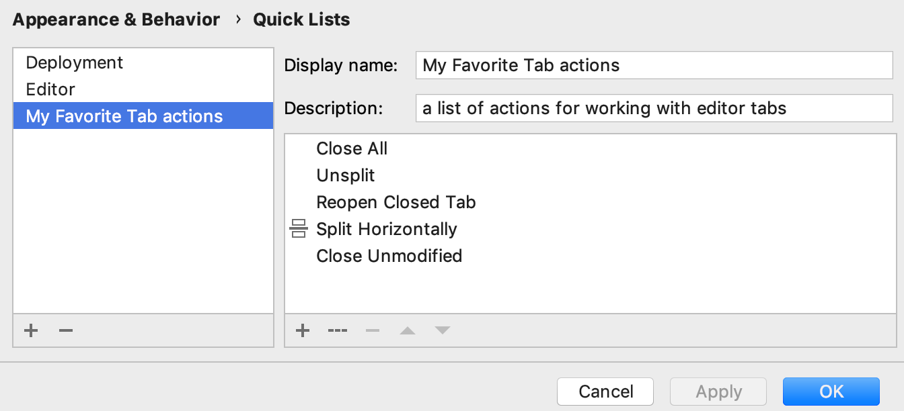

在使用 IDE 时，您执行某些操作的频率高于其他操作。为了最大限度地提高您的工作效率，请[了解](https://www.jetbrains.com/help/idea/2021.1/mastering-keyboard-shortcuts.html)您喜欢的操作[默认快捷方式](https://www.jetbrains.com/help/idea/2021.1/mastering-keyboard-shortcuts.html)或[为其分配快捷方式](https://www.jetbrains.com/help/idea/2021.1/configuring-keyboard-and-mouse-shortcuts.html)。您还可以自定义菜单和工具栏以仅包含您需要的操作、重新组合它们并配置它们的图标。

例如，如果您使用Java项目，您可能希望从File | New菜单中删除其他不使用的框架文件，以使菜单的这一部分更短，并只留下所需的选项。  

> 要快速访问您喜欢的文件、目录、书签和断点，请使用**Favorites**工具窗口。有关详细信息，请参阅[[Favorites](https://www.jetbrains.com/help/idea/2021.1/managing-your-project-favorites.html).](https://www.jetbrains.com/help/idea/2021.1/managing-your-project-favorites.html)。

### 自定义菜单和工具栏

1. 在**Settings/Preferences**对话框中Ctrl+Alt+S，选择**Appearance & Behavior | Menus and Toolbars**.。

   

2. 在可用菜单和工具栏的列表中，展开您要自定义的节点并选择所需的项目。

   - 单击以在所选项目下添加操作或分隔符。
   - 单击以删除选定的项目。
   - 单击以添加或更改所选操作的图标。您只能使用 PNG 或 SVG 文件作为图标。
   - 单击或向上或向下移动所选项目。
   - 单击可将所选操作或所有操作恢复为默认设置。

   

3. 单击**OK**以保存您的更改。

## 显示和隐藏 UI 元素

如果你有一个小显示器，你可以隐藏一些你从不使用的 UI 元素。这些元素[在用户界面概述中进行了](https://www.jetbrains.com/help/idea/2021.1/guided-tour-around-the-user-interface.html)描述。

- 从主菜单中，选择**View | Appearance**和启用或禁用必要的元素。

  

- **Toolbar**：位于窗口顶部，这是主工具栏，带有用于打开文件、撤消和重做操作的按钮。

- **Tool Window Bars**：位于窗口边缘，这些栏包含用于显示、隐藏和排列工具窗口的按钮。请参阅[工具窗口栏和按钮](https://www.jetbrains.com/help/idea/2021.1/tool-windows.html#bars_and_buttons)。

- **Status Bar**：位于窗口底部，它显示事件消息，指示整个项目和 IDE 状态，并通过小部件提供对某些设置的快速访问。请参阅[状态栏](https://www.jetbrains.com/help/idea/2021.1/guided-tour-around-the-user-interface.html#status-bar)。

- **Status Bar Widgets**：位于**状态栏**的右侧。您还可以右键单击状态栏以显示和隐藏小部件。

- **Navigation Bar**：位于窗口顶部，您可以在其中导航项目的目录和文件，Alt+Home作为**项目**工具窗口的替代。请参阅[导航栏](https://www.jetbrains.com/help/idea/2021.1/guided-tour-around-the-user-interface.html#navigation-bar)。

- **Members in Navigation Bar**：在导航栏中显示字段和方法。

- **Main Menu**：在 Windows 和 Linux 上，使用**File**、**Edit**、**View**和其他菜单隐藏应用程序窗口的标准菜单栏。如果您使用的是[Linux 本机菜单，](https://www.jetbrains.com/help/idea/2021.1/linux-native-menu.html)则无法在 macOS 或 Linux 上隐藏它。

  > 如果您隐藏主菜单，您仍然可以通过相应的操作访问它：按下Ctrl+Shift+A并搜索*主菜单*。

- **树视图中的详细信息**：在**项目**工具窗口中显示文件的最后修改日期和大小

## 包含您最喜欢操作的快速列表

一个**quick list* *是包含的IntelliJ IDEA的行动，一组自定义的弹出。将其视为自定义菜单或工具栏，您可以为其分配快捷方式以进行快速访问。您可以根据需要创建任意数量的快速列表。快速列表中的每个操作都由 0 到 9 之间的数字标识。

有许多预定义的快速列表，但请注意它们不可配置：

- **Refactor this** Ctrl+Alt+Shift+T
- **VCS Operations** Alt+`

例如，您可以创建一个未分配快捷方式的操作列表，并通过一个快捷方式后跟与特定操作关联的编号来引用该列表。您还可以创建您最喜欢的 Gradle 任务的快速列表，或者您可以使用一个快捷方式调用的不同运行配置的列表。

### 创建一个快速列表

1. 在**Settings/Preferences**对话框中Ctrl+Alt+S，选择**Appearance & Behavior | Quick Lists**。

2. 单击或左窗格按Alt+Insert以创建新的快速列表。

3. 在**Display name**字段中，指定快速列表的名称。（可选）提供快速列表说明。

4. 在右侧窗格中，添加并排列快速列表中的操作：

   - 单击以将操作添加到列表中。
   - 单击以添加分隔线。
   - 单击以从列表中删除选定的操作。
   - 单击或向上或向下移动所选项目。

   

5. 单击**OK**以保存更改。

### 为快速列表分配快捷方式

1. 在**Settings/Preferences**对话框中Ctrl+Alt+S，选择**Keymap**。

2. 展开**Quick Lists**节点并选择您的快速列表。添加键盘快捷键并保存更改。

   

3. 单击**OK**以保存更改。

在编辑器中，通过关联的快捷方式访问快速列表。

如果您不记得快捷方式，可以按名称搜索快速列表。按Shift两次并键入快速列表的名称。

