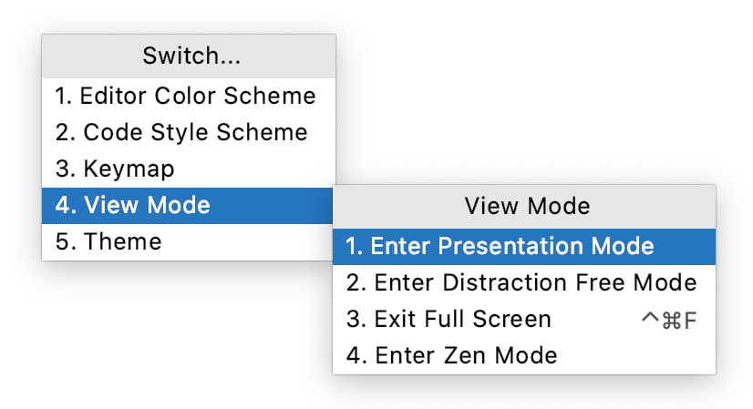

IntelliJ IDEA 为特定的使用模式提供了特殊的显示方式。例如，如果您需要专注于代码或向观众展示您的代码。

> 您可以使用主菜单 **View | Appearance**的操作进入和退出显示方式**。。

- 在**Full Screen** 模式下N/A，IntelliJ IDEA 扩展主窗口以占据整个屏幕。在 macOS 上，所有操作系统控件都是隐藏的，但如果将鼠标指针悬停在屏幕顶部，则可以访问主菜单。
- 在**Distraction-free**模式下，编辑器占据整个主窗口，源代码居中。UI 的所有其他元素都是隐藏的（工具窗口、工具栏和编辑器选项卡），以帮助您专注于当前文件的源代码。您仍然可以使用快捷方式打开工具窗口、导航和执行其他操作。
- 在**Zen**模式下，IntelliJ IDEA 结合了**Full Screen**和**Distraction-free**模式，因此主窗口展开，只留下带有源代码的编辑器，让您专注于编程。
- 在**Presentation**  **演示**模式下，IntelliJ IDEA 将编辑器扩展为占据整个屏幕并增加字体大小，使您的观众更容易看到您在做什么。UI 的其他元素是隐藏的，但是如果您将鼠标指针悬停在屏幕顶部，则可以使用相应的快捷方式或使用主菜单来调出它们。

## 技巧

### 使用快速切换器

1. 按Ctrl+`执行  **View | Quick Switch Scheme**  动作。
2. 在**Switch**弹出窗口中，选择**View Mode**，然后选择所需的显示方式。

