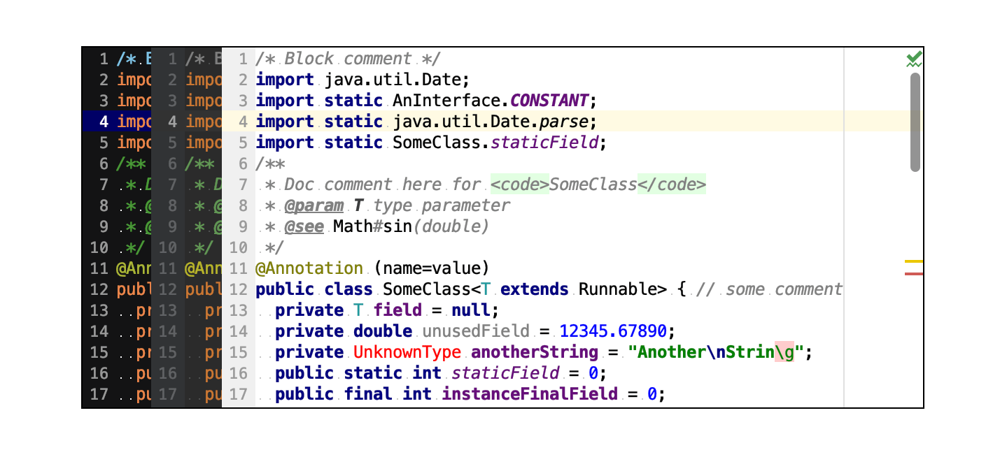
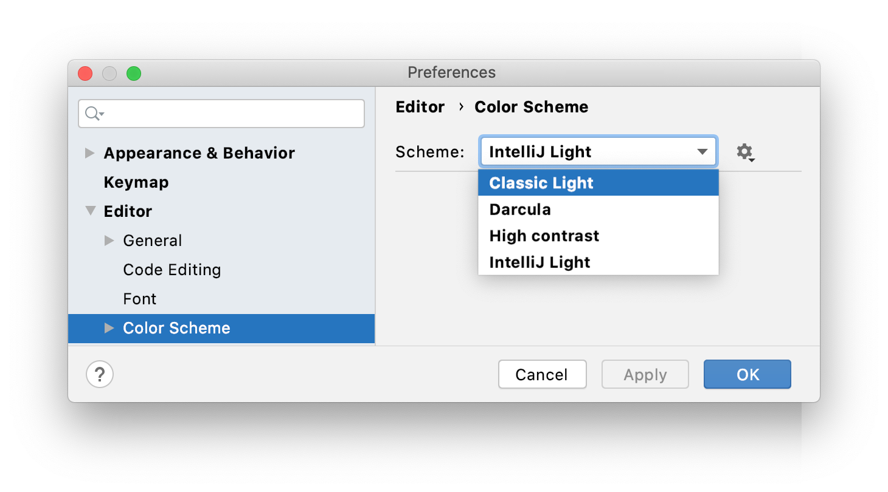

作为开发人员，您使用大量文本资源：编辑器中的源代码、搜索结果、调试器信息、控制台输入和输出等等。颜色和字体样式用于格式化此文本并帮助您更好地一目了然地理解它。

IntelliJ IDEA 使用定义首选颜色和字体的*配色方案*。

> *颜色方案*是不一样的[界面主题](https://www.jetbrains.com/help/idea/2021.1/user-interface-themes.html)，它定义窗口，对话框，和控件的外观。

您可以使用预定义的配色方案或根据自己的喜好对其进行自定义。也可以共享方案。

### 选择配色方案

1. 按Ctrl+Alt+S打开 IDE 设置并选择**Editor | Color Scheme**。

2. 使用**Scheme** 列表选择颜色方案。

   

默认情况下，有以下预定义的配色方案：

- **Classic Light**：专为*macOS Light*和*Windows 10 Light*界面主题而设计
- **Darcula**：专为*Darcula*界面主题设计
- **High contrast**: 专为*高对比度*界面主题设计（推荐给视力障碍的用户）
- **IntelliJ Light**：专为*IntelliJ Light*界面主题而设计

> 如果您安装带有配色方案的插件，该方案将添加到预定义方案列表中。有关详细信息，请参阅[共享配色方案](https://www.jetbrains.com/help/idea/2021.1/configuring-colors-and-fonts.html#share-color-scheme)。

## 字体

要自定义默认字体，请 Ctrl+Alt+S 再打开 **Editor | Font** 。默认情况下，此字体在所有配色方案中都使用和继承。

IntelliJ IDEA 可以使用操作系统中可用的任何字体。要将另一种字体添加到列表中，请将其安装在操作系统中或用于运行 IntelliJ IDEA的[Java 运行时](https://www.jetbrains.com/help/idea/2021.1/switching-boot-jdk.html)中。

### 自定义配色方案字体

您可以为当前方案设置不同的字体。

> 如果您计划共享您的方案或在可能不支持所选字体的其他平台上使用它，则不建议这样做。在这种情况下，请使用默认的全局字体设置。

1. 按Ctrl+Alt+S打开 IDE 设置并选择**Editor | Color Scheme | Color Scheme Font**。
2. 选择**Use color scheme font instead of the default** 复选框。

### 自定义控制台字体

默认情况下，控制台中的文本使用与配色方案相同的字体。要在控制台中使用不同的字体：

1. 按Ctrl+Alt+S打开 IDE 设置并选择**Editor | Color Scheme | Console Font**.。
2. 选择**Use console font instead of the default**复选框。