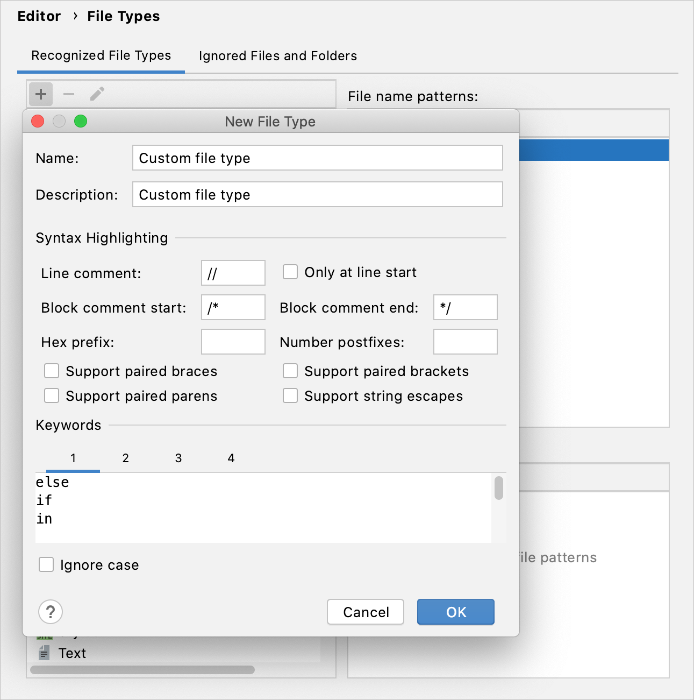

IntelliJ IDEA 识别一组默认的文件类型。此类文件根据相应语言的语法进行解析和突出显示。

如果您正在使用 IntelliJ IDEA 无法识别的文件类型（例如，如果它是专有的内部开发的文件类型），您还可以创建自定义文件类型。

您可以通过定义关键字、注释、数字等的突出显示方案来配置 IDE 解析文件的方式。您还可以将每种文件类型与扩展名相关联，以帮助 IDE 识别自定义格式的文件。

### 创建新的文件类型

1. 按Ctrl+Alt+S打开 IDE 设置并选择 **Editor | File Types**.。

2. 在已**Recognized File Types**部分中，单击，指定新类型的名称并提供说明。

3. 在**Syntax Highlighting**部分，配置区分大小写、大括号匹配设置，并指定定义注释的方式：

   - **Line comment**：指定指示单行注释开头的字符。
   - **Only at line start**：指示行注释开头的字符如果位于行首，则被识别为注释。
   - **Block comment start**, **Block comment end**：指定指示块注释开始和结束的字符。
   - **Hex prefix**：指定表示后续值是十六进制数的字符（例如，`0x`）。
   - **Number postfixes**：指定指示使用哪个数字系统或单位的字符。后缀是尾随字符串（例如，`e-3, kg`）。
   - **Support paired braces**, **Support paired brackets**, **Support paired parens**, **Support string escapes**：选中这些复选框以突出显示成对的大括号、括号、括号和字符串转义。

4. 在**Keywords** 部分，您最多可以指定四个关键字列表。每个列表的关键字将在编辑器中以不同方式突出显示，并将自动完成。

5. 在**Ignore case**复选框表示在自定义格式的文件的语言是否区分大小写。

   

### 

> 每组关键字都有自己的突出显示，您可以对其进行修改。为此，在**Settings/Preferences**对话框中Ctrl+Alt+S，选择 **Editor | Color Scheme | Custom**，并编辑**Keyword 1**、**Keyword 2**、**Keyword 3**和**Keyword 4**属性。


> 在 IntelliJ IDEA 中，识别的文件并不总是提供广泛的支持。例如，**.php**文件在[IntelliJ IDEA 社区版中](https://www.jetbrains.com/idea/features/editions_comparison_matrix.html)被识别并标有相应的图标，尽管该版本不提供 PHP 开发支持。

## 为文件类型配置 shebang 命令

IntelliJ IDEA 可以通过 shebang 行上指定的路径识别文件类型。shebang 是脚本文件中的字符组合，后跟应该执行该脚本的解释器程序的路径。它开始于`#!`并且总是位于脚本文件的第一行。

1. 按Ctrl+Alt+S打开 IDE 设置并选择 **Editor | File Types**。

2. 从已**Recognized File Types**列表中，选择要为其配置命令的文件类型。

3. 在**HashBang patterns**区域，单击（**Add HashBang Pattern**)。

4. 在打开的对话框中，指定解释程序的路径并单击**OK**。

5. 应用更改并关闭对话框。

   

## 注册新的文件类型关联

如果 IntelliJ IDEA 无法识别您尝试打开或创建的文件的类型，它会显示**Register New File Type Association**对话框，您可以在其中选择要处理此文件的方式。


如果对话框没有自动出现，请在**Project** 工具窗口中右键单击必要的文件，然后从上下文菜单中选择 **Associate with File Type** 。或者，在**Project** 工具窗口中选择文件并转到**File | File Properties | Associate with File Type**。

在**Register New File Type Association**对话框中，选择必要的选项：

1. 从**File pattern**列表中，选择是要为当前文件 ( **file.extension** ) 还是为所有具有此扩展名的文件 ( ***.extension** )指定类型。

2. 选择以下选项之一：

   - **Open matching files as text and auto-detect file type by content**：将不带扩展名的文件作为文本文件打开，并通过内容识别其类型，例如通过 shebang 行。

   - **Open matching files in IntelliJ IDEA**：将文件与现有文件类型之一相关联。您可以稍后在设置中[更改此关联](https://www.jetbrains.com/help/idea/2021.1/creating-and-registering-file-types.html#change-extension)。

   - **Open matching files in associated application**：在默认应用程序中打开文件。例如，PDF 文件在默认 PDF 查看器中打开。默认应用程序在您的系统系统中配置。

     您可以在**Settings/ Preferences | Editor | File Types**.中的**Files opened in associated applications**列表中找到与外部应用程序关联的所有扩展名。  

     在那里，您还可以将[文件类型与 IntelliJ IDEA 关联](https://www.jetbrains.com/help/idea/2021.1/creating-and-registering-file-types.html#associate-files-with-ide)，以默认在 IDE 中打开选定的文件类型。

3. 单击**确定**以应用设置。

## 更改文件类型关联

您可以将一个文件类型与另一个扩展名、一个文件或一组文件相关联，或者删除一个关联。

1. 按Ctrl+Alt+S打开 IDE 设置并选择 **Editor | File Types**.。

2. 从**Recognized File Types**列表中，选择要与另一个扩展名或一组文件关联的文件类型。

3. 使用**File name patterns**部分进行必要的更改。您可以添加新模式 ( )、删除现有模式或修改现有模式 ( )。

   

## 用 IntelliJ IDEA 默认打开文件

您可以将 IntelliJ IDEA 作为打开特定文件类型的默认应用程序。IDE 会记住这些关联，并在您升级到更新的主要版本时自动将它们应用到下一个 IntelliJ IDEA 实例。

1. 按Ctrl+Alt+S打开 IDE 设置并选择**Editor | File Types**。

2. 单击将**Associate File Types with IntelliJ IDEA**按钮，然后在打开的对话框中选择要使用 IDE 打开的文件扩展名。

   

3. 单击**OK**并关闭对话框。

   **如果您使用的是 macOS，请重新启动计算机以应用更改**。

## 忽略文件和文件夹

在 IntelliJ IDEA 中，有一个完全排除在任何类型处理之外的文件和文件夹列表。开箱即用，此列表包括临时文件、与版本控制系统相关的服务文件等：

```shell
*.pyc;*.pyo;*.rbc;*.yarb;*~;.DS_Store;.git;.hg;.svn;CVS;__pycache__;_svn;vssver.scc;vssver2.scc;
```


### 修改忽略的文件和文件夹列表

1. 按Ctrl+Alt+S打开 IDE 设置并选择**Editor | File Types**。

2. 切换到**Ignored Files and Folders**选项卡。

   您可以添加新扩展 ( )、删除现有扩展或修改现有扩展 ( )。

3. 应用更改并关闭对话框。

