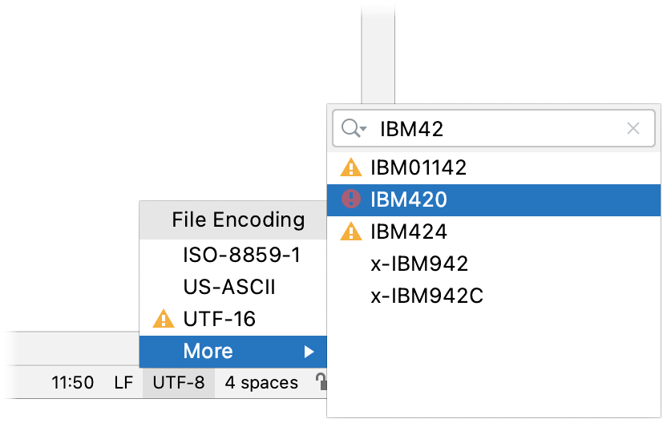
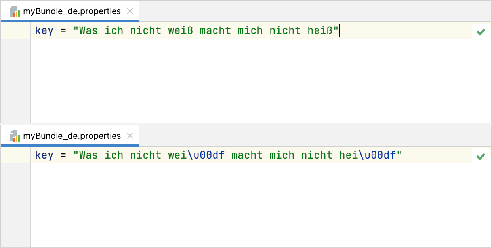

为了正确显示和编辑文件，IntelliJ IDEA 需要知道使用哪种编码。通常，源代码文件大多采用 UTF-8 格式。除非您有其他要求，否则这是推荐的编码。

为了确定文件的编码，IntelliJ IDEA 使用以下步骤：

- 如果存在*字节顺序标记*(BOM)，IntelliJ IDEA 将使用相应的 Unicode 编码，而不考虑所有其他设置。有关详细信息，请参阅[字节顺序标记](https://en.wikipedia.org/wiki/Byte_order_mark)。
- 如果文件明确声明了编码，IntelliJ IDEA 将使用指定的编码。例如，这可以应用于 XML、HTML 和 JSP 文件。显式声明也会覆盖所有其他设置，但您可以在编辑器中更改它。
- 如果文件中没有 BOM 且没有明确的编码声明，IntelliJ IDEA 将使用[文件编码设置中](https://www.jetbrains.com/help/idea/2021.1/encoding.html#file-encoding-settings)为文件或目录配置的[编码](https://www.jetbrains.com/help/idea/2021.1/encoding.html#file-encoding-settings)。如果没有为文件或目录配置编码，IntelliJ IDEA 将使用父目录的编码。如果父目录编码也没有配置，IntelliJ IDEA 将回退到**Project Encoding**，如果没有项目，则回退到**Global Encoding**。

### 更改用于查看文件的编码

如果 IntelliJ IDEA 错误地显示文件中的字符，它可能无法检测到文件编码。在这种情况下，您需要指定用于查看和编辑此文件的正确编码。

- 在编辑器中打开文件后，从主菜单选择**File | File Properties | File Encoding**或单击**File Encoding**的小窗口[状态栏](https://www.jetbrains.com/help/idea/2021.1/guided-tour-around-the-user-interface.html#status-bar)，并选择该文件的正确的编码。

  

  > 编码列表相当大。您可以使用[快速搜索](https://www.jetbrains.com/help/idea/2021.1/speed-search-in-the-tool-windows.html)快速找到正确的编码：在弹出窗口打开时开始输入。

  标有或图标的编码可能会改变文件的内容  。在这种情况下，IntelliJ IDEA 会打开一个对话框，您可以在其中选择如何处理文件：

  - **Reload**：从磁盘加载编辑器中的文件，并将编码更改仅应用于编辑器。您将看到与所选编码相关的内容更改，但实际文件不会更改。
  - **Convert**：用选择的编码覆盖文件。

这会将文件的关联添加到[文件编码设置](https://www.jetbrains.com/help/idea/2021.1/encoding.html#file-encoding-settings)。IntelliJ IDEA 将使用指定的编码来查看和编辑这个文件。

## 配置文件编码设置

在**Settings/Preferences**对话框中Ctrl+Alt+S，选择**Editor | File Encodings**。

IntelliJ IDEA 使用这些设置来查看和编辑它无法检测到编码的文件，并且还为新文件使用指定的编码。

| **Global Encoding**                        | 选择其他编码选项不适用时要使用的编码。例如，IntelliJ IDEA 将对不属于任何项目的文件或当您从版本控制系统检出源代码时使用此编码。 |
| ------------------------------------------ | ------------------------------------------------------------ |
| **Project Encoding**                       | 选择用于表中未列出的文件的编码。                             |
| **Path**                                   | 指定要为其配置编码的文件或目录的路径。                       |
| **Encoding**                               | 选择用于指定文件和目录的编码。如果禁用此选择器，则文件可能具有 BOM 或显式声明编码。在这种情况下，您无法配置用于此文件的编码。为目录选择的编码适用于其中的所有文件和子目录。 |
| **Default encoding for properties files**  | 选择项目中[属性文件](https://www.jetbrains.com/help/idea/2021.1/properties-files.html)的编码。标准 Java API 旨在为属性文件使用 ISO 8859-1 编码。您可以对未由此编码定义的字符使用转义序列。或者，您可以在项目级别为属性文件定义默认编码，并使用不同的 API 来读取您定义的编码中的属性文件。 |
| **Transparent native-to-ascii conversion** | 用国家字符(ISO 8859-1中未定义的字符)代替相应的转义序列。   |
| **Create UTF-8 files**                     | 选择 IntelliJ IDEA 应如何创建[UTF-8](https://en.wikipedia.org/wiki/Byte_order_mark#UTF-8)文件：带 BOM  、无 BOM  、Window 上有BOM，否则没有 BOM |

### 选择控制台输出编码

默认情况下，IntelliJ IDEA 使用系统编码来查看控制台输出。

1. 在**Settings/Preferences**对话框中Ctrl+Alt+S，选择**Editor | General | Console**。
2. 从**Default Encoding**列表中选择默认编码。
3. 单击**OK** 以应用更改。