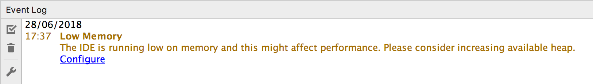
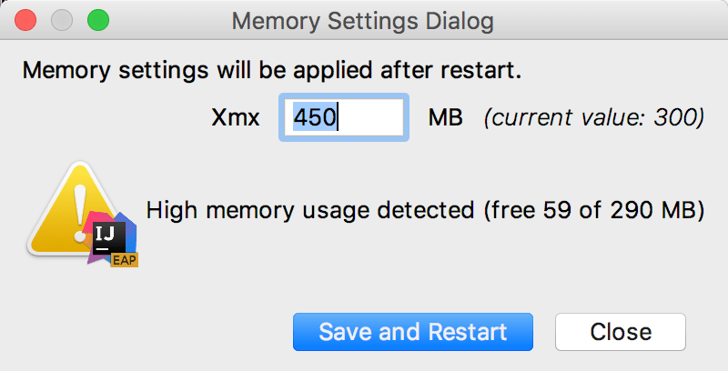

**Help | Change Memory Settings**

运行 IntelliJ IDEA 的 Java 虚拟机 (JVM) 会分配一些预定义的内存量。默认值取决于平台。如果您遇到速度变慢，您可能需要增加内存堆。

> 如果要为编译代码的构建过程配置堆大小，请打开**Settings/Preferences** Ctrl+Alt+S，选择**Build, Execution, Deployment | Compiler**，并在**Build process heap size**字段中指定必要的内存量。

1. 从主菜单中，选择**Settings/Preferences***。
2. 设置您要分配的必要内存量，然后单击**Save and Restart**。

此操作会更改`-Xmx`JVM 使用的选项的值，并使用新设置重新启动 IntelliJ IDEA。

> 在**Change Memory Settings**动作是从IntelliJ IDEA的版本2019.2开始提供。对于以前的版本或 IDE 崩溃，您可以`-Xmx`按照[JVM 选项中的说明](https://www.jetbrains.com/help/idea/2021.1/tuning-the-ide.html#configure-jvm-options)手动更改选项的值。

如果垃圾回收后的可用堆内存量小于最大堆大小的 5%，IntelliJ IDEA 还会向您发出警告：

单击**Configure** 以增加 JVM 分配的内存量。如果您不确定什么是好的值，请使用 IntelliJ IDEA 建议的值。

单击**Save and Restart**并等待 IntelliJ IDEA 使用新的内存堆设置重新启动。

### 启用内存指示灯

IntelliJ IDEA 可以在[状态栏中](https://www.jetbrains.com/help/idea/2021.1/guided-tour-around-the-user-interface.html#status-bar)显示已使用的内存量。用它来判断要分配多少内存。

- 右键单击状态栏并选择**Memory Indicator**。

## Toolbox App

如果您使用的是 Toolbox 应用程序，您可以更改特定 IDE 实例的最大分配堆大小，而无需启动它。

1. 打开 Toolbox App，单击相关 IDE 实例旁边的 ，然后选择**Settings**。
2. 在实例设置对话框中，展开**Configuration** 并在**Maximum heap size**字段中指定**堆大小**。

如果 IDE 实例当前正在运行，则新设置只有在重新启动后才会生效。

如果您使用的是不受 Toolbox 应用程序管理的独立实例，并且您无法启动它，则可以手动更改`-Xmx`控制分配内存量的选项。创建默认[JVM 选项](https://www.jetbrains.com/help/idea/2021.1/tuning-the-ide.html#configure-jvm-options)文件的副本并更改其中`-Xmx`选项的值。