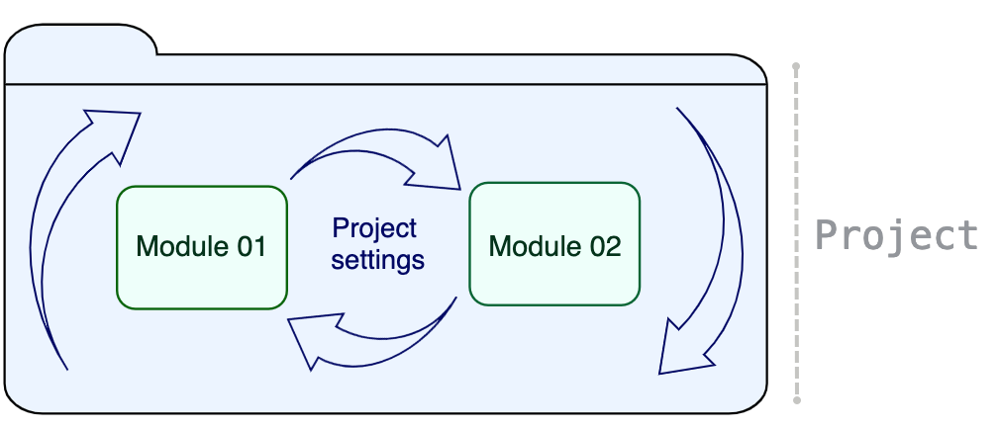
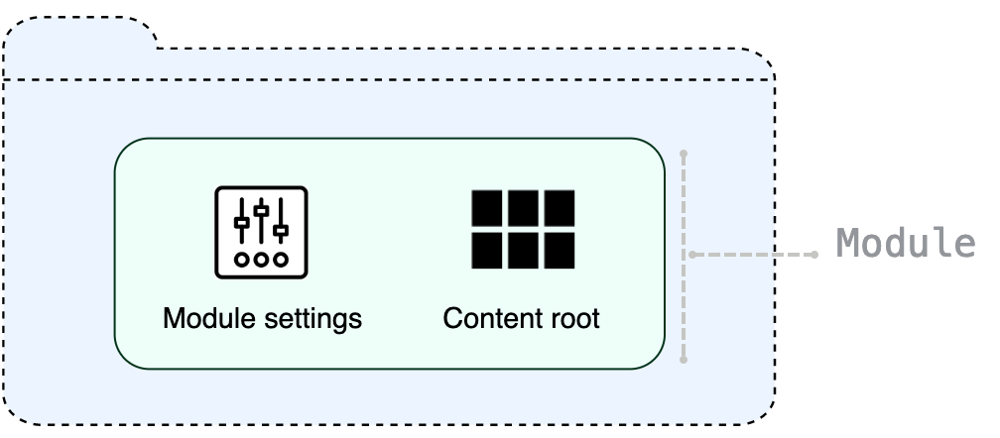

IntelliJ IDEA 中的开发从一个项目开始。项目可帮助您将代码和资源组织在一个易于存储和共享的单元中。简而言之，项目是一个目录，其中保存了构成应用程序的所有内容。一个典型的项目通常有一组设置和一个或几个模块。

IntelliJ IDEA 中的项目是一个外壳，它将模块保持在一起，提供它们之间的依赖关系，并存储它们的共享配置。

模块由保存模块设置的内部表示的**.iml**文件和存储源代码、资源、测试等的所谓*内容根目录组成*。

## 项目、模块和全局设置

IntelliJ IDEA 中有 3 种设置类型：模块、项目和全局设置。

模块设置

这些设置仅适用于一个模块并存储在**.iml**文件中。模块可以具有不同于为项目配置的 SDK 和语言级别以及它们自己的库。它们还可以承载特定的技术或框架。

项目设置

这些设置仅适用于当前项目。它们与其他项目文件一起以**.xml**格式存储在**.idea**目录中。例如，项目保留 VCS 设置、SDK、代码样式和拼写检查器设置、编译器输出、可用于项目中所有模块的库。

全局设置

全局设置适用于 IntelliJ IDEA 特定安装的所有项目。此类设置包括 IDE 外观（例如，主题和配色方案）、已安装和启用的插件集、调试器设置、全局检查配置文件等等。

