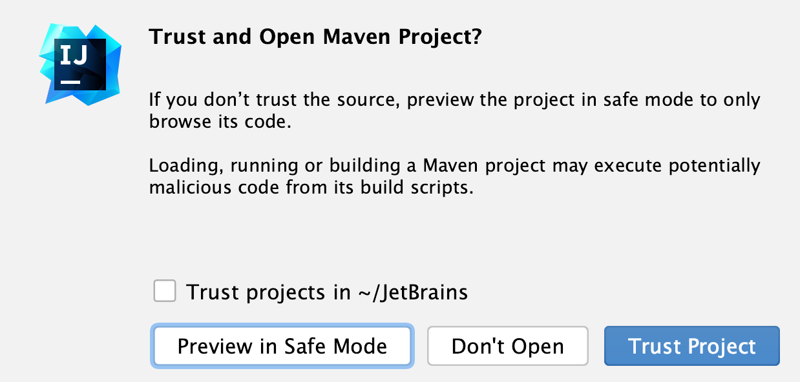
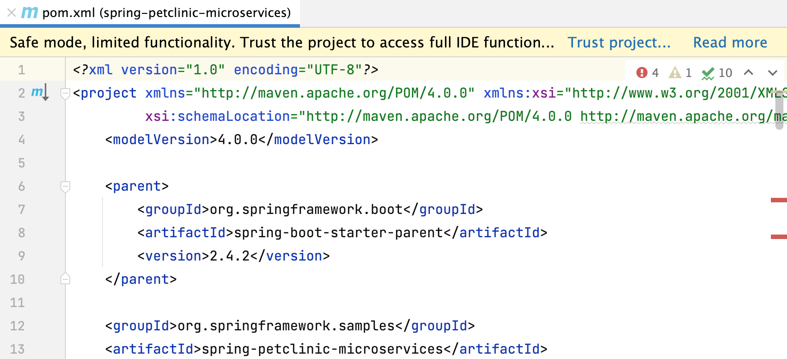
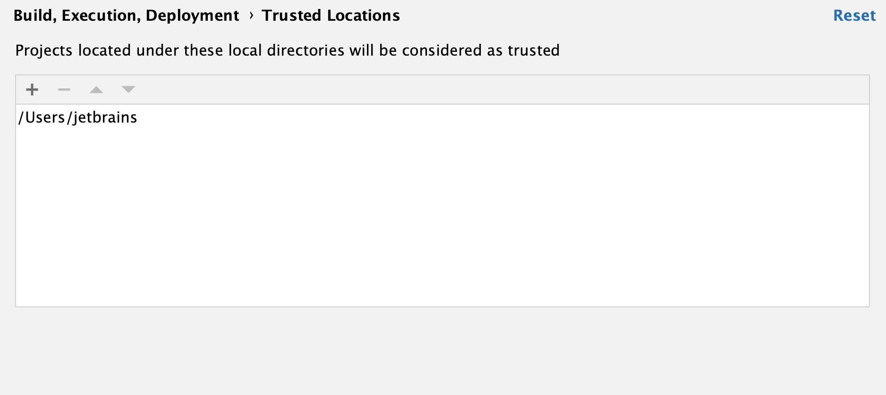

为防止潜在的安全风险，IntelliJ IDEA 允许您在不确定项目来源时决定如何打开项目。IntelliJ IDEA 会警告您在打开过程中将执行的任务或配置，并让您配置您可以信任的来源。

## Gradle 和 Maven 项目安全性

> 对于 sbt(Simple build tool) 和 BSP 项目，采用相同的安全措施。

当您打开一个项目（例如 Gradle 或 Maven）时，IntelliJ IDEA 会在可能包含不受信任代码的加载过程中执行其构建脚本。

### 首次打开项目

当您第一次尝试从未知来源打开 Gradle 或 Maven 项目时，IntelliJ IDEA 会显示警告并让您决定如何继续。

您可以选择以下操作之一：

- **Preview in Safe Mode**：在这种情况下，IntelliJ IDEA 以“预览模式”打开项目，这意味着您可以浏览项目的源代码，但执行任何任务或目标、构建或运行项目可能是不安全的。

  IntelliJ IDEA 在编辑器区域顶部显示一条通知，您可以随时单击**Trust project**链接并加载您的项目。

- **Trust Project**：在这种情况下，IntelliJ IDEA 打开并加载一个项目。这意味着构建脚本被执行，项目的插件被解析，依赖被添加等等。

- **Don't Open**：在这种情况下，IntelliJ IDEA 会取消该操作。

> 要信任您尝试打开项目的来源，请选择**Trust projects**选项。下次您从此目录打开项目时，它将自动打开并加载。

### 打开现有项目

如果您计划打开的项目是在另一台机器上创建的并且包含**.idea**目录，IntelliJ IDEA 会自动在 IDE 中打开您的项目，就像您选择了 [Preview in Safe Mode](https://www.jetbrains.com/help/idea/2021.1/project-security.html#safe_mode)操作一样。IntelliJ IDEA 不执行构建脚本、解析项目的插件或添加任何依赖项。但是，您仍然可以浏览项目的源代码并在编辑器中打开它们。

如果您尝试通过其专用工具窗口或**Run Anything**窗口执行任何 Maven 目标或 Gradle 任务，IntelliJ IDEA 将显示一条通知，建议您在执行任何操作之前信任并加载项目。

IntelliJ IDEA 还会显示一个编辑器通知，说明该项目不受信任。

如果您信任源，请单击 **Trust project** 并加载它。

在这种情况下，IntelliJ IDEA 会加载项目、解析插件、添加必要的依赖项等等。

您还可以将源添加到[受信任的位置](https://www.jetbrains.com/help/idea/2021.1/project-security.html#trusted_projects)，这样下次打开项目时，IntelliJ IDEA 就会隐式信任它。

## 启动任务

当您打开在不同机器上创建的项目时，它可能包含一些在打开过程中执行的脚本或任务。如果找到此类任务，IntelliJ IDEA 会显示一条通知，提示您即将执行的代码可能有害。

您可以查看将执行哪些任务并修改设置。

### 查看启动任务

1. 在 **Settings/Preferences**对话框中Ctrl+Alt+S，转到**Tools | Startup Tasks**。
2. 在**Startup Tasks** 设置页面，您可以查看和修改[启动任务](https://www.jetbrains.com/help/idea/2021.1/settings-tools-startup-tasks.html)。

## 受信任的位置

您可以配置 IntelliJ IDEA 应该认为安全的源并在打开过程中自动加载此类项目。

您可以将主目录添加到受信任位置，以禁用 IntelliJ IDEA 对不受信任项目的警告。

### 配置受信任的位置

1. 在**Settings/Preferences**对话框中Ctrl+Alt+S，转到 **Build, Execution, Deployment | Trusted Locations**。

2. 在**Trusted Locations**设置页面上，配置您认为受信任的项目所在的本地目录。单击**OK** 以保存更改。

   

   下次您从这些位置之一打开项目时，IntelliJ IDEA 将自动加载该项目。