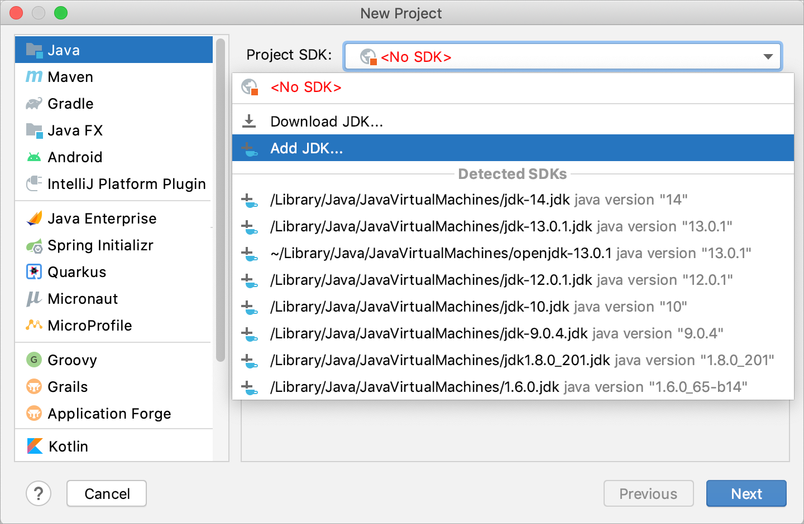
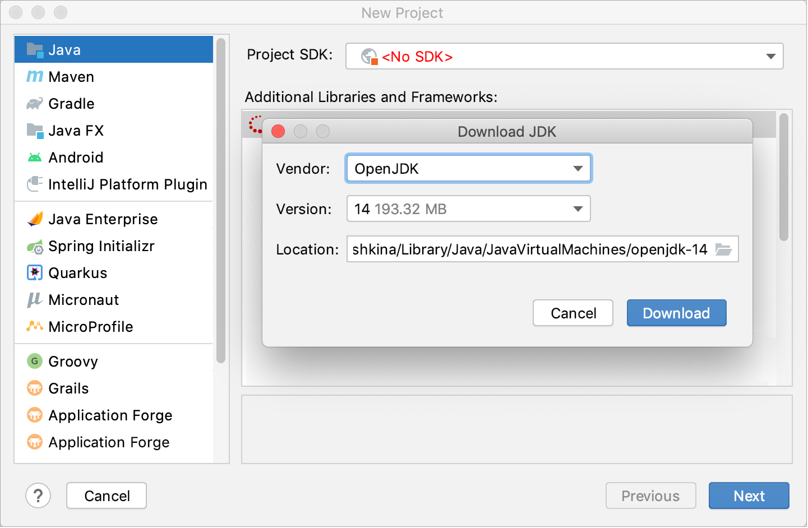
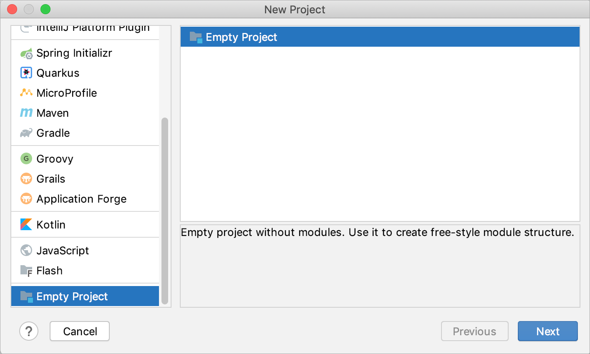

1. 启动 IntelliJ IDEA。

   如果欢迎屏幕打开，请单击**New Project**。

   否则，从主菜单中选择**File | New | Project**。

2. 从左侧的列表中，选择要在应用程序中使用的框架。

3. 如果建议，请配置项目 SDK。要开发基于 Java 的应用程序，您需要一个 JDK（Java 开发工具包）。

   如果 IntelliJ IDEA 中已经定义了必要的 JDK，请从**Project SDK**列表中选择它。

   如果 JDK 已安装在您的计算机上，但未在 IDE 中定义，请选择**Add JDK**并指定 JDK 主目录的路径（例如**/Library/Java/JavaVirtualMachines/jdk-12.0.1.jdk**）。

   

   如果您的计算机上没有必要的 JDK，请选择**Download JDK**。在下一个对话框中，指定 JDK 供应商、版本，并根据需要更改安装路径。

   

   > 除了 JDK 之外，一些框架还需要自己的 SDK，例如 Android 或 Grails。

   

4. 其他选项因您选择的框架而异。有关每个框架的选项的详细说明，请参阅下面的列表。

### 空项目

空项目是在没有模块的情况下创建的。对于此类项目，您需要手动[创建至少一个模块](https://www.jetbrains.com/help/idea/2021.1/creating-and-managing-modules.html#add-new-module)，[添加内容根](https://www.jetbrains.com/help/idea/2021.1/content-roots.html)，并[配置 SDK](https://www.jetbrains.com/help/idea/2021.1/sdk.html)。

步骤1

选择**Empty Project**并单击**Next**。

第2步

|                      |                                                              |
| -------------------- | ------------------------------------------------------------ |
| **Project name**     | 指定项目名称。                                               |
| **Project location** | 指定要在其中创建项目的目录的路径。默认情况下，IDE 会创建一个与项目同名的目录。 |
| **Project format*    | 建议您使用[directory-based format](https://www.jetbrains.com/help/idea/2021.1/creating-and-managing-projects.html#project-formats). |

