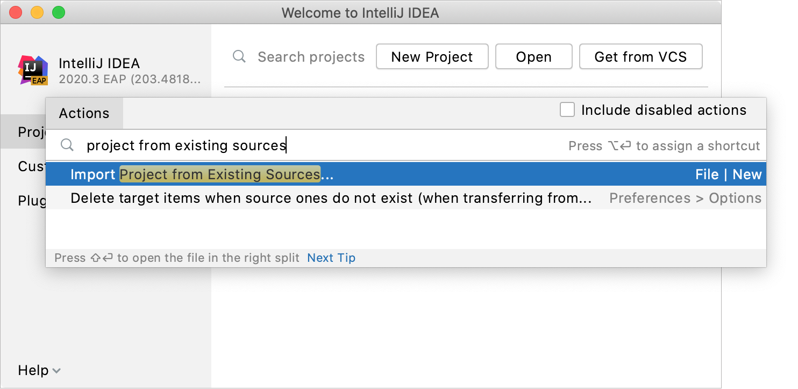
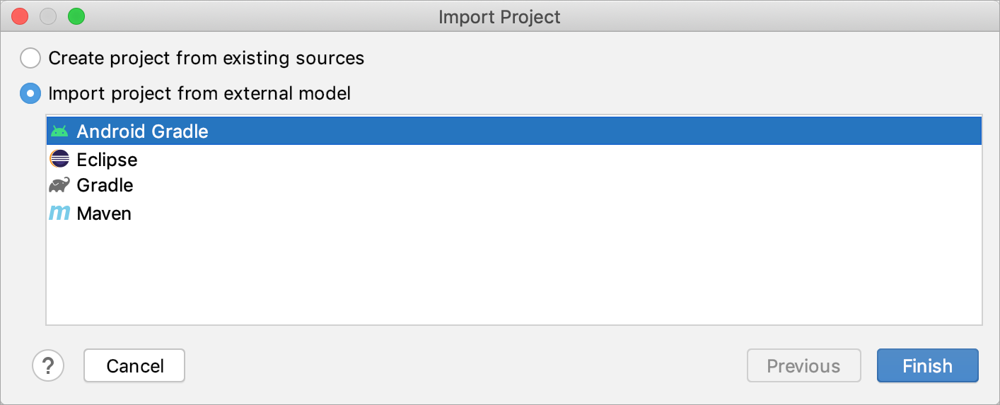
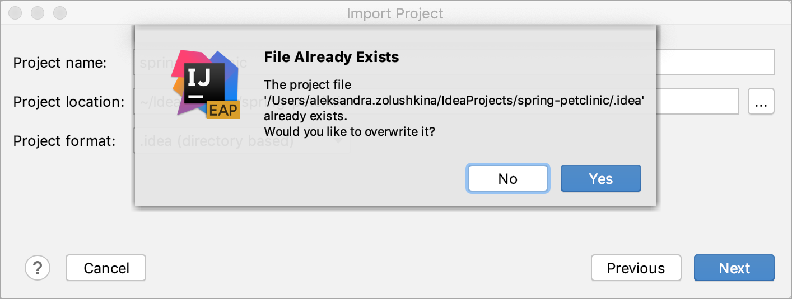
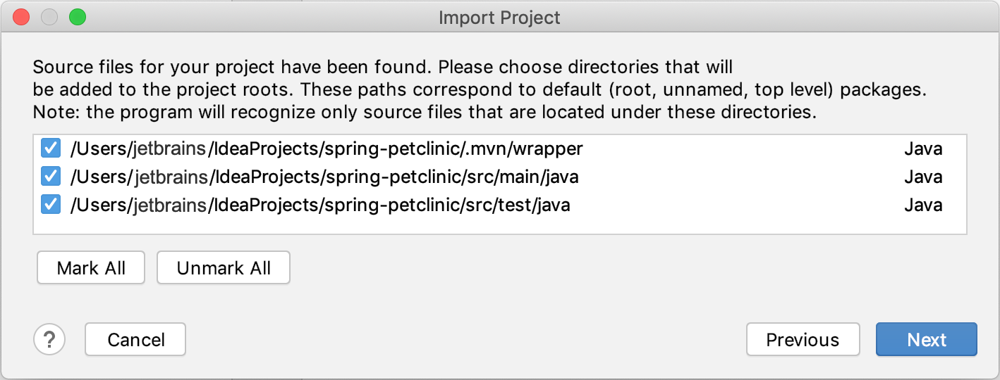
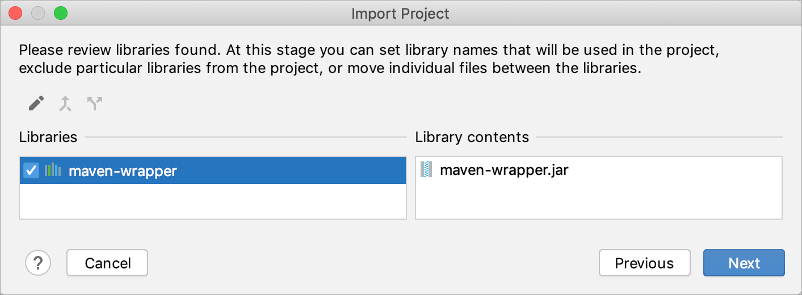
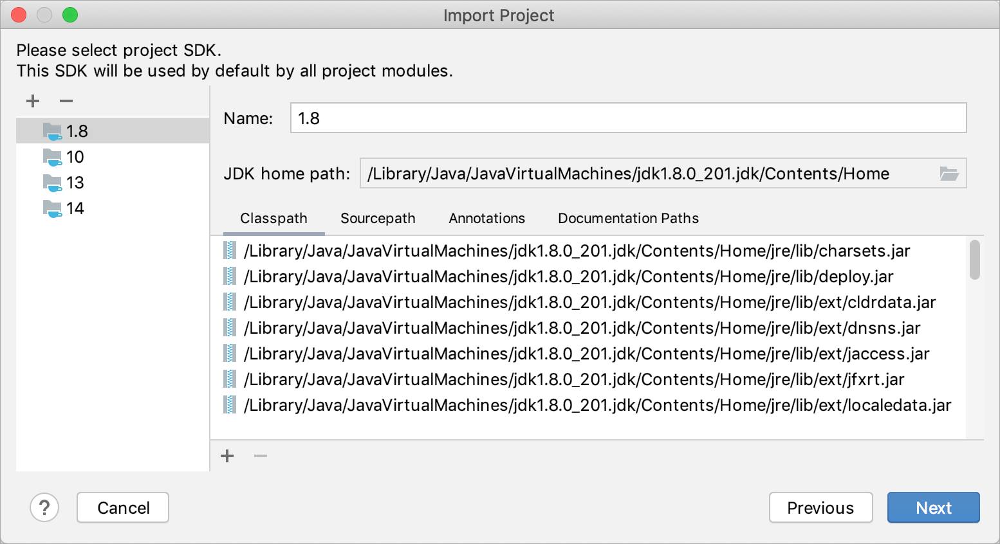

## 打开一个项目（简单导入）

此选项按原样将所选项目导入 IntelliJ IDEA（打开它）。如果您想在导入项目时设置自定义设置（例如，选择另一个 SDK 或选择要导入的库），请参阅[Create a project from existing sources](https://www.jetbrains.com/help/idea/2021.1/import-project-or-module-wizard.html#create-from-sources)。

1. 启动 IntelliJ IDEA。

   如果欢迎屏幕打开，请单击**Open**。

   否则，从主菜单中选择**File | Open**.

2. 在打开的对话框中，选择源、库和其他资产所在的目录，然后单击**Open**。

3. 首次导入或克隆项目时，IntelliJ IDEA 会对其进行分析。如果 IDE 检测到多个配置（例如，Eclipse 和 Gradle），它会提示您选择要使用的配置。

   > 如果您正在导入的项目使用构建工具，例如[Maven](https://www.jetbrains.com/help/idea/2021.1/maven-support.html)或[Gradle](https://www.jetbrains.com/help/idea/2021.1/gradle.html)，我们建议您选择构建工具配置。

   选择必要的配置并单击**OK**。

   

   IDE 会根据您的选择预先配置项目。例如，如果您选择**Gradle project**，IntelliJ IDEA 会执行其构建脚本、加载依赖项等。

4. 如果您一直在处理另一个项目，请选择是要在新对话框中还是在当前对话框中打开新项目。

> 有关如何从版本控制中获取项目的说明，请参阅[Check out a project from a remote host (clone)](https://www.jetbrains.com/help/idea/2021.1/set-up-a-git-repository.html#clone-repo).

## 导入带有设置的项目

> 本节介绍开箱即用的功能。如果您使用的是框架插件，请参阅相应的文档部分。

### 从外部模型导入项目

如果您的项目来自外部模型并且您希望将其作为一个整体导入，请使用这种类型的导入。在这种情况下，IntelliJ IDEA 会解释项目文件（例如，您的 Eclipse 项目将迁移到 IntelliJ IDEA）。

1. 启动 IntelliJ IDEA。

   如果欢迎屏幕打开，请按Ctrl+Shift+A，键入`project from existing sources`，然后单击弹出窗口中的**Import project from existing sources** 操作。

   否则，从主菜单中选择**File | New | Project from Existing Sources**。

   

2. 在打开的对话框中，选择源、库和其他资产所在的目录，然后单击**Open**。

3. 选择您的项目使用的外部模型：

   - Eclipse

   - Maven

   - Gradle：选择必要的构建工具并单击**Finish**。

     对于 Maven 和 Gradle 项目，IDE 会自动配置设置。导入项目后，您将能够调整它们。

   

### 从现有资源创建项目

使用这种类型的导入在不一定是导出项目的现有源代码上创建 IntelliJ IDEA 项目。

1. 启动 IntelliJ IDEA。

   如果欢迎屏幕打开，请按Ctrl+Shift+A，键入`project from existing sources`，然后单击弹出窗口中的**Import project from existing sources**操作。

   否则，从主菜单中选择**Create project from existing sources**。

   

2. 在打开的对话框中，选择源、库和其他资产所在的目录，然后单击**Open**。

3. 选择**Create project from existing sources**选项并单击**Next**。

   

   

4. 指定名称和位置，并为新项目选择一种格式。建议您使用[[directory-based format](https://www.jetbrains.com/help/idea/2021.1/creating-and-managing-projects.html#project-formats).](https://www.jetbrains.com/help/idea/2021.1/creating-and-managing-projects.html#project-formats)。

   单击**Next**。

   如果要将项目导入同一目录，IDE 会询问您是否要覆盖它。如果单击**Yes**，IntelliJ IDEA 将覆盖**.idea**目录中的文件和**.iml**文件，您的源文件将保持不变。

   

5. 选择要用作源根目录的目录（包含源代码的文件夹），然后单击**Next**。

   

   

6. 选择要添加到新项目的库。

   您可以通过单击 将多个选定的库或档案加入一个新库，或通过单击将选定的库分成两个。

   单击**下一步**

   

7. 查看模块结构：选择要包含在项目中的模块。

   您可以通过单击将多个模块合并为一个，或通过单击将所选模块拆分为两个。

   单击**下一步**

8. 指定要使用的[SDK](https://www.jetbrains.com/help/idea/2021.1/sdk.html)。

   如果 IntelliJ IDEA 中已经定义了必要的 SDK，请从左侧列表中选择它。否则，单击并添加新的 SDK。

   单击**Next**。

   

9. 启用对检测到的框架和技术的支持：选中必要项目旁边的复选框。

   您还可以指定文件指示器的分组方式：按类型（按框架）或按目录（按位置）。

10. 单击**Finish**。