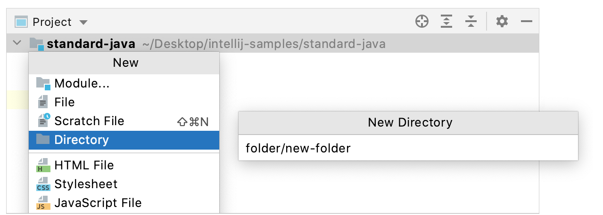
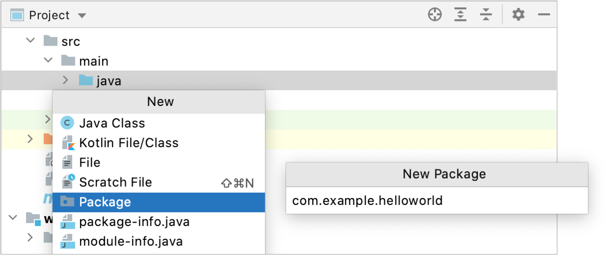
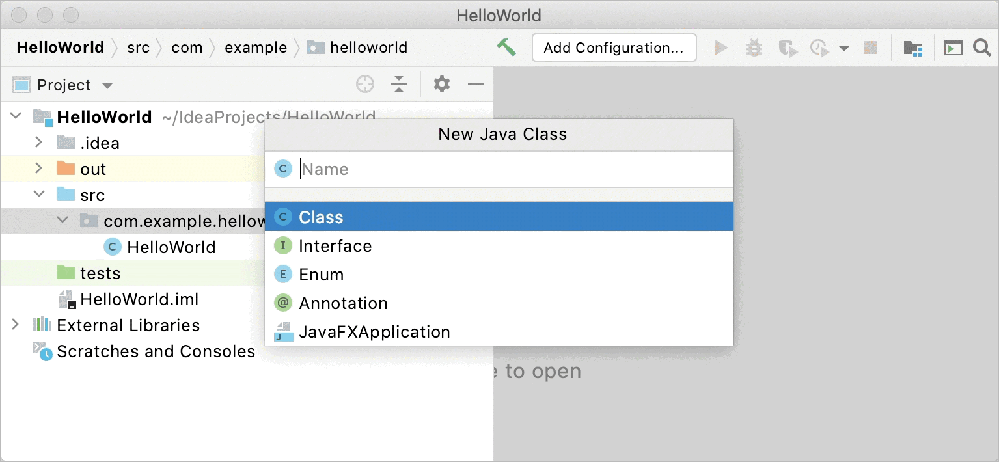
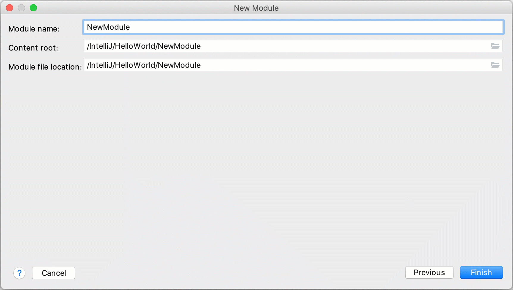

创建项目后，您可以开始添加新项目：[创建目录](https://www.jetbrains.com/help/idea/2021.1/add-items-to-project.html#new-directory)和[包](https://www.jetbrains.com/help/idea/2021.1/add-items-to-project.html#new-package)、添加[新类](https://www.jetbrains.com/help/idea/2021.1/add-items-to-project.html#new-java-class)、[导入资源](https://www.jetbrains.com/help/idea/2021.1/add-items-to-project.html#import-items)以及通过[添加更多模块来](https://www.jetbrains.com/help/idea/2021.1/add-items-to-project.html#create-module)扩展您的项目。

## 创建新项

### 创建一个新目录

1. 在**Project**工具窗口 ( Alt+1) 中，右键单击要在其中创建新目录的节点，然后选择**New | Directory**。

   或者，选择节点，按Alt+Insert，然后单击**Directory**。

2. 命名新目录并按Enter。

   如果要创建多个嵌套目录，请指定它们的名称并用斜杠分隔，例如：**folder/new-folder**。

   

### 创建一个新包

Java 中的包用于对属于同一类别或提供类似功能的类进行分组，用于构建和组织具有数百个类的大型应用程序。

1. 在**Project**工具窗口 ( Alt+1) 中，右键单击[Sources Root](https://www.jetbrains.com/help/idea/2021.1/content-roots.html#folder-categories) 或[Test Sources Root](https://www.jetbrains.com/help/idea/2021.1/content-roots.html#folder-categories) 中要在其中创建新包的节点，然后单击**New | Package**。

   或者，选择节点，按Alt+Insert，然后单击**Package**。

2. 命名新包并按Enter。

   用小写字母写包名。Java 中的包还有一些其他[命名约定](https://www.oracle.com/technetwork/java/codeconventions-135099.html)，您应该遵循这些[约定](https://www.oracle.com/technetwork/java/codeconventions-135099.html)。

   

### 创建一个新的空文件

1. 在**Project** 工具窗口 ( Alt+1) 中，右键单击要在其中创建新文件的节点，然后单击**New | File**.

   或者，选择节点，按Alt+Insert，然后单击**File**。

2. 为新文件命名并指定其扩展名，例如：**File.js**，然后按Enter。

   如果您指定的扩展名未与 IntelliJ IDEA 识别的任何文件类型相关联，则会显示[Register New File Type Association](https://www.jetbrains.com/help/idea/2021.1/creating-and-registering-file-types.html#register-new-association) 对话框。在此对话框中，您可以将扩展名与其中一种已识别的文件类型相关联。

### 创建一个新的 Java 类

1. 在**Project**工具窗口 ( Alt+1) 中，右键单击要在其中创建新类的节点，然后选择**New | Java Class**。

   或者，选择节点，按Alt+Insert，然后选择**Java Class**。

2. 命名新类并按Enter。

   在创建新类时遵循 Java[命名约定](https://www.oracle.com/technetwork/java/codeconventions-135099.html)。

   

IntelliJ IDEA 与该文件一起自动生成类声明。

这是通过文件模板完成的。根据您创建的文件的类型，IDE 会插入预期会出现在该类型的所有文件中的初始代码和格式。有关如何使用和配置模板的更多信息，请参阅[文件模板](https://www.jetbrains.com/help/idea/2021.1/using-file-and-code-templates.html)。

> 您可以创建一个类和一个包。为此，请Alt+Insert在**Project**工具窗口中按，选择**Java Class**，然后指定**类**的完全限定名，例如：`com.example.helloworld.HelloWorld`. 有关详细信息，请参阅[创建包和类](https://www.jetbrains.com/help/idea/2021.1/creating-and-running-your-first-java-application.html#create-package-and-class)。

### 创建一个新模块

模块允许您在一个应用程序中组合多种技术和框架。在 IntelliJ IDEA 中，您可以在一个项目中创建多个模块，每个模块可以负责自己的框架。

1. 右键单击**Project**工具窗口中的顶级目录，然后选择**New | Module**。该**New Module**向导打开。

2. 从左侧列表中，选择模块类型。

3. 在对话框的右侧部分，选择一个[SDK](https://www.jetbrains.com/help/idea/2021.1/sdk.html)，你想从使用**Module SDK**列表。您可以使用项目 SDK 或指定一个新的。

4. 在**Additional Libraries and Frameworks**部分中，选择要在此模块中使用的其他资产。

5. 在下一步中，为模块命名并指定内容根目录和**.iml**文件的位置。您可以将它们放置在项目内部或外部。

6. 单击**Finish**。

   

## 导入项

### 导入文件

您可以使用以下任何一种方式将文件导入您的项目：

- 将文件从系统文件管理器拖到**Project** 工具窗口中的必要节点。
- 在系统文件管理器中按Ctrl+C复制文件，然后按Ctrl+V粘贴到IDE项目工具窗口中必要的节点。  
- 手动将文件移动到系统文件管理器中的项目文件夹。

### 示例：导入图像

图片属于[资源文件](https://www.jetbrains.com/help/idea/2021.1/resource-files.html)。它们应存储在专用文件夹 - [Resources Root 中](https://www.jetbrains.com/help/idea/2021.1/content-roots.html#folder-categories)。如果您的项目中没有此文件夹，请[新建一个目录](https://www.jetbrains.com/help/idea/2021.1/add-items-to-project.html#new-directory)，在**Project** 工具窗口中右键单击它，然后选择**Mark Directory as | Resources Root**。

1. 复制文件管理器中的文件，然后粘贴到 IDE**Project** 工具窗口中包含资源文件的文件夹中。

2. 在打开的对话框中，如有必要，编辑文件名和目标位置。单击**OK**。

   https://resources.jetbrains.com/help/img/idea/2021.1/copy-image-to-project.mp4

3. 在**Project** 工具窗口中右键单击粘贴的图像，然后选择**Copy | Path From Source Root**。

4. 在要使用图像的类中，将插入符号放在必要的行，然后按Ctrl+V以粘贴图像的路径。

   运行该类以确保正确插入图像。

   https://resources.jetbrains.com/help/img/idea/2021.1/insert-image.mp4

### 导入存在的模块

您可以通过添加来自另一个项目的**.iml**文件来将模块导入您的项目：

1. 从主菜单中，选择**File | New | Module from Existing Sources**。

2. 在打开的对话框中，指定要导入的模块的**.iml**文件的路径，然后单击**Open**。

   通过这样做，您将另一个模块附加到项目中，而无需实际移动任何文件。如果您不需要将模块放在一个文件夹中，则模块导入完成，您可以开始正常使用项目。

   > 如果您希望模块在同一个文件夹中，在**项目**工具窗口中，将导入的模块拖到顶级目录中。在这种情况下，导入模块的内容将被物理传输到您的项目文件夹中。

