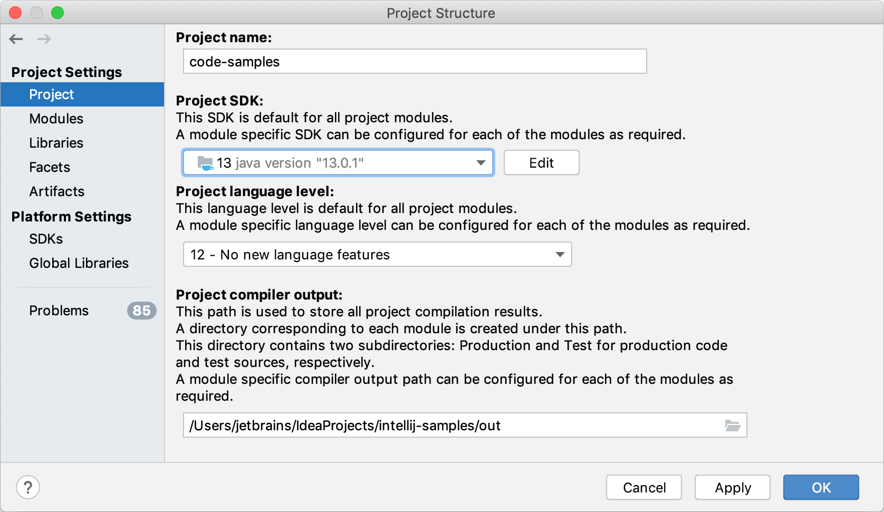
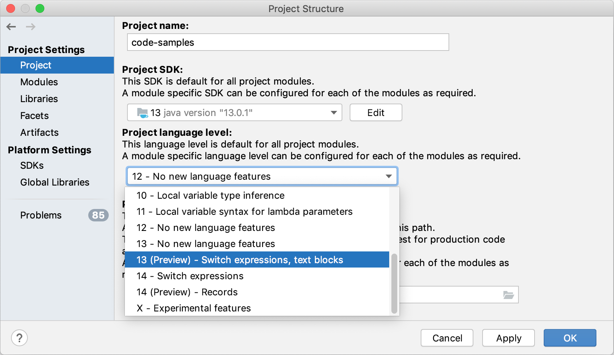

项目结构设置与其他项目文件一起以**.xml**格式存储在**.idea**目录中。这些设置包括可用于项目中所有模块的 SDK、项目编译器输出路径和库。

要更改项目结构设置，请单击工具栏并选择**Project Structure**或选择主菜单中的**File | Project Structure **Ctrl+Alt+Shift+S

### Project SDK

SDK 是为特定软件框架开发应用程序所需的工具集合。如果您的计算机上安装了必要的 SDK，但未在 IDE 中定义，请选择**Add SDK | 'SDK name'**，并指定 SDK 主目录的路径。

要开发基于 Java 的应用程序，您需要一个 JDK（Java 开发工具包）。有关如何设置项目 JDK 的详细说明，请参阅[设置项目 JDK](https://www.jetbrains.com/help/idea/2021.1/sdk.html#set-up-jdk)。

要查看或编辑所选 SDK 的名称和内容，请单击**Edit**。有关 SDK 以及如何使用它们的更多信息，请参阅[SDK](https://www.jetbrains.com/help/idea/2021.1/sdk.html)。

> 对于 Gradle 项目，请参阅[Gradle JVM 选择](https://www.jetbrains.com/help/idea/2021.1/gradle-jvm-selection.html)；对于 Maven 项目，请参阅[更改](https://www.jetbrains.com/help/idea/2021.1/maven-support.html#change_jdk)Maven 项目中[的 JDK 版本](https://www.jetbrains.com/help/idea/2021.1/maven-support.html#change_jdk)

### Project language level

语言级别定义了编辑器提供的编码辅助功能。语言级别可能与您的项目 SDK 不同。例如，您可以使用 JDK 9 并将语言级别设置为 8。这使得字节码与 Java 8 兼容，同时检查确保您不使用 Java 9 中的构造。

语言级别也会影响编译。如果您不为编译器手动配置目标字节码版本（**Settings/Preferences | Build, Execution, Deployment | Compiler | Java Compiler**），它将与项目语言级别相同。

对于每个模块，您可以[配置自己的语言级别](https://www.jetbrains.com/help/idea/2021.1/configure-modules.html#module-lang-level)。

在某些情况下，您可以选择`Preview`允许您使用 [Java Language Specification](https://docs.oracle.com/javase/specs/jls/se13/html/jls-1.html#jls-1.5)描述的预览功能的语言级别。有关 IntelliJ IDEA 中预览功能支持的更多信息，请参阅 [Preview features policy](https://www.jetbrains.com/help/idea/2021.1/project-settings-and-structure.html#preview-policy) 。

### Project compiler output

编译器输出路径是 IntelliJ IDEA 存储编译结果的目录的路径。单击图标以选择输出目录。在此目录中，IDE 会创建两个子目录：

- **production** 的产品代码。
- **test** 测试源。

在这些子目录中，将为您的每个模块创建单独的输出目录。输出路径可以[在模块级别重新定义](https://www.jetbrains.com/help/idea/2021.1/configure-modules.html#module-compiler-output)。

### Project libraries

项目级库可用于项目中的所有模块。要配置项目库，请在**Project Structure**对话框中单击**Libraries**。有关详细信息，请参阅[库](https://www.jetbrains.com/help/idea/2021.1/library.html)。

## 新项目的默认结构

您不仅可以为当前项目配置项目结构设置，还可以为您稍后将创建的所有项目配置项目结构设置。这意味着您可以为项目设置新的默认结构。

- 从主菜单中，选择**File | New Projects Settings | Structure for New Projects**.。

如果你想在已经存在的项目之间共享项目设置，你可以使用设置存储库或设置同步插件。 您还可以将设置导出到ZIP归档文件，然后将其导入到其他IDE实例。  

## 预览特性策略

IntelliJ IDEA 致力于支持最新 Java 版本的预览功能，如果可能的话，支持下一个版本的预览功能。

例如，IntelliJ IDEA v2019.2 支持 Java 12 和 13 预览功能。请注意，v2019.3 放弃了对 Java 12 预览功能的支持，因为 IntelliJ IDEA 2019.3 在 Java 13 发布之后发布，依此类推。

