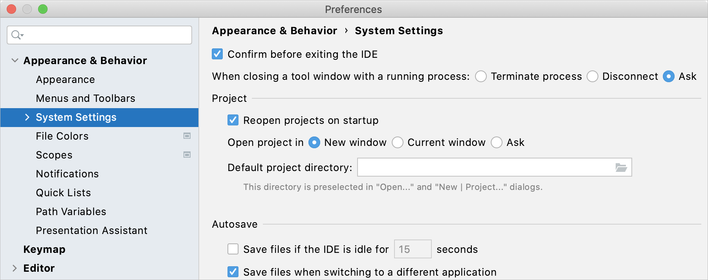
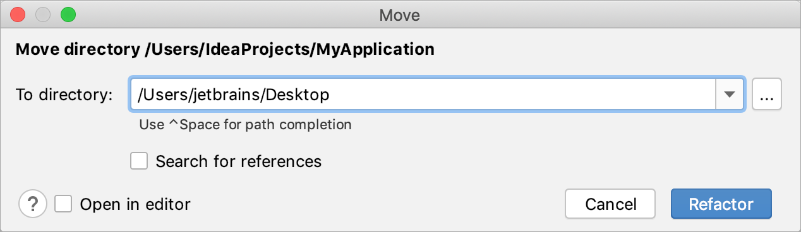
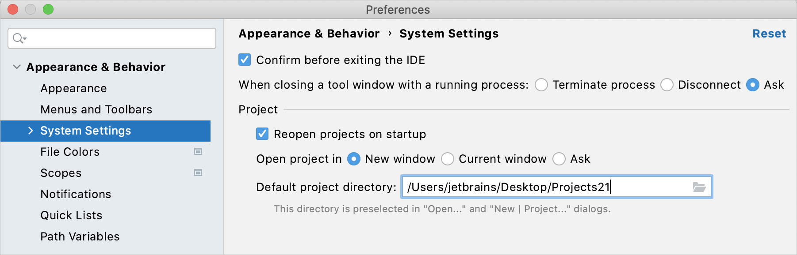

## 打开和重新打开项目

### 打开一个项目

- 如果您**最近**使用过该项目，请从主菜单中选择**File**并单击**Open**或**Open Recent**。

  或者，您可以[open projects from the command line](https://www.jetbrains.com/help/idea/2021.1/opening-files-from-command-line.html).。

> 如果您是第一次打开一个项目，并且该项目有多个配置（例如 Eclipse 和 Maven），IDE 会询问您要加载哪个配置。有关如何正确打开此类项目的更多信息，请参阅[Open a project (simple import)](https://www.jetbrains.com/help/idea/2021.1/import-project-or-module-wizard.html#open-project)。

### 在新窗口或同一窗口中打开项目

默认情况下，当您启动任何后续项目的第二个时，IDE 会询问您希望如何打开它：在新窗口中或在同一窗口中。您可以在设置中为此类情况配置默认行为：

1. 在**Settings/Preferences**对话框中Ctrl+Alt+S，选择 **Appearance & Behavior | System Settings**。

2. 在**Project**部分中，选择必要的**Open project in**选项：

   - **New window**：在单独的窗口中打开每个项目。
   - **Current window**：关闭当前项目并在同一窗口中打开新项目。
   - **Ask**：显示一个对话框，其中包含可供选择的操作。

   

3. 应用更改并关闭对话框。

### 始终重新打开项目

如果您退出具有多个已打开项目的 IDE，则下次启动 IntelliJ IDEA 时它们都将重新打开。如果您不想自动重新打开项目，可以在设置中更改此行为：

1. 在**Settings/Preferences**对话框中Ctrl+Alt+S，选择**Appearance & Behavior | System Settings**。
2. 在**Project** 部分中，清除**Reopen projects on startup**复选框。
3. 应用更改并关闭对话框。

## 在项目之间切换

如果您同时打开了多个项目，您可以使用以下选项在它们之间切换：

- 切换到下一个项目窗口：Ctrl+Alt+]（**Window | Next Project Window**）
- 切换到上一个项目窗口：Ctrl+Alt+[（**Window | Previous Project Window**）

或者，打开**Window** 菜单并选择要切换到的项目。

## 更改项目位置

### 将项目移动到另一个位置

1. 在**Project**工具窗口中Alt+1，右键单击项目的根目录并选择**Refactor | Move directory**( F6)。

2. 在打开的对话框中，为项目指定一个新位置，然后单击**Refactor**。

   

   

### 更改项目的默认位置

1. 在**Settings/Preferences**对话框中Ctrl+Alt+S，选择**Appearance & Behavior | System Settings**。

2. 在**Default project directory**字段中，指定要存储项目的文件夹的路径。

3. 应用更改并关闭对话框。

   

   

## 关闭项目

如果您只需要关闭一个项目，您可以关闭项目窗口或选择**File | Close Project**。

如果您处理多个项目，请使用以下操作一次关闭多个项目：

### 关闭所有项目

- 从主菜单中，选择**File | Close All Projects**。

  此操作将关闭当前在 IntelliJ IDEA 中打开的所有项目。

### 关闭除当前项目之外的所有项目

- 从主菜单中，选择**File | Close Other Projects**。

  此操作将关闭除当前项目之外的所有打开的项目