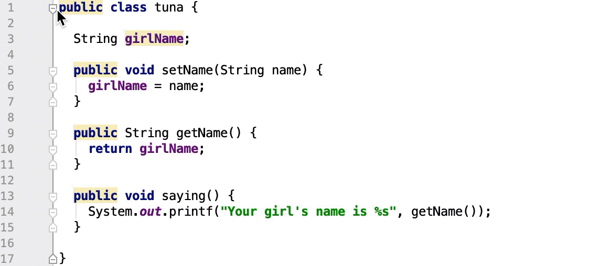

- 当您使用代码时，IntelliJ IDEA 可确保您的工作没有压力。它提供了各种快捷方式和功能来帮助您添加、选择、复制、移动、编辑、折叠、查找匹配项和保存代码。

  

  ### 寻找action

  - 如果您不记得要使用的操作的快捷方式，请按Ctrl+Shift+A以按名称查找任何操作。

    

    

  您可以使用相同的对话框来查找类、文件或符号。有关详细信息，请参阅[Searching Everywhere](https://www.jetbrains.com/help/idea/2021.1/searching-everywhere.html).

  

  ### 添加新的类、文件、包或临时文件

  - 在编辑器中，按下Ctrl+Alt+Insert以添加类、文件或包。

    如果焦点在**Project** 工具窗口内并且您想要添加新元素，请按Alt+Insert。

  - 要创建新的*Scratch*文件，请按Ctrl+Alt+Shift+Insert。

    IntelliJ IDEA 创建一个可以运行和调试的临时文件。有关详细信息，请参阅[暂存文件](https://www.jetbrains.com/help/idea/2021.1/scratches.html)。

  

  ### 切换文件的只读属性

  如果文件是只读的，它会在状态栏、其编辑器选项卡或项目工具窗口中标有关闭的锁定图标。如果文件是可写的，它会。

  1. 在编辑器中打开文件或在项目工具窗口中选择它。
  2. 执行以下操作之一：
     - 从主菜单中，选择**File | File Properties | Make File Read-only**或**File Properties | Make File Writable**。
     - 单击状态栏中的锁定图标。

  如果版本控制系统设置了只读状态，建议您使用 IntelliJ IDEA 版本控制集成功能。有关详细信息，请参阅[版本控制](https://www.jetbrains.com/help/idea/2021.1/version-control-integration.html)。

  

  ### 选择代码结构

  - 在编辑器中，将鼠标插入符号放在要选择的项上，然后按Ctrl+W/Ctrl+Shift+W扩展或缩小您的选择。

    例如，在纯文本文件中，选择从整个单词开始，然后扩展到句子、段落等。

    在 Java 文件中，如果您首先在方法调用中选择一个参数，它将扩展到所有参数，然后是整个方法，然后是包含该方法的表达式，然后是更大的表达式块，等等。

    

    如果您只需要突出显示您的大括号，请将鼠标插入符号放在块闭合大括号/括号之后或块打开大括号/括号之前。

  

  ### 根据大小写选择代码

  1. 在***Settings/Preferences**对话框中Ctrl+Alt+S，转到**Editor | General | Smart Keys**。
  2. 选中 **Use "CamelHumps" words** 复选框。

  如果你想使用双击时根据大小写选择，请确保在**Settings/Preferences**项对话框“Ctrl+Alt+S”的 **Editor | General** 页面上选中**Honor CamelHumps words...**… 复选框。  

  ### 配置制表符和缩进

  1. 在**Settings/Preferences**对话框中Ctrl+Alt+S，转到 **Editor | Code Style**。

  2. 选择要为其配置缩进的语言。

  3. 从右侧的选项中，在**Tabs and Indents** 上，选择**Use tab character**以便编辑器在您按下Tab、缩进或重新格式化代码时使用制表符。如果需要，您还可以配置选项卡大小。如果不选择此选项，IntelliJ IDEA 将使用空格。

     

     

  

  ### 复制和粘贴代码

  您可以使用标准快捷方式复制Ctrl+C和粘贴Ctrl+V任何选定的代码片段。如果未选择任何内容，IntelliJ IDEA 会自动复制插入符号所在的整行。

  默认情况下，当您在编辑器中粘贴任何内容时，IntelliJ IDEA 会执行“智能”粘贴，例如，在注释中粘贴多行会自动将适当的标记添加到您正在粘贴的行中。如果您只需要粘贴纯文本，请按Ctrl+Alt+Shift+V。

  - 将插入符号放在一行或一个符号上，右键单击以打开上下文菜单，选择**Copy/Paste Special | Copy Reference**。当您选择**Copy Reference** ( Ctrl+Alt+Shift+C) 选项时，IntelliJ IDEA 会创建一个引用字符串，其中包含所选行或符号的行号。您可以按Ctrl+V将复制的reference粘贴到任何地方。

  - IntelliJ IDEA 会跟踪您复制到剪贴板的所有内容。要从历史粘贴，在编辑器中，从上下文菜单中，选择

    **Copy/Paste Special | Paste from History** ( Ctrl+Shift+V)。在打开的对话框中，选择您的条目并单击粘贴

    > 剪贴板历史记录中存储的默认项目数为 100。

  - 当您将代码复制并粘贴到编辑器时，IntelliJ IDEA 会显示由其 Unicode 名称缩写表示的隐藏（特殊）字符。

    

    

  ## 代码行

  IntelliJ IDEA 提供了几个有用的快捷方式来操作代码行。

  > 如果您需要撤消或重做更改，请分别按Ctrl+Z/ Ctrl+Shift+Z。

  - 要在当前行之后添加一行，请按Shift+Enter。IntelliJ IDEA 将插入符号移动到下一行。

  - 要在当前行之前添加一行，请按Ctrl+Alt+Enter。IntelliJ IDEA 将插入符号移动到上一行。

  - 要复制一行，请按Ctrl+D。

  - 要在整个文件或代码选择中按字母顺序对行进行排序，请从主菜单中选择**Edit | Sort Lines**或**Edit | Reverse Lines**。当您使用属性文件、数据集、文本文件、日志文件等时，这些操作可能会有所帮助。如果您需要为这些操作分配快捷键，请参阅[配置键盘快捷键](https://www.jetbrains.com/help/idea/2021.1/configuring-keyboard-and-mouse-shortcuts.html)了解更多信息。

  - 要删除一行，请将插入符号放在您需要的行上，然后按Ctrl+Y。

    > 注意，当你第一次用Windows默认键映射安装IntelliJ IDEA时，会出现一个对话框，让你把这个快捷方式映射到重做或删除行操作。  

  - 要加入行，请将插入符号放在要加入其他行的行上，然后按Ctrl+Shift+J。一直按这些键，直到所有需要的元素都加入。

    您还可以连接字符串文字、字段或变量声明以及语句。请注意，IntelliJ IDEA 检查代码样式设置并消除不需要的空格和冗余字符。

  - 要将字符串文字分成两部分，请按Enter。

    IntelliJ IDEA 拆分字符串并提供正确的语法。您还可以使用**Break string on '\n'**意图来拆分字符串文字。按Alt+Enter或单击以选择此意图。

  - 要注释一行代码，请将插入符号放在相应的行并按Ctrl+/。

  - 要向上或向下移动一行，请分别按Alt+Shift+Up或Alt+Shift+Down。

  - 要将代码元素向左或向右移动（交换），请将插入符号放在其上，或选择它并按Ctrl+Alt+Shift+Left向左或Ctrl+Alt+Shift+Right向右。

    例如，对于 Java，您可以将这些操作用于方法调用或方法声明参数、枚举常量、数组初始值设定项表达式。对于 XML 或 HTML，将这些操作用于标记属性。

    

  ## 代码语句

  ### 移动语句

  - 在编辑器中，将插入符号放在需要的语句处，然后按Ctrl+Shift+Up将语句向上Ctrl+Shift+Down移动或将语句向下移动。IntelliJ IDEA 移动所选语句执行语法检查。

  > 如果在当前上下文中不允许移动语句，则操作将被禁用。

  ### 完成当前语句

  - 在编辑器中，按Ctrl+Shift+Enter或 从主菜单中选择**Code | Complete Current Statement**。IntelliJ IDEA 在结构、切片和其他复合文字中自动插入所需的尾随逗号。插入符号移动到您可以开始输入下一条语句的位置。

  ### 展开或删除语句

  1. 将插入符号放在要删除或展开的表达式处。

  2. 按Ctrl+Shift+Delete。

     IntelliJ IDEA 显示一个弹出窗口，其中包含当前上下文中可用的所有操作。为了更容易区分要提取的语句和要删除的语句，IntelliJ IDEA 使用不同的背景颜色。

     

  3. 选择一个动作并按下Enter。

     

     

  ## 代码片段

  - 通过在编辑器中拖动来移动和复制代码片段。

    - 要移动代码片段，请选择它并将所选内容拖动到目标位置。
    - 要复制代码选择，Ctrl按住不放，将其拖动到目标位置。

    默认情况下启用拖动功能。要禁用它，请在**Settings/Preferences**对话框中Ctrl+Alt+S，转到**Editor | General**并清除**Mouse** 部分**Enable Drag'n'Drop functionality in editor**复选框。

  - 要在所选代码片段的大小写之间切换，请按Ctrl+Shift+U。

    请注意，当您将切换大小写操作应用于*CamelCase*名称格式时，IntelliJ IDEA 会将名称转换为小写。

  - 要注释或取消注释代码片段，请选择它并按Ctrl+Shift+/。

    要配置生成的行或块注释应放置在 Java 中的位置的**设置**Ctrl+Alt+S，请在 **Settings/Preferences** 对话框中，转到**Editor | Code Style | Java**和**Code Generation**选项卡使用***Comment Code**部分中的选项。

  ## 代码折叠

  折叠的代码片段显示为阴影椭圆 ( )。如果折叠的代码片段包含错误，IntelliJ IDEA 会以红色突出显示该片段。

  

  动图

  要配置默认代码折叠行为，请在**Settings/Preferences**对话框中Ctrl+Alt+S，转到**Editor | General | Code Folding**。

  > 如果 IntelliJ IDEA 在代码重新格式化过程中更改了折叠片段中的代码，代码片段将自动展开。

  ### 展开或折叠代码元素

  - 要折叠或展开代码片段，请按Ctrl+NumPad -/ Ctrl+NumPad +。IntelliJ IDEA 折叠或展开当前代码片段，例如单个方法。

  - 要折叠或展开所有代码片段，请按Ctrl+Shift+NumPad -/ Ctrl+Shift+NumPad +。

    IntelliJ IDEA 折叠或展开选择中的所有片段，或者，如果未选择任何内容，则当前文件中的所有片段，例如文件中的所有方法。

  - 要递归折叠或展开代码，请按Ctrl+Alt+NumPad -/ Ctrl+Alt+NumPad +。IntelliJ IDEA 折叠或展开当前片段及其在该片段中的所有从属区域。

  - 要折叠代码块，请按Ctrl+Shift+.。此操作折叠匹配的花括号对之间的代码片段，为该片段`{}`创建*自定义折叠区域*，并使其“可折叠”。

  - 要折叠或展开当前文件中的文档注释，请在主菜单中选择 **Code | Folding | Expand doc comments/Collapse doc comments**。

  - 要折叠或展开自定义代码片段，请选择它并按Ctrl+.。

    您可以在代码中折叠或展开任何手动选择的区域。

  ### 折叠或展开嵌套片段

  - 要展开当前片段和所有嵌套片段，请按Ctrl+NumPad *, 1。您可以将当前片段扩展到指定的嵌套级别（从 1 到 5）。
  - 要展开文件中所有折叠的片段，请按Ctrl+Shift+NumPad *, 1。您可以将折叠的片段展开到指定的嵌套级别（从 1 到 5）。

  ### 使用环绕Action

  您可以使用**Surround With**操作折叠或展开代码。

  1. 在编辑器中，选择一个代码片段并按Ctrl+Alt+T。
  2. 从弹出菜单中，选择**<editor-fold...> Comments**或**region...endregion Comments**。
  3. （可选）指定将隐藏折叠片段的描述。
  4. 要折叠或展开创建的区域，请按Ctrl+.。
  5. 要导航到创建的自定义区域，请按Ctrl+Alt+.。

  ### 禁用代码折叠大纲

  您可以禁用装订线上显示的代码折叠轮廓。

  1. 在**Settings/Preferences**对话框中Ctrl+Alt+S，转到**Editor | General | Code Folding**。
  2. 清除**Show code folding outline**复选框。

  ## 自动保存

  IntelliJ IDEA 会自动保存您在文件中所做的更改。保存由各种事件触发，例如编译、运行、调试、执行版本控制操作、关闭文件或项目或退出 IDE。保存文件也可以由第三方[插件](https://www.jetbrains.com/help/idea/2021.1/managing-plugins.html)触发。
  大多数触发自动保存的事件都是预定义的，无法配置，但您可以确定更改不会丢失，您可以在[本地历史记录中](https://www.jetbrains.com/help/idea/2021.1/local-history.html)找到所有更改。

  > 要强制保存所有未保存的文件，请按Ctrl+S或从菜单中选择**File | Save ALl**。

  ### 配置自动保存行为

  1. 按Ctrl+Alt+S打开 IDE 设置并选择**Appearance and Behavior | System Settings**。
  2. 在**Autosave 下**，配置以下选项：
     - **Save files when switching to a different application  切换到其他应用程序时保存文件**
     - **Save files is the IDE is idle for N seconds IDE空闲N秒保存文件**

  如果您使用[版本控制集成](https://www.jetbrains.com/help/idea/2021.1/version-control-integration.html)，所有修改文件的名称将在文件选项卡上用[专用颜色](https://www.jetbrains.com/help/idea/2021.1/file-status-highlights.html)标记。但您也可以在文件选项卡上用星号 (*) 标记未保存的文件。

  ### 标记具有未保存更改的文件

  1. 按Ctrl+Alt+S打开 IDE 设置并选择**Editor | General | Editor Tabs**。
  2. 选中**Mark modified (\*)**复选框。

  ### 还原更改

  - 对于最近的更改，包括[重构](https://www.jetbrains.com/help/idea/2021.1/refactoring-source-code.html)，请按Ctrl+Z或从菜单中选择**Edit | Undo**。
  - 有关过去更改的更详细视图，请使用[Local History](https://www.jetbrains.com/help/idea/2021.1/local-history.html)。
  - 要对所有更改进行最可靠的跟踪，请使用[版本控制系统](https://www.jetbrains.com/help/idea/2021.1/version-control-integration.html)。