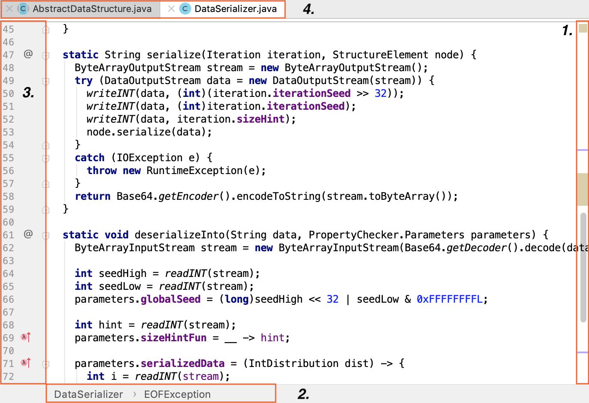
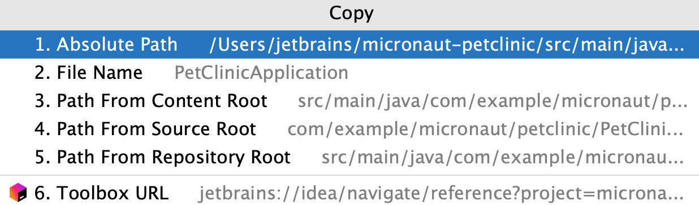
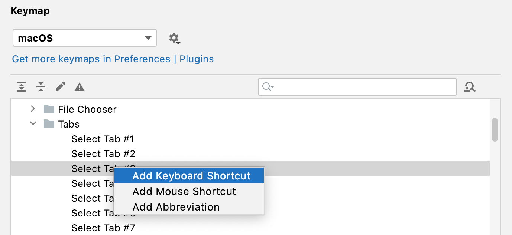
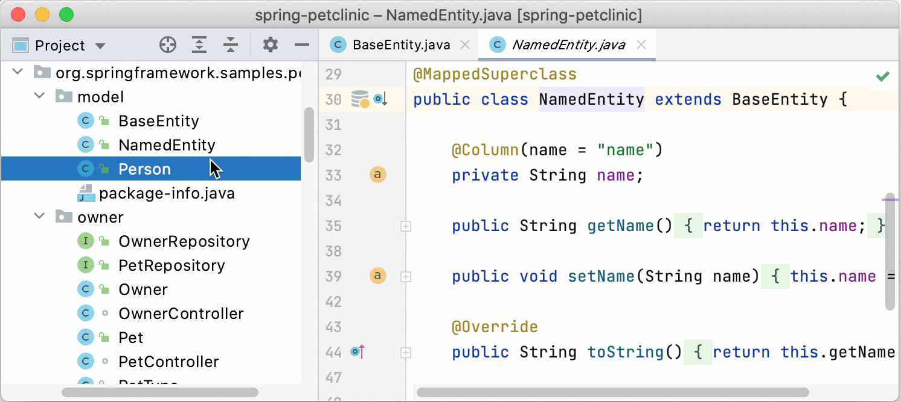
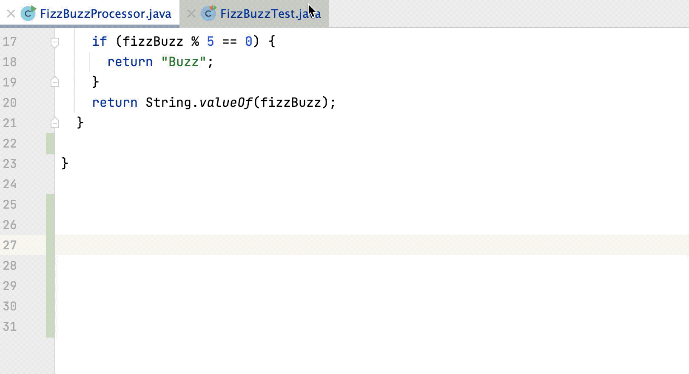
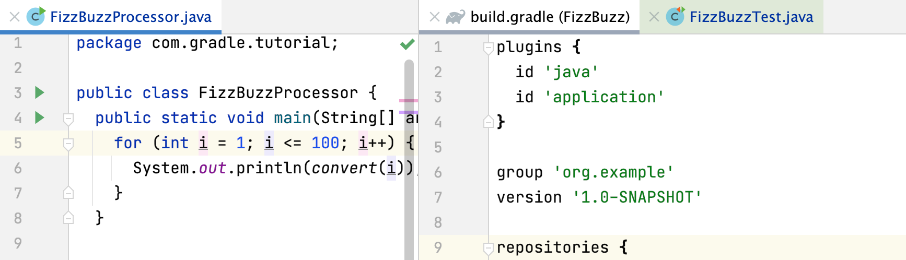
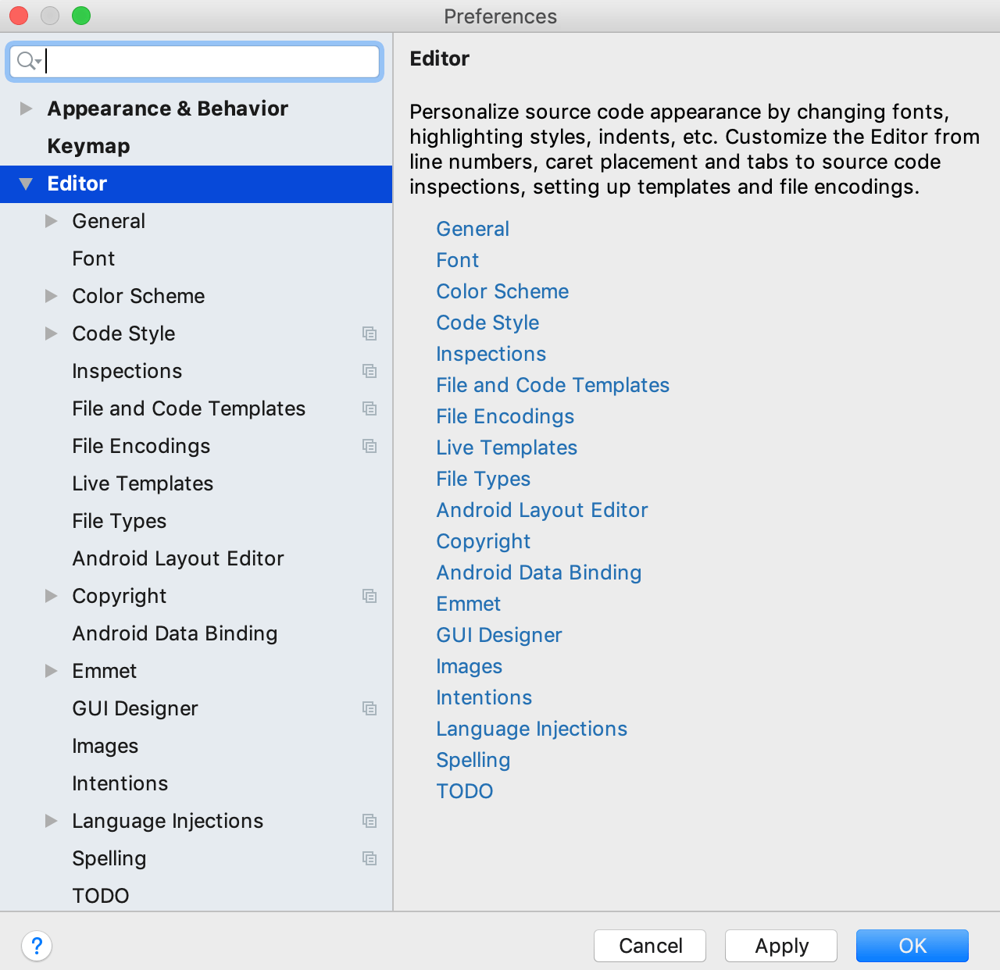

IntelliJ IDEA 编辑器是用于创建、读取和修改代码的 IDE 的主要部分。

编辑器由以下区域组成：

1. [滚动条](https://www.jetbrains.com/help/idea/2021.1/using-code-editor.html#scrollbar)显示错误和警告在当前文件。
2. [Breadcrumbs](https://www.jetbrains.com/help/idea/2021.1/navigating-through-the-source-code.html#editor_breadcrumbs)帮助您在当前文件的代码中导航。
3. gutter显示行号和注释。
4. 选项卡显示当前打开的文件的名称。

## 导航

您可以使用各种快捷方式在编辑器和不同工具窗口之间切换、更改编辑器大小、切换焦点或返回原始布局。

### 最大化编辑器窗格

- 在编辑器中，按Ctrl+Shift+F12 IntelliJ IDEA 隐藏除活动编辑器之外的所有窗口。

  您也可以最大化分屏。在这种情况下，活动屏幕被最大化，其他屏幕被移到一边。

### 将焦点从窗口切换到编辑器

- 按Escape。IntelliJ IDEA 将焦点从任何窗口移动到活动编辑器。

### 从命令行终端返回编辑器

- 按Alt+F12。IntelliJ IDEA 关闭终端窗口。
- 如果您在切换回活动编辑器时需要保持终端窗口打开，请按Ctrl+Tab。

### 返回默认布局

- 按Shift+F12。
- 要将当前布局保存为默认布局，请从主菜单中选择**Window | Store Current Layout as Default**。您可以使用相同的快捷方式Shift+F12来恢复保存的布局。

### 跳转到最后一个活动窗口

- 按F12。

### 使用切换器进行导航

1. 要使用切换器在打开的文件和工具窗口之间跳转，请按Ctrl+Tab。
2. Ctrl按住以使切换器弹出窗口保持打开状态。
3. 按下Tab可在元素之间移动。按Backspace可从列表中删除所选文件并在编辑器中将其关闭。

### 更改 IDE 外观

您可以在schemes、键盘映射或查看模式之间切换。

1. 按Ctrl+`。
2. 在**Switch** 菜单中，选择您需要的选项并按Enter。使用相同的快捷方式Ctrl+`撤消您的更改。

您还可以在**Editor | Color Scheme**页面上找到和调整配色方案设置，包括针对视力缺陷者的高对比度配色方案，以及在**Settings/Preferences**对话框Ctrl+Alt+S的 **Keymap** 页面上的键图设置。  

### 跳转到导航栏

- 按Alt + Home。

## 滚动条

当您在编辑器中处理代码时，IntelliJ IDEA 会在滚动条上显示代码分析结果，包括错误和警告。您可以检查您的代码是否有问题并快速导航到它们。

滚动条的顶部有**Inspections 检查**小部件，它为您提供代码问题的简要摘要。单击小部件可在**Problems**工具窗口中获取有关每个检测到的问题的更多信息。

滚动条上的条纹表示 IntelliJ IDEA 发现问题的地方。将鼠标悬停在条带上可查看描述问题的工具提示，或单击条带进行快速导航。

在处理文件时看到许多条纹是正常的。当您完成代码时，其中许多错误、警告和建议最终都会得到解决。如果您觉得您的代码完整时仍然存在任何错误，我们建议您在编译项目之前探索并解决它们。

不同颜色的条纹表示问题的严重性，从标记为红色的错误到标记为蓝色的**TODO**注释，但您可以根据需要更改显示的颜色。有关详细信息，请参阅[更改检查严重性](https://www.jetbrains.com/help/idea/2021.1/configuring-inspection-severities.html)。

## 编辑器选项卡

您可以关闭、隐藏和分离编辑器选项卡。每次打开文件进行编辑时，都会在活动编辑器选项卡旁边添加一个带有其名称的选项卡。

> 从主菜单中，选择 **Window | Editor Tabs**以查看您可以使用编辑器选项卡执行哪些其他操作。例如，**Close Tabs to the Left**或**Close Tabs to the Right**。
>
> 您可以将选项卡的上下文菜单用于相同目的。

要配置编辑器选项卡的设置，请使用**Settings/Preferences**对话框的 **Editor | General | Editor Tabs**选项卡页面Ctrl+Alt+S。或者，右键单击选项卡并从选项列表中选择**Configure Editor Tabs**。

### 打开或关闭选项卡

- 要关闭所有打开的选项卡，请在主菜单中选择 **Window | Editor Tabs | Close All Tabs** .
- 要关闭所有未激活的选项卡，按Alt键并单击活动选项卡上的关闭按钮。 在这种情况下，只有活动标签保持打开
- 关闭除活动选项卡和固定选项卡外的所有非活动选项卡，右键单击任何选项卡并选择 **Close Other Tabs**
- 要关闭仅活动的标签，按Ctrl+F4。 您也可以在选项卡上的任何地方单击鼠标滚轮按钮来关闭它.
- 要重新打开已关闭的选项卡，请右键单击任何选项卡，并从上下文菜单中选择 **Reopen Closed Tab**.
- 要在已打开的选项卡的末尾打开新选项卡，请在选项卡设置的末尾选择 **Open new tabs at the end** 

### Copy path or filename

1. 右键单击选项卡.

2. 从打开的列表中，选择**Copy Path**.

3. 从打开的列表中，选择复制选项.

   

   IntelliJ IDEA复制项目到剪贴板，你可以粘贴(Ctrl+V)你需要的任何地方.

### 移动、删除或排序选项卡

- 要移动或删除选项卡上的图标，请在**设置/首选项**对话框中Ctrl+Alt+S，转到**编辑器 | 一般 | 编辑器选项卡**并在**关闭按钮位置**字段中选择适当的选项。

- 要将编辑器选项卡放置在编辑器框架的不同部分或隐藏选项卡，请右键单击选项卡并选择**配置编辑器选项卡**以打开**编辑器选项卡**设置。在*外观*部分的**选项卡放置**列表中，选择适当的选项。

  > 要在所有选项卡都隐藏时访问**编辑器选项卡**设置，请选择**Window | 编辑器标签 |** 从主菜单**配置编辑器选项卡**。

- 要按字母顺序对编辑器选项卡进行排序，请右键单击选项卡并选择**配置编辑器选项卡**以打开**编辑器选项卡**设置。在*选项卡顺序*部分中，选择**按字母顺序排序选项卡**。

### 固定或取消固定选项卡

您可以在编辑器中固定活动选项卡，以便在达到选项卡限制或使用**Close Other Tabs**命令时保持打开状态。

- 要固定或取消固定活动选项卡，请右键单击它并从上下文菜单中选择**固定选项卡 Pin Tab**或**取消固定选项卡**。
- 要关闭除固定选项卡以外的所有选项卡，请右键单击任何选项卡并选择**Close All but Pinned**。
- 要为**Pin Tab**操作分配键盘快捷**键**，请在**Settings/Preferences**对话框中Ctrl+Alt+S，转到**Keymap**，找到**Pin Active Tab**操作，右键单击它，选择**Add Keyboard Shortcut**，然后按下您要使用的组合键。

### 分离选项卡

分离选项卡时，该选项卡将在一个单独的窗口中打开，并且该窗口将保留给分离的选项卡。如果您尝试从主框架中分离另一个选项卡，它将在新窗口中打开。

- 要分离活动选项卡，请按Shift+F4。
- 将您需要的选项卡拖到主窗口之外，然后将选项卡拖回以附加它。
- 您也可以Alt+mouse用于相同的操作。
- 在**项目**工具窗口中，选择要分离的文件并按Shift+Enter。

### 在选项卡之间切换

- 要在选项卡之间移动，请按Alt+Right或Alt+Left。

- 您还可以在最近查看的选项卡或文件之间切换。

  在编辑器中，按Ctrl+Tab。按住Ctrl的**Switcher** 窗口保持打开状态。用Tab在选项卡和其他文件之间切换。

### 为打开的选项卡分配快捷方式

1. 在**Settings/Preferences**对话框中Ctrl+Alt+S，转到**Keymap**。

2. 在目录列表中，单击**Other** 目录，然后从选项卡列表中选择您需要为其添加快捷方式的目录。您可以为其分配快捷方式的选项卡限制为 9 个。

   

   

### 更改默认选项卡限制

IntelliJ IDEA 限制您可以同时在编辑器中打开的选项卡数量（默认选项卡限制为 10）。

1. 在**Settings/Preferences**对话框中Ctrl+Alt+S，转到**Editor | General | Editor Tabs**。
2. 在**Tab closing policy**部分，根据您的偏好调整设置，然后单击**OK**。

> 如果选项卡限制等于 1，则编辑器中的选项卡将被禁用。如果您希望编辑器永远不会关闭选项卡，请输入一些无法访问的数字。

### 在预览选项卡中打开文件

预览选项卡允许您在单个选项卡中逐个查看文件，而无需在新选项卡中打开每个文件。如果您需要在不超过制表符限制的情况下查看多个文件，这将很有帮助。

1. 在**Project** 工具窗口中Alt+1，单击并选择**Enable Preview Tab**选项。

   您还可以在**Settings/Preferences | General | Editor Tabs | Opening Policy**.。

2. 在Project工具窗口中，选择尚未在任何其他选项卡中打开的文件。

   文件名用斜体表示，表示预览模式。您选择的任何其他文件都将替换预览选项卡中的前一个文件。

   开始编辑文件以退出预览模式并将其更改为常规选项卡。

   

   请注意，启用预览选项卡后，**Open Files with Single Click**选项将被忽略。双击文件以在常规选项卡中打开它。

### 如果没有更多空间，隐藏编辑器选项卡

1. 在**Settings/Preferences**对话框中Ctrl+Alt+S，转到**Editor | General | Editor Tabs**。
2. 选择 **Hide tabs if there is no space** 的选项。额外的选项卡将放置在位于编辑器右上角的列表中。

### 更改选项卡中的字体大小

1. 在**Settings/Preferences**对话框中Ctrl+Alt+S，转到**Appearance & Behavior | Appearance**。

2. 在**Size** 字段中，指定字体大小并单击**OK** 以保存更改。

   请记住，字体大小不仅会更改选项卡，还会更改工具窗口。

## 分屏

IntelliJ IDEA 提供了各种操作，您可以从主菜单或上下文菜单、编辑器或项目工具窗口调用这些操作来拆分编辑器屏幕。

- 在编辑器中，右键单击所需的编辑器选项卡，然后选择要如何拆分编辑器窗口（**Split Right**或**Split Down**）。IntelliJ IDEA 创建编辑器的拆分视图并根据您的选择放置它。

- 或者，从主菜单中选择**Window | 编辑器选项卡**和**拆分并向右移动**或**拆分并向下移动**选项。

  如有必要，您可以为这些操作分配键盘快捷键。为此，在**Settings/Preferences**对话框中Ctrl+Alt+S，转到**Keymap**，找到**Split Right**或**Split Down**操作，右键单击它，选择**Add Keyboard Shortcut**，然后按您要使用的组合键。您可以对**Split and Move Right**或**Split and Move Down**操作执行相同操作。

- 您可以垂直或水平拖动选项卡以拆分编辑器，然后将选项卡向后拖动以取消拆分屏幕。

  

- 您可以在右侧拆分的编辑器中打开文件。

  在**Project**工具窗口中，右键单击文件并从上下文菜单中选择**Open in Right Split**（或按Shift+Enter）。IntelliJ IDEA 将在编辑器右侧的拆分中打开一个文件。

  

  如果有两个拆分并且焦点在左拆分，则文件将在现有的右拆分中打开。如果焦点在右拆分，文件将在下一个右拆分中打开。

- 您可以在分屏之间移动文件。在编辑器中右键单击所需的文件选项卡，然后从上下文菜单中选择**Move To Opposite Group**或**Open In Opposite Group**。

- 您可以最大化活动的分屏。将光标放在要最大化的屏幕上，然后按Ctrl+Shift+F12。

  在这种情况下，IntelliJ IDEA 会隐藏所有工具窗口并将其他分屏移到一边。

  另一种方法是，您可以双击活动的分屏以将其最大化。

- 要**取消**拆分屏幕，请从上下文菜单中选择**Unsplit**或**Unsplit All**以取消拆分所有拆分帧。

### 移动分屏

1. 将插入符号放在所需的拆分框架内。

2. 从主菜单中，选择**Window | Editor Tabs**。

3. 从选项列表中，选择以下选项之一：

   - 将编辑器拉伸到顶部
   - 向左拉伸编辑器
   - 将编辑器拉伸到底部
   - 向右拉伸编辑器

   您可以为每个选项[分配一个快捷方式](https://www.jetbrains.com/help/idea/2021.1/configuring-keyboard-and-mouse-shortcuts.html)，并使用键盘来拉伸拆分框架。

   要在您创建的分割帧之间移动，请从主菜单中选择**Window | Editor Tabs**.。从选项列表中分别选择**Goto Next Splitter** N/A或**Goto Previous Splitter** N/A。

## 有用的编辑器配置

您可以使用**Settings/Preferences**对话框Ctrl+Alt+S来自定义编辑器的行为。

### 配置代码格式

1. 在**Settings/Preferences**对话框中Ctrl+Alt+S，转到**Editor | Code Style**。
2. 从语言列表中选择适当的语言，然后在语言页面上配置制表符和缩进、空格、换行和大括号、硬边距和软边距等设置。

### 配置字体、大小和字体连字

- 在**Settings/Preferences**对话框中Ctrl+Alt+S，转到 **Editor | Font**。

> 例如，如果您之前保存了**Color Scheme Font**设置，则主要设置将被覆盖。带有相应通知的链接将出现在**Font** 页面上。

### 在编辑器中更改字体大小

1. 在**Settings/Preferences**对话框中Ctrl+Alt+S，转到**Editor | General** (**Mouse Control** )。

2. 选择**Change font size with Ctrl+Mouse Wheel** 更改字体大小选项。

3. 返回编辑器，按住Ctrl，然后使用鼠标滚轮调整字体大小。

   > 您可以在编辑[器设置](https://www.jetbrains.com/help/idea/2021.1/using-code-editor.html#font_size)的**字体**页面上配置编辑器大小。

### 为不同的语言和框架配置配色方案设置

1. 在**Settings/Preferences**对话框中Ctrl+Alt+S，转到**Editor | Color Scheme**。
2. 打开**Color Scheme**节点并选择所需的语言或框架。您还可以从节点列表中选择**General**选项来配置常规项目（例如代码、编辑器、错误和警告、弹出窗口和提示、搜索结果等）的配色方案设置。

### 配置代码完成选项

- 在**Settings/Preferences**对话框中Ctrl+Alt+S，转到**Editor | 一般 | 代码完成**。在这里您可以配置区分大小写的完成、自动显示选项、代码排序等。

### 配置插入符号位置

- 在**Settings/Preferences**对话框中Ctrl+Alt+S，转到**Editor | General**.部分，您可以配置插入符号放置选项。

  选择**Allow placement of caret after end of line**选项以将插入符号放置在与上一行末尾相同的位置的下一行。如果清除此选项，则下一行的插入符号将放置在实际行的末尾。

  选择**Allow placement of caret inside tabs**选项，以帮助您在文件中上下移动插入符号，同时将其保持在同一位置。

### 配置保存时尾随空格的行为

- 在**Settings/Preferences**对话框中Ctrl+Alt+S，转到 **Editor | General**.。在**Other** 部分中，您可以配置尾随空格的选项。

  例如，当您手动或自动保存代码，并且希望在插入行保留尾随空格，而不管在保存列表的**Strip trailing spaces on save**中选择了什么选项时，请选择**Always keep trailing spaces on caret line**选项。  

### 配置编辑器外观选项

- 在**Settings/Preferences**对话框中Ctrl+Alt+S，转到**Editor | General | Appearance**.。

  例如，您可以配置显示硬包装指南，或显示参数提示。

### 管理长线的外观

1. 在**Settings/Preferences**对话框中Ctrl+Alt+S，转到**Editor | General**。

2. 在**软包装**部分中，指定适当的选项。

   例如，您可以指定要应用软包装的

   文件类型

   。在 Markdown 文件中编写文档时可能会有所帮助。

### 配置smart key

您可以根据您使用的语言为不同的基本编辑器操作配置特定行为。

- 在**Settings/Preferences**对话框中Ctrl+Alt+S，转到**Editor | General | Smart keys**。

  例如，对于 Java、SQL 或 Python，您可以选择[Jump outside closing bracket/quote with Tab](https://www.jetbrains.com/help/idea/2021.1/settings-smart-keys.html#jump_outside_closing_bracket)选项，以便Tab在键入代码时启用在右括号或引号之外的导航。