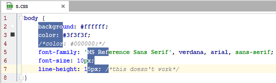

键入、复制或粘贴时，您可以切换多个光标，以便您的操作同时应用于多个位置。还支持高级编辑器操作，例如[代码完成](https://www.jetbrains.com/help/idea/2021.1/auto-completing-code.html)和[实时模板](https://www.jetbrains.com/help/idea/2021.1/using-live-templates.html)，并将应用于每个光标。

最近添加的光标被认为是**主要的**。当前编辑器行、完成列表和其他视觉辅助功能的突出显示将应用于主要光标。当您关闭多个光标时，该光标也将保留。

### 使用鼠标在选定位置添加或删除光标

- Alt+Shift+Click 在目标位置添加另一个光标。

  

- Alt+Shift+Click在多个光标之一删除它。最后一个光标不会被删除。

### 使用键盘在当前光标上方或下方添加光标

- 按Ctrl两次，然后在不松开的情况下按向上或向下箭头键。

  如果启用了[virtual spaces](https://www.jetbrains.com/help/idea/2021.1/multicursor.html#column_selection)，新的光标将精确地添加到当前光标位置的上方或下方。否则，在比当前偏移量短的行中，将在行尾添加光标。

  

- 启用[列选择模式](https://www.jetbrains.com/help/idea/2021.1/multicursor.html#column_selection)（按Alt+Shift+Insert），然后按Shift+Up/ Shift+Down。

- 按Ctrl+Shift+A，键入*Clone caret*，然后从建议列表中选择所需的操作：

  

### 在当前文档的每一行添加光标

- 按Ctrl+Home将光标设置在第一行的开头，启用[列选择模式](https://www.jetbrains.com/help/idea/2021.1/multicursor.html#column_selection)（按Alt+Shift+Insert），然后按Ctrl+Shift+End。

### 将光标添加到所选块中每行的末尾

- 在编辑器中选择一个代码块，然后按Alt+Shift+G。

### 删除多个光标

- 按Esc删除所有现有的光标，最后添加的光标除外。
- Alt+Shift+Click在多个光标之一删除它。最后一个光标不会被删除。

## 选择多个非连续范围

当您选择多个文本范围（非连续选择）时，请注意以下几点：

- 每个选择范围都与其自己的光标相关联，因此您可以开始键入以用您的输入替换所有选定的范围，或者您可以按Left Arrow或Right Arrow删除选择范围，但在范围的开头/结尾保留多个光标。
- 一旦选择范围重叠，它们就会被合并到一个带有单个光标的选择范围中。
- 选择独立于代码结构工作，即选择范围可以包括任何字符、标识符、字符串文字中的单词、注释或其部分。因此，在更改所选范围时必须小心，因为它们可能包含不同的标识符或其部分。

### 选择多个单词或文本范围

- 虽然Alt+Shift+Click将添加新的光标，但双击单词或在文本范围上拖动鼠标（保持按下相同的键）将添加具有相应选择的新光标。

  

### 选择多次出现的单词或文本范围

1. 如果要选择单词，请将光标设置在所需单词的出现处。否则，请使用鼠标或键盘快捷键选择所需范围。

2. 执行以下操作之一：

   - 连续按Alt+J查找并选择下一个出现的区分大小写匹配的单词或文本范围。

     

   - 按下Ctrl+Alt+Shift+J可选择文档中所有区分大小写匹配的单词或文本范围。

3. 要从上次选择的事件中删除选择，请按Alt+Shift+J。

4. 在添加了第二个或任何连续选择后Alt+J，您可以跳过它并使用 选择下一个匹配项F3。要将选择返回到最后跳过的事件，请按Shift+F3。

   

### 查找并选择多次出现的字符串

1. 按Ctrl+F或从主菜单中选择**Edit | Find | Find***。搜索窗格出现在活动编辑器的顶部。
2. 输入要查找并选择的字符串。在搜索字符串的右侧，您将看到当前文档中出现的次数。
3. （可选）按大小写限制搜索 Alt+C或仅匹配整个单词 Alt+W。
4. 按Ctrl+Alt+Shift+J或单击工具栏上的**Select All Occurrences** 。

### 在普通选择模式下使用鼠标选择文本的矩形片段

1. 确保[列选择模式](https://www.jetbrains.com/help/idea/2021.1/multicursor.html#column_selection)被*禁用*。

2. 要将范围选择为单个矩形，请执行以下操作之一：

   - 将光标设置在矩形的一个角处，然后设置Alt+Shift+Middle-Click在对角的对角处。
   - Alt+Click 并拖动鼠标进行选择。

3. 要将范围选择为多个矩形选择，Ctrl+Alt+Shift+Click然后将鼠标拖到所需的代码部分上。

4. 因此，您将在每个受影响的文档行中有多个选择范围。在比矩形短的行上，选择只会跨越到最后一个字符。

   

## 列选择模式

在*列选择模式下*，当前文档中的键盘导航和选择快捷键的工作方式不同，以简化添加多个光标和进行矩形选择：

- 您将能够在任何行中的最后一个字符之后的任何位置设置光标。一旦您开始在超出行尾的位置输入，就会在行尾和输入的开头之间添加必要数量的空格。

  > 您也可以在正常选择模式下启用此功能 —在**Editor | General**上选择**Allow placement of caret after end of line**。
  
- 按下Shift+Up/Shift+Down或上下拖动鼠标将在当前光标上方/下方添加新光标，而不是进行连续选择。

  

- 启用的列选择模式仅影响当前编辑器选项卡。如果您关闭或重新打开选项卡，它将切换回正常模式。

如果当前文档启用了列选择模式，您将在[状态栏](https://www.jetbrains.com/help/idea/2021.1/guided-tour-around-the-user-interface.html#status-bar)上看到****Column****指示符。

### 在普通和列选择模式之间切换

- 按Alt+Shift+Insert。
- 从主菜单中，选择**Edit | Column Selection Mode**.。
- 从编辑器的上下文菜单中，选择 **Column Selection Mode**。

## 复制和粘贴多个光标

当使用多个光标选择的文本范围被复制Ctrl+C或剪切时Ctrl+X，每个光标的选择将作为单独的行放置到剪贴板，即使原始选择在同一行上也是如此。

如果启用了[列选择模式](https://www.jetbrains.com/help/idea/2021.1/multicursor.html#column_selection)，则选择还可以包括行尾后的空格。如果您复制选择，这些将被剪贴板中的空格替换。

当您从剪贴板粘贴任何多行内容时，您可以在所需位置为每行添加多个Ctrl+V插入符，然后按将每行粘贴到其自己的插入符处。