### 使用光标导航

- 要向后导航，请按Ctrl+Alt+Left。要向前导航，请按Ctrl+Alt+Right。

- 要导航到上次编辑的位置，请按Ctrl+Shift+Backspace。

- 要在编辑器中查找当前光标位置，请按Ctrl+M。如果您不想滚动浏览大文件，此操作可能会有所帮助。

  但是，您可以按Up和Down箭头键来获得相同的结果。

- 要突出显示您要查找的光标处的单词，请选择**编辑 | 查找 |** 主菜单**中光标的下一个单词出现**。

- 要查看光标当前位于哪个元素上，请按Alt+Q。

- 要在匹配的代码块大括号之间移动光标，请按Ctrl+Shift+M。

- 要在代码块之间导航，请按Ctrl+[或Ctrl+]。

### 查找最近的位置

您还可以使用**Recent Locations**弹出窗口检查您最近查看或更改的代码。

- 要打开**Recent Locations**弹出窗口，请按Ctrl+Shift+E。该列表从顶部的最新访问位置开始，并包含代码片段。

  

- 在弹出窗口中，使用相同的快捷方式或选中**Show changed only**复选框以仅查看代码已更改的位置。

  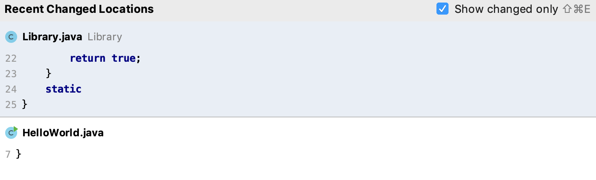

- 要搜索代码片段，请在**Recent Locations**弹出窗口中，开始输入您的搜索查询。您可以按代码文本、文件名或面包屑搜索。

  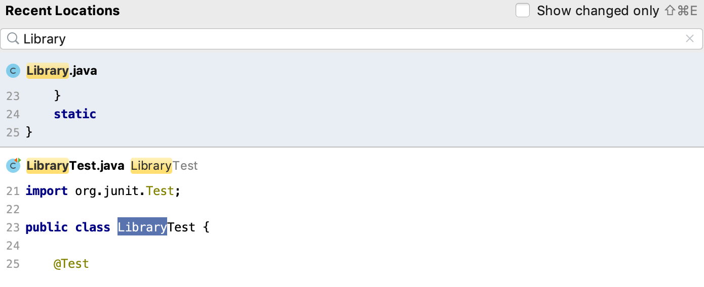

- 要从搜索结果中删除位置条目，请按Delete或Backspace。

  请记住，删除的位置也会从您使用Ctrl+Alt+Left快捷方式访问的条目列表中删除。

### 使用书签进行导航

- 要创建匿名书签，请将光标放在所需的代码行并按F11。

- 要使用助记符创建书签，请将光标放在所需的代码行，按下Ctrl+F11并选择助记符的数字或字母。

  

  

- 要显示下一个或上一个书签，在主菜单中选择**Navigate | Bookmarks | Next Bookmark** 或 **Navigate | Bookmarks | Previous Bookmark**。

- 要打开**Bookmarks** 对话框，请按Shift+F11。您可以使用此对话框来管理书签，例如，删除、排序书签或为它们提供简要说明。

  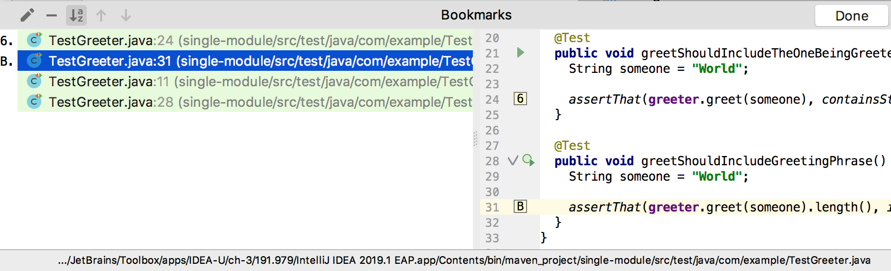

  

- 要导航到带有字母助记符的现有书签，请按Shift+F11，然后按您需要的字母。IntelliJ IDEA 将您返回到编辑器和相应的书签。

- 要导航到带有数字助记符的现有书签，请按Ctrl和书签的号码。

- 每个创建的书签都会反映在[收藏夹](https://www.jetbrains.com/help/idea/2021.1/favorites-tool-window.html) Alt+2（(**View | Tool Windows | Favourites**）工具窗口中，您也可以使用该工具窗口导航到您的书签。

  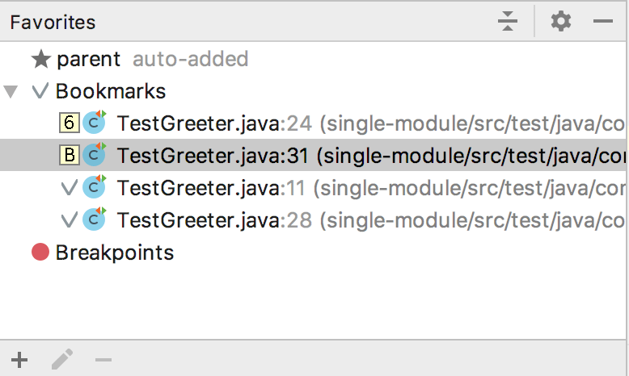

  

### 在更改之间导航

如果您编辑[受版本控制](https://www.jetbrains.com/help/idea/2021.1/enabling-version-control.html)的文件，IntelliJ IDEA 提供了多种方式来来回移动更新。特别是，您可以使用导航命令、键盘快捷键和更改标记。

- 按Ctrl+Alt+Shift+Down/ Ctrl+Alt+Shift+Up。
- 从主菜单中，选择**Navigate | Next / Previous Change**。
- 单击[更改标记](https://www.jetbrains.com/help/idea/2021.1/viewing-changes-information.html#local_changes)，然后单击或。

> 要导航到上次编辑的位置，请按Ctrl+Shift+Backspace或选择主菜单中的**Navigate | Last Edit Location** 。

### 查看最近的更改

您可以使用**Recent Changes**弹出窗口查看在项目中本地或外部更改的文件列表。如有必要，您可以还原这些更改。

1. 从主菜单中，选择 **View | Recent Changes**Alt+Shift+C。

   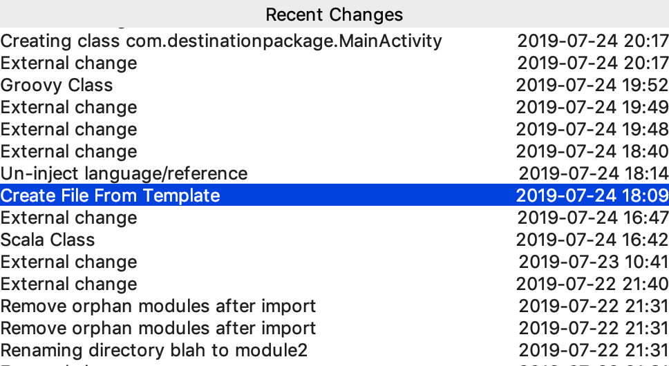

   

2. 在**Recent Changes**弹出窗口中，选择您需要的文件并按下Enter以在单独的对话框中将其打开，您可以在其中检查更改的内容并在必要时恢复这些更改。

您可以从其用法导航到符号和符号类型的初始声明。

### 转到声明及其类型

- 将光标放在所需符号处，然后按Ctrl+B。

  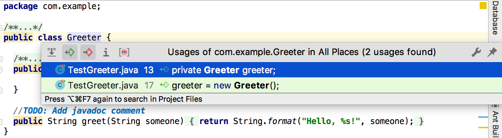

- 对于类型声明，请按Ctrl+Shift+B。

### 转到implementation

您可以使用编辑器中的装订线图标或按相应的快捷方式来跟踪类实现和覆盖方法。

- 单击位于编辑器中的/ 、/装订线图标之一，然后从列表中选择所需的上层或下层类。

  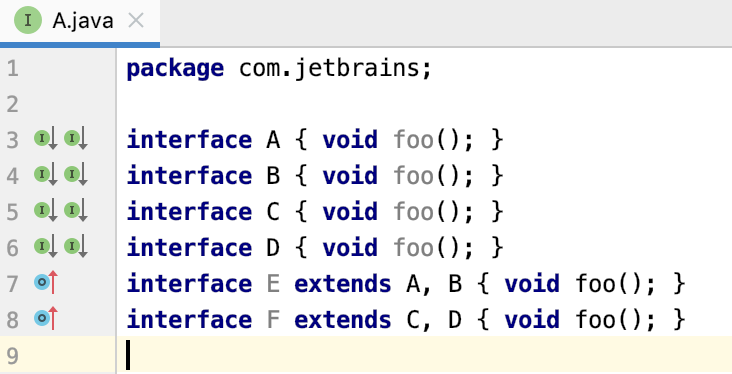

  

- 要导航到超级方法，请按Ctrl+U。

- 要导航到implementation，请按Ctrl+Alt+B。

### 显示siblings

您可以在单独的弹出窗口中查看相邻类中方法的实现。

1. 在编辑器中，将光标放在方法的名称上。

2. 从主菜单中，选择**View | Show Siblings**

   IntelliJ IDEA 会打开一个弹出窗口，您可以在其中浏览实现、导航到源代码、编辑代码并在**Find** 工具窗口中打开列表。

   

### 使用 Select In 弹出窗口导航

您可以在**Project** 工具窗口中自动定位一个类。

1. 如果类在编辑器Alt+F1中打开，按打开**Select In**弹出窗口。

   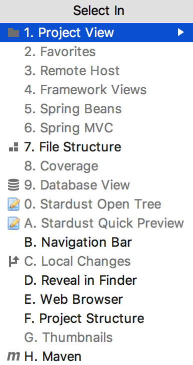

   

2. 在弹出窗口中，选择**Project View**并按Enter。IntelliJ IDEA 在**Project** 工具窗口中定位您的目标。

### 在项目工具窗口中找到一个文件

您可以使用**Open Files with Single Click** （以前称为*Autoscroll to Source*）和**Always Select Opened Files**（以前称为*Autoscroll from Source*）操作在**Project**工具窗口中找到您的文件。

1. 在**Project**工具窗口中，右键单击**Project**工具栏，然后从上下文菜单中选择**Always Select Opened File**。之后，IntelliJ IDEA 将跟踪当前在活动编辑器选项卡中打开的文件，并自动在**Project**工具窗口中找到它。

   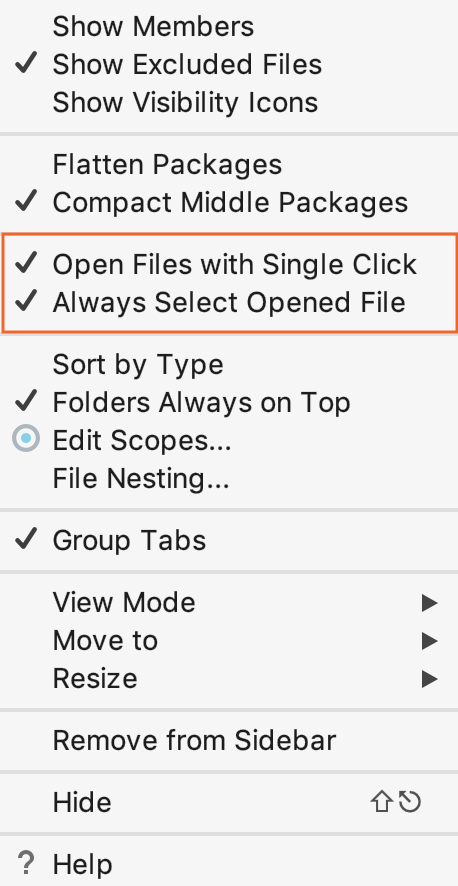

   

2. 您还可以选择**Open Files with Single Click**选项。在这种情况下，当您在**Project**视图中单击文件时，IntelliJ IDEA 将自动在编辑器中打开它。

### 在错误或警告之间导航

- 要跳转到代码中下一个或上一个发现的问题，请分别按F2或Shift+F2。或者，从主菜单中，选择**Navigate | Next / Previous Highlighted Error**。

  IntelliJ IDEA 将光标放在代码问题之前。

- 配置 IntelliJ IDEA 在代码问题之间导航的方式：它可以在所有代码问题之间跳转或跳过次要问题，并且仅在检测到的错误之间导航。右键单击滚动条区域中的代码分析标记，然后从上下文菜单中选择一种可用的导航模式：

  - 要让 IntelliJ IDEA 跳过警告、信息和其他小问题，请选择**Go to high priority questions only**。
  - 要让 IntelliJ IDEA 在所有检测到的代码问题之间跳转，请选择**Go to next problem**。

### 使用结构视图弹出窗口定位代码元素

您可以使用结构视图弹出窗口来定位您正在处理的文件中的代码元素。

1. 要打开结构视图弹出窗口，请按Ctrl+F12。

2. 在弹出窗口中，找到您需要的项目。您可以开始输入 IntelliJ IDEA 的元素名称以缩小搜索范围。按

   Enter

   返回编辑器和相应的元素。

   在弹出窗口中，您可以对文件成员进行排序，查看匿名类和继承的成员。

   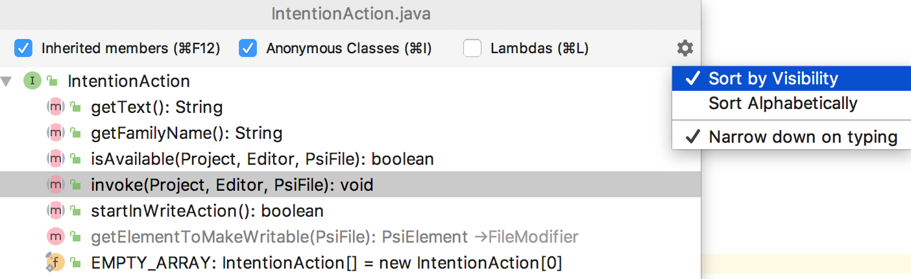

### 浏览方法

- 按Alt+Down或Alt+Up。

- 要在代码中直观地分离方法，请在**Settings/Preferences**对话框中Ctrl+Alt+S，转到**Editor | General | Appearance**并选择**Show method separators**选项。

  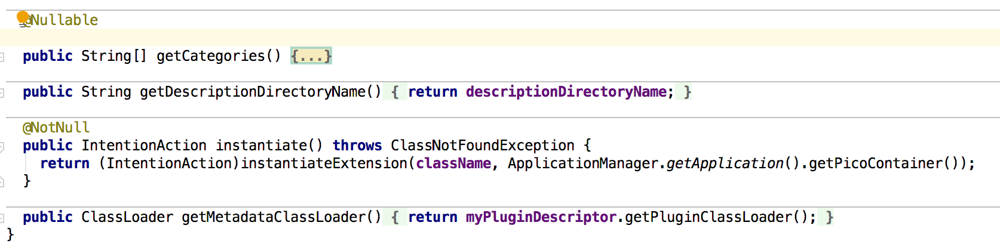

- 要打开**Structure** 工具窗口，请按Alt+7。

### 使用镜头模式

镜头模式让您无需实际滚动即可预览代码。默认情况下，当您将鼠标悬停在滚动条上时，该模式在编辑器中可用。当您将鼠标悬停在警告或错误消息上时，它特别有用。

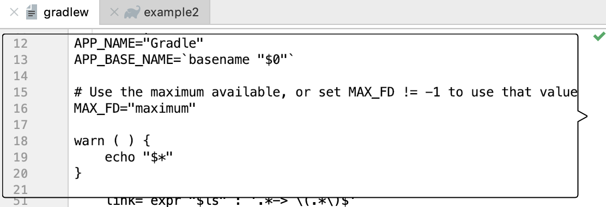

- 要禁用镜头模式，请右键单击位于编辑器右侧的代码分析标记，然后在上下文菜单中清除**Show code lens on the scrollbar hover**复选框。
- 或者，在**Settings/Preferences**对话框中Ctrl+Alt+S，转到**Editor | General | Appearance**并清除**Show code lens on the scrollbar hover**。

### 使用面包屑导航

您可以使用显示当前打开文件中的类、变量、函数、方法和标签名称的面包屑导航源代码。默认情况下，面包屑已启用并显示在编辑器的底部。

- 要更改面包屑的位置，请右键单击面包屑，在上下文菜单中选择**Breadcrumbs** 和位置首选项。

- 要编辑面包屑设置，在**Settings/Preferences**对话框中Ctrl+Alt+S，转到**Editor | General | Breadcrumbs**。

  > 清除**显示面包屑**选项以在编辑器中隐藏面包屑。

### 使用导航栏导航到文件

使用[导航栏](https://www.jetbrains.com/help/idea/2021.1/guided-tour-around-the-user-interface.html#navigation-bar)作为一个方便的工具来找到整个项目的方式。

1. 按下Alt+Home以激活导航栏。

2. 使用箭头键或鼠标指针定位所需文件。

3. 双击选定的文件，或按Enter在编辑器中打开它。

   您可以单击导航栏中的 Java 类或接口来查看方法列表。单击列出的方法之一以快速导航到编辑器中的方法。

   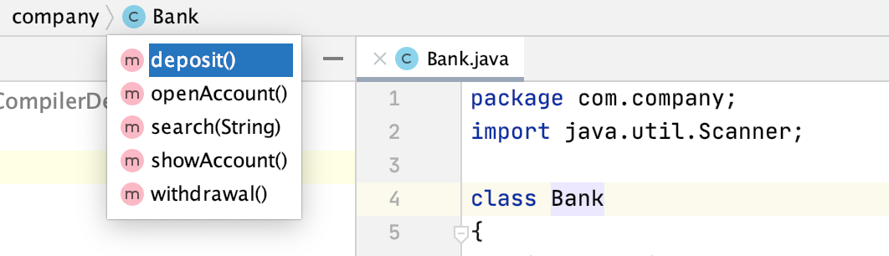

### 查找一行或一列

1. 在编辑器中，按Ctrl+G。

2. 在**Go to Line/Column**对话框中，指定行号或列号，或同时指定两者，用 : 分隔它们，然后单击**OK**。

   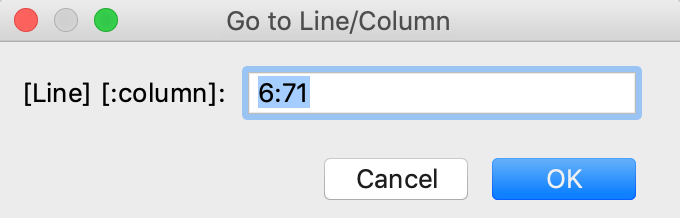

   

3. 如果您不想在编辑器中看到行号，请在**Settings/Preferences**对话框中Ctrl+Alt+S，转到**Editor | General | Appearance**并清除 **Show line numbers**复选框。

### 查找文件路径

1. 在编辑器中，按Ctrl+Alt+F12或 在上下文菜单中，选择**Open in | Finder**。

2. 在“**在 Finder 中显示”**弹出窗口中，选择要在路径查找器中打开的文件或目录，然后按Enter。

   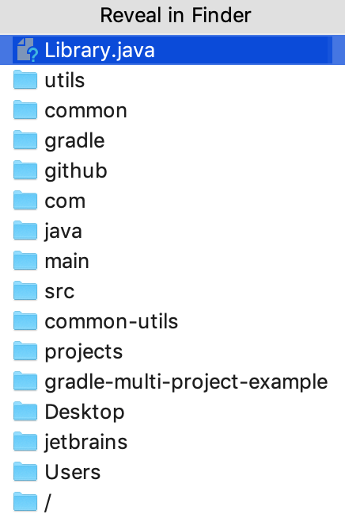

   

### 查找最近的文件

您可以使用**Recent Files**弹出窗口搜索最近和最近编辑的文件。

- 要打开包含**Recent Files**列表的最近文件弹出窗口，请按Ctrl+E。

  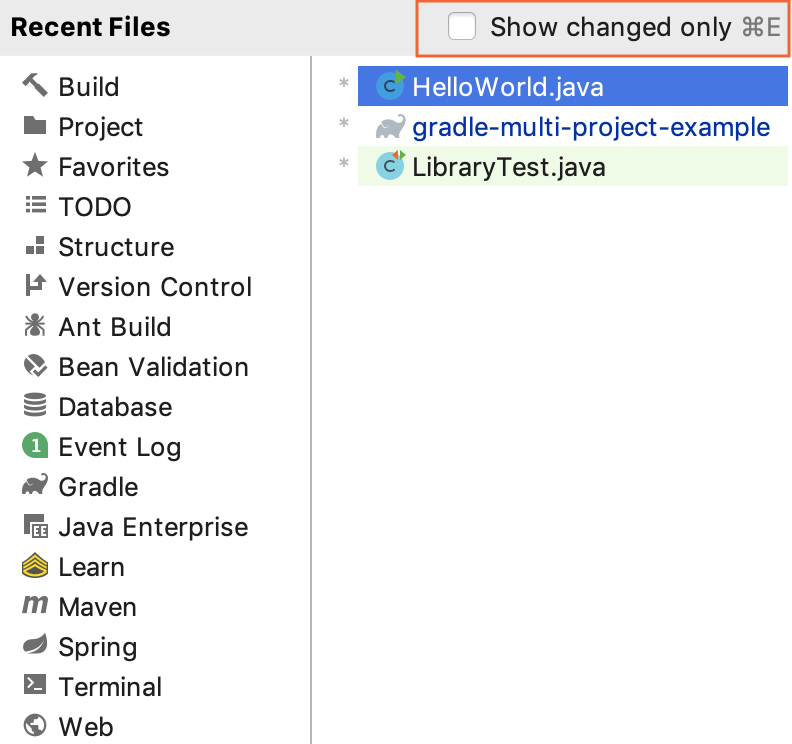

- 要仅查看最近编辑的文件，请Ctrl+E再次按下或选中**Show changed only**复选框。

- 要在弹出窗口中搜索项目，请使用*Speed Search*功能。只需开始输入搜索查询，就会出现**Search for** 字段。IntelliJ IDEA 根据您的搜索查询显示结果，列表会随着您键入而缩小。

  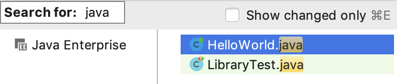