在 IntelliJ IDEA 中打开项目时，默认用户界面如下所示：`Hello, World!`到系统输出。在此过程中，您将熟悉 IntelliJ IDEA 功能，以提高您作为开发人员的生产力：编码辅助和补充工具。

## 准备一个项目

### 创建一个新的 Java 项目

在 IntelliJ IDEA 中，[项目](https://www.jetbrains.com/help/idea/2021.1/creating-and-managing-projects.html)可帮助您在单个单元中组织源代码、测试、使用的库、构建指令和个人设置。

1. 启动 IntelliJ IDEA。

   如果欢迎屏幕打开，点击 **New Project**。

   否则，从主菜单中选择** **File | New Project****。

2. 在**New Project**向导中，从左侧的列表中选择**Java**。

3. 要在 IntelliJ IDEA 中开发 Java 应用程序，您需要 Java SDK ( JDK )。

   如果 IntelliJ IDEA 中已经定义了必要的 JDK，请从**Project SDK**列表中选择它。

   如果您的计算机上安装了 JDK，但未在 IDE 中定义，请选择**添加 JDK**并指定 JDK 主目录的路径（例如，**/Library/Java/JavaVirtualMachines/jdk-13.0.1.jdk**）。

   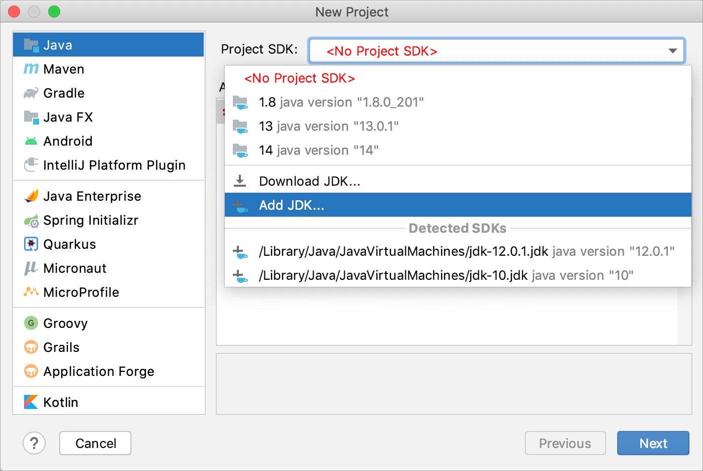

   如果您的计算机上没有必要的 JDK，请选择“**下载 JDK”**。在下一个对话框中，指定 JDK 供应商（例如 OpenJDK）、版本，根据需要更改安装路径，然后单击**下载**。

   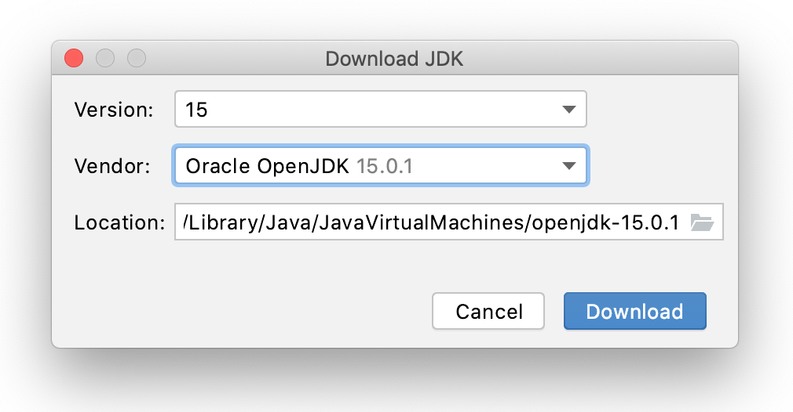

4. 我们不会在本教程中使用任何其他库或框架，因此请单击**Next**。

5. 不要从模板创建项目。在本教程中，我们将从头开始做所有事情，因此单击**下一步**。

6. 为项目命名，例如：`HelloWorld`。

7. 如有必要，更改默认项目位置并单击**完成**。

   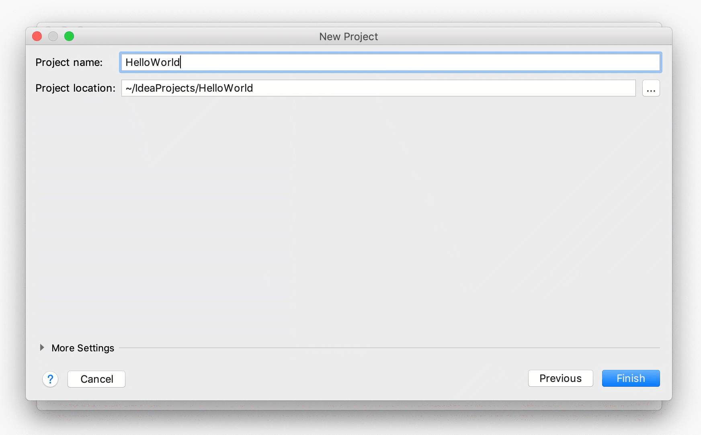

   

   

### 创建一个包和一个类

包用于将属于同一类别或提供类似功能的类组合在一起，用于构建和组织具有数百个类的大型应用程序。

1. 在**Project**工具窗口中，选择**src**文件夹，按Alt+Insert，然后选择**Java Class**。

2. 在**名称**字段中，键入`com.example.helloworld.HelloWorld`并单击**确定**。

   IntelliJ IDEA 创建`com.example.helloworld`包和`HelloWorld`类。

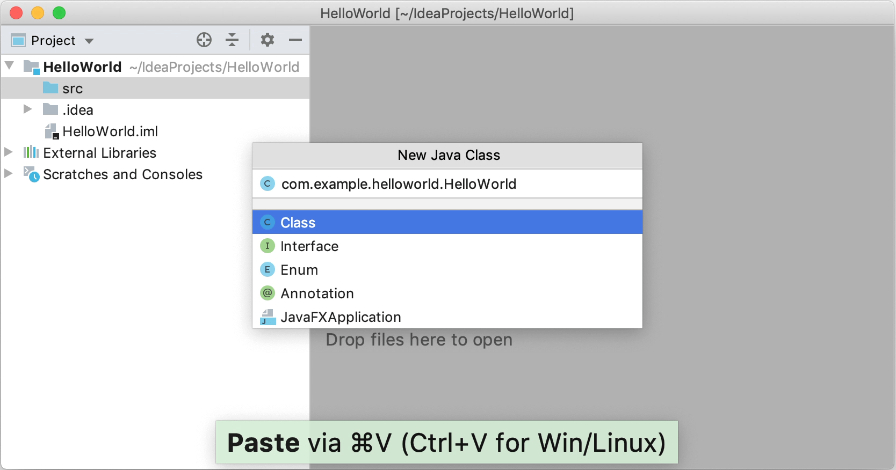

IntelliJ IDEA 与该文件一起为您的类自动生成了一些内容。在这种情况下，IDE 已插入包语句和类声明。

这是通过文件模板完成的。根据您创建的文件类型，IDE 会插入初始代码和格式，这些代码和格式预计会出现在该类型的所有文件中。有关如何使用和配置模板的更多信息，请参阅[文件模板](https://www.jetbrains.com/help/idea/2021.1/using-file-and-code-templates.html)。

> 该**Project**的工具窗口Alt+1会显示您的应用程序的结构，并帮助您浏览项目。

> 在 Java 中，[命名](https://www.oracle.com/technetwork/java/codeconventions-135099.html)包和类时应遵循[命名约定](https://www.oracle.com/technetwork/java/codeconventions-135099.html)。

## 写代码

### 使用live template添加 main() 方法

1. 将插入符号放在类声明字符串的左括号{后面，并按Shift+Enter。。

   与Enter 相比，Shift+Enter中断当前行的情况下开始新行。

2. 键入`main`并选择插入`main()`方法声明的模板。

   在您键入时，IntelliJ IDEA 会建议可在当前上下文中使用的各种构造。您可以使用Ctrl+J来查看可用的live template列表。

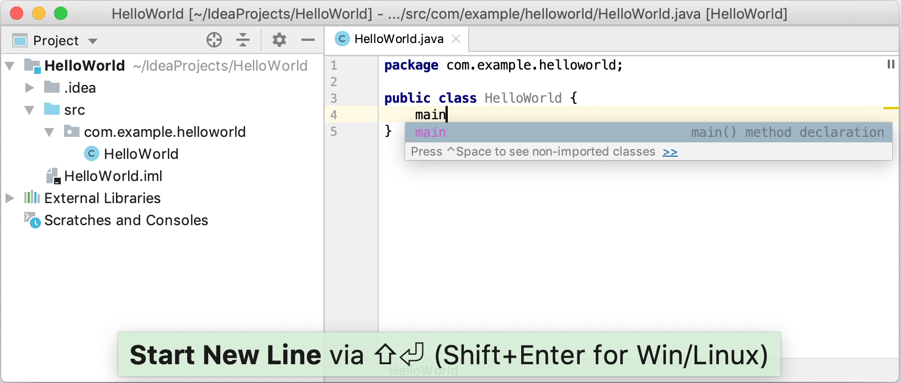

live template是可以插入到代码中的代码片段。`main`是这样的片段之一。通常，实时模板包含您最常使用的代码块。使用它们可以为您节省一些时间，因为您不必一遍又一遍地键入相同的代码。

有关在哪里可以找到预定义实时模板以及如何创建自己的实时模板的更多信息，请参阅[live template](https://www.jetbrains.com/help/idea/2021.1/using-live-templates.html)。

> 您还可以使用`sout`live template添加语句。

### 使用代码完成调用 println() 方法

在`main()`方法声明之后，IntelliJ IDEA 会自动将插入符号放在下一行。让我们调用一个将一些文本打印到标准系统输出的方法。

1. 从代码完成建议列表中键入`Sy`并选择`System`类（它来自标准`java.lang`包）。

   按下Ctrl+.以插入带有尾随逗号的选择。

2. 键入`o`，选择`out`，然后再按Ctrl+.一次。

3. 键入`p`，选择**println(String x)**方法，然后按Enter。

   IntelliJ IDEA 向您展示了可在当前上下文中使用[的参数类型](https://www.jetbrains.com/help/idea/2021.1/viewing-reference-information.html#view-parameter-info)。此信息供您参考。

4. 键入`"`。自动插入第二个引号，插入符号放在引号之间。类型`Hello, World!`

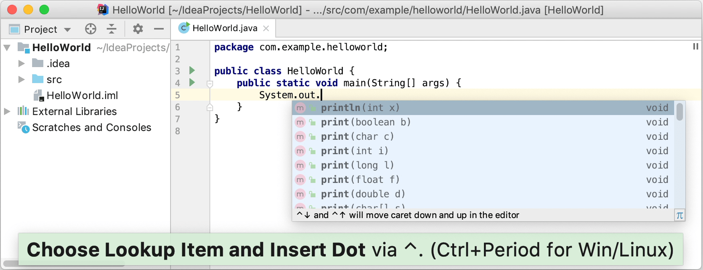

基本代码完成分析当前插入符号位置周围的上下文并在您键入时提供建议。您可以通过按 手动打开完成列表Ctrl+Space。

有关不同完成模式的信息，请参阅[代码完成](https://www.jetbrains.com/help/idea/2021.1/auto-completing-code.html)。

## 构建并运行应用程序

有效的 Java 类可以编译成字节码。您可以`main()`使用绿色箭头图标直接从编辑器中使用该方法编译和运行类。

1. 单击并在弹出窗口中选择**Run 'HelloWorld.main()'**。IDE 开始编译您的代码。

2. 编译完成后，**Run**工具窗口会在屏幕底部打开。

   第一行显示了 IntelliJ IDEA 用来运行编译类的命令。第二行显示程序输出：`Hello, World!`. 最后一行显示退出代码`0`，表示退出成功。

   如果您的代码不正确，IDE 无法编译，则**Run** 工具窗口将显示相应的退出代码。

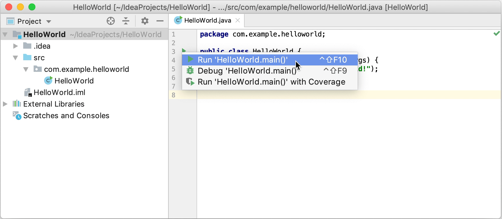

当您单击**Run 时**，IntelliJ IDEA 会创建一个特殊的运行配置来执行一系列操作。首先，它构建您的应用程序。在此阶段，javac将您的源代码编译为 JVM 字节码。

javac 完成编译后，会将编译后的字节码放置到**out**目录中，该目录在**Project**工具窗口中以黄色突出显示。

之后，JVM运行字节码。

> 自动创建的运行配置是临时的，但您可以[修改和保存它们](https://www.jetbrains.com/help/idea/2021.1/run-debug-configuration.html)。

> 如果要重新打开**Run** 工具窗口，请按Alt+4。

IntelliJ IDEA 会自动分析当前在编辑器中打开的文件并搜索不同类型的问题：从语法错误到拼写错误。编辑器右上角的**Inspections** 小部件可让您快速查看所有检测到的问题并详细查看每个问题。

## 将应用程序打包到 JAR 中

代码准备好后，您可以将应用程序打包到 Java 归档文件 (JAR) 中，以便与其他开发人员共享。构建的 Java 存档称为*artifact*。

### 为 JAR 创建artifact配置

1. 从主菜单中，选择**File | Project Structure**Ctrl+Alt+Shift+S并单击**Artifacts**。

2. 单击，指向**JAR**并选择**From modules with dependencies**。

3. 在**Main Class**字段的右侧，单击并在打开的对话框中选择**HelloWorld (com.example.helloworld)**。

   IntelliJ IDEA 创建工件配置并在 **Project Structure**对话框的右侧部分显示其设置。

4. 应用更改并关闭对话框。

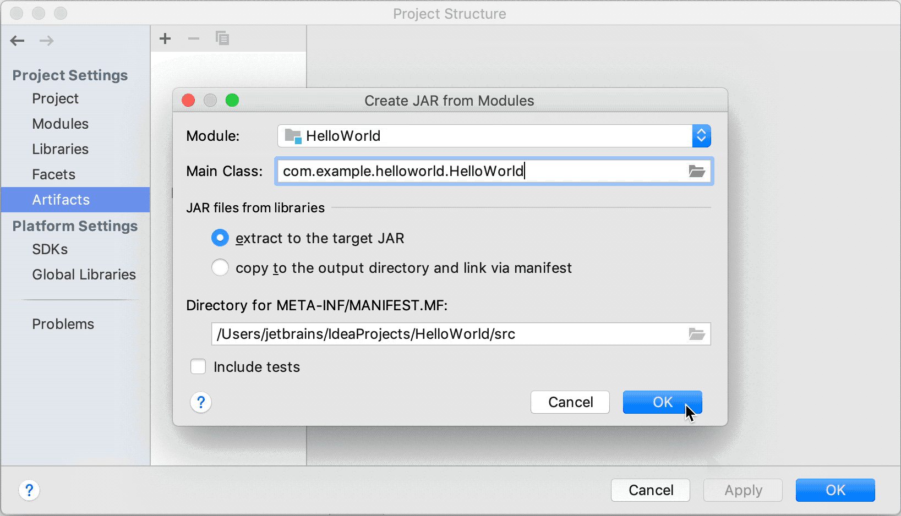

### 构建 JAR artifact

1. 从主菜单中，选择**Build | Build Artifacts**。

2. 指向**HelloWorld:jar**并选择**Build**。

   如果您现在查看**out/artifacts**文件夹，您会在那里找到您的 JAR。

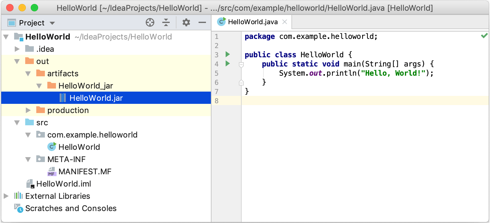

## 运行打包的应用程序

要确保正确创建 JAR 工件，您可以运行它。

> 使用**Find Action** Ctrl+Shift+A在整个 IDE 中搜索操作和设置。

### 为打包的应用程序创建运行配置

为了运行打包在 JAR 中的 Java 应用程序，IntelliJ IDEA 允许您创建专用的运行配置。

1. 按Ctrl+Shift+A，查找并运行“**Edit Configurations**操作。

2. 在**Run/Debug Configurations**对话框中，单击并选择**JAR Application**。

3. 命名新配置：`HelloWorldJar`.

   

   

   

4. 在 **Path to JAR**字段中，单击并指定计算机上 JAR 文件的路径。

5. 在**Before launch**，单击，选择**Build Artifacts | HelloWorld:jar** 在打开的对话框中。

   这样做意味着每次执行此运行配置时都会自动构建**HelloWorld.jar**。

   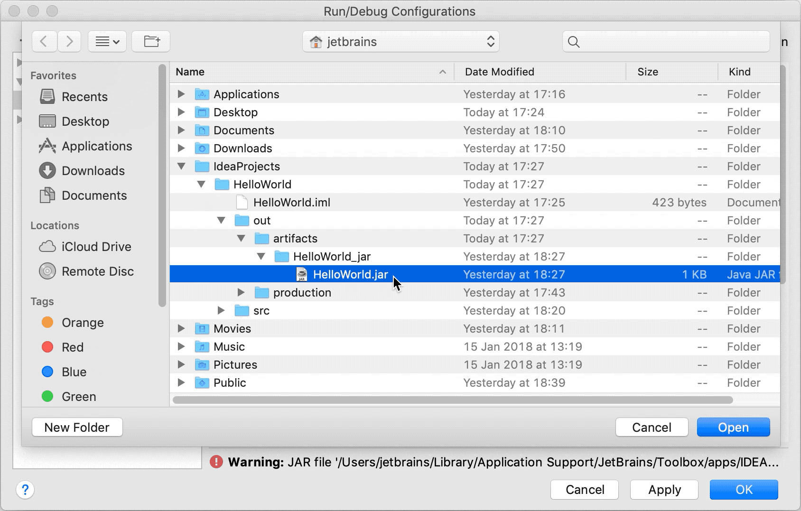

   

运行配置允许您定义您希望如何运行您的应用程序，使用哪些参数和选项。您可以为同一个应用程序设置多个运行配置，每个配置都有自己的设置。

### 执行运行配置

- 在工具栏上，选择`HelloWorldJar`配置并单击运行配置选择器右侧的 。或者，Shift+F10如果您更喜欢快捷方式，请按。

  和以前一样，**Run** 工具窗口打开并显示应用程序输出。

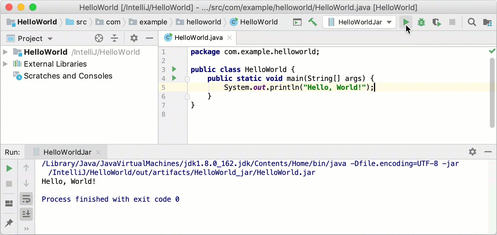

进程已经成功退出，这意味着应用程序被正确打包。