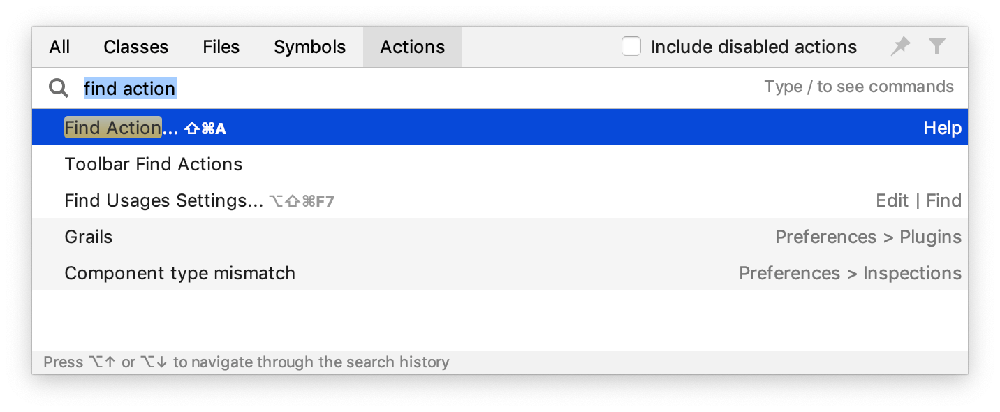

在本教程中，您将学习如何创建、运行和打包打印到系统输出的简单 Java 应用程序。在此过程中，您将熟悉 IntelliJ IDEA 功能，以提高您作为开发人员的生产力：编码辅助和补充工具。

| 捷径                | 行动                                                         |
| ------------------- | ------------------------------------------------------------ |
| 双击Shift           | [到处搜索](https://www.jetbrains.com/help/idea/2021.1/searching-everywhere.html)    在 IntelliJ IDEA、您的项目和当前 Git 存储库中快速查找任何文件、操作、符号、工具窗口或设置。 |
| Ctrl+Shift+A        | [查找操作   ](https://www.jetbrains.com/help/idea/2021.1/searching-everywhere.html#find_action)查找命令并执行它、打开工具窗口或搜索设置。 |
| Alt+Enter           | [显示上下文操作](https://www.jetbrains.com/help/idea/2021.1/intention-actions.html)   突出显示的错误和警告的快速修复，用于改进和优化代码的意图操作。 |
| F2 Shift+F2         | [在代码问题之间导航](https://www.jetbrains.com/help/idea/2021.1/navigating-through-the-source-code.html#navigate-errors-warnings)   跳转到下一个或上一个突出显示的错误。 |
| Ctrl+E              | [查看最近的文件](https://www.jetbrains.com/help/idea/2021.1/navigating-through-the-source-code.html#recent_files)  从列表中选择最近打开的文件。 |
| Ctrl+Shift+Enter    | [完成当前声明](https://www.jetbrains.com/help/idea/2021.1/working-with-source-code.html#editor_statement_select)  插入任何必要的尾随符号，并将插入符号放在可以开始键入下一个语句的地方。 |
| Ctrl+Alt+L          | [重新格式化代码](https://www.jetbrains.com/help/idea/2021.1/reformat-and-rearrange-code.html#reformat_code)  根据当前的代码样式设置重新格式化整个文件或选定的片段。 |
| Ctrl+Alt+Shift+T    | [调用重构](https://www.jetbrains.com/help/idea/2021.1/refactoring-source-code.html)  重构插入符号下的元素，例如安全删除、复制、移动、重命名等。 |
| Ctrl+W Ctrl+Shift+W | [扩展或缩小选择](https://www.jetbrains.com/help/idea/2021.1/working-with-source-code.html)  根据特定的代码结构增加或减少选择范围。 |
| Ctrl+/ Ctrl+Shift+/ | [添加/删除行或块注释](https://www.jetbrains.com/help/idea/2021.1/working-with-source-code.html#editor_lines_code_blocks)  注释掉一行或一段代码。 |
| Ctrl+B              | [转至声明](https://www.jetbrains.com/help/idea/2021.1/navigating-through-the-source-code.html#go_to_declaration)   导航到实例化类、调用方法或字段的初始声明。 |
| Alt+F7              | [查找用法](https://www.jetbrains.com/help/idea/2021.1/find-highlight-usages.html#find-usages)   显示项目中使用代码元素的所有位置。 |
| Alt+1               | 聚焦**Project** 工具窗口                                     |
| Escape              | 聚焦编辑器                                                   |

如果您为操作系统使用预定义的键盘映射之一，您可以打印[默认键盘映射参考卡](https://resources.jetbrains.com/storage/products/intellij-idea/docs/IntelliJIDEA_ReferenceCard.pdf)并将其放在您的办公桌上，以便在必要时查阅。此备忘单也可在**Help | Keymap Reference**.下找到。

## 在工作时学习快捷方式

IntelliJ IDEA 提供了几种学习快捷方式的可能性：

- [Find Action](https://www.jetbrains.com/help/idea/2021.1/searching-everywhere.html)是最重要的命令，它使您能够在所有菜单和工具中搜索命令和设置。

  按下Ctrl+Shift+A并开始输入以获取建议操作列表。然后选择必要的操作并按Enter执行它。

  

- [Key Promoter X](https://plugins.jetbrains.com/plugin/9792-key-promoter-x)是一个插件，每当使用鼠标执行命令时，它都会显示带有相应键盘快捷键的弹出通知。它还建议为经常执行的命令创建快捷方式。

- 如果您正在为您的操作系统使用预定义的键盘映射之一，您可以打印[默认的键盘映射参考卡](https://resources.jetbrains.com/storage/products/intellij-idea/docs/IntelliJIDEA_ReferenceCard.pdf)并将其放在您的办公桌上，以便在必要时进行查阅。此备忘单在**Help | Keymap Reference**.

- 要打印非默认或自定义的键盘映射，请使用[Keymap exporter plugin](https://plugins.jetbrains.com/plugin/7066-keymap-exporter).

> 如果某个操作有与之关联的键盘快捷键，则该快捷键会显示在该操作的名称附近。要为您经常使用的操作添加快捷方式（或者如果您想更改现有快捷方式），请选择它并按Alt+Enter。

## 使用高级功能

您可以通过以下有用的功能进一步提高您的工作效率：

- **Quick Lists**

  如果有一组您经常使用的操作，请创建一个[quick list](https://www.jetbrains.com/help/idea/2021.1/customize-actions-menus-and-toolbars.html#configure_quick_lists)以使用自定义快捷方式访问它们。例如，您可以尝试使用以下预定义的快速列表：

  - ****Refactor this**** Ctrl+Alt+Shift+T
  - **VCS 操作** Alt+`

- **[Smart Keys](https://www.jetbrains.com/help/idea/2021.1/settings-smart-keys.html)**

  IntelliJ IDEA 提供了很多打字辅助功能，例如自动添加成对的标签和引号，以及检测*CamelHump* 驼峰单词。

- **Speed search** **快速搜索**

  当焦点位于带有树、列表或表格的工具窗口时，[开始键入以查看匹配项](https://www.jetbrains.com/help/idea/2021.1/speed-search-in-the-tool-windows.html)。

- **Press twice** **按两次**

  IntelliJ IDEA 中的许多操作在您多次执行时会提供更多结果。例如，当您在字段、参数或变量声明的一部分上调用Ctrl+Space [基本代码完成](https://www.jetbrains.com/help/idea/2021.1/auto-completing-code.html#basic_completion)时，它会根据当前范围内的项目类型建议名称。如果再次调用它，它将包括通过模块依赖关系可用的类。当连续第三次调用时，建议列表将包括整个项目。

- **调整工具窗口大小**

  您可以在没有鼠标的情况下调整工具窗口的大小：

  - 要调整垂直工具窗口的大小，请使用Ctrl+Shift+Left和Ctrl+Shift+Right
  - 要调整水平工具窗口的大小，请使用Ctrl+Shift+Up和Ctrl+Shift+Down
