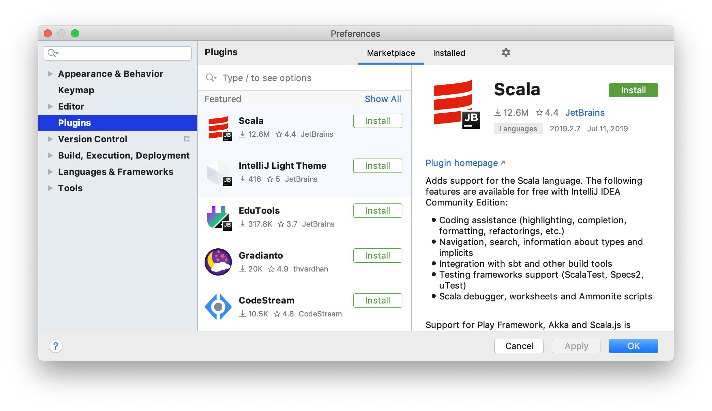
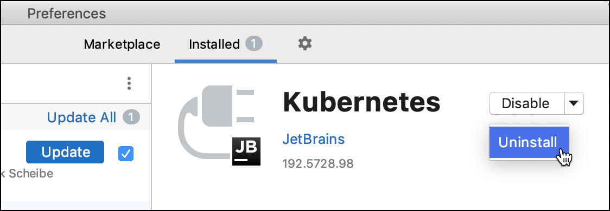
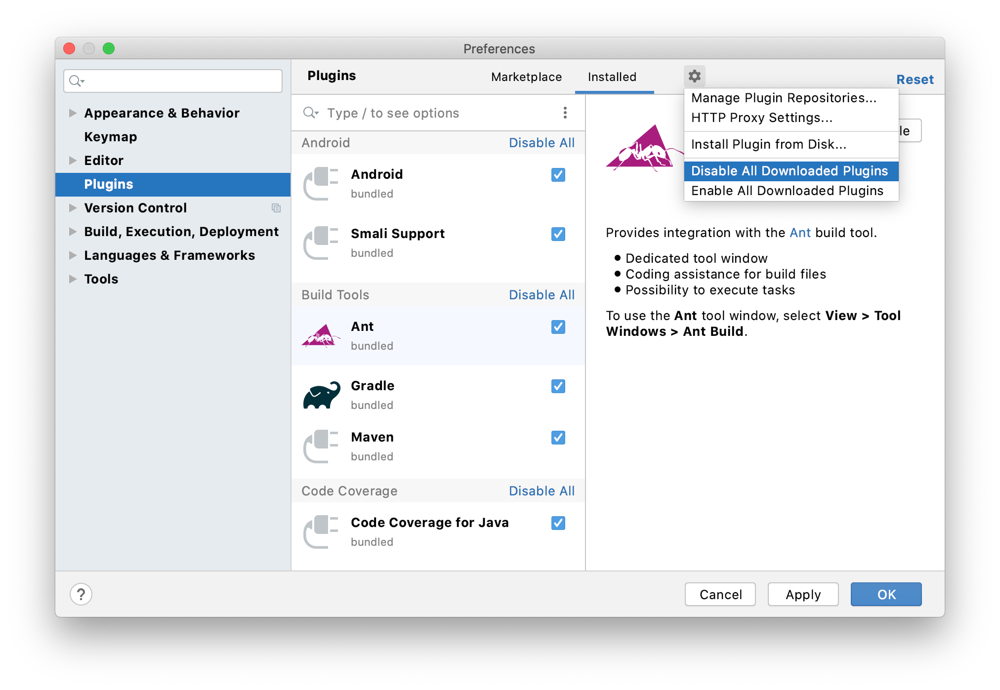
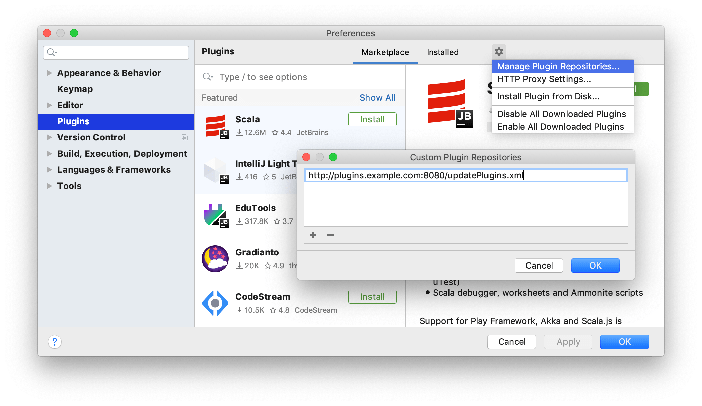

IntelliJ IDEA 的大多数与编辑、导航、重构、调试和其他任务相关的命令都有键盘快捷键。记住这些热键可以帮助您保持双手放在键盘上，从而提高工作效率。

- 与版本控制系统、Docker、Kubernetes 和其他技术的集成
- 对各种语言和框架的编码辅助支持
- 快捷方式提示、实时预览、文件观察器等
- 可以帮助您学习新编程语言的编码练习

以下视频简要概述了插件子系统。

### 打开插件设置

- 在**Settings/Preferences**对话框中Ctrl+Alt+S，选择**Plugins**。



使用**Marketplace**选项卡从 [JetBrains Plugin Repository](https://plugins.jetbrains.com/)或自 [custom plugin repository](https://www.jetbrains.com/help/idea/2021.1/managing-plugins.html#repos).浏览和安装插件。

使用**Installed** 选项卡浏览已安装的插件，启用、禁用、更新或删除它们。禁用不必要的插件可以提高性能。

如果一个插件依赖于其他插件，IntelliJ IDEA会通知你这些依赖关系。如果您的项目依赖于某些插件，请将它们添加到所需插件列表中。

大多数插件可以与任何 JetBrains 产品一起使用。有些仅限于商业产品。还有一些插件需要单独的许可证。

如果现有插件不提供您需要的某些功能，您可以为 IntelliJ IDEA 创建自己的插件。有关更多信息，请参阅[开发您自己的插件](https://www.jetbrains.com/help/idea/2021.1/managing-plugins.html#plugin-dev)。

默认情况下，IntelliJ IDEA 包含许多捆绑插件。您可以禁用捆绑插件，但无法删除它们。您可以从插件存储库或本地存档文件（ZIP 或 JAR）安装其他插件。


### 从库安装插件

1. 按Ctrl+Alt+S打开 IDE 设置并选择**Plugins**。
2. 在**Marketplace 中**找到该插件并单击**Install**。

要安装特定版本，请转到[JetBrains 插件库中](https://plugins.jetbrains.com/)的插件页面，按照[ [Install plugin from disk](https://www.jetbrains.com/help/idea/2021.1/managing-plugins.html#install_plugin_from_disk).](https://www.jetbrains.com/help/idea/2021.1/managing-plugins.html#install_plugin_from_disk)下载并安装它。例如，如果插件的最新版本已损坏，您可以执行此操作。

### 从磁盘安装插件

下载插件存档（ZIP 或 JAR）后，请执行以下操作：

1. 按Ctrl+Alt+S打开 IDE 设置并选择**Plugins**。
2. 在**Plugins**页面上，单击，然后单击**Install Plugin from Disk**.。
3. 选择插件存档文件并单击**OK**。
4. 单击**OK** 以应用更改并在出现提示时重新启动 IDE。

### 删除插件

您不能删除捆绑的插件。

1. 在 **Settings/Preferences** 对话框中Ctrl+Alt+S，选择**Plugins**。

2. 打开已**Installed** 选项卡并找到要删除的插件。

3. 单击**禁用**/**启用**旁边的按钮，然后从下拉菜单中选择**卸载**。

   

   

> 如果您需要在不启动 IntelliJ IDEA 的情况下删除插件，您可以从[插件目录中](https://www.jetbrains.com/help/idea/2021.1/tuning-the-ide.html#plugins-directory)手动删除它。

### 禁用插件

如果您不需要相应的功能，您可以禁用插件而不将其删除。

1. 在**Settings/Preferences**对话框中Ctrl+Alt+S，选择**Plugins**。

2. 打开已**Installed** 选项卡，找到并选择要禁用的插件。

3. 单击**Disable**。该按钮将更改为**Enable**。

   或者，您可以使用插件列表中的复选框或插件类别的**Disable All**按钮。

您可以在 下的菜单中一次性禁用或启用所有手动安装的插件（非捆绑）。



## 自定义插件库

默认情况下，IntelliJ IDEA 配置为使用来自[JetBrains Plugin Repository 的插件](https://plugins.jetbrains.com/)。这是托管所有社区插件的地方，您可以在那里随意托管您的插件。但是，如果您开发仅供内部使用的插件，则可以为它们设置自定义插件存储库。

有关设置自定义插件存储库的信息，请参阅[IntelliJ 平台 SDK 文档](https://www.jetbrains.org/intellij/sdk/docs/basics/getting_started/update_plugins_format.html)。

设置插件存储库后，将其添加到 IntelliJ IDEA：

1. 按Ctrl+Alt+S打开 IDE 设置并选择**Plugins**。

2. 在**Plugins** 页面上，单击，然后单击**Manage Plugin Repositories**。

3. 在**Custom Plugin Repositories**对话框中，单击并指定您的存储库 URL。它必须指向**updatePlugins.xml**文件的位置。该文件可以与您的自定义插件位于同一服务器上，也可以位于专用服务器上。

   

4. 单击**Custom Plugin Repositories**对话框中的**OK** 以保存插件存储库列表。

5. 单击**Settings/Preferences**对话框中的**OK** 以应用更改。

要浏览自定义插件存储库，在**Plugins**页面的**Marketplace**选项卡中键入**repository**:，然后是存储库的URL。例如:

```plaintext
repository:http://plugins.example.com:8080/updatePlugins.xml myPlugin
```

或者，您可以使用自定义存储库 URL替换默认的[JetBrains 插件存储](https://plugins.jetbrains.com/)库。如果您只想从 IntelliJ IDEA 获得自定义存储库插件，这会很有帮助。为此，请按如下所述编辑平台属性或 VM 选项文件。有关详细信息，请参阅[高级配置](https://www.jetbrains.com/help/idea/2021.1/tuning-the-ide.html)。


### 使用自定义插件存储库

1. 从主菜单中，选择**Help | Edit Custom Properties**.

2. 将该`idea.plugins.host`属性添加到平台属性文件中。例如：

   ```plaintext
   idea.plugins.host="http://plugins.example.com:8080/"
   ```

   > 要添加多个 URL，请用分号`;`分隔它们。

   确保没有[plugins.jetbrains.com](http://plugins.jetbrains.com/) URL。

3. 重启 IntelliJ IDEA。

如果您用自定义插件库替换默认插件库，则**Plugins** 对话框的**Marketplace** 选项卡上的搜索字段将仅浏览自定义库中的插件。

## 必须插件

一个项目可能需要为某些技术或框架提供支持的插件。您可以将此类插件添加到当前项目*所需的插件*列表中，以便 IntelliJ IDEA 验证插件是否已安装和启用。如果您忘记了某个插件，或者您团队中的某个人在项目中工作时不知道依赖项，它会通知您。

### 为您当前的项目添加所需的插件

1. 确保安装了所需的插件。
2. 按Ctrl+Alt+S打开 IDE 设置并选择**Build, Execution, Deployment | Required Plugins**。
3. 在**Required Plugins**页面上，单击并选择插件。或者，指定插件的最小和最大版本。

> 要指定 IntelliJ IDEA 本身所需的版本，请将**IDE Core**添加到所需插件列表中。

添加所需的插件后，当您在 IntelliJ IDEA 中打开项目时，如果插件被禁用、未安装或需要更新，它会通知您。

单击通知消息中的链接可快速启用、安装或更新所需的插件。

## 开发自己的插件

您可以使用任何版本的 IntelliJ IDEA 来开发插件。它提供了一个开放的 API、一个专用的 SDK、模块和运行/调试配置来帮助你。

推荐的工作流程是使用 Gradle。还支持使用内部 IntelliJ IDEA 构建系统的旧工作流程。有关更多信息，请参阅[IntelliJ 平台 SDK 开发人员指南](http://www.jetbrains.org/intellij/sdk/docs/)。

## 生产力提示

### 过滤和排序搜索结果

- 在搜索字符串中键入一个正斜杠**/**以查看筛选和排序搜索结果的选项。例如，你可以添加以下选项到你的搜索字符串中，只列出与语言相关的插件，并按下载数量排序:

  ```plaintext
  /tag:Languages /sortBy:downloads
  ```