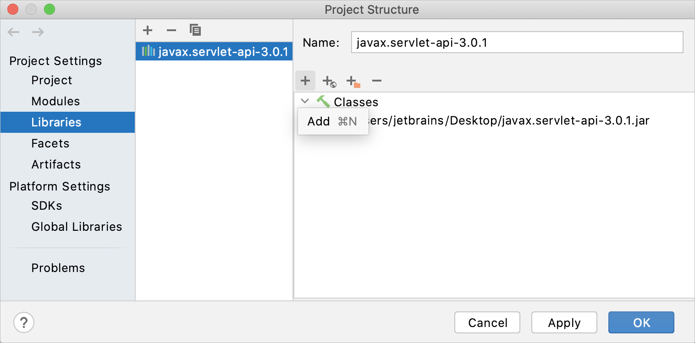

IntelliJ IDEA的很多功能都需要接入互联网。如果您是离线工作(例如，在一个隔离的环境中)，有一些方面您应该记住。

## 更新

默认情况下，IntelliJ IDEA 配置为自动检查更新并在新版本可用时通知您。更新通常是*基于补丁的*：它们应用于现有安装，只需要您重新启动 IDE。但是，有时补丁更新不可用，必须安装新版本的 IntelliJ IDEA。

如果 IntelliJ IDEA 在您的本地网络之外没有 HTTP 访问权限，它将无法检查更新和应用补丁。在这种情况下，您必须下载新版本的 IDE 并按照[独立安装中的说明](https://www.jetbrains.com/help/idea/2021.1/installation-guide.html#standalone)手动安装它们。

> 如果无法访问 Internet，您将无法使用[Toolbox App](https://www.jetbrains.com/help/idea/2021.1/installation-guide.html#toolbox)和[snaps](https://www.jetbrains.com/help/idea/2021.1/installation-guide.html#snap)安装 IntelliJ IDEA 。

有关更多信息，请参阅[更新 IntelliJ IDEA](https://www.jetbrains.com/help/idea/2021.1/update.html)。

## 插件

通常，插件是从[JetBrains Plugin Repository](https://plugins.jetbrains.com/)安装的。但是，您可以在本地网络中设置[自定义插件存储库](https://www.jetbrains.com/help/idea/2021.1/managing-plugins.html#repos)并配置 IntelliJ IDEA 以使用它来安装和更新插件。

或者，您可以[从磁盘](https://www.jetbrains.com/help/idea/2021.1/managing-plugins.html#install_plugin_from_disk)下载并手动[安装插件](https://www.jetbrains.com/help/idea/2021.1/managing-plugins.html#install_plugin_from_disk)。

## 许可证激活

您可以对IntelliJ IDEA Ultimate进行长达30天的评估。之后，购买并注册一个许可证以继续使用该产品。

如果 IntelliJ IDEA 在您的本地网络之外没有 HTTP 访问权限，您将无法使用[JetBrains 帐户](https://account.jetbrains.com/login)登录。但是，您可以生成一个在订阅期内有效的离线激活码。

如果您的组织至少有 50 个 JetBrains 产品的有效订阅或许可证，您可以使用[浮动许可证服务器](https://www.jetbrains.com/help/license_server)来激活您公司网络内的 IntelliJ IDEA 实例。请记住，许可证服务器本身需要访问 Internet 才能连接到 JetBrains 帐户。

有关更多信息，请参阅[注册 IntelliJ IDEA](https://www.jetbrains.com/help/idea/2021.1/register.html)。

## 代码检查

一些代码检查会验证外部资源。例如，**不存在的 Web 资源**检查突出显示死链接。如果您无法访问 Internet，这些检查将不起作用，并且不会突出显示死链接。

有关更多信息，请参阅[代码检查](https://www.jetbrains.com/help/idea/2021.1/code-inspection.html)。

## 外部文档

外部文档在 Web 浏览器中打开必要的信息，以便您可以导航到相关符号并同时保留这些信息以供进一步参考。但是，如果您没有 Internet 连接，则无法访问在线文档。在这种情况下，您可以下载它并通过[Quick Documentation](https://www.jetbrains.com/help/idea/2021.1/viewing-reference-information.html#inline-quick-documentation)弹出窗口打开它。

### 离线访问SDK文档

1. 下载所需版本的文档包。

   文档包通常以 ZIP 存档形式分发，下载后您需要将其解压缩。

   例如，您可以下载官方[Java SE Development Kit 14.0.1 文档](https://www.oracle.com/java/technologies/javase-jdk14-doc-downloads.html)并解压。

2. 在**Project Structure**对话框中Ctrl+Alt+Shift+S，选择**SDKs**。

3. 如果您配置了多个 JDK，请选择所需的 JDK 版本，然后打开右侧的**Documentation Path** 选项卡。

4. 单击该图标并指定包含下载的文档包的目录（例如，**C:\Users\jetbrains\Desktop\docs\api**)。

5. 应用更改并关闭对话框。

### 离线访问库文档

您可以将下载的文档添加到您的项目中，以便能够离线访问它。

1. 从主菜单中，选择**File | Project Structure** Ctrl+Alt+Shift+S并单击**Libraries**。

2. 选择要为其添加文档的库，然后单击对话框右侧的 。

   

   

3. 在打开的对话框中，选择包含文档的文件，然后单击**Open**。

4. 应用更改并关闭对话框。

下载并配置文档后，将鼠标悬停在编辑器中所需的符号上或将插入符号放在该符号上，然后按Ctrl+Q(**View | Quick Documentation**)。

## 版本控制系统

最有可能的是，您的源代码处于某种版本控制系统 (VCS) 之下。如果远程存储库不在您的本地网络中，并且无法访问 Internet，则 IntelliJ IDEA 将无法与 VCS 通信。例如，如果您使用 Git，您将能够提交更改，但无法将它们推送到远程存储库或从中提取更新。

## 任务和问题跟踪

您可以与问题跟踪器建立连接，以处理直接从 IntelliJ IDEA 分配给您的任务和错误。例如，您可以连接到[YouTrack](http://www.jetbrains.com/youtrack/)、[Jira](http://www.atlassian.com/software/jira/)、[GitHub](http://github.com/)等。

如果问题跟踪器服务器不在您的本地网络中，并且没有互联网访问，IntelliJ IDEA 将无法同步您的问题。在这种情况下，您将只能使用您自己创建的本地任务。

## Maven 依赖项

默认情况下，Maven 连接到远程存储库并在每次启动时检查更新。解决 Maven 依赖项可能需要下载新的工件。如果您希望 Maven 仅使用本地可用的资源，您可以切换到离线模式。

### 将 Maven 切换到离线模式

- 在**Maven**工具窗口中，单击。

这将把`——offline`选项附加到IntelliJ IDEA运行的所有Maven命令。它还将报告在本地存储库中找不到的任何项。

## Gradle 依赖项

默认情况下，Gradle 连接到远程存储库并在每次启动时检查更新。解决 Gradle 依赖项可能需要下载新的工件。如果您希望 Gradle 仅使用本地可用的资源，您可以切换到离线模式。

### 将 Gradle 切换到离线模式

- 在**Gradle**工具窗口中，单击。

这会将`--offline`选项附加到 IntelliJ IDEA 运行的所有 Gradle 命令。它还将报告在本地存储库中找不到的任何项目。

## 使用情况统计

当您第一次运行 IntelliJ IDEA 时，系统会提示您是否发送关于您使用的功能和插件、您的硬件和软件配置、文件类型、每个项目的文件数等的匿名数据。这不包括任何个人或敏感数据，例如您的源代码或文件名的一部分。这些信息是根据[JetBrains 隐私政策](https://www.jetbrains.com/company/privacy.html)收集的，用于帮助改进产品和整体体验。

即使您启用匿名使用情况统计，如果本地网络之外没有 HTTP 访问，它也不会发送。此外，如果您一开始同意然后改变主意，您可以完全禁用此功能。

### 禁用发送使用统计

1. 在 **Settings/Preferences**对话框中Ctrl+Alt+S，选择**Appearance & Behavior | System Settings | Data Sharing**。
2. 清除**Send usage statistics**复选框。