## 编码帮助

### 类型信息

如果您想了解有关插入符号的更多信息，例如，它来自哪里或它的类型是什么，[快速文档](https://www.jetbrains.com/help/idea/2021.1/viewing-reference-information.html#inline-quick-documentation)是您的朋友。按Ctrl+Q调用它，您将看到一个包含这些详细信息的弹出窗口。如果您不需要完整信息，请改用“类型信息”操作：它仅显示所选表达式的类型，但不会占用那么多屏幕空间。

### 代码完成区分大小写

默认情况下，IntelliJ IDEA代码自动完成大小写敏感性只影响你输入的第一个字母。可以在 **Settings/Preferences 设置/首选项**对话框中更改此策略Ctrl+Alt+S，**Editor | General | Code Completion**，因此您可以根据更适合您的喜好的方式使 IDE 对所有字母敏感或完全不区分大小写。

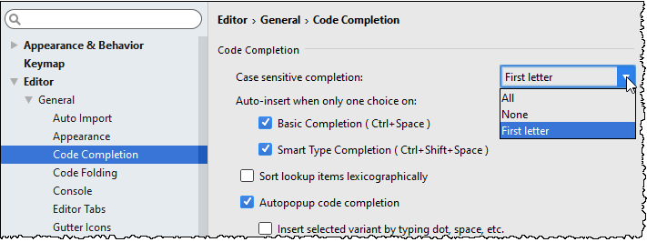

*热点提示*：您还可以在此处关闭**Autopopup code completion**选项。如果您希望代码完成弹出窗口仅在您显式调用它时显示，这是有道理的。

### 在插入符号处禁用突出显示元素的用法

在更好地学习IntelliJ IDEA之后，谈论你可能想要改变的默认值，我们不能错过在设置/首选项对话框的**Editor | General** 页面的 **Highlight usages of element at caret** 。如果你知道Ctrl+Shift+F7快捷键，并且不喜欢每次移动插入符号时编辑器中的高亮显示就会出现或消失，那么你不需要这个选项。

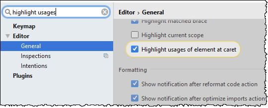

### 驼峰

默认情况下，当您在编辑器中选择任何内容时，IntelliJ IDEA对单词的大小写不敏感。例如，如果您喜欢根据CamelCase选择单词，而不是选择整个单词，选择它的一部分，您可以在Settings/Preferences对话框的 **Editor | General | Smart Keys**中启用此功能。

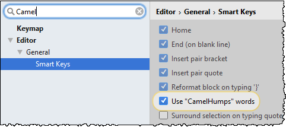

### Hippie补全

IntelliJ IDEA通过提供[基本](https://www.jetbrains.com/help/idea/2021.1/auto-completing-code.html#basic_completion)补全Ctrl+Space、[智能类型匹配补全](https://www.jetbrains.com/help/idea/2021.1/auto-completing-code.html#smart_type_matching_completion)通过Ctrl+Shift+Space和[语句补全](https://www.jetbrains.com/help/idea/2021.1/auto-completing-code.html#statements_completion)通过Ctrl+Shift+Enter。所有这些特性都是基于对代码结构的实际理解。但是，有时您可能需要更简单但更灵活的逻辑来建议当前文件或什至项目中较早使用的单词，而不管它们的上下文。此功能称为[Hippie补全](https://www.jetbrains.com/help/idea/2021.1/auto-completing-code.html#hippie_completion)，可通过Alt+/.


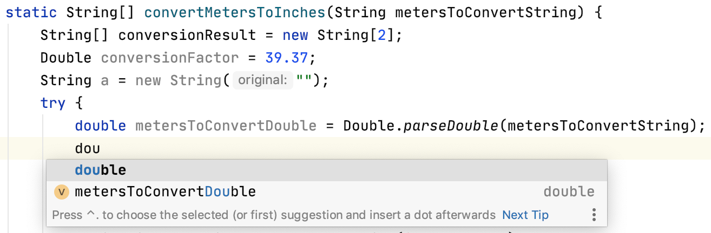

## 重构

### 撤消重构

使用 IntelliJ IDEA，您无需担心重构代码时的后果，因为您始终可以通过便捷的快捷方式调用[Undo](https://www.jetbrains.com/help/idea/2021.1/working-with-source-code.html#editor_code_selection)来撤消任何操作Ctrl+Z。

### 提取字符串片段

IntelliJ IDEA 不仅能够重构可执行代码，还能够重构字符串文字。选择字符串的任何片段，调用*Extract* variable/constant/field/parameter 将其提取为常量并在整个代码中替换其用法。

### 类型迁移

重构时，通常会重命名符号，或者提取和移动代码中的语句。然而，重构不仅仅如此。例如，[类型的迁移](https://www.jetbrains.com/help/idea/2021.1/type-migration.html)（通过提供Ctrl+Shift+F6）允许您更改类型的变量，字段，参数或方法的返回值（`int → String`，`int → Long`，等），更新相关的代码，并解决可能发生的冲突。

### 反转布尔值

如果 IntelliJ IDEA 可以自动进行类型迁移，为什么不对语义做同样的事情呢？要反转布尔符号的所有用法，只需使用[反转布尔重构](https://www.jetbrains.com/help/idea/2021.1/invert-boolean-refactoring.html)。

## 代码分析

### 依赖结构矩阵

IntelliJ IDEA 可以让您分析代码中的组件相互依赖的紧密程度，您需要密切关注这一点，因为当依赖关系过多时，很可能会导致各种[问题](https://en.wikipedia.org/wiki/Coupling_(computer_programming))。[Dependency Structure Matrix action](https://www.jetbrains.com/help/idea/2021.1/dsm-analysis.html) （通过**Analyze **菜单）将帮助您可视化和探索模块、包和类之间的依赖关系。

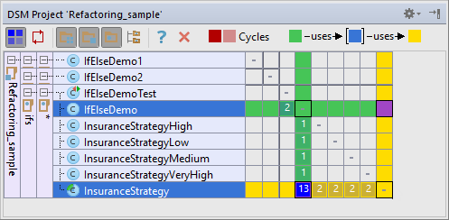

尽管它看起来很复杂，但它是一个非常易于使用的工具。只需选择一个类或包，然后查看它的使用位置和用途。

### 结构搜索和替换

[结构搜索和替换或 SSR](https://www.jetbrains.com/help/idea/2021.1/structural-search-and-replace.html)非常强大（在您学会正确使用后），可用于静态代码分析和重构自动化。简而言之，它使您可以在代码中搜索特定模式并将其替换为参数化模板。为此，它配备了自己的语言来定义[本文](https://www.jetbrains.com/idea/docs/ssr.pdf)中更详细地描述的代码模式。

要访问此功能，请使用 **Edit | Find | Search/Replace Structurally...**.。如果要创建模板或模式，请转到**Settings/Preferences**对话框，单击页面 [Editor | Inspections](https://www.jetbrains.com/help/idea/2021.1/inspections-settings.html)，并在常规节点下启用结构搜索检查：

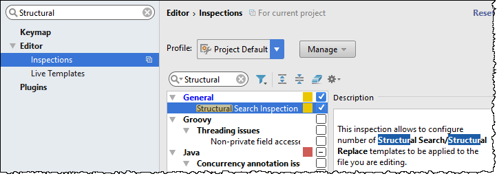

## 用户界面

### 禁用面包屑和标签树突出显示

如果您使用大量 HTML 和 XML 并希望避免不必要的分心，您可能需要在 [Editor | General | Appearance](https://www.jetbrains.com/help/idea/2021.1/settings-editor-appearance.html).禁用面包屑导航和标记树突出显示。

### 禁用不必要的装订线图标

**Gutter**是最左边的编辑器列，通常显示与您正在编辑的代码相关的有用信息。如果您觉得有时只是太多了，您可以在**设置/首选项**对话框中配置您想看到的内容Ctrl+Alt+S：[编辑器 | 一般 | 天沟图标](https://www.jetbrains.com/help/idea/2021.1/settings-gutter-icons.html)。

### 禁用意图灯泡

另一件可能令人讨厌的事情是每当插入符号中有可用的[意图时](https://www.jetbrains.com/help/idea/2021.1/intention-actions.html)，就会出现在编辑器中的[意图灯泡](https://www.jetbrains.com/help/idea/2021.1/intention-actions.html)。禁用它有点困难：您需要手动编辑 **<IntelliJ IDEA preferences folder>/options/editor.xml**，并添加以下行：

```markup
<option name="SHOW_INTENTION_BULB" value="false" />
```

### 到处搜索

使用[Search Everywhere，](https://www.jetbrains.com/help/idea/2021.1/searching-everywhere.html)您可以在任何[地方](https://www.jetbrains.com/help/idea/2021.1/searching-everywhere.html)找到任意文本片段：在代码、库、UI 部分、设置（通过在设置名称前加上`#`），甚至操作名称。如果您经常使用此功能，那么只需Enter在弹出窗口中按右键即可访问 IntelliJ IDEA 设置。例如，在这里我们访问编辑器设置：

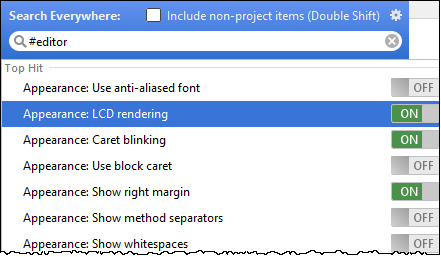

如果您以 开始搜索查询`#plugins`，您将能够打开和关闭它们：

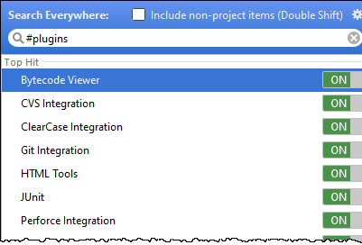

其它标签包括`#appearance`，`#system`，`#inspections`，`#registry`，`#intentions`，`#templates`，和`#vcs`。

另一个有趣的事实是 Search Everywhere 支持缩写。您可以使用Settings/Preferences 对话框的[Keymap 页面](https://www.jetbrains.com/help/idea/2021.1/settings-keymap.html)为任何操作分配一个短文本，然后通过输入以下文本从 Search Everywhere 调用此操作：

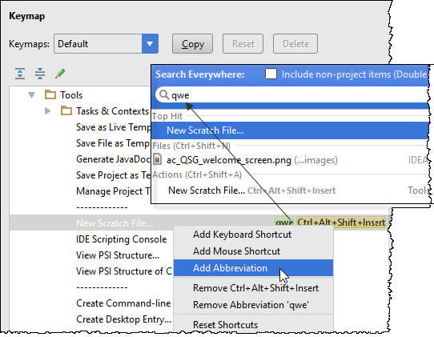

### 隐藏编辑器选项卡

当您需要关闭除当前选项卡之外的所有编辑器选项卡时，请单击当前选项卡上的关闭图标，按住`Alt`：

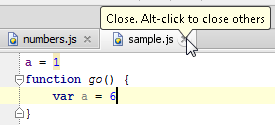

如果您根本不想看到编辑器选项卡，请转到[编辑](https://www.jetbrains.com/help/idea/2021.1/settings-editor-tabs.html)器设置/首选项的[编辑器选项卡](https://www.jetbrains.com/help/idea/2021.1/settings-editor-tabs.html)页面，然后在**放置**下拉菜单下选择无。

### 在新窗口中打开文件

一个不太容易找到但又派上用场的功能是，通过在“[项目”工具窗口中](https://www.jetbrains.com/help/idea/2021.1/project-tool-window.html)选择文件并单击，在新窗口中打开文件Shift+Enter。

### 使用路径补全

路径补全可帮助您加快文件、文件夹等的选择。这在**Project Structure**对话框中添加新 SDK或指定应用程序服务器主目录时非常有用。

当您开始输入路径时，按下Ctrl+Space以调用建议列表：

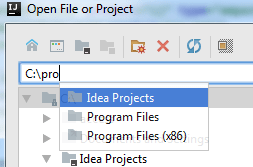

### 向工具栏添加停止和恢复按钮

将停止和恢复按钮添加到导航栏的工具栏可能会很方便。您可以通过 [Appearance and Behavior | Menus and Toolbars](https://www.jetbrains.com/help/idea/2021.1/menus-and-toolbars-appearance-settings.html)页面。

如果您更喜欢使用鼠标而不是键盘快捷键，这样您就无需打开调试工具窗口来管理当前的调试会话。

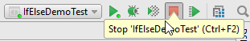

## 编辑

### 与剪贴板比较

IntelliJ IDEA 具有用于代码、jar 文件、修订甚至图像的内置差异查看器。要调用它，请选择任意一对文件并按Ctrl+D。

如果您选择了单个文件，IDE 将提示您选择要与之比较的文件。要快速比较活动编辑器与剪贴板，请选择**View | Compare with Clipboard**。

### 从历史粘贴

说到剪贴板，IntelliJ IDEA 会跟踪你放在那里的所有东西。任何时候您想粘贴之前复制的项目之一，请按Ctrl+Shift+V。

### 多项选择

[多项选择](https://www.jetbrains.com/help/idea/2021.1/working-with-source-code.html)是一个相对较新的、非常强大的编辑器功能，它可以让您一次快速选择和编辑多个（相邻或不相邻）代码段。

简而言之，事情是这样的。你可以从按Alt+J开始(然后IntelliJ IDEA在插入符号处选择一个符号)，或者你可以像平常一样选择一些东西。

然后，按Alt+J，IntelliJ IDEA 将向前搜索当前文件，直到找到匹配的文本，并将其添加到选择中。您可以再按Alt+J前进或Alt+Shift+J后退，但请注意，当搜索到文件末尾时，将从文件开头重新开始。


选择完成后，您可以开始编辑所有片段，就好像它们是一个片段一样。

*热点提示*：克隆插入符的另一种方法是按Ctrl两次，然后使用箭头或鼠标向上或向下移动插入符。

### Emmet

如果您不知道，[Emmet](http://emmet.io/)是编写 HTML、XML 和 CSS 代码的好方法。IntelliJ IDEA 支持[开箱即用](https://www.jetbrains.com/help/idea/2021.1/settings-emmet.html)：编写 Emmet 表达式并按下Tab以展开它。

使用 Emmet 预览操作（可通过 Find Action 或 Search Everywhere 获得 - 因此确保将其分配给一个方便的快捷方式）来查看结果代码的预览。

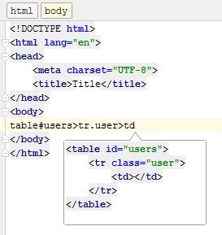

### 正则表达式

正则表达式功能强大且使用广泛，但有时很难正确编写它们。IntelliJ IDEA 将帮助您检查代码中的任何正则表达式：只需在其上放置插入符号并按下Alt+Enter即可使用[检查正则表达式](https://www.jetbrains.com/help/idea/2021.1/regular-expression-syntax-reference.html#check_regexp)意图：


### 查找并替换为正则表达式组

IntelliJ IDEA 帮助使用 Regex 的另一个地方是[Find and Replace 功能](https://www.jetbrains.com/help/idea/2021.1/finding-and-replacing-text-in-file.html)。值得知道的是，它支持替换表达式中的捕获组。


### 字节码查看器

有时查看您的程序生成的实际字节码是非常[有见地的](http://www.ibm.com/developerworks/library/it-haggar_bytecode/)。

在 IntelliJ IDEA 中，您始终可以通过 **View | Show Bytecode**来做到这一点**。。

## 版本控制

### 修改变更

在[Commit Changes dialog](https://www.jetbrains.com/help/idea/2021.1/commit-changes-dialog.html)ntelliJ IDEA 提供执行各种操作。其中之一是**Amend commit**，当您想更改上次提交并将当前更改加入其中时，这很有用。

### 搁置和补丁 Shelves and patches

*Shelves* 搁置是一个类似于[Git Stash](http://git-scm.com/book/en/v1/Git-Tools-Stashing)的 IDE 功能，但适用于所有 VCS：当您需要暂停当前工作并从存储库中提取某些内容以尽快修复它时，它会有所帮助，然后继续处理您正在处理的任何内容. 此功能无需提交即可处理本地更改的文件，因此不会再丢失更改或匆忙进行合并提交。

有关更多详细信息，请参阅[Git-Stash](http://git-scm.com/docs/git-stash)页面和[存储和取消存储](https://www.jetbrains.com/help/idea/2021.1/work-on-several-features-simultaneously.html)部分。

*Patches*  *补丁*允许您将一组更改保存到文本文件中，该文件可以通过电子邮件（或任何其他古老的媒体）传输，然后应用于代码。当您在飞机失事降落在荒岛上后确实需要做出一些事情时，或者您以其他方式让自己陷入没有可靠宽带连接的情况时，这非常有帮助。

有关更多详细信息，请参阅[使用补丁](https://www.jetbrains.com/help/idea/2021.1/using-patches.html)部分。

## 调试

### 方法断点

有时，您可能希望在不实际停止的情况下评估特定代码行中的某些内容。您可以通过使用[Method breakpoint 方法断点](https://www.jetbrains.com/help/idea/2021.1/using-breakpoints.html#method_breakpoint)来做到这一点。要创建一个，只需按住Shift单击边沟。

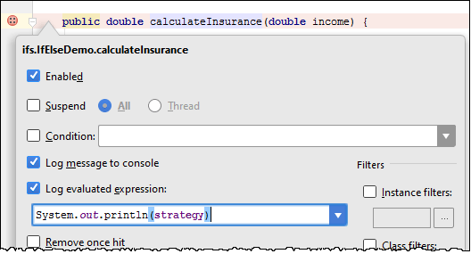

通过这种方式，您可以在不更改代码的情况下将任何表达式打印到输出中。这在您调试库或远程应用程序时特别有用。

### 字段断点或字段观察点

除了上面提到的动作断点，你还可以使用[Field watchpoints](https://www.jetbrains.com/help/idea/2021.1/using-breakpoints.html#field_watchpoint)。当访问与其关联的字段时，此断点将停止执行。要创建字段观察点，只需按住Alt并单击边沟

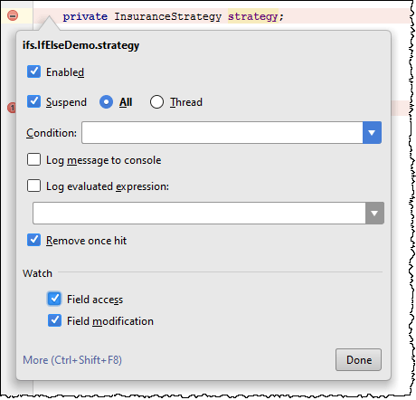

### 对象标记

当你在调试一个应用程序时，IntelliJ IDEA让你用彩色标签标记任意对象的特定实例，以便通过标记对象操作(Evaluate Expression, [Variables](https://www.jetbrains.com/help/idea/2021.1/examining-suspended-program.html#variables) or views. [Watches](https://www.jetbrains.com/help/idea/2021.1/examining-suspended-program.html#watches) views. )更容易识别。

如果您有任何标有标签的实例，您也可以在条件表达式中使用它：

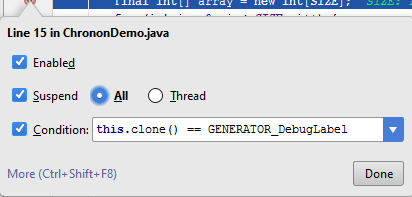

### 自定义数据渲染器

[Evaluate Expression](https://www.jetbrains.com/help/idea/2021.1/examining-suspended-program.html#evaluating-expressions)、[Variables](https://www.jetbrains.com/help/idea/2021.1/examining-suspended-program.html#variables)、[Watches](https://www.jetbrains.com/help/idea/2021.1/examining-suspended-program.html#watches)和[内联调试器](https://www.jetbrains.com/help/idea/2021.1/examining-suspended-program.html#inline-view)都使用标准方式来呈现变量值，主要基于`toString`类的实现。不是每个人都知道您可以为任何类定义自己的自定义渲染器。为此，从e [Debug tool window](https://www.jetbrains.com/help/idea/2021.1/debug-tool-window.html) 上下文菜单中选择 **Customize Data Views**。


当您使用的库中的某些类没有提供有意义的`toString`实现时，这尤其有用——因此您可以在库之外自己定义它。

### Drop frame

如果您想在调试时“回到过去”，您可以通过 Drop Frame 操作来实现。如果您错误地走得太远，这将是一个很大的帮助。这不会恢复您的应用程序的全局状态，但至少会让您通过帧堆栈返回。

### 强制返回

顺便说一句，如果您想跳转到未来，并强制从当前方法返回而不执行任何更多指令，请使用 **Force Return**操作（要调用它，按下Ctrl+Shift+A并键入操作名称）。如果该方法返回一个值，则必须指定它。

## DCEVM

有时，当您对代码进行快速更改时，您希望立即查看它们在工作应用程序中的行为。不幸的是，Java HotSwap VM 有很多限制：例如，您不能向类添加新方法或字段并执行热交换；在热插拔期间，您唯一可以实际更改的是方法主体。

有关详细信息，请参阅[重新加载修改的类](https://www.jetbrains.com/help/idea/2021.1/altering-the-program-s-execution-flow.html#reload_classes)和[更改程序的执行流程部分](https://www.jetbrains.com/help/idea/2021.1/altering-the-program-s-execution-flow.html)。

幸运的是，有一种方法可以通过新的开源项目 Dynamic Code Evolution VM 来修正这种情况，这是对 Java HotSwap VM 的一种修改，可以无限支持在运行时重新加载类。

在IntelliJ IDEA中使用它是很容易的。当您启用该插件时，IDE将为您的环境提供下载DCEVM JRE的功能。然后你必须在可选jre列表中选择它。

## 更新应用

如果您在应用程序服务器(Tomcat、JBoss等等)上运行应用程序，那么您可以通过`Ctrl+F10`更新应用程序操作重新加载更改过的类和资源吗.

详细信息请参见[Update applications on application servers](https://www.jetbrains.com/help/idea/2021.1/updating-applications-on-application-servers.html)。

## 工具

### 外部工具

IntelliJ IDEA集成了许多开发人员工具，并且可以开箱即用。如果您需要的工具没有集成，但您希望通过快捷方式使用它，请转到**Settings/Preferences | Tools |** [External Tools](https://www.jetbrains.com/help/idea/2021.1/settings-tools-external-tools.html)，并配置如何运行该工具。然后，您将能够通过e **Tools | External Tools** 主菜单运行此工具。
