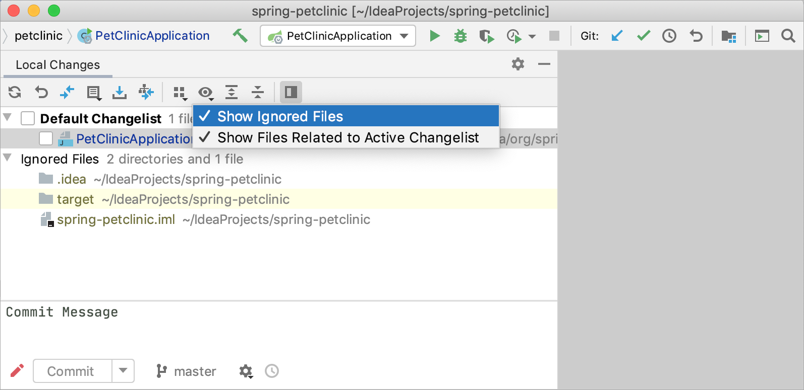
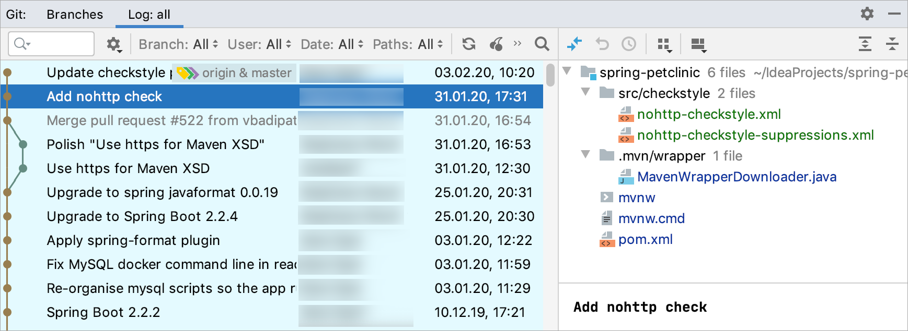

从*Eclipse*切换到*IntelliJ IDEA*，特别是如果你已经使用了很长时间的*Eclipse*，需要了解两个 IDE 之间的一些根本区别，包括它们的[用户界面](https://www.jetbrains.com/help/idea/2021.1/migrating-from-eclipse-to-intellij-idea.html#user_interface)、[编译方法](https://www.jetbrains.com/help/idea/2021.1/migrating-from-eclipse-to-intellij-idea.html#RunningReloadingChanges)、[快捷方式](https://www.jetbrains.com/help/idea/2021.1/migrating-from-eclipse-to-intellij-idea.html#Shortcuts)、项目配置等方面。

从*Eclipse*切换到*IntelliJ IDEA*，特别是如果你已经使用了很长时间的*Eclipse*，需要了解两个 IDE 之间的一些根本区别，包括它们的[用户界面](https://www.jetbrains.com/help/idea/2021.1/migrating-from-eclipse-to-intellij-idea.html#user_interface)、[编译方法](https://www.jetbrains.com/help/idea/2021.1/migrating-from-eclipse-to-intellij-idea.html#RunningReloadingChanges)、[快捷方式](https://www.jetbrains.com/help/idea/2021.1/migrating-from-eclipse-to-intellij-idea.html#Shortcuts)、项目配置等方面。

## 用户界面

### 没有工作区

启动*IntelliJ IDEA*时，您首先会注意到它没有*工作区*概念。这意味着您一次只能处理一个项目。在*Eclipse 中，*您通常有一组可能相互依赖的项目，而在*IntelliJ IDEA 中，*您有一个由一组模块组成的项目。

如果您有多个不相关的项目，您可以在单独的窗口中打开它们。

如果您仍然希望在一个窗口中打开多个不相关的项目，作为一种解决方法，您可以[将它们配置为 modules](https://www.jetbrains.com/help/idea/2021.1/creating-and-managing-modules.html#import-module)。

### IntelliJ IDEA 与 Eclipse 术语

下表比较了*Eclipse*和*IntelliJ IDEA 中*的术语：

| Eclipse                       | IntelliJ IDEA          |
| ----------------------------- | ---------------------- |
| Workspace 工作区              | Project 项目           |
| Project 项目                  | Module 模块            |
| Facet                         | Facet                  |
| Library                       | Library                |
| JRE                           | SDK                    |
| Classpath variable 类路径变量 | Path variable 路径变量 |

### 没有perspectives 视角

当您切换到*IntelliJ IDEA*时，第二个大惊喜是它没有**perspectives**。

这意味着您无需在不同的工作区布局之间手动切换来执行不同的任务。IDE 会根据您的上下文自动调出相关工具。


### 工具窗口

就像在*Eclipse 中一样*，在*IntelliJ IDEA 中*您也有工具窗口。要打开工具窗口，请在工具窗口栏中单击它：


如果工具窗口栏被隐藏，您可以通过将鼠标悬停在左下角的相应图标上来打开任何工具窗口：


如果您想让工具窗口栏显示一会儿，您可以按Alt两次并按住它。  

如果您不想使用鼠标，您可以随时通过按下分配给它的快捷方式切换到任何工具栏。要记住的最重要的快捷方式是：

- **Project 项目**：Alt+1
- **Commit 提交**：Alt+9
- **Terminal 终端**：Alt+F12

关于工具窗口的另一件事是您可以拖动、固定、取消固定、附加和分离它们：


为了帮助存储/恢复工具窗口布局，有两个有用的命令：

- **Window | Store Current Layout as Default**   将当前布局存储为默认值
- **Window | Restore Default Layout **（也可通过Shift+F12） 恢复默认布局

### 多窗口

*IntelliJ IDEA 中的*Windows 管理与*Eclipse*略有不同。您不能用一个项目打开多个窗口，但您可以将任意数量的编辑器选项卡分离到单独的窗口中。

### 始终选择打开的文件

默认情况下，当你在编辑器选项卡之间切换时，IntelliJ IDEA不会改变项目工具窗口中的选项。 但是，你可以在工具窗口设置中启用它:  

## 一般工作流程

### 没有“保存”按钮

现在来看看一些真正令人震惊的消息:IntelliJ IDEA没有**保存**按钮。 因为在IntelliJ IDEA中，你可以撤消重构并从本地历史中恢复更改，所以要求你每次都保存更改是没有意义的。  

不过，值得知道的是，物理保存到磁盘是由某些事件触发的，包括编译、关闭文件、将焦点切换到IDE之外等等。 你可以通过**Settings/Preferences | Appearance & Behavior | System Settings**  改变这个行为


### 没有保存操作

作为Eclipse用户，IntelliJ IDEA中可能缺少的特性之一是保存操作:例如重新格式化代码、组织导入、添加缺失的注释和最终修饰符等自动触发保存操作。 相反，IntelliJ IDEA提供你在提交时自动运行相应的操作:  


或手动：

- **代码 | 重新格式化代码**  **Code | Reformat Code** Ctrl+Alt+L
- **代码 | 优化导入**  **Code | Optimize Imports** Ctrl+Alt+O
- **分析 | 清理**   Analyze | Cleanup

如果**Eclipse**保存操作对您来说必不可少，您可以安装一个[模仿 Eclipse 保存操作](https://plugins.jetbrains.com/plugin/7642)的[插件](https://plugins.jetbrains.com/plugin/7642)。

### 汇编

IntelliJ IDEA编译项目的方式在许多方面与Eclipse不同。  

#### 自动编译

默认情况下，*IntelliJ IDEA*不会在保存时自动编译项目，因为通常我们不会在*IntelliJ IDEA 中*显式调用*保存*操作。

如果您想模仿**Eclipse**行为，您可以调用**Build Project**操作Ctrl+F9- 它将保存更改的文件并编译它们。为方便起见，您甚至可以将Ctrl+S快捷方式重新分配给**Build Project** 操作。

要启用自动编译，请导航至**Settings/Preferences | Build, Execution, Deployment | Compiler**并选择**Build project automatically** 选项：


请注意，*IntelliJ IDEA*中的自动编译与**Eclipse 中的**不同。在*Eclipse 中，*它不是完全自动的，因为它是由用户显式调用的**保存**操作触发的，而在*IntelliJ IDEA 中，*它是在您在编辑器中键入时隐式调用的。

这就是为什么即使启用了**自动构建项目**选项，如果至少有一个应用程序正在运行，*IntelliJ IDEA*也不会执行自动编译：它会隐式地重新加载应用程序中的类。在这种情况下，您可以调用**Build | 构建项目** Ctrl+F9。

#### 问题工具窗口

该问题的工具窗口，如果出现**生成项目自动**选项在启用[编译器设置](https://www.jetbrains.com/help/idea/2021.1/compiler.html)。它显示了在项目编译时检测到的问题列表。

#### Eclipse 编译器

Eclipse使用自己的编译器，IntelliJ IDEA使用与项目JDK捆绑在一起的javac编译器。 如果你必须使用Eclipse编译器，导航到**Settings/Preferences | Build, Execution, Deployment | Compiler | Java Compiler**，并选择它如下所示:  


*Eclipse*和*javac*编译器之间的最大区别在于*Eclipse*编译器更能容忍错误，有时允许您运行无法编译的代码。

当你需要在IntelliJ IDEA中运行带有编译错误的代码时，将运行配置中的Build选项替换为**Build, no error check**:  


## 快捷方式

*IntelliJ IDEA 的*快捷键与*Eclipse 中的*快捷键完全不同。

下表显示了顶级*Eclipse*操作（及其快捷方式）如何映射到*IntelliJ IDEA*（您可能希望将其打印出来以便随时使用）。

> 如果您选择特定于您的操作系统的键盘映射（Windows/Linux 的**默认值**或**macOS**的 macOS），则*IntelliJ IDEA 中*使用的快捷方式和您的操作系统之间可能存在冲突。为避免此类冲突，我们建议调整您的操作系统快捷方式设置（有关详细信息，请参阅[键盘映射](https://www.jetbrains.com/help/idea/2021.1/configuring-keyboard-and-mouse-shortcuts.html)）。

| Eclipse                | IntelliJIDEA                 |                      |                              |
| ---------------------- | ---------------------------- | -------------------- | ---------------------------- |
| **Action**             | **快捷键**                   | **Action**           | **快捷键**                   |
| 代码补全               | Ctrl+Space                   | 基本补全             | Ctrl+Space                   |
| -                      | -                            | 类型匹配补全         | Ctrl+Shift+Space             |
| -                      | -                            | 语句块补全           | Ctrl+Shift+Enter             |
| 快速访问               | Ctrl+3                       | 到处搜索             | 双倍的 Shift                 |
| 最大化活动视图或编辑器 | Ctrl+M                       | 隐藏所有工具窗口     | Ctrl+Shift+F12               |
| 开放式                 | Ctrl+Shift+T                 | 导航到类             | Ctrl+N                       |
| 打开资源               | Ctrl+Shift+R                 | 导航到文件           | Ctrl+Shift+N                 |
| -                      | -                            | 导航到符号           | Ctrl+Alt+Shift+N             |
| 下一个视图             | Ctrl+F7                      | -                    | -                            |
| -                      | -                            | 最近的文件           | Ctrl+E                       |
| -                      | -                            | 切换台               | Ctrl+Tab                     |
| 快速概要               | Ctrl+O                       | 文件结构             | Ctrl+F12                     |
| 移动行                 | Alt+Up/Down                  | 移动行               | Alt+Shift+Up/ Alt+Shift+Down |
| 删除行                 | Ctrl+D                       | 删除行               | Ctrl+Y                       |
| 快速解决               | Ctrl+1                       | 显示意图动作         | Alt+Enter                    |
| 快速切换编辑器         | Ctrl+E                       | 切换                 | Ctrl+Tab                     |
| -                      | -                            | 最近的文件           | Ctrl+E                       |
| 快速层次结构           | Ctrl+T                       | 导航到类型层次结构   | Ctrl+H                       |
| -                      | -                            | 导航到方法层次结构   | Ctrl+Shift+H                 |
| -                      | -                            | 显示 UML 弹出窗口    | Ctrl+Alt+U                   |
| 最后编辑位置           | Ctrl+Q                       | 最后编辑位置         | Ctrl+Shift+Backspace         |
| 下一个编辑页           | Ctrl+F6                      | 选择下一个tab        | Alt+Right                    |
| 运行                   | Ctrl+Shift+F11               | 运行                 | Shift+F10                    |
| 调试                   | Ctrl+F11                     | 调试                 | Shift+F9                     |
| 正确缩进               | Ctrl+I                       | 自动缩进行           | Ctrl+Alt+I                   |
| 格式                   | Ctrl+Shift+F                 | 重新格式化代码       | Ctrl+Alt+L                   |
| Surround with          | Ctrl+Alt+Z                   | Surround with        | Ctrl+Alt+T                   |
| -                      | -                            | 用实时模板环绕       | Ctrl+Alt+J                   |
| 打开声明               | F3                           | 导航到声明           | Ctrl+B                       |
| -                      | -                            | 快速定义             | Ctrl+Shift+I                 |
| 开放类型层次结构       | F4                           | 导航到类型层次结构   | Ctrl+H                       |
| -                      | -                            | 显示 UML 弹出窗口    | Ctrl+Alt+U                   |
| 工作区中的引用         | Ctrl+Shift+G                 | 查找使用             | Alt+F7                       |
| -                      | -                            | 显示使用             | Ctrl+Alt+F7                  |
| -                      | -                            | 查找用法设置         | Ctrl+Alt+Shift+F7            |
| 打开搜索对话框         | Ctrl+H                       | 在文件中查找         | Ctrl+Shift+F                 |
| 文件中的出现次数       | Alt+Ctrl+U                   | 文件中高亮显示       | Ctrl+Shift+F7                |
| 复制行                 | Ctrl+Alt+Down                | 复制行               | Ctrl+D                       |
| 提取局部变量           | Ctrl+Alt+L                   | 提取变量             | Ctrl+Alt+V                   |
| 分配给字段             | Ctrl+2/ Ctrl+F               | 提取字段             | Ctrl+Alt+F                   |
| 显示重构快捷菜单       | Ctrl+Alt+T                   | 重构这个             | Ctrl+Alt+Shift+T             |
| 重命名                 | Ctrl+Alt+R                   | 重命名               | Shift+F6                     |
| 跳转到多少行           | Ctrl+L                       | 导航到行             | Ctrl+G                       |
| 结构化选择             | Alt+Shift+Up/ Alt+Shift+Down | 选择插入符号处的单词 | Ctrl+W/ Ctrl+Shift+W         |
| 找下一个               | Ctrl+J                       | 找下一个             | F3                           |
| 显示                   | Ctrl+Alt+W                   | 选择                 | Alt+F1                       |
| 后退                   | Ctrl+[                       | 后退                 | Ctrl+Alt+Left                |
| 向前                   | Ctrl+]                       | 向前                 | Ctrl+Alt+Right               |

### Eclipse 键盘映射

对于不想学习新快捷键的*Eclipse*用户，*IntelliJ IDEA*提供了*Eclipse*键盘映射，它非常模仿其快捷键：


### 查找action

当您不知道某些操作的快捷方式时，请尝试使用通过 提供的**Find action**功能Ctrl+Shift+A。开始键入以按名称查找操作、查看其快捷方式或调用它：


## 编码帮助

Eclipse和IntelliJ IDEA都提供了编码辅助功能，比如代码完成、代码生成、快速修复、实时模板等。  

### 快速修复

要在*IntelliJ IDEA 中*应用快速修复，请按Alt+Enter：


所有快速修复均基于inspections configured  **Settings/Preferences | Editor | Inspections**:


如果您想一次将快速修复应用到多个位置（即整个文件夹、模块甚至是一个项目），您可以通过运行**Analyze | Run Inspection By Name**完成相应的检查或通过**Analyze | Inspect Code**运行整批检查：


除了直接的问题，IntelliJ IDEA还可以识别可以通过所谓的意图(也可以通过Alt+Enter)改进或优化的代码结构:  


| Eclipse    | IntelliJ IDEA |              |              |
| ---------- | ------------- | ------------ | ------------ |
| **Action** | **快捷方式**  | **Action**   | **快捷方式** |
| 快速解决   | Ctrl+1        | 显示意图动作 | Alt+Enter    |

### 生成代码

生成代码的关键动作是 **Code | Generate**，可通过Alt+Insert：


此操作是上下文相关的，不仅在编辑器中可用，而且在[项目工具窗口](https://www.jetbrains.com/help/idea/2021.1/project-tool-window.html)和导航栏中可用：


### 代码补全

*IntelliJ IDEA*提供了几种不同类型的代码完成，其中包括：

- 基本补全  
- 第二次基本补全 
- 类型匹配补全
- 语句块不全

要了解有关这些完成类型之间差异的更多信息，请参阅[IntelliJ IDEA 中代码完成的前 20 大特性](http://jetbrains.dzone.com/articles/top-20-code-completions-in-intellij-idea)。

默认情况下，*IntelliJ IDEA*不显示所选项目的**Documentation**弹出窗口，但您可以在**Settings/Preferences | Editor | Code Completion | Show the documentation popup in (ms)**：


如果您不想启用此选项，可以Ctrl+Q在需要时通过按手动调用此弹出窗口：


当插入符号的方法或构造函数的括号内，你可以通过调用获取的参数信息**参数信息** Ctrl+P：


| Eclipse  | IntelliJ IDEA |            |                  |
| -------- | ------------- | ---------- | ---------------- |
| **行动** | **快捷方式**  | **行动**   | **快捷方式**     |
| 代码补全 | Ctrl+Space    | 基本补全   | Ctrl+Space       |
| -        | -             | 智能补全   | Ctrl+Shift+Space |
| -        | -             | 语句块补全 | Ctrl+Shift+Enter |

### 模板

您可能习惯于`main`在编辑器中键入，然后调用代码完成将其转换为主要方法定义。然而，*IntelliJ IDEA*模板有点不同：

| 模板                                | Eclipse        | IntelliJ IDEA |
| ----------------------------------- | -------------- | ------------- |
| 定义一个主要方法                    | `main`         | `psvm`        |
| 遍历数组                            | `for`          | `itar`        |
| 迭代一个集合                        | `for`          | `itco`        |
| 迭代一个列表                        | `for`          | `itli`        |
| 使用 foreach 语法迭代一个可迭代对象 | `foreach`      | `iter`        |
| 打印到 System.out                   | `sysout`       | `sout`        |
| 打印到 System.err                   | `syserr`       | `serr`        |
| 定义静态字段                        | `static_final` | `psf`         |

可用模板列表可以在**设置/首选项 | 中**找到。**编辑|** **实时模板**。您还可以在那里添加自己的模板或修改任何现有模板。

虽然*IntelliJ IDEA*在代码完成结果中建议模板，但您只需按 即可快速扩展任何模板而无需使用代码完成Tab。

### 后缀模板

除了“常规”模板，*IntelliJ IDEA*还提供所谓的*后缀*模板。当您想将模板应用到已键入的表达式时，它们很有用。例如，键入一个变量名称，添加`.ifn`并按Tab。*IntelliJ IDEA*会将您的表达式转换为`if (...==null){...}`语句。

要查看可用后缀模板的完整列表，请转到**Settings/Preferences | Editor | General | Postfix Completion**。

### 用实时模板环绕

在*环绕*模板是另一种另外的作品类似*活动模板*，但可以适用于所选择的代码Ctrl+Alt+J。

要*使用*模板定义您自己的*环绕声*，请转到**Settings/Preferences | Editor | Live Templates**并在模板文本中使用`$SELECTION$`：

```java
$LOCK$.readLock().lock();
try {
   $SELECTION$
       } finally {
   $LOCK$.readLock().unlock();
}
```

### 导航

下表粗略地映射了*Eclipse 中*可用的导航操作与*IntelliJ IDEA 中*的导航操作：

| Eclipse          | IntelliJ IDEA |                    |                  |
| ---------------- | ------------- | ------------------ | ---------------- |
| **行动**         | **快捷方式**  | **行动**           | **快捷方式**     |
| 快速访问         | Ctrl+3        | 到处搜索           | Shift x 2        |
| Open Type        | Ctrl+Shift+T  | 导航到Class        | Ctrl+N           |
| 打开资源         | Ctrl+Shift+R  | 导航到文件         | Ctrl+Shift+N     |
| -                | -             | 导航到符号         | Ctrl+Alt+Shift+N |
| 快速切换编辑器   | Ctrl+E        | 切换               | Ctrl+Tab         |
| -                | -             | 最近的文件         | Ctrl+E           |
| 打开声明         | F3            | 导航到声明         | Ctrl+B           |
| 打开类型层次结构 | F4            | 导航到类型层次结构 | Ctrl+H           |
| -                | -             | 显示 UML 弹出窗口  | Ctrl+Alt+U       |
| 快速概述         | Ctrl+O        | 文件结构           | Ctrl+F12         |
| 后退             | Ctrl+[        | 后退               | Ctrl+Alt+Left    |
| 向前             | Ctrl+]        | 向前               | Ctrl+Alt+Right   |

稍后，当您习惯了这些导航选项并需要更多时，请参阅[IntelliJ IDEA 中的 Top 20 Navigation Features](https://dzone.com/articles/top-20-navigation-features-in-intellij-idea)。

### 重构

下表将*Eclipse 中*最常见重构的快捷方式与*IntelliJ IDEA 中*的快捷方式进行了映射：

| Eclipse          | IntelliJ IDEA |          |                  |
| ---------------- | ------------- | -------- | ---------------- |
| **行动**         | **快捷方式**  | **行动** | **快捷方式**     |
| 提取局部变量     | Ctrl+Alt+L    | 提取变量 | Ctrl+Alt+V       |
| 分配给字段       | Ctrl+2        | 提取字段 | Ctrl+Alt+F       |
| 显示重构快捷菜单 | Alt+Shift+T   | 重构这个 | Ctrl+Alt+Shift+T |
| 重命名           | Ctrl+Alt+R    | 重命名   | Shift+F6         |

要了解有关*IntelliJ IDEA*提供的许多其他重构的更多信息，请参阅[IntelliJ IDEA 中的 20 大重构功能](http://jetbrains.dzone.com/articles/top-20-refactoring-features)

### 撤消

有时候，重构可能会影响项目中的许多文件。 IntelliJ IDEA不仅负责安全地应用更改，还允许您恢复它们。 要撤销上次的重构，将焦点切换到 [Project tool window](https://www.jetbrains.com/help/idea/2021.1/project-tool-window.html) 并按Ctrl+Z。  

### 搜索

下面是最常见的搜索操作和快捷方式的地图：

| Eclipse          | IntelliJ IDEA |                    |                   |
| ---------------- | ------------- | ------------------ | ----------------- |
| **行动**         | **快捷方式**  | **行动**           | **快捷方式**      |
| 打开搜索对话框   | Ctrl+H        | 在文件中查找       | Ctrl+Shift+F      |
| 工作区中的参考   | Ctrl+Shift+G  | 查找使用           | Alt+F7            |
| -                | -             | 显示使用           | Ctrl+Alt+F7       |
| -                | -             | 查找使用设置       | Ctrl+Alt+Shift+F7 |
| 文件中的出现次数 | Alt+Ctrl+U    | 文件中突出显示使用 | Ctrl+F7           |

## 代码格式化

*IntelliJ IDEA*代码格式规则（可通过**Settings/Preferences | Editor | Code Style**）与*Eclipse*中的类似，但有一些细微差别。您可能需要注意以下事实：默认情况下禁用**使用制表符**选项，**缩进大小**可能不同等。


如果您想导入*Eclipse*格式化程序设置，请转至**Settings/Preferences | Editor | Code Style | Java**，单击，单击**Import Scheme** 并选择导出的*Eclipse*格式化程序设置（一个 XML 文件)。

> 请注意，如果无法导入 Eclipse 格式化程序设置，则会显示以下错误消息：*输入文件不是有效的 Eclipse XML 配置文件。*

请注意，*IntelliJ IDEA*和*Eclipse 中*的代码样式设置可能存在一些差异。例如，您不能告诉*IntelliJ IDEA*在之后（而不是之前）放置空格。如果您希望*IntelliJ IDEA*使用*Eclipse*格式化程序，请考虑安装[Eclipse 代码格式化程序插件](https://plugins.jetbrains.com/plugin/6546)。

| Eclipse  | IntelliJ IDEA |                |              |
| -------- | ------------- | -------------- | ------------ |
| **行动** | **快捷方式**  | **行动**       | **快捷方式** |
| 格式     | Ctrl+Shift+F  | 重新格式化代码 | Ctrl+Alt+L   |

## 运行和重新加载更改

与*Eclipse*类似，*IntelliJ IDEA*也有[运行/调试配置对话框](https://www.jetbrains.com/help/idea/2021.1/run-debug-configurations-dialog.html)，您可以从主工具栏或主菜单访问该[对话框](https://www.jetbrains.com/help/idea/2021.1/run-debug-configurations-dialog.html)。对比相关快捷键：

| Eclipse  | IntelliJ IDEA  |          |              |
| -------- | -------------- | -------- | ------------ |
| **行动** | **快捷方式**   | **行动** | **快捷方式** |
| 运行     | Ctrl+Shift+F11 | 运行     | Shift+F10    |
| 调试     | Ctrl+F11       | 调试     | Shift+F9     |
| -        | -              | Make     | Ctrl+F9      |
| -        | -              | 更新应用 | Ctrl+F10     |

如前所述，默认情况下IntelliJ IDEA不会自动编译已更改的文件(除非您配置它这样做)。 这意味着IDE不会自动重新加载更改。 要重载更改的类，通过Ctrl+F9显式调用**Build**操作。 如果你的应用程序在服务器上运行，除了重新加载外，你还可以通过Ctrl+F10使用**Update application**动作:  

## 调试

*Eclipse*和*IntelliJ IDEA*中的调试器类似但使用不同的快捷方式：

| Eclipse            | IntelliJ IDEA |                     |              |
| ------------------ | ------------- | ------------------- | ------------ |
| **行动**           | **快捷方式**  | **行动**            | **快捷方式** |
| Step Into          | F5            | Step Into           | F7           |
| -                  | -             | 智能Step Into       | Shift+F7     |
| Step over 单步执行 | F6            | Step over 单步执行  | F8           |
| Step out           | F7            | Step out            | Shift+F8     |
| Resume 恢复        | F8            | Resume 恢复         | F9           |
| Toggle breakpoint  | Ctrl+Shift+B  | Toggle breakpoint   | Ctrl+F8      |
| -                  | -             | Evaluate expression | Alt+F8       |

## 使用应用服务器（Tomcat/TomEE、Glassfish、WebLogic、WebSphere）

在*IntelliJ IDEA 中*部署到应用程序服务器或多或少类似于您在*Eclipse*中可能习惯的。要将您的应用程序部署到服务器：

1. 通过**Project Structure | Artifacts**配置您的[工件](https://www.jetbrains.com/help/idea/2021.1/working-with-artifacts.html#artifact_def)（为*Maven*和*Gradle*项目自动完成）。
2. 通过**Settings| Build,Execution,Deployment| Application Servers**配置应用服务器。
3. 创建[运行配置](https://www.jetbrains.com/help/idea/2021.1/run-debug-configuration.html)，然后指定要部署的工件和要部署到的服务器。

一旦通过**build | build artifacts**配置了构件，您总是可以告诉IDE构建/重建构件。  

## 使用构建工具 (Maven/Gradle)

*IntelliJ IDEA*不提供用于编辑*Maven/Gradle*配置文件的可视化表单。导入/创建*Maven/Gradle*项目后，您可以直接在编辑器中自由编辑其**pom.xml/build.gradle**文件。后来，你可以告诉*的IntelliJ IDEA*到[项目模型同步](https://www.jetbrains.com/help/idea/2021.1/maven-support.html)与需求改变的文件，或[自动导入变化](https://www.jetbrains.com/help/idea/2021.1/work-with-gradle-projects.html#gradle_refresh_project)到新的版本文件。对底层构建配置的任何更改最终都需要与*IntelliJ IDEA 中*的项目模型同步。

对于特定于*Maven/Gradle 的操作*，*IntelliJ IDEA*提供了[Maven Project 工具窗口](https://www.jetbrains.com/help/idea/2021.1/maven-projects-tool-window.html)和[Gradle 工具窗口](https://www.jetbrains.com/help/idea/2021.1/jetgradle-tool-window.html)。除了您的项目结构之外，这些工具窗口还提供*目标/任务*列表以及带有相关操作的工具栏。


对于手动同步，请使用*Maven/Gradle*工具窗口工具栏上的相应操作：。

### 运行目标/任务

使用**Maven/Gradle**工具窗口运行任何项目*目标/任务*。当您这样做时，*IntelliJ IDEA*会创建相应的运行配置，您可以稍后重用该配置以快速运行*目标/任务*。

值得一提的是，任何goal/task都可以附加在*Run Configuration*之前*运行*。当您的goal/task生成应用程序所需的特定文件时，这可能很有用。


Maven和Gradle工具窗口都提供了运行任务操作。 它运行Maven/Gradle命令，类似于您使用控制台运行它的方式。  

### 配置工件

如果您在**pom.xml/build.gradle**文件中配置了*WAR 工件*，*IntelliJ IDEA 会*自动在**Project Structure | **Artifacts****配置相应的工件。

请注意，当您编译项目或构建工件时，*IntelliJ IDEA*使用其自己的构建过程，这可能会更快，但不能保证 100% 准确。如果在使用*IntelliJ IDEA 中的***Build**编译项目时发现不一致的结果，请尝试改用*Maven 目标*或*Gradle 任务*。

## 使用 VCS（Git、Mercurial、Subversion、Perforce）

### 配置 VCS 根

当您打开位于 VCS 根目录下的项目时，*IntelliJ IDEA 会*自动检测它并建议将此根目录添加到项目设置中。要更改与版本控制相关的项目设置（或手动添加 VCS 根），请转到**Settings/Preferences | Version Control**：


*IntelliJ IDEA*与多存储库项目完美配合。只需将您的项目目录映射到 VCS，IDE 将负责其余的工作。对于[Git](https://www.jetbrains.com/help/idea/2021.1/using-git-integration.html)和[Mercurial](https://www.jetbrains.com/help/idea/2021.1/using-mercurial-integration.html)，IDE 甚至会为您提供同步分支控制，以便您可以同时对多个存储库执行分支操作（更多详细信息，请参阅[管理 Git 分支](https://www.jetbrains.com/help/idea/2021.1/manage-branches.html)）。

### 编辑 VCS 设置

每个 VCS 可能需要特定的设置，例如**Path to Git executable**, **GitHub/Perforce credentials**等：


配置 VCS 设置后，您将看到**Version Control** 工具窗口Alt+9。

### 检查项目

要检查出从VCS一个项目，单击**Get from Version Control** 的欢迎屏幕，或**VCS** 菜单。

### 处理本地更改

在**Local Changes**视图显示你的本地修改：包含暂存和未暂存的。为了简化管理变更，所有变更都被组织到*变更列表中*。对源文件所做的任何更改都会自动包含在活动更改列表中。您可以创建新的更改列表、删除现有的更改列表（**默认**更改列表除外）以及在更改列表之间移动文件。


在**Version Control**工具窗口的“Alt+9”或**Project** 工具窗口的 **Local Changes** 选项卡中右键单击需要忽略的未版本文件或文件夹，选择 **Git | Add to .gitignore**或**Git | Add to .git/info/exclude**。  

如果您希望忽略的文件也显示在**Local Changes**视图中，请单击工具栏上的 并选择**Show Ignored Files**。



### 处理历史

**Git** 工具窗口的**Log** 选项卡可让您查看和搜索提交的历史记录。您可以按存储库、分支、用户、日期、文件夹甚至描述中的短语对提交进行排序和过滤。你可以找到一个特定的提交，或者只是浏览历史和分支树：



### 与分支机构合作

*IntelliJ IDEA*允许您创建、切换、合并、比较和删除分支。对于这些操作，可以使用主**VCS**菜单或上下文**VCS**菜单中的**分支**，或**VCS 操作弹出窗口**（您可以通过按或状态栏右侧的小部件来调用它：Alt+`


VCS 主菜单中提供了所有 VCS 操作：

| 行动             | 快捷方式     |
| ---------------- | ------------ |
| 版本控制工具窗口 | Alt+9        |
| VCS 操作弹出窗口 | Alt+`        |
| 提交更改         | Ctrl+K       |
| 更新项目         | Ctrl+T       |
| 推送提交         | Ctrl+Shift+K |