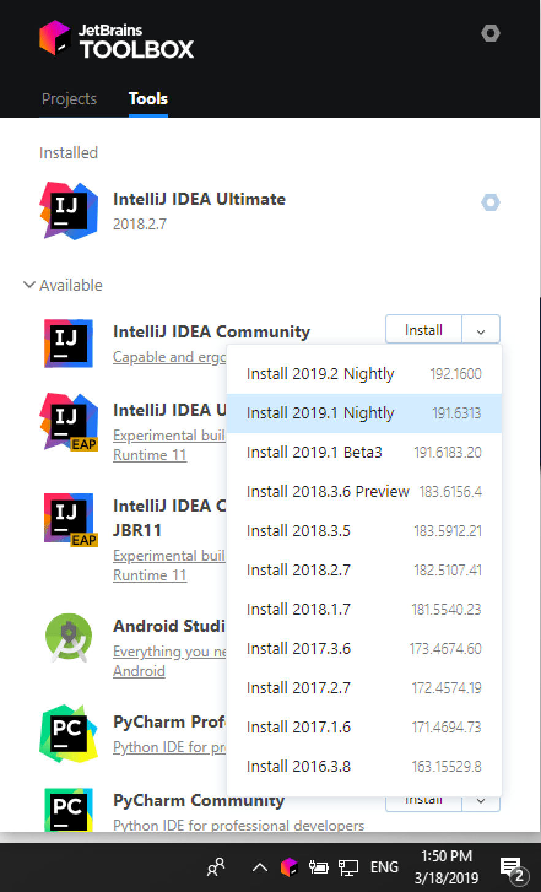
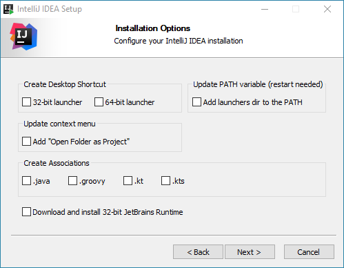

IntelliJ IDEA 是一个跨平台的 IDE，可在 Windows、macOS 和 Linux 操作系统上提供一致的体验。

- **社区版**是免费和开源的，在 Apache 2.0 下获得许可。它提供了 JVM 和 Android 开发的所有基本功能。
- **IntelliJ IDEA Ultimate**是商业版，分发有 30 天的试用期。它为 Web 和企业开发提供了额外的工具和功能。

您可以下载[IntelliJ IDEA Edu](https://www.jetbrains.com/idea/features/editions_comparison_matrix.html)以立即开始使用这些工具。如果您需要进一步的说明，请参阅

您无需安装 Java 即可运行 IntelliJ IDEA，因为 JetBrains Runtime 与 IDE 捆绑在一起（基于JRE 11）。但是，要开发 Java 应用程序，需要一个独立的JDK。

## 使用 Toolbox 应用程序安装

该[JetBrains的工具箱应用程序](https://www.jetbrains.com/toolbox/app/)是安装JetBrains公司产品的推荐工具。使用它来安装和管理不同产品或同一产品的多个版本，包括[Early Access Program](https://www.jetbrains.com/community/eap/) (EAP) 和 Nightly 版本，必要时更新和回滚，并轻松删除任何工具。工具箱应用程序维护所有项目的列表，以便在正确的 IDE 和版本中快速打开任何项目。

### 安装工具箱应用程序

1. 从[Toolbox App 网页](https://www.jetbrains.com/toolbox/app/)下载安装程序**.exe**。
2. 运行安装程序并按照向导步骤操作。

运行 Toolbox App 后，单击通知区域中的图标并选择要安装的产品和版本。



从 Toolbox 应用程序登录您的 JetBrains 帐户，它将自动激活您安装的任何 IDE 的可用许可证。

## 单机安装

手动安装 IntelliJ IDEA 以管理每个实例和所有配置文件的位置。例如，如果您的策略需要特定的安装位置。

1. [下载安装程序](https://www.jetbrains.com/idea/download/) **.exe**。

2. 运行安装程序并按照向导步骤操作。

   在**安装选项**步骤中，您可以配置以下内容：

   - 为与您的操作系统相关的启动器创建桌面快捷方式。
   - 将带有 IntelliJ IDEA[命令行启动器](https://www.jetbrains.com/help/idea/2021.1/working-with-the-ide-features-from-command-line.html)的目录添加到`PATH`环境变量中，以便能够从命令提示符中的任何工作目录运行它们。
   - 将项目**作为项目打开文件夹**添加到系统上下文菜单（当您右键单击文件夹时）。
   - 将特定的文件扩展名与 IntelliJ IDEA 相关联，双击打开它们。
   - 如果您运行的是 32 位 Windows 版本，请安装 32 位版本的 JetBrains Runtime。

   

要运行 IntelliJ IDEA，请在 Windows**开始**菜单中找到它或使用桌面快捷方式。您也可以在**bin**下的安装目录中运行启动程序批处理脚本或可执行文件。

## Windows 上的静默安装

在没有任何用户界面的情况下执行静默安装。网络管理员可以使用它在多台机器上安装 IntelliJ IDEA，避免打扰其他用户。

要执行静默安装，请使用以下开关运行安装程序：

- `/S`: 启用静默安装

- `/CONFIG`: 指定[静默配置文件](https://www.jetbrains.com/help/idea/2021.1/installation-guide.html#silent-config)的路径

- `/D`: 指定安装目录的路径

  此参数必须是命令行中的最后一个，并且即使路径包含空格也不应包含任何引号。

例如：

```bash
>ideaIU.exe /S /CONFIG=d:\temp\silent.config /D=d:\IDE\IntelliJ IDEA Ultimate
```

要在安装过程中检查问题，在`/S`和`/D`之间添加`/LOG`参数。安装程序将生成指定的日志文件。例如：

```bash
>ideaIU.exe /S /CONFIG=d:\temp\silent.config /LOG=d:\JetBrains\IDEA\install.log /D=d:\IDE\IntelliJ IDEA Ultimate
```


### 静默配置文件

您可以在https://download.jetbrains.com/idea/silent.config下载 IntelliJ IDEA 的默认静默配置文件

静默配置文件定义了安装 IntelliJ IDEA 的选项。使用默认选项，仅对当前用户执行静默安装：`mode=user`。如果要为所有用户安装 IntelliJ IDEA，请将安装模式选项的值更改为`mode=admin`并以管理员身份运行安装程序。

每个 JetBrains 产品的默认静默配置文件都是唯一的。您可以根据需要修改它以启用或禁用各种安装选项。

> 可以在没有配置文件的情况下执行静默安装。在这种情况下，请省略`/CONFIG`开关并以管理员身份运行安装程序。如果没有静默配置文件，安装程序将忽略所有附加选项：它不会创建桌面快捷方式、添加关联或更新`PATH`变量。但是，它仍然会在**JetBrains**下的**开始**菜单中创建一个快捷方式。

## 在 Linux 上作为 snap 包安装

您可以将 IntelliJ IDEA 作为自包含的[snap](https://snapcraft.io/)包安装。由于 snaps 会自动更新，因此您的 IntelliJ IDEA 安装将始终是最新的。

> 要使用 snaps，请按照[安装指南](https://docs.snapcraft.io/core/install)中的[说明](https://docs.snapcraft.io/core/install)安装并运行*snapd*服务。
>
> 在 Ubuntu 16.04 LTS 及更高版本上，此服务已预先安装。

IntelliJ IDEA 通过两个渠道分发：

- *稳定*通道仅包括稳定版本。要安装 IntelliJ IDEA 的最新稳定版本，请运行以下命令：

  ```bash
  $sudo snap install intellij-idea-ultimate --classic
  ```

  该`--classic`选项是必需的，因为 IntelliJ IDEA snap 需要对系统的完全访问权限，就像传统的打包应用程序一样。

- *边缘*通道包括EAP构建。要安装 IntelliJ IDEA 的最新 EAP 版本，请运行以下命令：

  ```bash
  $sudo snap install intellij-idea-ultimate --classic --edge
  ```

当snap安装，就可以通过运行`intellij-idea-community`，`intellij-idea-ultimate`或`intellij-idea-educational`命令启动它。

要列出所有已安装的快照，您可以运行`sudo snap list`. 有关其他 snap 命令的信息，请参阅[Snapcraft 文档](https://docs.snapcraft.io/)。