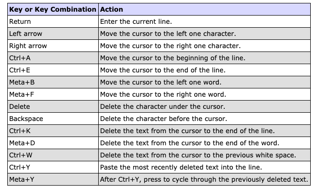

您可以使用shell语言学习 Java 语言、探索新功能和 API 以及对新代码进行原型设计。

 

## 介绍 jshell

[jshell](https://docs.oracle.com/en/java/javase/16/docs/specs/man/jshell.html) - 在读取-计算-打印循环 (REPL) 中以交互方式评估 Java 编程语言的声明、语句和表达式

 

## 概要

```shell
jshell [options] [load-files]
```


`options` 命令行选项，以空格分隔。请参阅 `jshell`的选项。

`load-files` 工具启动时要运行的一个或多个脚本。脚本可以包含任何有效的代码片段或`jshell`命令。

该脚本可以是本地文件或以下预定义脚本之一：

`DEFAULT` 加载通常用作导入的默认条目。

`JAVASE` 导入所有 Java SE 包。

`PRINTING` 将 print、println 和 printf 定义`jshell`为在工具中使用的方法。

对于多个脚本，使用空格分隔名称。脚本按照在命令行中输入的顺序运行。命令行脚本在启动脚本之后运行。要在 jshell 启动后运行脚本，请使用 /open 命令。

要接受来自标准输入的输入并禁止交互式 I/O，请为加载文件输入连字符 (-)。此选项允许`jshell`在管道链中使用该工具。

 

## 描述

`jshell`提供了一种交互式评估 Java 编程语言的声明、语句和表达式的方法，使学习该语言、探索不熟悉的代码和 API 以及构建复杂代码原型变得更加容易。接受 Java 语句、变量定义、方法定义、类定义、导入语句和表达式。输入的代码位称为片段。

输入片段时，会对它们进行评估，并提供反馈。根据输入的代码片段和选择的反馈模式，反馈从结果和操作解释到无。无论反馈模式如何，都会描述错误。从详细模式开始，在学习工具的同时获得最多的反馈。

命令行选项可用于在`jshell`启动时配置初始环境。在 中`jshell`，命令可用于根据需要修改环境。

可以从文件加载现有片段以初始化`jshell`会话，或在会话内的任何时间。可以在会话中修改片段以尝试不同的变化并进行更正。要保留片段供以后使用，请将它们保存到文件中。

 

## 选项

`--add-exports module/package` 指定要被视为从其定义模块导出的包。

`--add-modules module[,module...]` 指定除初始模块之外要解析的根模块。

`-Cflag` 提供要传递给编译器的标志。要传递多个标志，请为所需的每个标志或标志参数提供此选项的实例。

`--class-path path` 指定为定位类文件而搜索的目录和档案。此选项会覆盖 CLASSPATH 环境变量中的路径。如果未设置环境变量且未使用此选项，则搜索当前目录。

- **Linux 和 macOS**，使用冒号 ( `:`) 分隔路径中的项目。
- **Windows**，使用分号 ( `;`) 分隔项目。

`--enable-preview` 允许代码依赖此版本的预览功能。

`--execution specification` 指定备用执行引擎，其中规范是 ExecutionControl 规范。有关规范的语法，请参阅包 jdk.jshell.spi 的文档。

`--feedback mode` 设置为响应输入的内容而提供的初始反馈级别。可以使用 /set 反馈模式命令在会话中覆盖初始级别。默认为正常。

以下值对模式有效：

`verbose` 为条目提供详细的反馈。在操作结果之后显示有关所执行操作的附加信息。下一个提示与反馈之间用空行分隔。

`normal` 提供平均数量的反馈。下一个提示与反馈之间用空行分隔。

`concise` 提供最少的反馈。下一个提示紧跟在代码片段或反馈之后。

`silent` 不提供反馈。下一个提示紧跟在代码片段之后。

`custom` 根据模式的定义方式提供自定义反馈。自定义反馈模式是通过使用 /set mode 命令在 JShell 中创建的。

`--help`或`-h`或`-?` 打印标准选项的摘要并退出该工具。

`--help-extra`或`-X` 打印非标准选项的摘要并退出该工具。非标准选项如有更改，恕不另行通知。

`-Jflag` 提供传递给运行时系统的标志。要传递多个标志，请为所需的每个标志或标志参数提供此选项的实例。

`--module-path modulepath` 指定在哪里可以找到应用程序模块。

- 对于**Linux 和 macOS**，使用冒号 ( `:`) 分隔路径中的项目。
- 对于**Windows**，使用分号 ( `;`) 来分隔项目。

`--no-startup` 防止启动脚本在`jshell`启动时运行。使用此选项可在启动 JShell 时仅运行在命令行中输入的脚本，或者如果未输入脚本，则在没有任何预加载信息的情况下启动 JShell。如果使用了该选项，则不能使用该`--startup`选项。

`-q` 将反馈模式设置为简洁，与输入 --feedback 简洁相同。

`-Rflag` 提供要传递给远程运行时系统的标志。要传递多个标志，请为要传递的每个标志或标志参数提供此选项的实例。

`-s` 将反馈模式设置为无声，这与输入 --feedback silent 相同。

`--show-version` 打印版本信息并进入工具。

`--startup file` 覆盖此会话的默认启动脚本。该脚本可以包含任何有效的代码片段或命令。

该脚本可以是本地文件或以下预定义脚本之一：

`DEFAULT` 加载通常用作导入的默认条目。

`JAVASE` 导入所有 Java SE 包。

`PRINTING` 将 print、println 和 printf 定义`jshell`为在工具中使用的方法。

对于多个脚本，请为每个脚本提供此选项的单独实例。启动脚本运行时，`jshell`首先启动并在会话重新启动与`/reset`，`/reload`或`/env`命令。启动脚本按照它们在命令行中输入的顺序运行。

如果使用了该选项，则不能使用该`--no-startup`选项。

`-v` 设置反馈模式为verbose，与输入--feedback verbose相同。

`--version` 打印版本信息并退出工具。

 

## 命令

在该`jshell`工具中，命令用于修改环境和管理代码片段。

`/drop {name|id|startID-endID} [{name|id|startID-endID}...]` 删除按名称、ID 或 ID 范围标识的片段，使它们处于非活动状态。对于一系列 ID，提供用连字符分隔的起始 ID 和结束 ID。要提供列表，请用空格分隔列表中的项目。使用该`/list`命令查看代码片段的 ID。

`/edit [option]` 打开编辑器。如果未输入任何选项，则编辑器会以活动片段打开。

以下选项有效：

`{name|id|startID-endID} [{name|id|startID-endID}...]` 打开带有按名称、ID 或 ID 范围标识的片段的编辑器。对于一系列 ID，提供用连字符分隔的起始 ID 和结束 ID。要提供列表，请用空格分隔列表中的项目。使用该`/list`命令查看代码片段的 ID。

`-all` 打开包含所有片段的编辑器，包括启动片段和失败、被覆盖或被删除的片段。

`-start` 使用在 JShell 启动时评估的启动片段打开编辑器。要退出编辑模式，请关闭编辑器窗口，或者如果在`-wait`设置编辑器时使用了该选项，则响应提供的提示。

使用`/set`editor 命令指定要使用的编辑器。如果没有编辑设置，那么下面的环境变量进行检查，以便：`JSHELLEDITOR`，`VISUAL`，和`EDITOR`。如果在 JShell 中没有设置编辑器并且没有设置任何编辑器环境变量，那么将使用一个简单的默认编辑器。

`/env [options]` 显示环境设置，或更新环境设置并重新启动会话。如果未输入任何选项，则显示当前环境设置。如果输入了一个或多个选项，则会话将按如下方式重新启动：

- 使用提供的选项更新环境设置：
- 重置执行状态。
- 运行启动脚本。
- 按照输入的顺序静默回放历史记录。历史记录包括`/drop`在`jshell`提示符下输入的所有有效片段或命令，在命令行上输入的脚本中，或与`/open`命令一起输入的脚本中。

输入的命令行上或提供与以前的环境设置`/reset`，`/env`或`/reload`命令被保持除非一个选项被输入该重写的设置。

以下选项有效：

`--add-modules module[,module...]` 指定除初始模块之外要解析的根模块。

`--add-exports source-module/package=target-module[,target-module]*` 添加从源模块到目标模块的包导出。

`--class-path path` 指定为定位类文件而搜索的目录和档案。此选项会覆盖 CLASSPATH 环境变量中的路径。如果未设置环境变量且未使用此选项，则搜索当前目录。

- 对于**Linux 和 macOS**，使用冒号 ( `:`) 分隔路径中的项目。
- 对于**Windows**，使用分号 ( `;`) 来分隔项目。

`--module-path modulepath` 指定在哪里可以找到应用程序模块。

- 对于**Linux 和 macOS**，使用冒号 ( `:`) 分隔路径中的项目。
- 对于**Windows**，使用分号 ( `;`) 来分隔项目。

`/exit [integer-expression-snippet]` 退出工具。如果未输入代码段，则退出状态为零。如果输入了一个片段并且片段的结果是一个整数，则结果将用作退出状态。如果发生错误，或者代码段的结果不是整数，则会显示错误并且该工具保持活动状态。

`/history` 显示在此会话中输入的内容。

`/help [command|subject]` 显示有关命令和主题的信息。如果未输入任何选项，则会显示所有命令的信息摘要和可用主题列表。如果提供了有效命令，则会显示该命令的扩展信息。如果输入了有效的主题，则会显示有关该主题的信息。

主题的以下值有效：

`context` 描述可用于配置环境的选项。

`intro` 提供该工具的介绍。

`shortcuts` 描述完成命令和代码片段的击键。请参阅输入快捷方式。

`/imports` 显示当前活动的导入，包括来自启动脚本和启动时在命令行输入的脚本的导入`jshell`。

`/list [option]` 显示片段及其 ID 的列表。如果未输入任何选项，则显示所有活动代码段，但不显示启动代码段。

以下选项有效：

`{name|id|startID-endID} [{name|id|startID-endID}...]` 显示按名称、ID 或 ID 范围标识的片段。对于一系列 ID，提供用连字符分隔的起始 ID 和结束 ID。要提供列表，请用空格分隔列表中的项目。

`-all` 显示所有片段，包括启动片段和失败、被覆盖或删除的片段。以 s 开头的 ID 是启动片段。以 e 开头的 ID 是失败的片段。

`-start` 显示启动 JShell 时评估的启动片段。

`/methods [option]` 显示有关输入的方法的信息。如果未输入任何选项，则显示所有活动方法的名称、参数类型和返回类型。

以下选项有效：

`{name|id|startID-endID} [{name|id|startID-endID}...]` 显示按名称、ID 或 ID 范围标识的方法的信息。对于一系列 ID，提供用连字符分隔的起始 ID 和结束 ID。要提供列表，请用空格分隔列表中的项目。使用 /list 命令查看代码片段的 ID。

`-all` 显示所有方法的信息，包括在 JShell 启动时添加的方法，以及失败、覆盖或删除的方法。

`-start` 显示启动 JShell 时添加的启动方法的信息。

`/open file` 打开指定的脚本并将片段读入工具。该脚本可以是本地文件或以下预定义脚本之一：

`DEFAULT` 加载通常用作导入的默认条目。

`JAVASE` 导入所有 Java SE 包。

`PRINTING` 将 print、println 和 printf 定义为在工具中使用的 jshell 方法。

`/reload [options]` 重新启动会话如下：

- 使用提供的选项更新环境设置（如果有）。
- 重置执行状态。
- 运行启动脚本。
- 按输入的顺序重播历史记录。历史记录包括`/drop`在`jshell`提示符下、在命令行输入的脚本中或使用 /open 命令输入的脚本中输入的所有有效片段或命令。

输入的命令行上或提供与以前的环境设置`/reset`，`/env`或`/reload`命令被保持除非一个选项被输入该重写的设置。

以下选项有效：

`--add-modules module[,module...]` 指定除初始模块之外要解析的根模块。

`--add-exports source-module/package=target-module[,target-module]*` 添加从源模块到目标模块的包导出。

`--class-path path` 指定为定位类文件而搜索的目录和档案。此选项会覆盖 CLASSPATH 环境变量中的路径。如果未设置环境变量且未使用此选项，则搜索当前目录。对于 Linux 和 macOS，使用冒号 (:) 分隔路径中的项目。对于 Windows，使用分号 (;) 来分隔项目。

`--module-path modulepath` 指定在哪里可以找到应用程序模块。对于 Linux 和 macOS，使用冒号 (:) 分隔路径中的项目。对于 Windows，使用分号 (;) 来分隔项目。

`-quiet` 重播有效历史记录而不显示它。显示错误。

`-restore` 将环境重置为工具上次运行开始时的状态或上次运行中执行 /reset、/reload 或 /env 命令时的状态。从那时起的有效历史被重播。使用此选项可以恢复以前的 JShell 会话。

`/reset [options]` 丢弃所有输入的片段并重新启动会话，如下所示：

- 使用提供的选项更新环境设置（如果有）。
- 重置执行状态。
- 运行启动脚本。

历史不会重演。输入的所有代码都丢失了。

在命令行上输入的环境设置或通过先前的 /reset、/env 或 /reload 命令提供的环境设置将被保留，除非输入了覆盖设置的选项。

以下选项有效：

`--add-modules module[,module...]` 指定除初始模块之外要解析的根模块。

`--add-exports source-module/package=target-module[,target-module]*` 添加从源模块到目标模块的包导出。

`--class-path path` 指定为定位类文件而搜索的目录和档案。此选项会覆盖 CLASSPATH 环境变量中的路径。如果未设置环境变量且未使用此选项，则搜索当前目录。

- 对于**Linux 和 macOS**，使用冒号 ( `:`) 分隔路径中的项目。
- 对于**Windows**，使用分号 ( `;`) 来分隔项目。

`--module-path modulepath` 指定在哪里可以找到应用程序模块。对于 Linux 和 macOS，使用冒号 ( `:`) 分隔路径中的项目。对于 Windows，使用分号 ( `;`) 分隔项目。

`/save [options] file` 将片段和命令保存到指定的文件。如果未输入任何选项，则保存活动片段。

以下选项有效：

`{name|id|startID-endID} [{name|id|startID-endID}...]` 保存由名称、ID 或 ID 范围标识的片段和命令。对于一系列 ID，提供用连字符分隔的起始 ID 和结束 ID。要提供列表，请用空格分隔列表中的项目。使用 /list 命令查看代码片段的 ID。

`-all` 保存所有片段，包括启动片段和被覆盖或失败的片段。

`-history` 保存在当前会话中输入的所有命令和片段的顺序历史记录。

`-start` 保存当前的启动设置。如果未提供启动脚本，则保存一个空文件。

`/set [setting]` 设置配置信息，包括外部编辑器、启动设置和反馈模式。此命令还用于创建具有自定义提示、格式和截断值的自定义反馈模式。如果未输入设置，则显示编辑器的当前设置、启动设置和反馈模式。

以下值可用于设置：

`editor [options] [command]` 设置用于在输入 /edit 命令时启动外部编辑器的命令。命令可以包含由空格分隔的命令参数。如果未输入命令或选项，则显示当前设置。

以下选项有效：

`-default` 将编辑器设置为 JShell 提供的默认编辑器。如果输入了启动编辑器的命令，则不能使用此选项。

`-delete` 将编辑器设置为会话开始时有效的编辑器。如果与-retain选项一起使用，则保留编辑器设置被删除，编辑器设置为第一下列环境变量的发现：`JSHELLEDITOR`，`VISUAL`或`EDITOR`。如果未设置任何编辑器环境变量，则此选项将编辑器设置为默认编辑器。

如果输入了启动编辑器的命令，则不能使用此选项。

`-retain` 跨会话保存编辑器设置。如果未输入其他选项或命令，则保存当前设置。

`-wait` 提示用户在编辑完成时进行指示。否则，当编辑器退出时，控制权将返回到 JShell。如果正在使用的编辑器立即退出，则使用此选项，例如，当编辑窗口已存在时。此选项仅在输入启动编辑器的命令时有效。

`feedback [mode]` 设置用于响应输入的反馈模式。如果没有进入模式，则显示当前模式。

以下模式有效：`concise`、`normal`、`silent`、`verbose`和使用`/set`mode 命令创建的任何自定义模式。

`format mode field "format-string" selector` 设置为响应输入而提供的反馈格式。如果未输入任何模式，则显示所有反馈模式的所有字段的当前格式。如果只输入一种模式，则显示该模式的当前格式。如果仅输入模式和字段，则显示该字段的当前格式。

要定义格式，需要以下参数：

`mode` 指定应用响应格式的反馈模式。只能`/set`修改使用mode 命令创建的自定义模式。

`field` 指定应用响应格式的特定于上下文的字段。这些字段在联机帮助中进行了描述，可以`jshell`使用`/help` `/set`format 命令访问该帮助。

`format-string` 指定用作指定字段和选择器的响应格式的字符串。格式字符串的结构在联机帮助中有描述，可以使用`/help /set`format 命令从 JShell 访问。

`selector` 指定应用响应格式的上下文。选择器在联机帮助中有描述，可以使用`/help` `/set`format 命令从 JShell 访问。

`mode [mode-name] [existing-mode] [options]` 使用提供的模式名称创建自定义反馈模式。如果未输入模式名称，则显示所有模式的设置，包括模式、提示、格式和截断设置。如果提供了现有模式的名称，则现有模式中的设置将到正在创建的模式中。

以下选项有效：

`-command|-quiet` 指定使用模式时为命令显示的反馈级别。创建反馈模式时需要此选项。使用`-command`以示对命令的信息和验证反馈。用于`-quiet`仅显示命令的基本反馈，例如错误消息。

`-delete` 删除此会话的命名反馈模式。要删除的模式的名称是必需的。要永久删除保留模式，请使用`-retain`带有此选项的选项。无法删除预定义模式。

`-retain` 跨会话保存命名的反馈模式。要保留的模式的名称是必需的。配置使用新的反馈模式`/set prompt`，`/set format`和`/set truncation`命令。

要开始使用新模式，请使用`/set feedback`命令。

`prompt mode "prompt-string" "continuation-prompt-string"` 在 JShell 中设置输入提示。如果未输入任何模式，则显示所有反馈模式的当前提示。如果只输入一种模式，则显示该模式的当前提示。

要定义提示，需要以下参数：

`mode` 指定应用提示的反馈模式。只能`/set`修改使用mode 命令创建的自定义模式。

`prompt-string` 指定用作第一行输入提示的字符串。

`continuation-prompt-string` 指定用作提示的字符串，以提示完成片段所需的其他输入行。

`start [-retain] [file [file...]|option]` 将下次时使用的启动脚本的名称`/reset`，`/reload`或`/env`输入命令。如果输入了多个脚本，则脚本将按输入的顺序运行。如果未输入任何脚本或选项，则会显示当前的启动设置。

脚本可以是本地文件或以下预定义脚本之一：

`DEFAULT` 加载通常用作导入的默认条目。 `JAVASE` 导入所有 Java SE 包。 `PRINTING` 将 print、println 和 printf 定义为在工具中使用的 jshell 方法。以下选项有效：

`-default` 将启动设置设为默认设置。

`-none` 指定不使用启动设置。使用该`-retain`选项可以跨会话保存开始设置。

`truncation mode length selector` 设置显示值的最大长度。如果未输入任何模式，则显示所有反馈模式的当前截断值。如果只输入一种模式，则显示该模式的当前截断值。

要定义截断值，需要以下参数：

`mode` 指定应用截断值的反馈模式。只能`/set`修改使用mode 命令创建的自定义模式。

`length` 指定用作指定选择器最大长度的无符号整数。

`selector` 指定应用截断值的上下文。选择器在联机帮助中进行了描述，可以`jshell`使用`/help /set truncation`命令访问该帮助。

`/types [option]` 显示输入的类、接口和枚举。如果未输入任何选项，则显示所有当前活动的类、接口和枚举。

以下选项有效：

`{name|id|startID-endID} [{name|id|startID-endID}...]` 显示由名称、ID 或 ID 范围标识的类、接口和枚举的信息。对于一系列 ID，提供用连字符分隔的起始 ID 和结束 ID。要提供列表，请用空格分隔列表中的项目。使用 /list 命令查看代码片段的 ID。

`-all` 显示所有类、接口和枚举的信息，包括在启动 JShell 时添加的类、接口和枚举，以及失败、覆盖或删除的类、接口和枚举。

`-start` 显示启动 JShell 时添加的启动类、接口和枚举的信息。

`/vars [option]` 显示输入的变量的名称、类型和值。如果未输入任何选项，则显示所有当前活动变量。

以下选项有效：

`{name|id|startID-endID} [{name|id|startID-endID}...]` 显示按名称、ID 或 ID 范围标识的变量的信息。对于一系列 ID，提供用连字符分隔的起始 ID 和结束 ID。要提供列表，请用空格分隔列表中的项目。使用该`/list`命令查看代码片段的 ID。

`-all` 显示所有变量的信息，包括在 JShell 启动时添加的变量，以及失败、覆盖或删除的变量。

`-start` 显示启动时添加的启动变量的信息`jshell`。 `/?` 与 /help 命令相同。

`/!` 重新运行最后一个片段。

`/{name|id|startID-endID} [{name|id|startID-endID}...]` 重新运行由 ID、ID 范围或名称标识的片段。对于一系列 ID，提供用连字符分隔的起始 ID 和结束 ID。要提供列表，请用空格分隔列表中的项目。列表中的第一项必须是 ID 或 ID 范围。使用该`/list`命令查看代码片段的 ID。

`/-n` 重新运行第 -n 个前一个片段。例如，如果输入了 15 个代码片段，则`/-4`运行第 11 个代码片段。命令不包括在计数中。

 

## 输入快捷键

以下快捷方式可用于在 JShell 中输入命令和代码片段。

### 标签完成

输入片段、命令、子命令、命令参数或命令选项时，请使用 Tab 键自动完成项目。如果无法根据输入的内容确定项目，则提供可能的选项。

输入方法调用时，使用方法调用的左括号后的 Tab 键可以查看该方法的参数。如果方法有多个签名，则显示所有签名。再次按 Tab 键会显示方法的描述和第一个签名的参数。继续按 Tab 键以获取任何其他签名的说明。

**Shift+ V** 输入完整的表达式后，使用此键序列将表达式转换为由表达式类型确定的类型的变量声明。

**Shift+ M** 输入完整的表达式或语句后，使用此键序列将表达式或语句转换为方法声明。如果输入表达式，则返回类型基于表达式的类型。

**Shift+ I** 当输入无法解析的标识符时，使用此键序列显示根据指定类路径的内容解析标识符的可能导入。

### 命令缩写

如果缩写唯一地标识命令，则接受命令的缩写。例如，`/l`被识别为`/list`命令。但是，`/s`不是有效的缩写，因为无法确定`/set`or`/save`命令的含义。使用`/se`的`/set`命令或`/sa`为`/save`命令。

子命令、命令参数和命令选项也接受缩写。例如，用于`/m -a`显示所有方法。

### 历史导航

跨会话维护输入内容的历史记录。使用向上和向下箭头滚动查看当前和过去会话中的命令和片段。使用带有向上和向下箭头的 Ctrl 键跳过多行代码段的第一行以外的所有内容。

### 历史搜索

使用 Ctrl+R 组合键在历史记录中搜索输入的字符串。提示更改为显示字符串和匹配项。**Ctrl+R**从历史记录中的当前位置向后搜索较早的条目。 **Ctrl+S**从历史记录中的当前位置向前搜索，但后来的条目。

### 输入编辑

JShell 的编辑能力与其他常见的 shell 相似。键盘键和组合键提供行编辑快捷方式。Ctrl 键和 Meta 键用于组合键。如果您的键盘没有 Meta 键，则`Alt`通常会映射该键以提供 Meta 键功能。



 

## 启动和停止 jshell 会话的示例

jshell 是随 JDK 提供的。要启动会话，请`jshell`在命令行上输入。打印一条欢迎消息，并提供输入命令和代码片段的提示。

```shell
jshell
|  Welcome to JShell -- Version 16
|  For an introduction type: /help intro

jshell>
```

要查看在 JShell 启动时自动加载了哪些片段，请使用该`/list -start`命令。默认的启动片段是常用包的导入语句。每个代码段的 ID 以字母 s 开头，表示它是一个启动代码段。

```shell
jshell> /list -start

  s1 : import java.io.*;
  s2 : import java.math.*;
  s3 : import java.net.*;
  s4 : import java.nio.file.*;
  s5 : import java.util.*;
  s6 : import java.util.concurrent.*;
  s7 : import java.util.function.*;
  s8 : import java.util.prefs.*;
  s9 : import java.util.regex.*;
 s10 : import java.util.stream.*;
```

要结束会话，请使用 /exit 命令。

```shell
jshell> /exit
|  Goodbye

%
```


## 输入代码片段的示例

代码片段是 Java 语句、变量定义、方法定义、类定义、导入语句和表达式。如果缺少分号，则会自动将终止分号添加到已完成代码段的末尾。

以下示例显示了两个变量和一个正在定义的方法，以及正在运行的方法。请注意，由于未提供任何变量，因此会自动创建临时变量来保存结果。

```shell
jshell> int a=4
a ==> 4

jshell> int b=8
b ==> 8

jshell> int square(int i1) {
   ...> return i1 * i1;
   ...> }
|  created method square(int)

jshell> square(b)
$5 ==> 64
```


 

## 更改代码片段的示例

通过再次输入来更改变量、方法或类的定义。

以下示例显示了正在定义的方法和运行的方法：

```shell
jshell> String grade(int testScore) {
...>     if (testScore >= 90) {
...>         return "Pass";
...>     }
...>     return "Fail";
...> }
|  created method grade(int)

jshell> grade(88)
$3 ==> "Fail"
```

要更改方法等级以允许更多学生通过，请再次输入方法定义并将通过分数更改为 80。使用向上箭头键检索以前的条目以避免重新输入它们并在 if 语句中进行更改。以下示例显示了新定义并重新运行该方法以显示新结果：

```shell
jshell> String grade(int testScore) {
...>     if (testScore >= 80) {
...>         return "Pass";
...>     }
...>     return "Fail";
...> }
|  modified method grade(int)

jshell> grade(88)
$5 ==> "Pass"
```

对于长度超过几行的代码段，或者要进行多次更改，请使用 /edit 命令在编辑器中打开代码段。更改完成后，关闭编辑窗口以将控制权返回给`jshell`会话。以下示例显示了关闭编辑窗口时提供的命令和反馈。/list 命令用于显示通过分数更改为 85。

```shell
jshell> /edit grade
|  modified method grade(int)
jshell> /list grade

   6 : String grade(int testScore) {
           if (testScore >= 85) {
               return "Pass";
           }
           return "Fail";
       }
```


## 创建自定义反馈模式的示例

反馈模式决定了显示的提示、作为片段输入的反馈消息以及显示值的最大长度。提供预定义的反馈模式。还提供了用于创建自定义反馈模式的命令。

使用`/set`mode 命令创建新的反馈模式。在下面的例子中，新模式`mymode`，基于预定义的反馈模式，正常，并显示验证命令反馈：

```shell
jshell> /set mode mymode normal -command
|  Created new feedback mode: mymode
```

因为新模式是基于普通模式，所以提示是一样的。以下示例显示如何查看使用了哪些提示，然后将提示更改为自定义字符串。第一个字符串代表标准的 JShell 提示。第二个字符串表示多行代码段中附加行的提示。

```shell
jshell> /set prompt mymode
|  /set prompt mymode "\njshell> " "   ...> "

jshell> /set prompt mymode "\nprompt$ " "   continue$ "
```

显示值的最大长度由截断设置控制。不同类型的值可以有不同的长度。以下示例为变量值表达式设置整体截断值`72`和 截断值`500`：

```shell
jshell> /set truncation mymode 72
jshell> /set truncation mymode 500 varvalue
```

输入片段后显示的反馈由格式设置控制，并基于输入的片段类型和对该片段采取的操作。在预定义模式 normal 中，创建方法时会显示创建的字符串。以下示例显示了如何将该字符串更改为已定义：

```shell
jshell> /set format mymode action "defined" added-primary
```

使用 /set feedback 命令开始使用刚刚创建的反馈模式。以下示例显示了正在使用的自定义模式：

```shell
jshell> /set feedback mymode
|  Feedback mode: mymode

prompt$ int square (int num1){
   continue$ return num1*num1;
   continue$ }
|  defined method square(int)

prompt$
```

