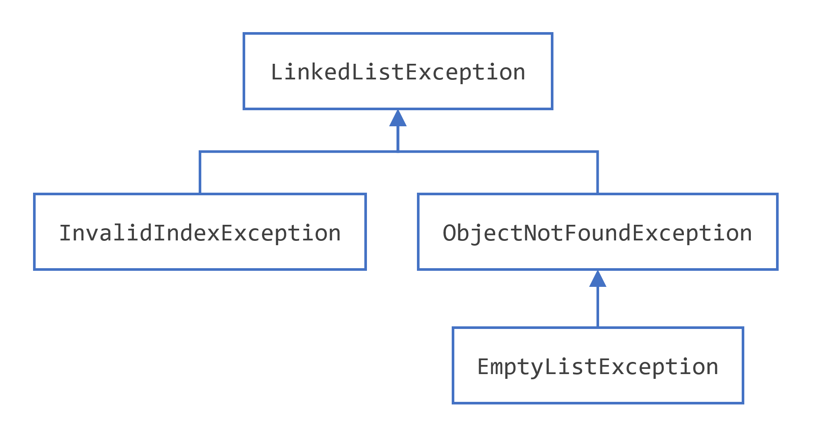

## 指定方法抛出的异常

上一节展示了如何为类中的`writeList()`方法编写异常处理程序`ListOfNumbers`。有时，代码捕获可能发生在其中的异常是合适的。但是，在其他情况下，最好让调用堆栈更上层的方法处理异常。例如，如果您将`ListOfNumbers`类作为类包的一部分提供，您可能无法预测包的所有用户的需求。在这种情况下，最好不要捕获异常并允许调用堆栈更上一层的方法来处理它。

如果该`writeList()`方法没有捕获其中可能发生的已检查异常，则该`writeList()`方法必须指定它可以抛出这些异常。让我们修改原始`writeList()`方法以指定它可以抛出的异常而不是捕获它们。提醒您，这里是`writeList()`无法编译的方法的原始版本。

```java
public void writeList() {
    PrintWriter out = new PrintWriter(new FileWriter("OutFile.txt"));
    for (int i = 0; i < SIZE; i++) {
        out.println("Value at: " + i + " = " + list.get(i));
    }
    out.close();
}
```

要指定`writeList()`可以抛出两个异常，请在方法的方法声明中添加 throws 子句`writeList()`。该`throws`子句包含`throws`关键字，后跟该方法抛出的所有异常的逗号分隔列表。该子句在方法名称和参数列表之后，在定义方法范围的大括号之前；这是一个例子。

```java
public void writeList() throws IOException, IndexOutOfBoundsException {
```

请记住，这[`IndexOutOfBoundsException`](https://docs.oracle.com/en/java/javase/17/docs/api/java.base/java/lang/IndexOutOfBoundsException.html)是一个unchecked的异常；将其包含在`throws`条款中不是强制性的。你可以只写以下内容。

```java
public void writeList() throws IOException {
```

## 如何抛出异常

在捕获异常之前，某处的某些代码必须抛出异常。任何代码都可能引发异常：您的代码、来自其他人编写的包的代码，例如 Java 平台附带的包或 Java 运行时环境。不管什么抛出异常，它总是与`throw`语句一起抛出。

您可能已经注意到，Java 平台提供了许多异常类。所有的类都是[`Throwable`](https://docs.oracle.com/en/java/javase/17/docs/api/java.base/java/lang/Throwable.html)该类的后代，并且都允许程序区分在程序执行期间可能发生的各种类型的异常。

您还可以创建自己的异常类来表示您编写的类中可能发生的问题。事实上，如果您是包开发人员，您可能必须创建自己的一组异常类，以允许用户将可能发生在您的包中的错误与发生在 Java 平台或其他包中的错误区分开来。

您还可以创建链式异常。有关更多信息，请参阅链式异常 Chained Exceptions 部分。

## throw语句

所有方法都使用该`throw`语句抛出异常。该`throw`语句需要一个参数：一个可抛出的对象。Throwable 对象是[`Throwable`](https://docs.oracle.com/en/java/javase/17/docs/api/java.base/java/lang/Throwable.html)该类的任何子类的实例。这是一个`throw`声明的例子。

```java
throw someThrowableObject;
```

让我们`throw`在上下文中查看该语句。以下`pop()`方法取自一个实现公共堆栈对象的类。该方法从堆栈中移除顶部元素并返回对象。

```java
public Object pop() {
    Object obj;

    if (size == 0) {
        throw new EmptyStackException();
    }

    obj = objectAt(size - 1);
    setObjectAt(size - 1, null);
    size--;
    return obj;
}
```

该`pop()`方法检查堆栈上是否有任何元素。如果堆栈为空（其大小等于 0），则 pop 实例化一个新[`EmptyStackException`](https://docs.oracle.com/en/java/javase/17/docs/api/java.base/java/util/EmptyStackException.html)对象（[`java.util`](https://docs.oracle.com/en/java/javase/17/docs/api/java.base/java/util/package-summary.html) 的成员）并将其抛出。本章中的创建异常类部分解释了如何创建自己的异常类。 现在，您需要记住的是，您只能抛出继承自java.lang.Throwable类的对象。  

注意，pop()方法的声明不包含throws子句。 EmptyStackException不是一个checked异常，所以不需要pop来说明它可能发生。   

## Throwable 类及其子类

从[`Throwable`](https://docs.oracle.com/en/java/javase/17/docs/api/java.base/java/lang/Throwable.html)类继承的对象包括直接后代（直接从[`Throwable`](https://docs.oracle.com/en/java/javase/17/docs/api/java.base/java/lang/Throwable.html)类继承的对象）和间接后代（从类的子孙后代继承的对象[`Throwable`](https://docs.oracle.com/en/java/javase/17/docs/api/java.base/java/lang/Throwable.html)）。下图说明了类的类层次结构[`Throwable`](https://docs.oracle.com/en/java/javase/17/docs/api/java.base/java/lang/Throwable.html)及其最重要的子类。如您所见，[`Throwable`](https://docs.oracle.com/en/java/javase/17/docs/api/java.base/java/lang/Throwable.html)有两个直系后代：[`Error`](https://docs.oracle.com/en/java/javase/17/docs/api/java.base/java/lang/Error.html)和[`Exception`](https://docs.oracle.com/en/java/javase/17/docs/api/java.base/java/lang/Exception.html)。


​																								Throwable 层次结构

 

## Error Class

当 Java 虚拟机发生动态链接失败或其他硬故障时，虚拟机抛出一个[`Error`](https://docs.oracle.com/en/java/javase/17/docs/api/java.base/java/lang/Error.html). 简单程序通常不会捕获或抛出[`Error`](https://docs.oracle.com/en/java/javase/17/docs/api/java.base/java/lang/Error.html).

## Exception Class

大多数程序抛出和捕获从Exception类派生的对象。 Exception表示出现了问题，但不是严重的系统问题。 你编写的大多数程序都会抛出和捕获Exception实例，而不是Error实例。  

Java平台定义了Exception类的许多后代。 这些后代表示可能发生的各种类型的异常。 例如，IllegalAccessException表示找不到特定的方法，NegativeArraySizeException表示程序试图创建一个大小为负的数组。  

一个Exception子类RuntimeException被保留用于指示不正确使用API的异常。 运行时异常的一个例子是NullPointerException，它发生在方法试图通过空引用访问对象的成员时。 在未检查的异常—争议部分讨论了为什么大多数应用程序不应该抛出运行时异常或子类RuntimeException。  

## 链式异常Chained Exceptions 

应用程序通常通过抛出另一个异常来响应异常。实际上，第一个异常会导致第二个异常。了解一个异常何时导致另一个异常会非常有帮助。链式异常帮助程序员做到这一点。

以下是[`Throwable`](https://docs.oracle.com/en/java/javase/17/docs/api/java.base/java/lang/Throwable.html)支持链式异常的方法和构造函数。

```java
Throwable getCause()
Throwable initCause(Throwable)
Throwable(String, Throwable)
Throwable(Throwable)
```

initCause()和Throwable构造函数的Throwable参数是导致当前异常的异常。getCause()返回导致当前异常的异常，initCause()设置当前异常的原因。

以下示例显示了如何使用链式异常。

```java
try {

} catch (IOException e) {
    throw new SampleException("Other IOException", e);
}
```

在这个例子中，当一个[`IOException`](https://docs.oracle.com/en/java/javase/17/docs/api/java.base/java/io/IOException.html)被捕获时，一个新的`SampleException`异常被创建，并附加了原始原因，并且异常链被抛出到下一个更高级别的异常处理程序。

## 访问堆栈跟踪信息

现在让我们假设更高级别的异常处理程序想要以自己的格式转储堆栈跟踪。

> 定义:堆栈跟踪提供了当前线程执行历史的信息，并列出了异常发生时调用的类和方法的名称。堆栈跟踪是一种有用的调试工具，通常在抛出异常时可以利用它。

以下代码显示了如何调用[`getStackTrace()`](https://docs.oracle.com/en/java/javase/17/docs/api/java.base/java/lang/Throwable.html#getStackTrace())异常对象上的方法。

```java
catch (Exception cause) {
    StackTraceElement elements[] = cause.getStackTrace();
    for (int i = 0, n = elements.length; i < n; i++) {       
        System.err.println(elements[i].getFileName()
            + ":" + elements[i].getLineNumber() 
            + ">> "
            + elements[i].getMethodName() + "()");
    }
}
```

### 日志API

下一个代码片段记录catch块中发生异常的地方。但是，我们没有手动解析堆栈跟踪并将输出发送给java.util.logging，它使用java.util.logging包中的日志功能将输出发送到一个文件。

```java
try {
    Handler handler = new FileHandler("OutFile.log");
    Logger.getLogger("").addHandler(handler);
    
} catch (IOException e) {
    Logger logger = Logger.getLogger("package.name"); 
    StackTraceElement elements[] = e.getStackTrace();
    for (int i = 0, n = elements.length; i < n; i++) {
        logger.log(Level.WARNING, elements[i].getMethodName());
    }
}
```

## 创建异常类

当面临选择要抛出的异常类型时，您可以使用别人编写的异常类型(Java平台提供了许多可以使用的异常类)，也可以编写自己的异常类型。如果你对以下任何一个问题的回答是肯定的，你应该编写自己的异常类;否则，你可能会用别人的。

- 您是否需要 Java 平台中没有的异常类型？
- 如果用户能够将您的异常与其他供应商编写的类抛出的异常区分开来，这对用户有帮助吗？
- 您的代码是否抛出多个相关异常？
- 如果您使用其他人的异常，用户是否可以访问这些异常?类似的问题是，您的包应该是独立和自包含的吗?

### 一个例子

假设您正在编写一个链表类。该类支持以下方法，其中包括：

- `objectAt(int n)`— 返回列表中第 n 个位置的对象。如果参数小于 0 或大于当前列表中的对象数，则引发异常。
- `firstObject()`— 返回列表中的第一个对象。如果列表不包含对象，则抛出异常。
- `indexOf(Object o)`— 在列表中搜索指定的对象并返回其在列表中的位置。如果传入方法的对象不在列表中，则抛出异常。

链表类可以抛出多个异常，如果能够用一个异常处理程序捕获链表抛出的所有异常会很方便。此外，如果您打算在一个包中分发您的链表，则应将所有相关代码打包在一起。因此，链表应该提供它自己的一组异常类。

下图说明了链表抛出的异常的一个可能的类层次结构。



​																						  示例异常类层次结构

### 选择超类

任何Exception子类都可以用作LinkedListException的父类。但是，快速浏览一下这些子类就会发现它们是不合适的，因为它们要么太专门化，要么与LinkedListException完全无关。因此，LinkedListException的父类应该是Exception。

您编写的大多数应用程序都会抛出作为Exception实例的对象。 Error实例通常用于系统中严重的硬错误，例如那些阻止JVM运行的错误。

注意：对于可读代码，最好将字符串附加到从[`Exception`](https://docs.oracle.com/en/java/javase/17/docs/api/java.base/java/lang/Exception.html)类继承（直接或间接）的所有类的名称中。

