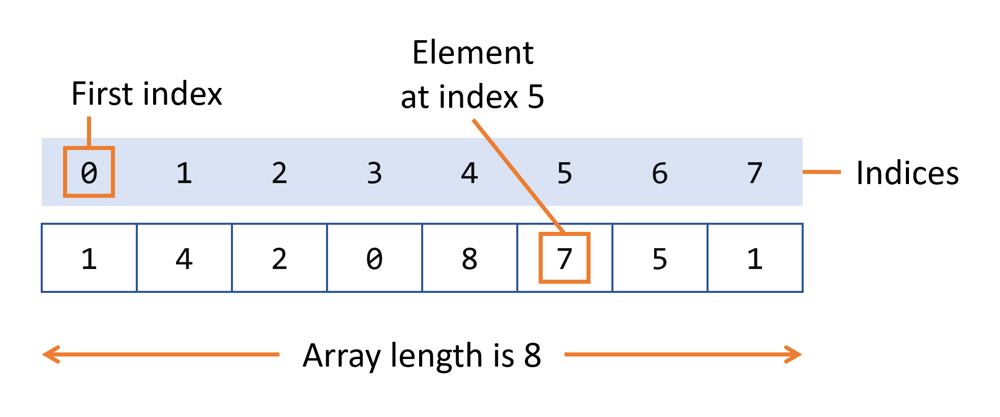

## 数组

*数组*是一种容器对象，它包含固定数量的单一类型的值。数组的长度是在创建数组时确定的。创建后，其长度是固定的。您已经在“Hello World!”程序的 main 方法中看到了一个数组示例。。本节更详细地讨论数组。



​																				8 个元素的数组。

数组中的每一项都称为一个*元素*，每个元素都通过其数字*索引进行*访问。如上图所示，编号从 0 开始。例如，第 6 个元素因此将在索引 5 处访问。

下面的程序 ，`ArrayDemo`创建一个整数数组，将一些值放入数组中，并将每个值打印到标准输出。

```java
class ArrayDemo {
    public static void main(String[] args) {
        // declares an array of integers
        int[] anArray;

        // allocates memory for 10 integers
        anArray = new int[10];
           
        // initialize first element
        anArray[0] = 100;
        // initialize second element
        anArray[1] = 200;
        // and so forth
        anArray[2] = 300;
        anArray[3] = 400;
        anArray[4] = 500;
        anArray[5] = 600;
        anArray[6] = 700;
        anArray[7] = 800;
        anArray[8] = 900;
        anArray[9] = 1000;

        System.out.println("Element at index 0: "
                           + anArray[0]);
        System.out.println("Element at index 1: "
                           + anArray[1]);
        System.out.println("Element at index 2: "
                           + anArray[2]);
        System.out.println("Element at index 3: "
                           + anArray[3]);
        System.out.println("Element at index 4: "
                           + anArray[4]);
        System.out.println("Element at index 5: "
                           + anArray[5]);
        System.out.println("Element at index 6: "
                           + anArray[6]);
        System.out.println("Element at index 7: "
                           + anArray[7]);
        System.out.println("Element at index 8: "
                           + anArray[8]);
        System.out.println("Element at index 9: "
                           + anArray[9]);
    }
} 
```

这个程序的输出是：

```shell
Element at index 0: 100
Element at index 1: 200
Element at index 2: 300
Element at index 3: 400
Element at index 4: 500
Element at index 5: 600
Element at index 6: 700
Element at index 7: 800
Element at index 8: 900
Element at index 9: 1000
```

在实际编程情况下，您可能会使用一种受支持的循环构造来遍历数组的每个元素，而不是像前面的示例那样单独编写每一行。但是，该示例清楚地说明了数组语法。您将在[控制流](https://dev.java/learn/control-flow-statements/)部分了解各种循环结构（for、while 和 do-while）。

 

## 声明一个变量来引用一个数组

前面的程序`anArray`使用以下代码行声明了一个数组（名为）：

```java
// declares an array of integers
int[] anArray;
```

与其他类型变量的声明一样，数组声明有两个组成部分：数组的类型和数组的名称。数组的类型写为`type[]`，其中`type`是所包含元素的数据类型；括号是特殊符号，表示此变量包含一个数组。数组的大小不是其类型的一部分（这就是括号为空的原因）。数组的名称可以是您想要的任何名称，前提是它遵循[类](https://dev.java/learn/creating-classes/)部分中讨论的规则和约定。与其他类型的变量一样，声明实际上并不创建数组；它只是告诉编译器这个变量将保存一个指定类型的数组。

同样，您可以声明其他类型的数组：

```java
byte[] anArrayOfBytes;
short[] anArrayOfShorts;
long[] anArrayOfLongs;
float[] anArrayOfFloats;
double[] anArrayOfDoubles;
boolean[] anArrayOfBooleans;
char[] anArrayOfChars;
String[] anArrayOfStrings;
```

您还可以将括号放在数组名称之后：

```java
// this form is discouraged
float anArrayOfFloats[];
```

然而，惯例不鼓励这种形式；括号标识数组类型，并应与类型名称一起出现。

 

## 创建、初始化和访问数组

创建数组的一种方法是使用`new`运算符。程序中的下`ArrayDemo`一条语句为一个具有足够内存的数组分配 10 个整数元素，并将该数组分配给`anArray`变量。

```java
// create an array of integers
anArray = new int[10];
```

如果缺少此语句，则编译器会打印如下错误，并且编译失败：

```shell
ArrayDemo.java:4: Variable anArray may not have been initialized.
```

接下来的几行为数组的每个元素分配值：

```java
anArray[0] = 100; // initialize first element
anArray[1] = 200; // initialize second element
anArray[2] = 300; // and so forth
```

每个数组元素通过其数字索引访问：

```java
System.out.println("Element 1 at index 0: " + anArray[0]);
System.out.println("Element 2 at index 1: " + anArray[1]);
System.out.println("Element 3 at index 2: " + anArray[2]);
```

或者，您可以使用快捷语法来创建和初始化数组：

```java
int[] anArray = { 
    100, 200, 300,
    400, 500, 600, 
    700, 800, 900, 1000
};
```

这里数组的长度由大括号之间提供并用逗号分隔的值的数量决定。

您还可以使用两组或更多组括号（例如`String[][]`名称）来声明数组数组（也称为多维数组）。因此，每个元素都必须由相应数量的索引值访问。

在 Java 编程语言中，多维数组是一个数组，其组件本身就是数组。这与 C 或 Fortran 中的数组不同。这样做的结果是允许行的长度不同，如以下`MultiDimArrayDemo`程序所示：

```java
class MultiDimArrayDemo {
    public static void main(String[] args) {
        String[][] names = {
            {"Mr. ", "Mrs. ", "Ms. "},
            {"Smith", "Jones"}
        };
        // Mr. Smith
        System.out.println(names[0][0] + names[1][0]);
        // Ms. Jones
        System.out.println(names[0][2] + names[1][1]);
    }
}
```

这个程序的输出是：

```shell
Mr. Smith
Ms. Jones
```

最后，您可以使用内置`length`属性来确定任何数组的大小。以下代码将数组的大小打印到标准输出：

```java
System.out.println(anArray.length);
```


## 复制数组

[`System`](https://docs.oracle.com/en/java/javase/17/docs/api/java.base/java/lang/System.html)类有一个[`arraycopy()`](https://docs.oracle.com/en/java/javase/17/docs/api/java.base/java/lang/System.html#arraycopy(java.lang.Object,int,java.lang.Object,int,i))方法，可以有效地将一个数组数据拷贝到其他：

```java
public static void arraycopy(Object src, int srcPos,
                             Object dest, int destPos, int length)
```

这两个`Object`参数指定要的数组和要到的数组。这三个`int`参数指定源数组中的起始位置、目标数组中的起始位置以及要的数组元素数。

下面的程序`ArrayCopyDemo`声明了一个`String`元素数组。它使用以下[`System.arraycopy()`](https://docs.oracle.com/en/java/javase/17/docs/api/java.base/java/lang/System.html#arraycopy(java.lang.Object,int,java.lang.Object,int,i))方法将数组组件的子序列到第二个数组中：

```java
class ArrayCopyDemo {
    public static void main(String[] args) {
        String[] copyFrom = {
            "Affogato", "Americano", "Cappuccino", "Corretto", "Cortado",   
            "Doppio", "Espresso", "Frappucino", "Freddo", "Lungo", "Macchiato",      
            "Marocchino", "Ristretto" };
        
        String[] copyTo = new String[7];
        System.arraycopy(copyFrom, 2, copyTo, 0, 7);
        for (String coffee : copyTo) {
            System.out.print(coffee + " ");           
        }
    }
}
```

这个程序的输出是：

```shell
Cappuccino Corretto Cortado Doppio Espresso Frappucino Freddo
```

## 数组操作

数组是编程中使用的一个强大而有用的概念。Java SE 提供了执行一些与数组相关的最常见操作的方法。例如，该`ArrayCopyDemo`示例使用类的[`arraycopy()`](https://docs.oracle.com/en/java/javase/17/docs/api/java.base/java/lang/System.html#arraycopy(java.lang.Object,int,java.lang.Object,int,i))方法，而不是[`System`](https://docs.oracle.com/en/java/javase/17/docs/api/java.base/java/lang/System.html)手动遍历源数组的元素并将每个元素放入目标数组。这是在幕后执行的，使开发人员只需使用一行代码即可调用该方法。

为方便起见，Java SE 提供了几种在[`java.util.Arrays`](https://docs.oracle.com/en/java/javase/17/docs/api/java.base/java/util/Arrays.html)类中执行数组操作（常见任务，例如、排序和搜索数组）的方法。例如，可以修改前面的示例以使用[`java.util.Arrays`](https://docs.oracle.com/en/java/javase/17/docs/api/java.base/java/util/Arrays.html)类的方法，如`ArrayCopyOfDemo`示例中所示。不同之处在于，使用该[`java.util.Arrays`](https://docs.oracle.com/en/java/javase/17/docs/api/java.base/java/util/Arrays.html)，如`ArrayCopyOfDemo`示例中所示。不同之处在于，使用该[`java.util.Arrays`](https://docs.oracle.com/en/java/javase/17/docs/api/java.base/java/util/Arrays.html)方法不需要您在调用该方法之前创建目标数组，因为目标数组是由该方法返回的：

```java
class ArrayCopyOfDemo {
    public static void main(String[] args) {
        String[] copyFrom = {
            "Affogato", "Americano", "Cappuccino", "Corretto", "Cortado",   
            "Doppio", "Espresso", "Frappucino", "Freddo", "Lungo", "Macchiato",      
            "Marocchino", "Ristretto" };
        
        String[] copyTo = java.util.Arrays.copyOfRange(copyFrom, 2, 9);        
        for (String coffee : copyTo) {
            System.out.print(coffee + " ");           
        }            
    }
}
```

如您所见，该程序的输出是相同的，尽管它需要的代码行更少。请注意，该[`java.util.Arrays`](https://docs.oracle.com/en/java/javase/17/docs/api/java.base/java/util/Arrays.html)方法的第二个参数是要的范围的初始索引，包括在内，而第三个参数是要的范围的最终索引，独占。在此示例中，要的范围不包括索引 9 处的数组元素（其中包含字符串`Lungo`）。

[`java.util.Arrays`](https://docs.oracle.com/en/java/javase/17/docs/api/java.base/java/util/Arrays.html)类中的方法提供的其他一些有用的操作是：

- 在数组中搜索特定值以获取放置它的索引（[`binarySearch()`](https://docs.oracle.com/en/java/javase/17/docs/api/java.base/java/util/Arrays.html#binarySearch(int[],int))方法）。
- 比较两个数组以确定它们是否相等（[`equals()`](https://docs.oracle.com/en/java/javase/17/docs/api/java.base/java/util/Arrays.html#equals(int[],int[]))方法）。
- 填充数组以在每个索引处放置特定值（[`fill()`](https://docs.oracle.com/en/java/javase/17/docs/api/java.base/java/util/Arrays.html#fill(int[],int))方法）。
- 将数组按升序排序。这可以使用[`sort()`](https://docs.oracle.com/en/java/javase/17/docs/api/java.base/java/util/Arrays.html#sort(int[]))方法按顺序完成，也可以使用[`parallelSort()`](https://docs.oracle.com/en/java/javase/17/docs/api/java.base/java/util/Arrays.html#parallelSort(int[]))Java SE 8 中引入的方法同时完成。在多处理器系统上并行排序大型数组比顺序数组排序更快。
- 创建一个使用数组作为其源（[`stream()`](https://docs.oracle.com/en/java/javase/17/docs/api/java.base/java/util/Arrays.html#stream(int[]))方法）的流。例如，以下语句`copyTo`以与前一个示例相同的方式打印数组的内容：

```java
java.util.Arrays.stream(copyTo).map(coffee -> coffee + " ").forEach(System.out::print);  
```


有关流的更多信息，请参阅聚合操作。

- 将数组转换为字符串。该[`toString()`](https://docs.oracle.com/en/java/javase/17/docs/api/java.base/java/util/Arrays.html#toString(int[]))方法将数组的每个元素转换为字符串，用逗号分隔它们，然后用括号将它们括起来。例如，以下语句将`copyTo`数组转换为字符串并打印它：

```java
System.out.println(java.util.Arrays.toString(copyTo));
```

该语句打印以下内容：

```shell
[Cappuccino, Corretto, Cortado, Doppio, Espresso, Frappucino, Freddo] 
```

 

## 总结变量和数组

Java 编程语言使用“字段”和“变量”作为其术语的一部分。实例变量（非静态字段）对于类的每个实例都是唯一的。类变量（静态字段）是用 static 修饰符声明的字段；无论类被实例化了多少次，都只有一个类变量的副本。局部变量在方法内存储临时状态。参数是为方法提供额外信息的变量；局部变量和参数总是被归类为“变量”（而不是“字段”）。在命名字段或变量时，您应该（或必须）遵循一些规则和约定。

这八个基本数据类型有：`byte`，`short`，`int`，`long`，`float`，`double`，`boolean`，和`char`。`java.lang.String`类代表字符串。编译器会为上述类型的字段分配一个合理的默认值；对于局部变量，永远不会分配默认值。

字面量是固定值的源代码表示。数组是一个容器对象，它包含固定数量的单一类型的值。数组的长度是在创建数组时确定的。创建后，其长度是固定的。