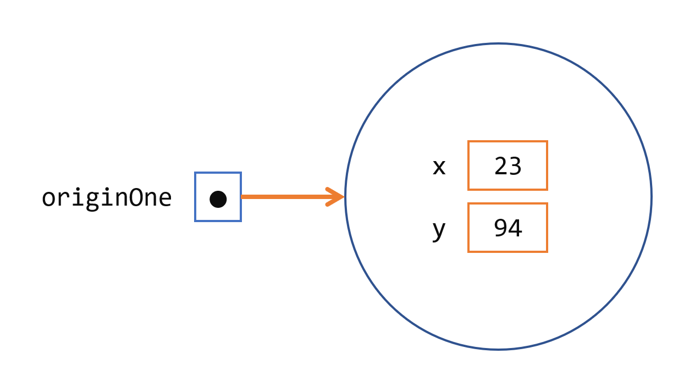

## 了解什么是对象

一个典型的 Java 程序会创建许多对象，如您所知，它们通过调用方法进行交互。通过这些对象交互，程序可以执行各种任务，例如实现 GUI、运行动画或通过网络发送和接收信息。一旦一个对象创建后完成了它的工作，它的资源将被回收供其他对象使用。。

这是一个名为`CreateObjectDemo`的小程序，它创建三个对象：一个`Point`对象和两个`Rectangle`对象。您将需要所有三个源文件来编译此程序。

```java
public class CreateObjectDemo {

    public static void main(String[] args) {
        
        // Declare and create a point object and two rectangle objects.
        Point originOne = new Point(23, 94);
        Rectangle rectOne = new Rectangle(originOne, 100, 200);
        Rectangle rectTwo = new Rectangle(50, 100);
        
        // display rectOne's width, height, and area
        System.out.println("Width of rectOne: " + rectOne.width);
        System.out.println("Height of rectOne: " + rectOne.height);
        System.out.println("Area of rectOne: " + rectOne.getArea());
        
        // set rectTwo's position
        rectTwo.origin = originOne;
        
        // display rectTwo's position
        System.out.println("X Position of rectTwo: " + rectTwo.origin.x);
        System.out.println("Y Position of rectTwo: " + rectTwo.origin.y);
        
        // move rectTwo and display its new position
        rectTwo.move(40, 72);
        System.out.println("X Position of rectTwo: " + rectTwo.origin.x);
        System.out.println("Y Position of rectTwo: " + rectTwo.origin.y);
    }
}
```

这是`Point`类：

```java
public class Point {
    public int x = 0;
    public int y = 0;
    // a constructor!
    public Point(int a, int b) {
    x = a;
    y = b;
    }
}
```

和`Rectangle`类：

```java
public class Rectangle {
    public int width = 0;
    public int height = 0;
    public Point origin;
 
    // four constructors
    public Rectangle() {
    origin = new Point(0, 0);
    }
    public Rectangle(Point p) {
    origin = p;
    }
    public Rectangle(int w, int h) {
    origin = new Point(0, 0);
    width = w;
    height = h;
    }
    public Rectangle(Point p, int w, int h) {
    origin = p;
    width = w;
    height = h;
    }
 
    // a method for moving the rectangle
    public void move(int x, int y) {
    origin.x = x;
    origin.y = y;
    }
 
    // a method for computing the area of the rectangle
    public int getArea() {
    return width * height;
    }
}
```

该程序创建、操作和显示有关各种对象的信息。这是输出：

```shell
Width of rectOne: 100
Height of rectOne: 200
Area of rectOne: 20000
X Position of rectTwo: 23
Y Position of rectTwo: 94
X Position of rectTwo: 40
Y Position of rectTwo: 72
```

下面三节将使用上面的例子来描述程序中对象的生命周期。从它们中，您将学习如何在自己的程序中编写创建和使用对象的代码。您还将了解在一个对象的生命周期结束后，系统如何进行清理。

 

## 创建对象

如您所知，类提供对象的蓝图；你从一个类创建一个对象。从`CreateObjectDemo`程序中提取的以下每个语句都会创建一个对象并将其分配给一个变量：

```shell
Point originOne = new Point(23, 94);
Rectangle rectOne = new Rectangle(originOne, 100, 200);
Rectangle rectTwo = new Rectangle(50, 100);
```

第一行创建`Point`类的对象，第二行和第三行分别创建`Rectangle`类的对象。

这些陈述中的每一个都包含三个部分（在下面详细讨论）：

1. 声明：以粗体设置的代码都是将变量名与对象类型相关联的变量声明。
2. 实例化：`new`关键字是创建对象的 Java 运算符。
3. 初始化：`new`操作符之后是对构造函数的调用，该构造函数初始化新对象。

### 声明一个变量来引用一个对象

之前，您学习过要声明一个变量，您可以这样写：

```java
type name;
```

这会通知编译器您将使用 name 来引用类型为 type 的数据。对于原始变量，此声明还为变量保留了适当的内存量。

您还可以在其自己的行上声明一个引用变量。例如：

```java
Point originOne;
```

如果你这样声明`originOne`，它的值将是不确定的，直到一个对象被实际创建并分配给它。简单地声明一个引用变量不会创建一个对象。为此，您需要使用`new`运算符，如下一节所述。`originOne`在您的代码中使用它之前，您必须为其分配一个对象。否则，您将收到编译器错误。

处于此状态的变量，当前未引用任何对象。

### 实例化一个类

`new`操作符通过为新对象分配内存并返回对该内存的引用来实例化类。new操作符还调用对象构造函数。

> 注意:短语“实例化一个类”的意思是“创建一个对象”。当你创建一个对象时，你是在创建一个类的“实例”，因此你是在“实例化”一个类。

`new`操作需要一个后缀参数:对构造函数的调用。构造函数的名称提供了要实例化的类的名称。
`new`操作返回对它创建的对象的引用。这个引用通常被赋值给适当类型的变量，例如:

```java
Point originOne = new Point(23, 94);
```

`new`运算符返回的引用不必赋值给变量。它也可以直接在表达式中使用。例如：

```java
int height = new Rectangle().height;
```

该声明将在下一节中讨论。

### 初始化对象

这是`Point`该类的代码：

```java
public class Point {
    public int x = 0;
    public int y = 0;
    //constructor
    public Point(int a, int b) {
        x = a;
        y = b;
    }
}
```

此类包含一个构造函数。您可以识别构造函数，因为它的声明使用与类相同的名称，并且它没有返回类型。类中的构造函数`Point`采用两个整数参数，如代码所声明的`(int a, int b)`。以下语句提供 23 和 94 作为这些参数的值：

```java
Point originOne = new Point(23, 94);
```

执行该语句的结果如下图所示：



​																															一个点对象

这是`Rectangle`该类的代码，其中包含四个构造函数：

```java
public class Rectangle {
    public int width = 0;
    public int height = 0;
    public Point origin;

    // four constructors
    public Rectangle() {
        origin = new Point(0, 0);
    }
    
    public Rectangle(Point p) {
        origin = p;
    }
    
    public Rectangle(int w, int h) {
        origin = new Point(0, 0);
        width = w;
        height = h;
    }
    
    public Rectangle(Point p, int w, int h) {
        origin = p;
        width = w;
        height = h;
    }

    // a method for moving the rectangle
    public void move(int x, int y) {
        origin.x = x;
        origin.y = y;
    }

    // a method for computing the area of the rectangle
    public int getArea() {
        return width * height;
    }
}
```

每一个构造函数允许您为矩形的提供初始值`origin`，`width`和`height`，同时使用原始和引用类型。如果一个类有多个构造函数，它们必须有不同的签名。Java 编译器根据参数的数量和类型区分构造函数。当 Java 编译器遇到以下代码时，它知道调用`Rectangle`需要一个`Point`参数后跟两个整数参数的类中的构造函数：

```java
Rectangle rectOne = new Rectangle(originOne, 100, 200);
```

复制

这会调用`Rectangle`将 origin 初始化为 的构造函数之一`originOne`。此外，构造函数将宽度设置为 100，将高度设置为 200。 现在对同`Point`一个对象有两个引用——一个对象可以有多个引用，如下图所示：


矩形对象

下面的代码行调用`Rectangle`需要两个整数参数，这对于提供初始值的构造`width`和`height`。如果您检查构造函数中的代码，您将看到它创建了一个新`Point`对象，其`x`和`y`值初始化为 0：

```java
Rectangle rectTwo = new Rectangle(50, 100);
```

`Rectangle`以下语句中使用的构造函数不带任何参数，因此称为无参数构造函数：

```java
Rectangle rect = new Rectangle();
```

所有类至少有一个构造函数。如果一个类没有显式声明，Java 编译器会自动提供一个无参数构造函数，称为默认构造函数。这个默认构造函数调用父类的无参数构造函数，或者`Object`如果类没有其他父类，则调用构造函数。如果父级没有构造函数（`Object`有），编译器将拒绝该程序。

## 使用对象

一旦你创建了一个对象，你可能想用它来做某事。您可能需要使用其字段之一的值、更改其字段之一或调用其方法之一来执行操作。

### 引用对象的字段

对象字段按其名称访问。您必须使用明确的名称。

您可以为其自己的类中的字段使用简单的名称。例如，我们可以在`Rectangle`打印`width`and的类中添加一条语句`height`：

```java
System.out.println("Width and height are: " + width + ", " + height);
```

在这种情况下，`width`和`height`是简单的名称。

对象类之外的代码必须使用对象引用或表达式，后跟点 ( `.`) 运算符，后跟简单的字段名称，如下所示：

```java
objectReference.fieldName
```

例如，`CreateObjectDemo`类中的代码在类的代码之外`Rectangle`。因此，要参考`origin`，`width`以及`height`该领域内`Rectangle`命名对象`rectOne`的`CreateObjectDemo`类必须使用的名称`rectOne.origin`，`rectOne.width`和`rectOne.height`分别。该方案采用两个这些名称的显示`width`及`height`的`rectOne`：

```java
System.out.println("Width of rectOne: "  + rectOne.width);
System.out.println("Height of rectOne: " + rectOne.height);
```

尝试使用类中的简单名称`width`和`height`代码`CreateObjectDemo`是没有意义的——这些字段只存在于一个对象中——并导致编译器错误。

后来，该程序使用类似的代码来显示有关`rectTwo`. 相同类型的对象有自己的相同实例字段的副本。因此，每个`Rectangle`对象都有一个名为领域`origin`，`width`和`height`。当您通过对象引用访问实例字段时，您引用了该特定对象的字段。这两个对象`rectOne`，并`rectTwo`在`CreateObjectDemo`程序有不同`origin`，`width`和`height`各个领域。

要访问字段，您可以使用对对象的命名引用，如前面的示例，或者您可以使用任何返回对象引用的表达式。回想一下，`new`运算符返回对对象的引用。因此，您可以使用从 new 返回的值来访问新对象的字段：

```java
int height = new Rectangle().height;
```

此语句创建一个新`Rectangle`对象并立即获取其`height`. 本质上，该语句计算 a 的默认高度`Rectangle`。请注意，在执行此语句后，程序不再拥有对 created 的引用`Rectangle`，因为程序从未将引用存储在任何地方。该对象未被引用，其资源可以被 Java 虚拟机自由回收。

### 调用对象的方法

您还可以使用对象引用来调用对象的方法。您将方法的简单名称附加到对象引用中，中间有一个点运算符 ( `.`)。此外，您可以在括号内为该方法提供任何参数。如果该方法不需要任何参数，请使用空括号。

```java
objectReference.methodName(argumentList);
```

或者：

```java
objectReference.methodName();
```

本`Rectangle`类有两个方法：`getArea()`计算矩形的面积和`move()`改变矩形的原点。这`CreateObjectDemo`是调用这两个方法的代码：

```java
System.out.println("Area of rectOne: " + rectOne.getArea());
...
rectTwo.move(40, 72);
```

第一条语句调用`rectOne`的`getArea()`方法并显示结果。第二行移动`rectTwo`是因为该`move()`方法为对象的`origin.x`和分配了新值`origin.y`。

与实例字段一样，`objectReference`必须是对对象的引用。您可以使用变量名，但也可以使用任何返回对象引用的表达式。该`new`运算符返回一个对象引用，因此您可以使用返回的值`new`来调用新对象的方法：

```java
new Rectangle(100, 50).getArea()
```

该表达式`new Rectangle(100, 50)`返回引用对象的对象引用`Rectangle`。如图所示，您可以使用圆点表示法调用 new`Rectangle`的`getArea()`方法来计算新矩形的面积。

某些方法，例如`getArea()`，返回一个值。对于返回值的方法，您可以在表达式中使用方法调用。您可以将返回值分配给变量，使用它来做出决策或控制循环。此代码将 返回的值分配给`getArea()`变量`areaOfRectangle`：

```java
int areaOfRectangle = new Rectangle(100, 50).getArea();
```

在这种情况下，`getArea()`被调用的对象是构造函数返回的矩形。

 

## 垃圾收集器

一些面向对象的语言要求您跟踪您创建的所有对象，并在不再需要它们时明确销毁它们。显式管理内存既乏味又容易出错。Java 平台允许您创建任意数量的对象（当然，受限于您的系统可以处理的内容），并且您不必担心销毁它们。Java 运行时环境会在确定不再使用对象时删除这些对象。这个过程称为垃圾收集。

当不再有对该对象的引用时，该对象就有资格进行垃圾回收。当变量超出范围时，变量中保存的引用通常会被删除。或者，您可以通过将变量设置为特殊值`null`来显式删除对象引用。记住，一个程序可以对同一个对象有多个引用;在对象适合进行垃圾收集之前，必须删除对对象的所有引用。

Java 运行时环境有一个垃圾收集器，它会定期释放不再被引用的对象所使用的内存。当垃圾收集器确定时间合适时，它会自动执行其工作。