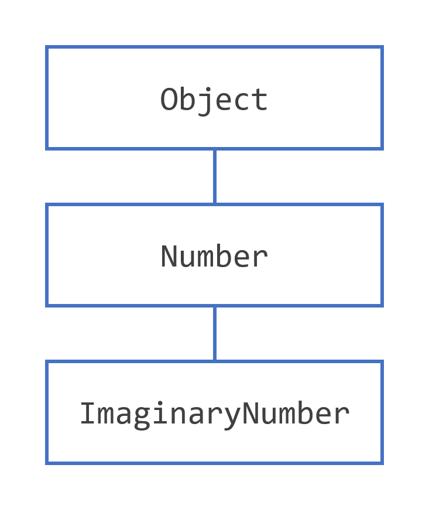

## 关于Class更多信息

本节涵盖了依赖于使用对象引用的类的更多方面，以及您在前面有关对象的部分中学到的点运算符：

- 从方法返回值。
- 该`this`关键字。
- 类与实例成员。
- 访问控制。

 

## 从方法返回值

一个方法返回到调用它的代码时

- 完成方法中的所有语句，
- 达成一项`return`声明，或
- 抛出异常（稍后介绍），
- 以先发生者为准。

在方法声明中声明方法的返回类型。在方法体中，您使用`return`语句返回值。

任何声明的方法`void`都不返回值。它不需要包含`return`语句，但可以这样做。在这种情况下，`return`可以使用语句从控制流块中分支出来并退出该方法，并且可以像这样简单地使用：

```java
return;
```

如果您尝试从已声明的`void`方法返回值，您将收到编译器错误。

任何未声明为`void`的方法都都必须包含一个带有相应返回值的`return`语句，如下所示:

```java
return returnValue;
```

返回值的数据类型必须与方法声明的返回类型匹配;不能从声明为返回布尔值的方法返回整数值。

在对象部分讨论`getArea()`的`Rectangle`类中的方法返回一个整数：

```java
// a method for computing the area of the rectangle
public int getArea() {
    return width * height;
}
```

此方法返回表达式`width*height`计算结果的整数。

该`getArea()`方法返回一个原始类型。方法还可以返回引用类型。例如，在一个操作`Bicycle`对象的程序中，我们可能有这样的方法：

```java
public Bicycle seeWhosFastest(Bicycle myBike, Bicycle yourBike, Environment env) {
    Bicycle fastest;
    // code to calculate which bike is 
    // faster, given each bike's gear 
    // and cadence and given the 
    // environment (terrain and wind)
    return fastest;
}
```

 

## 返回一个类或接口

如果本节让您感到困惑，请跳过它并在完成有关接口和继承的部分后返回。

当方法使用类名作为其返回类型时，例如`seeWhosFastest()`，返回对象的类型的类必须是返回类型的子类或正确的类。假设您有一个类层次结构，其中`ImaginaryNumber`是 `java.lang.Number`的子类，而 又是 `Object`的子类，如下图所示。



​																		“ImaginaryNumber”的类层次结构

现在假设您有一个声明返回`Number`的方法：

```java
public Number returnANumber() {
    ...
}
```

方法可以返回一个ImaginaryNumber，但不能返回一个Object。ImaginaryNumber的实例也是Number的实例，因为ImaginaryNumber是Number的子类。然而，对象不一定是数字——它可以是字符串或其他类型。

你可以重写一个方法并定义它以返回原始方法的子类，如下所示:

```java
public ImaginaryNumber returnANumber() {
    ...
}
```

这种技术称为协变返回类型，意味着允许返回类型按照子类的相同方向变化。。

> 注意：您也可以使用接口名称作为返回类型。在这种情况下，返回的对象必须实现指定的接口。

 

## 使用 this 关键字

在实例方法或构造函数中， this 是对*当前对象*的引用——正在调用其方法或构造函数的对象。您可以使用`this`.在实例方法或构造函数中引用当前对象的任何成员。

### this与字段一起使用

使用`this`关键字的最常见原因是因为字段被方法或构造函数参数遮蔽。

例如，这个`Point`类是这样写的：

```java
public class Point {
    public int x = 0;
    public int y = 0;
        
    //constructor
    public Point(int a, int b) {
        x = a;
        y = b;
    }
}
```

但它可以写成这样：

```java
public class Point {
    public int x = 0;
    public int y = 0;
        
    //constructor
    public Point(int x, int y) {
        this.x = x;
        this.y = y;
    }
}
```

构造函数的每个参数都隐藏了对象的一个字段——构造函数内部是构造`x`函数第一个参数的本地副本。要引用该`Point`字段`x`，构造函数必须使用`this.x`.

### this与构造函数一起使用

在构造函数中，您还可以使用`this`关键字调用同一类中的另一个构造函数。这样做称为显式构造函数调用。这是另一个`Rectangle`类，其实现与对象部分中的类不同。

```java
public class Rectangle {
    private int x, y;
    private int width, height;
        
    public Rectangle() {
        this(0, 0, 1, 1);
    }
    public Rectangle(int width, int height) {
        this(0, 0, width, height);
    }
    public Rectangle(int x, int y, int width, int height) {
        this.x = x;
        this.y = y;
        this.width = width;
        this.height = height;
    }
    ...
}
```

此类包含一组构造函数。每个构造函数都会初始化矩形的部分或全部成员变量。构造函数为其初始值不是由参数提供的任何成员变量提供默认值。例如，无参数构造函数在坐标 0,0 处创建一个 1x1 矩形。二参数构造函数调用四参数构造函数，传入`width`和`height`但始终使用 0,0 坐标。和以前一样，编译器根据参数的数量和类型确定要调用哪个构造函数。

如果存在，另一个构造函数的调用必须在构造函数的第一行。

 

## 控制对类成员的访问

访问级别修饰符确定其他类是否可以使用特定字段或调用特定方法。有两个级别的访问控制：

- 在顶层—`public`或包私有（无显式修饰符）。
- 在成员级别`public`— `private`、`protected`、 或 package-private（无显式修饰符）。

可以使用修饰符声明一个类`public`，在这种情况下，该类对任何地方的所有类都是可见的。如果一个类没有修饰符（默认设置，也称为包私有），它只在它自己的包中可见（包被命名为相关类的组——你将在后面的部分中了解它们。）

在成员级别，您还可以使用`public`修饰符或不使用修饰符（包私有），就像顶级类一样，并且具有相同的含义。对于成员，还有两个额外的访问修饰符：`private`和`protected`。该`private`修饰符指定了成员只能在自己的类访问。所述`protected`修饰符指定了构件只能在其自己的封装件内被访问的（与包专用），此外，通过它的类的另一个包的子类。

下表显示了每个修饰符允许的成员访问权限。

| 修饰符       | Class | Package | SubClass | World |
| ------------ | ----- | ------- | -------- | ----- |
| `public`     | Y     | Y       | Y        | Y     |
| `protected`  | Y     | Y       | Y        | N     |
| *没有修饰符* | Y     | Y       | N        | N     |
| `private`    | Y     | N       | N        | N     |

第一个数据列指示类本身是否可以访问由访问级别定义的成员。如您所见，类始终可以访问自己的成员。

第二列指示与该类位于同一包中的类（无论其出身如何）是否可以访问该成员。

第三列指示在此包外声明的类的子类是否可以访问该成员。

第四列指示是否所有类都可以访问该成员。

访问级别以两种方式影响您。首先，当您使用来自其他来源的类（例如 Java 平台中的类）时，访问级别决定了您自己的类可以使用这些类的哪些成员。其次，当你编写一个类时，你需要决定你类中的每个成员变量和每个方法应该具有什么访问级别。

### 选择访问级别的提示：

如果其他程序员使用您的类，您希望确保不会发生因误用而导致的错误。访问级别可以帮助您做到这一点。

使用对特定成员有意义的最严格的访问级别。`private`除非您有充分的理由不使用，否则请使用。

避免使用`public`字段,常量字段。本教程中的许多示例都使用`public`字段。这可能有助于简明地说明一些要点，但不建议用于生产代码。这不是一个好的做法，因为`public`字段往往会将您链接到特定的实现并限制您更改代码的灵活性。

 

## 了解类成员

在本节中，我们将讨论使用`static`关键字来创建属于类而非类实例的字段和方法。

### 类变量

当从同一个类蓝图创建多个对象时，它们每个都有自己不同的实例变量副本。在的`Bicycle`类例子下，实例变量是`cadence`，`gear`和`speed`。每个`Bicycle`对象对这些变量都有自己的值，存储在不同的内存位置。

有时，您希望拥有所有对象都共有的变量。这是通过`static`修饰符完成的。在其声明中具有`static`修饰符的字段称为静态字段或*类变量*。它们与类相关联，而不是与任何对象相关联。

类的每个实例共享一个类变量，该变量位于内存中的一个固定位置。任何对象都可以更改类变量的值，但也可以在不创建类的实例的情况下操作类变量。

例如，假设您要创建多个`Bicycle`对象并为每个对象分配一个序列号，第一个对象从 1 开始。这个`ID`数字对于每个对象都是唯一的，因此是一个实例变量。同时，您需要一个字段来跟踪`Bicycle`已创建的对象数量，以便您知道将什么`ID`分配给下一个对象。这样的字段与任何单个对象无关，而是与整个类相关。为此，您需要一个类变量，`numberOfBicycles`如下所示：

```java
public class Bicycle {
        
    private int cadence;
    private int gear;
    private int speed;
        
    // add an instance variable for the object ID
    private int id;
    
    // add a class variable for the
    // number of Bicycle objects instantiated
    private static int numberOfBicycles = 0;
        ...
}
```

类变量由类名本身引用，如

```java
Bicycle.numberOfBicycles
```

这清楚地表明它们是类变量。

> 注意：你也可以用一个对象引用引用静态字段， `myBike.numberOfBicycles` 但不鼓励这样做，因为它没有明确说明它们是类变量。

您可以使用`Bicycle`构造函数来设置`ID`实例变量并增加`numberOfBicycles`类变量：

```java
public class Bicycle {
        
    private int cadence;
    private int gear;
    private int speed;
    private int id;
    private static int numberOfBicycles = 0;
        
    public Bicycle(int startCadence, int startSpeed, int startGear){
        gear = startGear;
        cadence = startCadence;
        speed = startSpeed;

        // increment number of Bicycles
        // and assign ID number
        id = ++numberOfBicycles;
    }

    // new method to return the ID instance variable
    public int getID() {
        return id;
    }
        ...
}
```

### 类方法

Java 编程语言支持静态方法和静态变量。静态方法，在声明中有`Static`修饰符的静态方法应该用类名调用，而不需要创建类的实例，如

```java
ClassName.methodName(args)
```

> 注意：你也可以用一个对象引用引用静态方法， `instanceName.methodName(args)` 但不鼓励这样做，因为它没有明确说明它们是类方法。

静态方法的一个常见用途是访问静态字段。例如，我们可以在`Bicycle`类中添加一个静态方法来访问`numberOfBicycles`静态字段：

```java
public static int getNumberOfBicycles() {
    return numberOfBicycles;
}
```

不是所有的实例和类变量和方法的组合都是允许的:

- 实例方法可以直接访问实例变量和实例方法。
- 实例方法可以直接访问类变量和类方法。
- 类方法可以直接访问类变量和类方法。
- 类方法不能直接访问实例变量或实例方法——它们必须使用对象引用。此外，类方法不能使用`this`关键字，因为没有可供 this 引用的实例。

### 常量

`static`饰符与`final`修饰符结合使用也可用于定义常量。`final`修饰符表示该字段的值不能更改。

例如，以下变量声明定义了一个名为 的常量`PI`，其值是 pi（圆的周长与其直径之比）的近似值：

```java
static final double PI = 3.141592653589793;
```

以这种方式定义的常量无法重新分配，如果您的程序尝试这样做，则会导致编译时错误。按照惯例，常量值的名称用大写字母拼写。如果名称由多个单词组成，则单词之间用下划线 ( `_`)分隔。

> 注意：如果原始类型或字符串被定义为常量并且该值在编译时已知，则编译器将代码中各处的常量名称替换为其值。这称为编译时常量。如果外部世界中常量的值发生变化（例如，如果立法规定 pi 实际上应该是 3.975），则需要重新编译任何使用此常量的类来获取当前值。

### Bicyle类

在本节中进行所有修改后，`Bicycle`该类现在是：

```java
public class Bicycle {
        
    private int cadence;
    private int gear;
    private int speed;
        
    private int id;
    
    private static int numberOfBicycles = 0;

        
    public Bicycle(int startCadence,
                   int startSpeed,
                   int startGear) {
        gear = startGear;
        cadence = startCadence;
        speed = startSpeed;

        id = ++numberOfBicycles;
    }

    public int getID() {
        return id;
    }

    public static int getNumberOfBicycles() {
        return numberOfBicycles;
    }

    public int getCadence() {
        return cadence;
    }
        
    public void setCadence(int newValue) {
        cadence = newValue;
    }
        
    public int getGear(){
        return gear;
    }
        
    public void setGear(int newValue) {
        gear = newValue;
    }
        
    public int getSpeed() {
        return speed;
    }
        
    public void applyBrake(int decrement) {
        speed -= decrement;
    }
        
    public void speedUp(int increment) {
        speed += increment;
    }
}
```

 

## 初始化字段

如您所见，您通常可以在其声明中为字段提供初始值：

```java
public class BedAndBreakfast {

    // initialize to 10
    public static int capacity = 10;

    // initialize to false
    private boolean full = false;
}
```

当初始化值可用并且初始化可以放在一行时，这很有效。但是，这种形式的初始化由于其简单性而具有局限性。如果初始化需要一些逻辑（例如，错误处理或用于填充复杂数组的 for 循环），那么简单的赋值是不够的。实例变量可以在构造函数中初始化，其中可以使用错误处理或其他逻辑。为了为类变量提供相同的功能，Java 编程语言包括*静态初始化块*。

> 注意：没有必要在类定义的开头声明字段，尽管这是最常见的做法。只需要在使用它们之前声明和初始化它们。

### 静态初始化块

静态初始化块是一个普通的代码块，括在大括号 , 中`{ }`，并以`static`关键字开头。下面是一个例子：

```java
static {
    // whatever code is needed for initialization goes here
}
```

一个类可以有任意数量的静态初始化块，它们可以出现在类体的任何地方。运行时系统保证静态初始化块按照它们在源代码中出现的顺序被调用。

有一个静态块的替代方案——你可以编写一个私有的静态方法：

```java
class Whatever {
    public static varType myVar = initializeClassVariable();
        
    private static varType initializeClassVariable() {

        // initialization code goes here
    }
}
```

私有静态方法的优点是，如果您需要重新初始化类变量，它们可以在以后重用。

您应该知道您不能重新定义静态块的内容。一旦写入，就不能阻止执行该块。如果静态块的内容由于某种原因无法执行，那么您的应用程序将无法正常工作，因为您将无法为此类实例化任何对象。如果您的静态块包含访问某些外部资源（如文件系统或网络）的代码，则可能会发生这种情况。

### 初始化实例成员

通常，您会在构造函数中放置用于初始化实例变量的代码。使用构造函数初始化实例变量有两种替代方法：初始化块和最终方法。

实例变量的初始化块看起来就像静态初始化块，但没有 static 关键字：

```java
{
    // whatever code is needed for initialization goes here
}
```

Java 编译器将初始化块复制到每个构造函数中。因此，这种方法可用于在多个构造函数之间共享代码块。

final方法不能在子类中被重写。这将在继承一节中讨论。下面是一个使用final方法初始化实例变量的例子:

```java
class Whatever {
    private varType myVar = initializeInstanceVariable();
        
    protected final varType initializeInstanceVariable() {

        // initialization code goes here
    }
}
```

如果子类可能想要重用初始化方法，这尤其有用。该方法是final方法，因为在实例初始化期间调用非final方法可能会导致问题。

 

## 创建和使用类和对象的总结

类声明为类命名并用大括号将类体括起来。类名前面可以有修饰符。类主体包含类的字段、方法和构造函数。类使用字段来包含状态信息并使用方法来实现行为。初始化类的新实例的构造函数使用类的名称，看起来像没有返回类型的方法。

您可以以相同的方式控制对类和成员的访问：通过在它们的声明中使用诸如 public 之类的访问修饰符。

您可以通过`static`在成员声明中使用关键字来指定类变量或类方法。未声明为`static`的成员隐式为实例成员。类变量由类的所有实例共享，可以通过类名和实例引用访问。类的实例获得每个实例变量的自己的副本，必须通过实例引用访问这些副本。

您可以使用`new`运算符和构造函数从类创建对象。的`new`操作者返回到所创建的对象的引用。您可以将引用分配给变量或直接使用它。

可以使用限定名来引用声明它们的类之外的代码可以访问的实例变量和方法。实例变量的限定名称如下所示：

```java
objectReference.variableName
```

方法的限定名称如下所示：

```java
objectReference.methodName(argumentList)
```

或者：

```java
objectReference.methodName()
```

垃圾回收器会自动清理未使用的对象。如果程序不再保存对该对象的引用，则该对象未被使用。通过将持有引用的变量设置为`null`，可以显式地删除引用。

