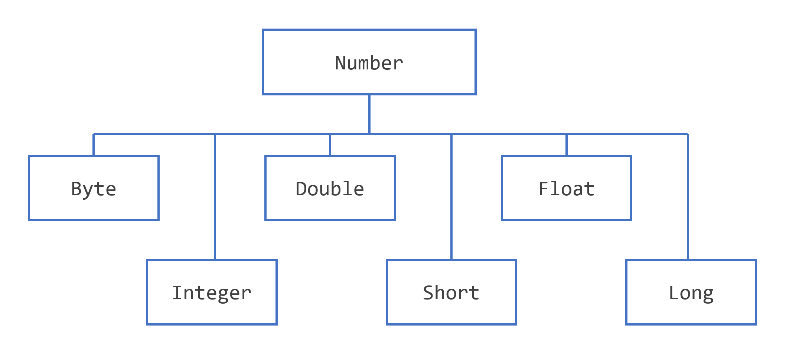

本节首先讨论包中的[`Number`](https://docs.oracle.com/en/java/javase/17/docs/api/java.base/java/lang/Number.html)类[`java.lang`](https://docs.oracle.com/en/java/javase/17/docs/api/java.base/java/lang/package-summary.html)、它的子类，以及您将使用这些类的实例化而不是原始数字类型的情况。

本节还介绍了[`PrintStream`](https://docs.oracle.com/en/java/javase/17/docs/api/java.base/java/io/PrintStream.html)和[`DecimalFormat`](https://docs.oracle.com/en/java/javase/17/docs/api/java.base/java/text/DecimalFormat.html) 类，它们提供了编写格式化数字输出的方法。

最后，讨论[`Math`](https://docs.oracle.com/en/java/javase/17/docs/api/java.base/java/lang/Math.html) 类[`java.lang`](https://docs.oracle.com/en/java/javase/17/docs/api/java.base/java/lang/package-summary.html)。它包含数学函数来补充语言中内置的运算符。此类具有三角函数、指数函数等的方法。

处理数字时，大多数情况下您在代码中使用基本类型。例如：

```java
int i = 500;
float gpa = 3.65f;
byte mask = 0x7f;
```

然而，使用对象代替基本类型是有原因的，Java 平台为每种基本类型提供了包装类。这些类将基本类型“包装”在一个对象中。通常，包装是由编译器完成的——如果您在需要对象的地方使用基本类型，编译器会为您在其包装类中装箱该基本类型。类似地，如果您在需要基本数据类型使用数字对象，则编译器会为您拆箱该对象。有关更多信息，请参阅自动装箱和拆箱部分

所有数字包装类都是抽象类的子类[`Number`](https://docs.oracle.com/en/java/javase/17/docs/api/java.base/java/lang/Number.html)：



Number 类层次结构

> 注意：这里[`Number`](https://docs.oracle.com/en/java/javase/17/docs/api/java.base/java/lang/Number.html)没有讨论其他四个子类。[`BigDecimal`](https://docs.oracle.com/en/java/javase/17/docs/api/java.base/java/math/BigDecimal.html)和[`BigInteger`](https://docs.oracle.com/en/java/javase/17/docs/api/java.base/java/math/BigInteger.html)用于高精度计算。[`AtomicInteger`](https://docs.oracle.com/en/java/javase/17/docs/api/java.base/java/util/concurrent/atomic/AtomicInteger.html)和[`AtomicLong`](https://docs.oracle.com/en/java/javase/17/docs/api/java.base/java/util/concurrent/atomic/AtomicLong.html)用于多线程应用程序。

您可能使用[`Number`](https://docs.oracle.com/en/java/javase/17/docs/api/java.base/java/lang/Number.html)对象而不是基本类型的三个原因：

1. 作为期望对象的方法的参数（通常在操作数字集合时使用）。
2. 使用类定义的常量，例如[`MIN_VALUE`](https://docs.oracle.com/en/java/javase/17/docs/api/java.base/java/lang/Integer.html#MIN_VALUE)and [`MAX_VALUE`](https://docs.oracle.com/en/java/javase/17/docs/api/java.base/java/lang/Integer.html#MAX_VALUE)，提供数据类型的上限和下限。
3. 使用类方法将值与其他基本类型相互转换，与字符串相互转换，以及在数字系统（十进制、八进制、十六进制、二进制）之间进行转换。

下表列出了 Number 类的所有子类实现的实例方法。

以下方法将此[`Number`](https://docs.oracle.com/en/java/javase/17/docs/api/java.base/java/lang/Number.html)对象的值转换为返回的原始数据类型。

- [`byte byteValue()`](https://docs.oracle.com/en/java/javase/17/docs/api/java.base/java/lang/Integer.html#byteValue())
- [`short shortValue()`](https://docs.oracle.com/en/java/javase/17/docs/api/java.base/java/lang/Integer.html#shortValue())
- [`int intValue()`](https://docs.oracle.com/en/java/javase/17/docs/api/java.base/java/lang/Integer.html#intValue())
- [`long longValue()`](https://docs.oracle.com/en/java/javase/17/docs/api/java.base/java/lang/Integer.html#longValue())
- [`float floatValue()`](https://docs.oracle.com/en/java/javase/17/docs/api/java.base/java/lang/Integer.html#floatValue())
- [`double doubleValue()`](https://docs.oracle.com/en/java/javase/17/docs/api/java.base/java/lang/Integer.html#doubleValue())

以下方法将此[`Number`](https://docs.oracle.com/en/java/javase/17/docs/api/java.base/java/lang/Number.html)对象与参数进行比较。

- [`int compareTo(Byte anotherByte)`](https://docs.oracle.com/en/java/javase/17/docs/api/java.base/java/lang/Byte.html#compareTo(java.lang.Byte))
- [`int compareTo(Double anotherDouble)`](https://docs.oracle.com/en/java/javase/17/docs/api/java.base/java/lang/Double.html#compareTo(java.lang.Double))
- [`int compareTo(Float anotherFloat)`](https://docs.oracle.com/en/java/javase/17/docs/api/java.base/java/lang/Float.html#compareTo(java.lang.Float))
- [`int compareTo(Integer anotherInteger)`](https://docs.oracle.com/en/java/javase/17/docs/api/java.base/java/lang/Integer.html#compareTo(java.lang.Integer))
- [`int compareTo(Long anotherLong)`](https://docs.oracle.com/en/java/javase/17/docs/api/java.base/java/lang/Long.html#compareTo(java.lang.Long))
- [`int compareTo(Short anotherShort)`](https://docs.oracle.com/en/java/javase/17/docs/api/java.base/java/lang/Short.html#compareTo(java.lang.Short))
- [`boolean equals(Object obj)`](https://docs.oracle.com/en/java/javase/17/docs/api/java.base/java/lang/Integer.html#equals(java.lang.Object))

该方法`equals(Object obj)`确定此数字对象是否等于参数。如果参数不是`null`并且是相同类型和相同数值的对象，则这些方法返回`true`。 Java API 文档中描述了对[`Double`](https://docs.oracle.com/en/java/javase/17/docs/api/java.base/java/lang/Double.html)和[`Float`](https://docs.oracle.com/en/java/javase/17/docs/api/java.base/java/lang/Float.html)对象的一些额外要求。

每个[`Number`](https://docs.oracle.com/en/java/javase/17/docs/api/java.base/java/lang/Number.html)类都包含其他方法，这些方法可用于在数字与字符串之间进行转换以及在数字系统之间进行转换。下表列出了[`Integer`](https://docs.oracle.com/en/java/javase/17/docs/api/java.base/java/lang/Integer.html)类中的这些方法。其他[`Number`](https://docs.oracle.com/en/java/javase/17/docs/api/java.base/java/lang/Number.html)子类的方法类似：

| 方法                                                         | 描述                                                         |
| ------------------------------------------------------------ | ------------------------------------------------------------ |
| [`static Integer decode(String s)`](https://docs.oracle.com/en/java/javase/17/docs/api/java.base/java/lang/Integer.html#decode(java.lang.String)) | 将字符串解码为整数。可以接受十进制、八进制或十六进制数字的字符串表示形式作为输入。 |
| [`static int parseInt(String s)`](https://docs.oracle.com/en/java/javase/17/docs/api/java.base/java/lang/Integer.html#parseInt(java.lang.String)) | 返回一个整数（仅限十进制）。                                 |
| [`static int parseInt(String s, int radix)`](https://docs.oracle.com/en/java/javase/17/docs/api/java.base/java/lang/Integer.html#parseInt(java.lang.String,int)) | 返回一个整数，给定十进制、二进制、八进制或十六进制（基数分别等于 10、2、8 或 16）数字的字符串表示作为输入。 |
| [`static toString()`](https://docs.oracle.com/en/java/javase/17/docs/api/java.base/java/lang/Integer.html#toString()) | 返回一个[`String`](https://docs.oracle.com/en/java/javase/17/docs/api/java.base/java/lang/String.html)表示 this 值的对象[`Integer`](https://docs.oracle.com/en/java/javase/17/docs/api/java.base/java/lang/Integer.html)。 |
| [`static String toString(int i)`](https://docs.oracle.com/en/java/javase/17/docs/api/java.base/java/lang/Integer.html#toString(int)) | 返回[`String`](https://docs.oracle.com/en/java/javase/17/docs/api/java.base/java/lang/String.html)表示指定整数的对象。 |
| [`static Integer valueOf(int i)`](https://docs.oracle.com/en/java/javase/17/docs/api/java.base/java/lang/Integer.html#valueOf(int)) | 返回一个[`Integer`](https://docs.oracle.com/en/java/javase/17/docs/api/java.base/java/lang/Integer.html)保存指定基本类型值的对象。 |
| [`static Integer valueOf(String s)`](https://docs.oracle.com/en/java/javase/17/docs/api/java.base/java/lang/Integer.html#valueOf(java.lang.String)) | 返回一个[`Integer`](https://docs.oracle.com/en/java/javase/17/docs/api/java.base/java/lang/Integer.html)包含指定字符串表示值的对象。 |
| [`static Integer valueOf(String s, int radix)`](https://docs.oracle.com/en/java/javase/17/docs/api/java.base/java/lang/Integer.html#valueOf(java.lang.String,int)) | 返回一个[`Integer`](https://docs.oracle.com/en/java/javase/17/docs/api/java.base/java/lang/Integer.html)对象，该对象包含指定字符串表示的整数值，使用 radix 的值进行解析。例如，如果 s = "333" 且基数 = 8，则该方法返回与八进制数 333 等效的以十为底的整数。 |

 

## 格式化数字打印输出

之前您看到了使用[`print`](https://docs.oracle.com/en/java/javase/17/docs/api/java.base/java/io/PrintStream.html#print(int))和[`println`](https://docs.oracle.com/en/java/javase/17/docs/api/java.base/java/io/PrintStream.html#println(int))方法将字符串打印到标准输出 ( [`System.out`](https://docs.oracle.com/en/java/javase/17/docs/api/java.base/java/lang/System.html#out))。由于所有数字都可以转换为字符串，因此您可以使用这些方法打印出字符串和数字的任意组合。但是，Java 编程语言还有其他方法，允许您在包含数字时对打印输出进行更多控制。

### Printf 和 Format 方法

该[`java.io`](https://docs.oracle.com/en/java/javase/17/docs/api/java.base/java/io/package-summary.html)包包含一个[`PrintStream`](https://docs.oracle.com/en/java/javase/17/docs/api/java.base/java/io/PrintStream.html)具有两种格式化方法的类，可用于替换[`print`](https://docs.oracle.com/en/java/javase/17/docs/api/java.base/java/io/PrintStream.html#print(int))和[`println`](https://docs.oracle.com/en/java/javase/17/docs/api/java.base/java/io/PrintStream.html#println(int))。这些方法[`format`](https://docs.oracle.com/en/java/javase/17/docs/api/java.base/java/io/PrintStream.html#format(java.lang.String,java.lang.Object...))和[`printf`](https://docs.oracle.com/en/java/javase/17/docs/api/java.base/java/io/PrintStream.html#printf(java.lang.String,java.lang.Object...))彼此等效。您一直在使用的[`System.out`](https://docs.oracle.com/en/java/javase/17/docs/api/java.base/java/lang/System.html#out)恰好是[`PrintStream`](https://docs.oracle.com/en/java/javase/17/docs/api/java.base/java/io/PrintStream.html)对象，因此您可以在[`PrintStream`](https://docs.oracle.com/en/java/javase/17/docs/api/java.base/java/io/PrintStream.html) 上调用方法[`System.out`](https://docs.oracle.com/en/java/javase/17/docs/api/java.base/java/lang/System.html#out)。因此，你可以使用[`format`](https://docs.oracle.com/en/java/javase/17/docs/api/java.base/java/io/PrintStream.html#format(java.lang.String,java.lang.Object...))或[`printf`](https://docs.oracle.com/en/java/javase/17/docs/api/java.base/java/io/PrintStream.html#printf(java.lang.String,java.lang.Object...))在你的代码，你以前使用过的任何地方[`print`](https://docs.oracle.com/en/java/javase/17/docs/api/java.base/java/io/PrintStream.html#print(int))或[`println`](https://docs.oracle.com/en/java/javase/17/docs/api/java.base/java/io/PrintStream.html#println(int))。例如，

```java
System.out.format(.....);
```

这两种[`java.io.PrintStream`](https://dev.java/learn/numbers/[`PrintStream`](https://docs.oracle.com/en/java/javase/17/docs/api/java.base/java/io/PrintStream.html))方法的语法是相同的：

```java
public PrintStream format(String format, Object... args)
```

其中[`format`](https://docs.oracle.com/en/java/javase/17/docs/api/java.base/java/io/PrintStream.html#format(java.lang.String,java.lang.Object...))是指定要使用的格式的字符串， args 是要使用该格式打印的变量列表。一个简单的例子是

```java
System.out.format("The value of " + "the float variable is " +
     "%f, while the value of the " + "integer variable is %d, " +
     "and the string is %s", floatVar, intVar, stringVar); 
```


第一个参数[`format`](https://docs.oracle.com/en/java/javase/17/docs/api/java.base/java/io/PrintStream.html#format(java.lang.String,java.lang.Object...))是一个格式字符串，指定如何`args`格式化第二个参数 中的对象。该[`format`](https://docs.oracle.com/en/java/javase/17/docs/api/java.base/java/io/PrintStream.html#format(java.lang.String,java.lang.Object...))字符串包含纯文本和格式说明符，它们是格式化`Object...`args参数的特殊字符。（符号`Object...`args 称为*varargs*，这意味着参数的数量可能会有所不同。）

格式说明符以百分号 ( `%`)开头并以转换器结尾。转换器是一个字符，指示要格式化的参数类型。在百分号 ( `%`) 和转换器之间，您可以有可选的标志和说明符。有许多转换器、标志和说明符，它们在[`java.util.Formatter`](https://docs.oracle.com/en/java/javase/17/docs/api/java.base/java/util/Formatter.html).

这是一个基本示例：

```java
int i = 461012;
System.out.format("The value of i is: %d%n", i)
```


`%d`指定单个可变结构是十进制整数玻璃。该`%n`是一个独立于平台的换行符。输出是：

```shell
The value of i is: 461012
```


该[`printf`](https://docs.oracle.com/en/java/javase/17/docs/api/java.base/java/io/PrintStream.html#printf(java.lang.String,java.lang.Object...))和[`format`](https://docs.oracle.com/en/java/javase/17/docs/api/java.base/java/io/PrintStream.html#format(java.lang.String,java.lang.Object...))方法被重载。每个都有一个具有以下语法的版本：

```java
public PrintStream format(Locale l, String format, Object... args)
```


例如，要打印法语系统中的数字（在浮点数的英文表示中使用逗号代替小数位），您可以使用：

```java
System.out.format(Locale.FRANCE,
    "The value of the float " + "variable is %f, while the " +
    "value of the integer variable " + "is %d, and the string is %s%n", 
    floatVar, intVar, stringVar);
```


### 例子

下表列出了在该表后面的示例程序 中使用的一些转换器和标志`TestFormat.java`。

| **Converter** | **Flag** | 解释                                                         |
| ------------- | -------- | ------------------------------------------------------------ |
| d             |          | 一个十进制整数。                                             |
| F             |          | 一个浮动。                                                   |
| n             |          | 适合运行应用程序的平台的换行符。您应该始终使用`%n`, 而不是`\n`。 |
| tB            |          | 日期和时间转换——特定于语言环境的月份全名。                   |
| td, te        |          | 日期和时间转换——每月的 2 位数字。td 根据需要有前导零，te 没有。 |
| TY, TY        |          | 日期和时间转换——ty = 2 位数年份，tY = 4 位数年份。           |
| tl            |          | 日期和时间转换——12 小时制中的小时。                          |
| tM            |          | 日期和时间转换——2 位数的分钟，必要时带前导零。               |
| tp            |          | 日期和时间转换——特定于语言环境的 am/pm（小写）。             |
| tm            |          | 日期和时间转换——以 2 位数字表示的月份，必要时带前导零。      |
| tD            |          | 日期和时间转换——日期为 %tm%td%ty                             |
|               | 08       | 宽度为八个字符，必要时带有前导零。                           |
|               | +        | 包括符号，无论是正的还是负的。                               |
|               | ,        | 包括特定于语言环境的分组字符。                               |
|               | -        | 左对齐。                                                     |
|               | .3       | 小数点后三位。                                               |
|               | 10.3     | 十个字符，右对齐，小数点后三位。                             |

以下程序显示了您可以使用 format 进行的一些格式化。输出显示在嵌入注释中的双引号内：

```java
import java.util.Calendar;
import java.util.Locale;

public class TestFormat {
    
    public static void main(String[] args) {
      long n = 461012;
      System.out.format("%d%n", n);      //  -->  "461012"
      System.out.format("%08d%n", n);    //  -->  "00461012"
      System.out.format("%+8d%n", n);    //  -->  " +461012"
      System.out.format("%,8d%n", n);    // -->  " 461,012"
      System.out.format("%+,8d%n%n", n); //  -->  "+461,012"
      
      double pi = Math.PI;

      System.out.format("%f%n", pi);       // -->  "3.141593"
      System.out.format("%.3f%n", pi);     // -->  "3.142"
      System.out.format("%10.3f%n", pi);   // -->  "     3.142"
      System.out.format("%-10.3f%n", pi);  // -->  "3.142"
      System.out.format(Locale.FRANCE,
                        "%-10.4f%n%n", pi); // -->  "3,1416"

      Calendar c = Calendar.getInstance();
      System.out.format("%tB %te, %tY%n", c, c, c); // -->  "May 29, 2006"

      System.out.format("%tl:%tM %tp%n", c, c, c);  // -->  "2:34 am"

      System.out.format("%tD%n", c);    // -->  "05/29/06"
    }
}
```


> 注意：本节中的讨论仅涵盖[`format`](https://docs.oracle.com/en/java/javase/17/docs/api/java.base/java/io/PrintStream.html#format(java.lang.String,java.lang.Object...))和[`printf`](https://docs.oracle.com/en/java/javase/17/docs/api/java.base/java/io/PrintStream.html#printf(java.lang.String,java.lang.Object...))方法的基础知识。可以在本教程的“基本 I/O”部分的“格式化”页面中找到更多详细信息。中介绍了使用[`String.format()`](https://docs.oracle.com/en/java/javase/17/docs/api/java.base/java/lang/String.html#format(java.lang.String,java.lang.Object...))来创建字符串[`Strings`](https://dev.java/learn/strings/)。

 

## DecimalFormat 类

您可以使用[`java.text.DecimalFormat`](https://docs.oracle.com/en/java/javase/17/docs/api/java.base/java/text/DecimalFormat.html)该类来控制前导和尾随零、前缀和后缀、分组（千）分隔符和小数分隔符的显示。[`DecimalFormat`](https://docs.oracle.com/en/java/javase/17/docs/api/java.base/java/text/DecimalFormat.html)在数字格式方面提供了很大的灵活性，但它会使您的代码更加复杂。

下面的示例通过将模式字符串传递给构造函数来创建[`DecimalFormat`](https://docs.oracle.com/en/java/javase/17/docs/api/java.base/java/text/DecimalFormat.html)对象。该方法继承自https://docs.oracle.com/en/java/javase/17/docs/api/java.base/java/text/NumberFormat.html，然后由- 它接受双值调用作为参数并以字符串形式返回格式化的数字。

这是一个示例程序，说明了使用[`DecimalFormat`](https://docs.oracle.com/en/java/javase/17/docs/api/java.base/java/text/DecimalFormat.html)：

```java
import java.text.*;

public class DecimalFormatDemo {

   static public void customFormat(String pattern, double value ) {
      DecimalFormat myFormatter = new DecimalFormat(pattern);
      String output = myFormatter.format(value);
      System.out.println(value + "  " + pattern + "  " + output);
   }

   static public void main(String[] args) {

      customFormat("###,###.###", 123456.789);
      customFormat("###.##", 123456.789);
      customFormat("000000.000", 123.78);
      customFormat("$###,###.###", 12345.67);  
   }
}
```


输出是：

```shell
123456.789  ###,###.###  123,456.789
123456.789  ###.##  123456.79
123.78  000000.000  000123.780
12345.67  $###,###.###  $12,345.67
```


下表解释了每一行输出。

| Value      | **Pattern**  | 输出           | 解释                                                         |
| ---------- | ------------ | -------------- | ------------------------------------------------------------ |
| 123456.789 | ###,###.###  | 123,456.789    | 井号 ( `#`) 表示数字，逗号是分组分隔符的占位符，句点是小数分隔符的占位符。 |
| 123456.789 | ###.##       | 123456.79      | 该值在小数点右边有三位数字，但模式只有两位。 format方法通过舍入来处理这个问题。 |
| 123.78     | 000000.000   | 000123.780     | 该模式指定了开头和结尾的零，因为使用的是0字符而不是#。       |
| 12345.67   | $###,###.### | 12,345.67 美元 | 模式中的第一个字符是美元符号($)。 注意，它紧跟在格式化输出中最左边的数字之前。 |

 

## 除了基本算术

Java编程语言支持基本算术运算符：`+`，`-`，`*`，`/`，和`%`。[`java.lang`](https://docs.oracle.com/en/java/javase/17/docs/api/java.base/java/lang/package-summary.html)包中的[`Math`](https://docs.oracle.com/en/java/javase/17/docs/api/java.base/java/lang/Math.html)类提供了进行更高级数学计算的方法和常量。

[`Math`](https://docs.oracle.com/en/java/javase/17/docs/api/java.base/java/lang/Math.html)类中的方法都是静态的，所以你直接从类中调用它们，像这样：

```java
Math.cos(angle);
```


> 注意:使用静态导入语言特性，你不必在每个数学函数前面写Math: 这允许您通过简单的名称调用Math类方法。 例如:*cos(angle)*;  

### 常量和基本方法

本[`Math`](https://docs.oracle.com/en/java/javase/17/docs/api/java.base/java/lang/Math.html)类包括两个常量：

- [`Math.E`](https://docs.oracle.com/en/java/javase/17/docs/api/java.base/java/lang/Math.html#E)，这是自然对数的底，和
- [`Math.PI`](https://docs.oracle.com/en/java/javase/17/docs/api/java.base/java/lang/Math.html#PI)，它是圆的周长与其直径的比值。

本[`Math`](https://docs.oracle.com/en/java/javase/17/docs/api/java.base/java/lang/Math.html)类还包括超过40种静态方法。下表列出了一些基本方法。

#### 计算绝对值

- [`double abs(double d)`](https://docs.oracle.com/en/java/javase/17/docs/api/java.base/java/lang/Math.html#abs(double))
- [`float abs(float f)`](https://docs.oracle.com/en/java/javase/17/docs/api/java.base/java/lang/Math.html#abs(float))
- [`int abs(int i)`](https://docs.oracle.com/en/java/javase/17/docs/api/java.base/java/lang/Math.html#abs(int))
- [`long abs(long lng)`](https://docs.oracle.com/en/java/javase/17/docs/api/java.base/java/lang/Math.html#abs(long))

#### 约等于一个值

- [`double ceil(double d)`](https://docs.oracle.com/en/java/javase/17/docs/api/java.base/java/lang/Math.html#ceil(double))：返回大于或等于参数的最小整数。作为`double`.
- [`double floor(double d)`](https://docs.oracle.com/en/java/javase/17/docs/api/java.base/java/lang/Math.html#floor(double))：返回小于或等于参数的最大整数。作为`double`.
- [`double rint(double d)`](https://docs.oracle.com/en/java/javase/17/docs/api/java.base/java/lang/Math.html#rint(double)): 返回值最接近参数的整数。作为`double`.
- [`long round(double d)`](https://docs.oracle.com/en/java/javase/17/docs/api/java.base/java/lang/Math.html#round(double))and [`int round(float f)`](https://docs.oracle.com/en/java/javase/17/docs/api/java.base/java/lang/Math.html#round(float))：返回与参数最接近的`long`or `int`，如方法的返回类型所示。

#### 计算最小值

- [`double min(double arg1, double arg2)`](https://docs.oracle.com/en/java/javase/17/docs/api/java.base/java/lang/Math.html#min(double,double))
- [`float min(float arg1, float arg2)`](https://docs.oracle.com/en/java/javase/17/docs/api/java.base/java/lang/Math.html#min(float,float))
- [`int min(int arg1, int arg2)`](https://docs.oracle.com/en/java/javase/17/docs/api/java.base/java/lang/Math.html#min(int,int))
- [`long min(long arg1, long arg2)`](https://docs.oracle.com/en/java/javase/17/docs/api/java.base/java/lang/Math.html#min(long,long))

#### 计算最大值

- [`double max(double arg1, double arg2)`](https://docs.oracle.com/en/java/javase/17/docs/api/java.base/java/lang/Math.html#max(double,double))
- [`float max(float arg1, float arg2)`](https://docs.oracle.com/en/java/javase/17/docs/api/java.base/java/lang/Math.html#max(float,float))
- [`int max(int arg1, int arg2)`](https://docs.oracle.com/en/java/javase/17/docs/api/java.base/java/lang/Math.html#max(int,int))
- [`long max(long arg1, long arg2)`](https://docs.oracle.com/en/java/javase/17/docs/api/java.base/java/lang/Math.html#max(long,long))

以下程序`BasicMathDemo`说明了如何使用其中一些方法：

```java
public class BasicMathDemo {
    public static void main(String[] args) {
        double a = -191.635;
        double b = 43.74;
        int c = 16, d = 45;

        System.out.printf("The absolute value " + "of %.3f is %.3f%n", 
                          a, Math.abs(a));

        System.out.printf("The ceiling of " + "%.2f is %.0f%n", 
                          b, Math.ceil(b));

        System.out.printf("The floor of " + "%.2f is %.0f%n", 
                          b, Math.floor(b));

        System.out.printf("The rint of %.2f " + "is %.0f%n", 
                          b, Math.rint(b));

        System.out.printf("The max of %d and " + "%d is %d%n",
                          c, d, Math.max(c, d));

        System.out.printf("The min of of %d " + "and %d is %d%n",
                          c, d, Math.min(c, d));
    }
}
```


这是这个程序的输出：

```shell
The absolute value of -191.635 is 191.635
The ceiling of 43.74 is 44
The floor of 43.74 is 43
The rint of 43.74 is 44
The max of 16 and 45 is 45
The min of 16 and 45 is 16
```


### 指数和对数方法

下表列出了[`Math`](https://docs.oracle.com/en/java/javase/17/docs/api/java.base/java/lang/Math.html)该类的指数和对数方法。

- [`double exp(double d)`](https://docs.oracle.com/en/java/javase/17/docs/api/java.base/java/lang/Math.html#exp(double))：返回自然对数的底数 e 的参数幂。
- [`double log(double d)`](https://docs.oracle.com/en/java/javase/17/docs/api/java.base/java/lang/Math.html#log(double))：返回参数的自然对数。
- [`double pow(double base, double exponent)`](https://docs.oracle.com/en/java/javase/17/docs/api/java.base/java/lang/Math.html#pow(double,double)): 返回第一个参数的第二个参数的幂的值。
- [`double sqrt(double d)`](https://docs.oracle.com/en/java/javase/17/docs/api/java.base/java/lang/Math.html#sqrt(double)): 返回参数的平方根。

下面的程序`ExponentialDemo`显示 的值`e`，然后对任意选择的数字调用上表中列出的每个方法：

```java
public class ExponentialDemo {
    public static void main(String[] args) {
        double x = 11.635;
        double y = 2.76;

        System.out.printf("The value of " + "e is %.4f%n",
                          Math.E);

        System.out.printf("exp(%.3f) " + "is %.3f%n",
                          x, Math.exp(x));

        System.out.printf("log(%.3f) is " + "%.3f%n",
                          x, Math.log(x));

        System.out.printf("pow(%.3f, %.3f) " + "is %.3f%n",
                          x, y, Math.pow(x, y));

        System.out.printf("sqrt(%.3f) is " + "%.3f%n",
                          x, Math.sqrt(x));
    }
}
```


这是您运行时将看到的输出`ExponentialDemo`：

```shell
The value of e is 2.7183
exp(11.635) is 112983.831
log(11.635) is 2.454
pow(11.635, 2.760) is 874.008
sqrt(11.635) is 3.411
```


### 三角方法

该[`Math`](https://docs.oracle.com/en/java/javase/17/docs/api/java.base/java/lang/Math.html)类还提供了三角函数，总结下表中的集合。传递给这些方法中的每一个的值是以弧度表示的角度。您可以使用该[`toRadians(double d)`](https://docs.oracle.com/en/java/javase/17/docs/api/java.base/java/lang/Math.html#toRadians(double))方法将度数转换为弧度。

- [`double sin(double d)`](https://docs.oracle.com/en/java/javase/17/docs/api/java.base/java/lang/Math.html#sin(double))：返回指定双精度值的正弦值。
- [`double cos(double d)`](https://docs.oracle.com/en/java/javase/17/docs/api/java.base/java/lang/Math.html#cos(double))：返回指定双精度值的余弦。
- [`double tan(double d)`](https://docs.oracle.com/en/java/javase/17/docs/api/java.base/java/lang/Math.html#tan(double)): 返回指定双精度值的切线。
- [`double asin(double d)`](https://docs.oracle.com/en/java/javase/17/docs/api/java.base/java/lang/Math.html#asin(double))：返回指定双精度值的反正弦。
- [`double acos(double d)`](https://docs.oracle.com/en/java/javase/17/docs/api/java.base/java/lang/Math.html#acos(double))：返回指定双精度值的反余弦值。
- [`double atan(double d)`](https://docs.oracle.com/en/java/javase/17/docs/api/java.base/java/lang/Math.html#atan(double))：返回指定双精度值的反正切值。
- [`double atan2(double y, double x)`](https://docs.oracle.com/en/java/javase/17/docs/api/java.base/java/lang/Math.html#atan2(double,double))：将直角坐标（x，y）转换为极坐标（r，theta）并返回theta。
- [`double toDegrees(double d)`](https://docs.oracle.com/en/java/javase/17/docs/api/java.base/java/lang/Math.html#toDegrees(double))and [`double toRadians(double d)`](https://docs.oracle.com/en/java/javase/17/docs/api/java.base/java/lang/Math.html#toRadians(double))：将参数转换为度数或弧度。

这是一个程序，`TrigonometricDemo`，它使用这些方法中的每一种来计算 45 度角的各种三角函数值：

```java
public class TrigonometricDemo {
    public static void main(String[] args) {
        double degrees = 45.0;
        double radians = Math.toRadians(degrees);
        
        System.out.format("The value of pi " + "is %.4f%n",
                           Math.PI);

        System.out.format("The sine of %.1f " + "degrees is %.4f%n",
                          degrees, Math.sin(radians));

        System.out.format("The cosine of %.1f " + "degrees is %.4f%n",
                          degrees, Math.cos(radians));

        System.out.format("The tangent of %.1f " + "degrees is %.4f%n",
                          degrees, Math.tan(radians));

        System.out.format("The arcsine of %.4f " + "is %.4f degrees %n", 
                          Math.sin(radians), 
                          Math.toDegrees(Math.asin(Math.sin(radians))));

        System.out.format("The arccosine of %.4f " + "is %.4f degrees %n", 
                          Math.cos(radians),  
                          Math.toDegrees(Math.acos(Math.cos(radians))));

        System.out.format("The arctangent of %.4f " + "is %.4f degrees %n", 
                          Math.tan(radians), 
                          Math.toDegrees(Math.atan(Math.tan(radians))));
    }
}
```


这个程序的输出如下：

```shell
The value of pi is 3.1416
The sine of 45.0 degrees is 0.7071
The cosine of 45.0 degrees is 0.7071
The tangent of 45.0 degrees is 1.0000
The arcsine of 0.7071 is 45.0000 degrees
The arccosine of 0.7071 is 45.0000 degrees
The arctangent of 1.0000 is 45.0000 degrees
```


 

## 随机数

该[`random()`](https://docs.oracle.com/en/java/javase/17/docs/api/java.base/java/lang/Math.html#random())方法返回一个介于 0.0 和 1.0 之间的伪随机选择的数字。范围包括 0.0 但不包括 1.0。换句话说：`0.0 <= Math.random() < 1.0`。要获得不同范围内的数字，您可以对随机方法返回的值执行算术运算。例如，要生成 0 到 9 之间的整数，您可以这样写：

```java
int number = (int)(Math.random() * 10);
```


通过将该值乘以 10，可能值的范围变为`0.0 <= number < 10.0`。

[`Math.random`](https://dev.java/learn/numbers/(https://docs.oracle.com/en/java/javase/17/docs/api/java.base/java/lang/Math.html#random()))当您需要生成单个随机数时，使用效果很好。如果您需要生成一系列随机数，您应该创建一个实例[`java.util.Random`](https://docs.oracle.com/en/java/javase/17/docs/api/java.base/java/util/Random.html)并调用该对象的方法来生成数字。