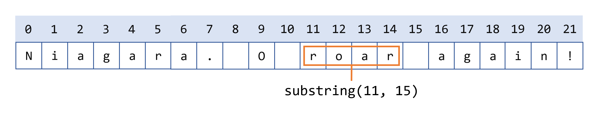

## 创建字符串

字符串在Java编程中被广泛使用，它是一个字符序列。 在Java编程语言中，字符串是对象。

Java 平台提供了创建和操作字符串的[`String`](https://docs.oracle.com/en/java/javase/17/docs/api/java.base/java/lang/String.html)类。

创建字符串最直接的方法是这样写：

```java
String greeting = "Hello world!";
```


在本例中，“Hello world!”是一个字符串字面量——代码中用双引号括起来的一系列字符。 每当它在你的代码中遇到一个字符串字面值时，编译器就会用它的值创建一个string对象——在本例中是Hello world!  

与任何其他对象一样，您可以使用new关键字和构造函数创建String对象。 String类有13个构造函数，允许你使用不同的来源来提供String的初始值，比如字符数组:  

```java
char[] helloArray = { 'h', 'e', 'l', 'l', 'o', '.' };
String helloString = new String(helloArray);
System.out.println(helloString);
```

此代码片段的最后一行显示`hello`。

> 注意:String类是不可变的，因此一旦创建，String对象就不能更改。 String类有许多方法，下面将讨论其中一些方法，它们似乎可以修改字符串。 因为字符串是不可变的，所以这些方法真正做的是创建并返回一个包含操作结果的新字符串。  

## 字符串长度

用于获取对象信息的方法称为访问器方法。可以与字符串一起使用的一种访问器方法是[`length()`](https://docs.oracle.com/en/java/javase/17/docs/api/java.base/java/lang/String.html#length())方法，它返回字符串对象中包含的字符数。执行以下两行代码后，`len`等于 17：

```java
String palindrome = "Dot saw I was Tod";
int len = palindrome.length();
```

一个*回文*是一个对称的词或句子，前后拼写相同，忽略大小写和标点符号。这是一个简短且低效的程序来反转回文字符串。它调用[`String`](https://docs.oracle.com/en/java/javase/17/docs/api/java.base/java/lang/String.html)方法[`charAt(i)`](https://docs.oracle.com/en/java/javase/17/docs/api/java.base/java/lang/String.html#charAt(int))，该方法返回字符串中的*第**i个*字符，从 0 开始计数。

```java
public class StringDemo {
    public static void main(String[] args) {
        String palindrome = "Dot saw I was Tod";
        int len = palindrome.length();
        char[] tempCharArray = new char[len];
        char[] charArray = new char[len];
        
        // put original string in an 
        // array of chars
        for (int i = 0; i < len; i++) {
            tempCharArray[i] = 
                palindrome.charAt(i);
        } 
        
        // reverse array of chars
        for (int j = 0; j < len; j++) {
            charArray[j] =
                tempCharArray[len - 1 - j];
        }
        
        String reversePalindrome =
            new String(charArray);
        System.out.println(reversePalindrome);
    }
}
```

运行程序会产生以下输出：

```shell
doT saw I was toD
```

为了完成字符串反转，程序必须将字符串转换为字符数组（第一次`for`循环），将数组反转为第二个数组（第二次`for`循环），然后再转换回字符串。所述[`String`](https://docs.oracle.com/en/java/javase/17/docs/api/java.base/java/lang/String.html)类包括一种方法，[`getChars()`](https://docs.oracle.com/en/java/javase/17/docs/api/java.base/java/lang/String.html#getChars(int,int,char[],int))涉及一种串或串的一部分，转换为字符数组，所以我们可以代替第一个for循环在上述与节目

```java
palindrome.getChars(0, len, tempCharArray, 0);
```


## 连接字符串

所述[`String`](https://docs.oracle.com/en/java/javase/17/docs/api/java.base/java/lang/String.html)类包括用于连接两个字符串的方法：

```java
string1.concat(string2); 
```

这将返回一个新的字符串，它是`string1`用`string2`在最后添加进去。

您还可以将该[`concat()`](https://docs.oracle.com/en/java/javase/17/docs/api/java.base/java/lang/String.html#concat(java.lang.String))方法与字符串文字一起使用，如下所示：

```java
"My name is ".concat("Rumplestiltskin");
```

字符串更常与`+`运算符连接，如

```java
"Hello," + " world" + "!"
```

结果

```java
"Hello, world!"
```

`+`运算符广泛用于打印语句。例如：

```java
String string1 = "saw I was ";
System.out.println("Dot " + string1 + "Tod");
```

打印

```shell
Dot saw I was Tod
```

这样的连接可以是任何对象的混合。 对于每个不是String的对象，调用它的toString()方法将其转换为String。  

> 注意:在Java SE 15之前，Java编程语言不允许字面值字符串在源文件中跨行，因此必须在多行字符串的每一行的末尾使用+连接操作符。 例如:  

```java
String quote = 
    "Now is the time for all good " +
    "men to come to the aid of their country.";
```

使用`+`连接运算符在行之间断开字符串再次在`print`语句中非常常见。

从 Java SE 15 开始，您可以编写二维字符串文字：

```java
String html = """
              <html>
                  <body>
                      <p>Hello, world</p>
                  </body>
              </html>
              """;
```

## 创建格式字符串

您已经看到使用[`printf()`](https://docs.oracle.com/en/java/javase/17/docs/api/java.base/java/io/PrintStream.html#printf(java.lang.String,java.lang.Object...))和[`format()`](https://docs.oracle.com/en/java/javase/17/docs/api/java.base/java/io/PrintStream.html#format(java.lang.String,java.lang.Object...))方法打印带格式化数字的输出。所述[`String`](https://docs.oracle.com/en/java/javase/17/docs/api/java.base/java/lang/String.html)类具有等效类方法，[`format()`](https://docs.oracle.com/en/java/javase/17/docs/api/java.base/java/lang/String.html#format(java.lang.String,java.lang.Object...))即返回一个[`String`](https://docs.oracle.com/en/java/javase/17/docs/api/java.base/java/lang/String.html)对象，而不是一个[`PrintStream`](https://docs.oracle.com/en/java/javase/17/docs/api/java.base/java/io/PrintStream.html)对象。

Using[`String`](https://docs.oracle.com/en/java/javase/17/docs/api/java.base/java/lang/String.html)的静态[`format()`](https://docs.oracle.com/en/java/javase/17/docs/api/java.base/java/io/PrintStream.html#format(java.lang.String,java.lang.Object...))方法允许您创建一个可以重用的格式化字符串，而不是一次性打印语句。例如，代替

```java
System.out.printf("The value of the float " +
                  "variable is %f, while " +
                  "the value of the " + 
                  "integer variable is %d, " +
                  "and the string is %s", 
                  floatVar, intVar, stringVar); 
```


你可以写

```java
String fs;
fs = String.format("The value of the float " +
                   "variable is %f, while " +
                   "the value of the " + 
                   "integer variable is %d, " +
                   " and the string is %s",
                   floatVar, intVar, stringVar);
System.out.println(fs);
```


## 将字符串转换为数字

通常，程序以字符串对象中的数字数据结束——例如，用户输入的值。

的[`Number`](https://docs.oracle.com/en/java/javase/17/docs/api/java.base/java/lang/Number.html)子类涡卷原始数值类型（[`Byte`](https://docs.oracle.com/en/java/javase/17/docs/api/java.base/java/lang/Byte.html)，[`Integer`](https://docs.oracle.com/en/java/javase/17/docs/api/java.base/java/lang/Integer.html)，[`Double`](https://docs.oracle.com/en/java/javase/17/docs/api/java.base/java/lang/Double.html)，[`Float`](https://docs.oracle.com/en/java/javase/17/docs/api/java.base/java/lang/Float.html)，[`Long`](https://docs.oracle.com/en/java/javase/17/docs/api/java.base/java/lang/Long.html)，和[`Short`](https://docs.oracle.com/en/java/javase/17/docs/api/java.base/java/lang/Short.html)），每个提供一个名为类方法[`valueOf()`](https://docs.oracle.com/en/java/javase/17/docs/api/java.base/java/lang/Integer.html#valueOf(int))，其将一字符串于该类型的一个对象。这是一个示例，`ValueOfDemo`从命令行获取两个字符串，将它们转换为数字，并对值执行算术运算：

```java
public class ValueOfDemo {
    public static void main(String[] args) {

        // this program requires two 
        // arguments on the command line 
        if (args.length == 2) {
            // convert strings to numbers
            float a = (Float.valueOf(args[0])).floatValue(); 
            float b = (Float.valueOf(args[1])).floatValue();

            // do some arithmetic
            System.out.println("a + b = " +
                               (a + b));
            System.out.println("a - b = " +
                               (a - b));
            System.out.println("a * b = " +
                               (a * b));
            System.out.println("a / b = " +
                               (a / b));
            System.out.println("a % b = " +
                               (a % b));
        } else {
            System.out.println("This program " +
                "requires two command-line arguments.");
        }
    }
}
```

以下是使用`4.5`和`87.2`命令行参数时程序的输出：

```shell
a + b = 91.7
a - b = -82.7
a * b = 392.4
a / b = 0.0516055
a % b = 4.5
```

> 注意：[`Number`](https://docs.oracle.com/en/java/javase/17/docs/api/java.base/java/lang/Number.html)包装原始数字类型的每个子类还提供了一个`parseXXXX()`方法（例如，[`parseFloat()`](https://docs.oracle.com/en/java/javase/17/docs/api/java.base/java/lang/Float.html#parseFloat(java.lang.String))），可用于将字符串转换为原始数字。由于返回的是原始类型而不是对象，因此[`parseFloat()`](https://docs.oracle.com/en/java/javase/17/docs/api/java.base/java/lang/Float.html#parseFloat(java.lang.String))方法比[`valueOf()`](https://docs.oracle.com/en/java/javase/17/docs/api/java.base/java/lang/Integer.html#valueOf(int))方法更直接。例如，在`ValueOfDemo`程序中，我们可以使用：

```java
float a = Float.parseFloat(args[0]);
float b = Float.parseFloat(args[1]);
```


## 将数字转换为字符串

有时您需要将数字转换为字符串，因为您需要对其字符串形式的值进行操作。有几种简单的方法可以将数字转换为字符串：

```java
int i;
// Concatenate "i" with an empty string; conversion is handled for you.
String s1 = "" + i;
```

或者

```java
// The valueOf class method.
String s2 = String.valueOf(i);
```

每个[`Number`](https://docs.oracle.com/en/java/javase/17/docs/api/java.base/java/lang/Number.html)子类都包含一个类方法，[`toString()`](https://docs.oracle.com/en/java/javase/17/docs/api/java.base/java/lang/Number.html#toString())，它将其原始类型转换为字符串。例如：

```java
int i;
double d;
String s3 = Integer.toString(i); 
String s4 = Double.toString(d); 
```

该`ToStringDemo`示例使用[`toString()`](https://docs.oracle.com/en/java/javase/17/docs/api/java.base/java/lang/String.html#toString())方法将数字转换为字符串。然后程序使用一些字符串方法来计算小数点前后的位数：

```java
public class ToStringDemo {
    
    public static void main(String[] args) {
        double d = 858.48;
        String s = Double.toString(d);
        
        int dot = s.indexOf('.');
        
        System.out.println(dot + " digits " +
            "before decimal point.");
        System.out.println( (s.length() - dot - 1) +
            " digits after decimal point.");
    }
}
```

这个程序的输出是：

```shell
3 digits before decimal point.
2 digits after decimal point.
```


## 通过索引获取字符和子串

String 类具有许多用于检查字符串内容、查找字符串中的字符或子字符串、更改大小写和其他任务的方法。

您可以通过调用[`charAt()`](https://docs.oracle.com/en/java/javase/17/docs/api/java.base/java/lang/String.html#charAt(int))访问器方法获取字符串中特定索引处的字符。第一个字符的索引为 0，而最后一个字符的索引为`length() - 1`。例如，以下代码获取字符串中索引 9 处的字符：

```java
String anotherPalindrome = "Niagara. O roar again!"; 
char aChar = anotherPalindrome.charAt(9);
```


索引从0开始，所以索引9处的字符是'O'，如下图所示：


字符串中的字符索引

如果要从字符串中获取多个连续字符，可以使用 substring 方法。substring 方法有两个版本：

- [`String substring(int beginIndex, int endIndex)`](https://docs.oracle.com/en/java/javase/17/docs/api/java.base/java/lang/String.html#substring(int,int)): 返回一个新的字符串，它是这个字符串的子字符串。子字符串从指定的开始`beginIndex`并扩展到索引处的字符`endIndex - 1`。
- [`String substring(int beginIndex)`](https://docs.oracle.com/en/java/javase/17/docs/api/java.base/java/lang/String.html#substring(int)): 返回一个新的字符串，它是这个字符串的子字符串。整数参数指定第一个字符的索引。这里，返回的子字符串扩展到原始字符串的末尾。

以下代码从 Niagara 回文中获取从索引 11 延伸到但不包括索引 15 的子字符串，即“roar”一词：

```java
String anotherPalindrome = "Niagara. O roar again!"; 
String roar = anotherPalindrome.substring(11, 15); 
```




从带有子字符串的字符串中提取字符

 

## 其他操作字符串的方法

以下是其他[`String`](https://docs.oracle.com/en/java/javase/17/docs/api/java.base/java/lang/String.html)几种操作字符串的方法：

- [`String[\] split(String regex)`](https://docs.oracle.com/en/java/javase/17/docs/api/java.base/java/lang/String.html#split(java.lang.String))and [`String[\] split(String regex, int limit)`](https://docs.oracle.com/en/java/javase/17/docs/api/java.base/java/lang/String.html#split(java.lang.String,int))：搜索由字符串参数（包含正则表达式）指定的匹配项，并相应地将此字符串拆分为字符串数组。可选的整数参数指定返回数组的最大大小。正则表达式包含在标题为“正则表达式”的部分中。
- [`CharSequence subSequence(int beginIndex, int endIndex)`](https://docs.oracle.com/en/java/javase/17/docs/api/java.base/java/lang/String.html#subSequence(int,int)): 返回从`beginIndex`index 到构造的新字符序列`endIndex - 1`。
- [`String trim()`](https://docs.oracle.com/en/java/javase/17/docs/api/java.base/java/lang/String.html#trim())：返回此字符串的副本，其中删除了前导和尾随空格。
- [`String toLowerCase()`](https://docs.oracle.com/en/java/javase/17/docs/api/java.base/java/lang/String.html#toLowerCase())and [`String toUpperCase()`](https://docs.oracle.com/en/java/javase/17/docs/api/java.base/java/lang/String.html#toUpperCase())：返回此字符串转换为小写或大写的副本。如果不需要转换，这些方法返回原始字符串。

 

## 搜索字符串中的字符和子字符串

以下是[`String`](https://docs.oracle.com/en/java/javase/17/docs/api/java.base/java/lang/String.html)在字符串中查找字符或子字符串的其他一些方法。的[`String`](https://docs.oracle.com/en/java/javase/17/docs/api/java.base/java/lang/String.html)类提供了返回一个特定的字符或字符串的字符串内的位置的存取方法：[`indexOf()`](https://docs.oracle.com/en/java/javase/17/docs/api/java.base/java/lang/String.html#indexOf(java.lang.String))和[`lastIndexOf()`](https://docs.oracle.com/en/java/javase/17/docs/api/java.base/java/lang/String.html#lastIndexOf(java.lang.String))。该[`indexOf()`](https://docs.oracle.com/en/java/javase/17/docs/api/java.base/java/lang/String.html#indexOf(java.lang.String))方法从字符串的开头向前搜索，和[`lastIndexOf()`](https://docs.oracle.com/en/java/javase/17/docs/api/java.base/java/lang/String.html#lastIndexOf(java.lang.String))方法从字符串的结尾向后搜索。如果找不到字符或字符串，[`indexOf()`](https://docs.oracle.com/en/java/javase/17/docs/api/java.base/java/lang/String.html#indexOf(java.lang.String))并[`lastIndexOf()`](https://docs.oracle.com/en/java/javase/17/docs/api/java.base/java/lang/String.html#lastIndexOf(java.lang.String))返回-1。

该[`String`](https://docs.oracle.com/en/java/javase/17/docs/api/java.base/java/lang/String.html)级还提供了一个搜索方法，包含，即返回`true`如果字符串包含特定字符序列。当您只需要知道字符串包含一个字符序列，而精确位置并不重要时，请使用此方法。

搜索方法如下：

- [`int indexOf(int ch)`](https://docs.oracle.com/en/java/javase/17/docs/api/java.base/java/lang/String.html#indexOf(int))and [`int lastIndexOf(int ch)`](https://docs.oracle.com/en/java/javase/17/docs/api/java.base/java/lang/String.html#lastIndexOf(int))：返回指定字符第一次（最后一次）出现的索引。
- [`int indexOf(int ch, int fromIndex)`](https://docs.oracle.com/en/java/javase/17/docs/api/java.base/java/lang/String.html#indexOf(int,int))and [`int lastIndexOf(int ch, int fromIndex)`](https://docs.oracle.com/en/java/javase/17/docs/api/java.base/java/lang/String.html#lastIndexOf(int,int))：返回指定字符第一次（最后一次）出现的索引，从指定索引向前（向后）搜索。
- [`int indexOf(String str)`](https://docs.oracle.com/en/java/javase/17/docs/api/java.base/java/lang/String.html#indexOf(java.lang.String))and [`int lastIndexOf(String str)`](https://docs.oracle.com/en/java/javase/17/docs/api/java.base/java/lang/String.html#lastIndexOf(java.lang.String))：返回指定子字符串第一次（最后一次）出现的索引。
- [`int indexOf(String str, int fromIndex)`](https://docs.oracle.com/en/java/javase/17/docs/api/java.base/java/lang/String.html#indexOf(java.lang.String,int))and [`int lastIndexOf(String str, int fromIndex)`](https://docs.oracle.com/en/java/javase/17/docs/api/java.base/java/lang/String.html#lastIndexOf(java.lang.String,int))：返回指定子字符串第一次（最后一次）出现的索引，从指定索引向前（向后）搜索。
- [`boolean contains(CharSequence s)`](https://docs.oracle.com/en/java/javase/17/docs/api/java.base/java/lang/String.html#contains(java.lang.CharSequence)): 返回`true`字符串是否包含指定的字符序列。

> 注意：[`CharSequence`](https://docs.oracle.com/en/java/javase/17/docs/api/java.base/java/lang/CharSequence.html)是[`String`](https://docs.oracle.com/en/java/javase/17/docs/api/java.base/java/lang/String.html)类实现的接口。因此，您可以使用字符串作为该[`contains()`](https://docs.oracle.com/en/java/javase/17/docs/api/java.base/java/lang/String.html#contains(java.lang.CharSequence))方法的参数。

 

## 将字符和子串替换为字符串

本[`String`](https://docs.oracle.com/en/java/javase/17/docs/api/java.base/java/lang/String.html)类有插入字符或字符串转换成字符串非常少的方法。通常，它们不是必需的：您可以通过将从字符串中删除的子字符串与要插入的子字符串串联来创建新字符串。

然而，[`String`](https://docs.oracle.com/en/java/javase/17/docs/api/java.base/java/lang/String.html)该类确实有四种方法来替换找到的字符或子字符串。他们是：

- [`String replace(char oldChar, char newChar)`](https://docs.oracle.com/en/java/javase/17/docs/api/java.base/java/lang/String.html#replace(char,char)): 返回一个新字符串`oldChar`，该字符串是用替换此字符串中所有出现的`newChar`。
- [`String replace(CharSequence target, CharSequence replacement)`](https://docs.oracle.com/en/java/javase/17/docs/api/java.base/java/lang/String.html#replace(java.lang.CharSequence,java.lang.CharSequence))：用指定的文字替换序列替换此字符串中与文字目标序列匹配的每个子字符串。
- [`String replaceAll(String regex, String replacement)`](https://docs.oracle.com/en/java/javase/17/docs/api/java.base/java/lang/String.html#replaceAll(java.lang.String,java.lang.String)): 用给定的替换替换此字符串中与给定正则表达式匹配的每个子字符串。
- [`String replaceFirst(String regex, String replacement)`](https://docs.oracle.com/en/java/javase/17/docs/api/java.base/java/lang/String.html#replaceFirst(java.lang.String,java.lang.String)): 用给定的替换替换此字符串的第一个与给定正则表达式匹配的子字符串。

 

## String 类作用

下面的类`Filename`说明了如何使用[`lastIndexOf()`](https://docs.oracle.com/en/java/javase/17/docs/api/java.base/java/lang/String.html#lastIndexOf(java.lang.String))和[`substring()`](https://docs.oracle.com/en/java/javase/17/docs/api/java.base/java/lang/String.html#substring(int,int))隔离文件名的不同部分。

> 注意：以下`Filename`类中的方法不进行任何错误检查，并假设它们的参数包含完整的目录路径和带有扩展名的文件名。如果这些方法是生产代码，它们将验证它们的参数是否正确构造。

```java
public class Filename {
    private String fullPath;
    private char pathSeparator, 
                 extensionSeparator;

    public Filename(String str, char sep, char ext) {
        fullPath = str;
        pathSeparator = sep;
        extensionSeparator = ext;
    }

    public String extension() {
        int dot = fullPath.lastIndexOf(extensionSeparator);
        return fullPath.substring(dot + 1);
    }

    // gets filename without extension
    public String filename() {
        int dot = fullPath.lastIndexOf(extensionSeparator);
        int sep = fullPath.lastIndexOf(pathSeparator);
        return fullPath.substring(sep + 1, dot);
    }

    public String path() {
        int sep = fullPath.lastIndexOf(pathSeparator);
        return fullPath.substring(0, sep);
    }
}
```


这是一个程序，`FilenameDemo`，它构造一个`Filename`对象并调用它的所有方法：

```java
public class FilenameDemo {
    public static void main(String[] args) {
        final String FPATH = "/home/user/index.html";
        Filename myHomePage = new Filename(FPATH, '/', '.');
        System.out.println("Extension = " + myHomePage.extension());
        System.out.println("Filename = " + myHomePage.filename());
        System.out.println("Path = " + myHomePage.path());
    }
}
```


这是程序的输出：

```shell
Extension = html
Filename = index
Path = /home/user
```


如下图所示，我们的扩展方法用于[`lastIndexOf()`](https://docs.oracle.com/en/java/javase/17/docs/api/java.base/java/lang/String.html#lastIndexOf(java.lang.String))定位`.`文件名中最后一次出现的句点 ( )。然后 substring 使用 的返回值[`lastIndexOf()`](https://docs.oracle.com/en/java/javase/17/docs/api/java.base/java/lang/String.html#lastIndexOf(java.lang.String))来提取文件扩展名——即从句点到字符串末尾的子字符串。此代码假定文件名中有句点；如果文件名没有句点，则[`lastIndexOf()`](https://docs.oracle.com/en/java/javase/17/docs/api/java.base/java/lang/String.html#lastIndexOf(java.lang.String))返回 -1，并且 substring 方法抛出一个[`StringIndexOutOfBoundsException`](https://docs.oracle.com/en/java/javase/17/docs/api/java.base/java/lang/StringIndexOutOfBoundsException.html).

另外，请注意扩展方法`dot + 1`用作[`substring()`](https://docs.oracle.com/en/java/javase/17/docs/api/java.base/java/lang/String.html#substring(int,int)). 如果句点字符 ( `.`) 是字符串的最后一个字符，`dot + 1`则等于字符串的长度，该长度比字符串中的最大索引大 1（因为索引从 0 开始）。这是一个合法的参数，[`substring()`](https://docs.oracle.com/en/java/javase/17/docs/api/java.base/java/lang/String.html#substring(int,int))因为该方法接受一个等于但不大于字符串长度的索引，并将其解释为“字符串的结尾”。

 

## 比较字符串和部分字符串

[`String`](https://docs.oracle.com/en/java/javase/17/docs/api/java.base/java/lang/String.html)类有许多用于比较字符串的字符串和部分的方法。下表列出了这些方法。

- [`boolean endsWith(String suffix)`](https://docs.oracle.com/en/java/javase/17/docs/api/java.base/java/lang/String.html#endsWith(java.lang.String))and [`boolean startsWith(String prefix)`](https://docs.oracle.com/en/java/javase/17/docs/api/java.base/java/lang/String.html#startsWith(java.lang.String))：返回`true`此字符串是否以指定为方法参数的子字符串结尾或开头。
- [`boolean startsWith(String prefix, int offset)`](https://docs.oracle.com/en/java/javase/17/docs/api/java.base/java/lang/String.html#startsWith(java.lang.String,int)): 考虑从 index 开始的字符串`offset`，`true`如果它以指定为参数的子字符串开头，则返回。
- [`int compareTo(String anotherString)`](https://docs.oracle.com/en/java/javase/17/docs/api/java.base/java/lang/String.html#compareTo(java.lang.String))：按字典顺序比较两个字符串。返回一个整数，指示此字符串是大于（结果为 > 0）、等于（结果为 = 0）还是小于（结果为 < 0）参数。
- [`int compareToIgnoreCase(String str)`](https://docs.oracle.com/en/java/javase/17/docs/api/java.base/java/lang/String.html#compareToIgnoreCase(java.lang.String))：按字典顺序比较两个字符串，忽略大小写差异。返回一个整数，指示此字符串是大于（结果为 > 0）、等于（结果为 = 0）还是小于（结果为 < 0）参数。
- [`boolean equals(Object anObject)`](https://docs.oracle.com/en/java/javase/17/docs/api/java.base/java/lang/String.html#equals(java.lang.Object)):`true`当且仅当参数是[`String`](https://docs.oracle.com/en/java/javase/17/docs/api/java.base/java/lang/String.html)表示与此对象相同的字符序列的对象时才返回。
- [`boolean equalsIgnoreCase(String anotherString)`](https://docs.oracle.com/en/java/javase/17/docs/api/java.base/java/lang/String.html#equalsIgnoreCase(java.lang.String)):`true`当且仅当参数是一个[`String`](https://docs.oracle.com/en/java/javase/17/docs/api/java.base/java/lang/String.html)表示与此对象相同的字符序列的对象时返回，忽略大小写差异。
- [`boolean regionMatches(int toffset, String other, int ooffset, int len)`](https://docs.oracle.com/en/java/javase/17/docs/api/java.base/java/lang/String.html#regionMatches(int,java.lang.String,int,int)): 测试此字符串的指定区域是否与[`String`](https://docs.oracle.com/en/java/javase/17/docs/api/java.base/java/lang/String.html)参数的指定区域匹配。区域的长度`len`从`toffset`该字符串和`ooffset`另一个字符串的索引开始。
- [`boolean regionMatches(boolean ignoreCase, int toffset, String other, int ooffset, int len)`](https://docs.oracle.com/en/java/javase/17/docs/api/java.base/java/lang/String.html#regionMatches(boolean,int,java.lang.String,int,int)): 测试此字符串的指定区域是否与[`String`](https://docs.oracle.com/en/java/javase/17/docs/api/java.base/java/lang/String.html)参数的指定区域匹配。区域的长度`len`从`toffset`该字符串和`ooffset`另一个字符串的索引开始。布尔参数指示是否应忽略大小写；if `true`，比较字符时忽略大小写。
- [`boolean matches(String regex)`](https://docs.oracle.com/en/java/javase/17/docs/api/java.base/java/lang/String.html#matches(java.lang.String)): 测试此字符串是否与指定的正则表达式匹配。正则表达式在标题为“正则表达式”的课程中讨论。

以下程序`RegionMatchesDemo`使用[`regionMatches()`](https://docs.oracle.com/en/java/javase/17/docs/api/java.base/java/lang/String.html#regionMatches(int,java.lang.String,int,int))方法在另一个字符串中搜索一个字符串：

```java
public class RegionMatchesDemo {
    public static void main(String[] args) {
        String searchMe = "Green Eggs and Ham";
        String findMe = "Eggs";
        int searchMeLength = searchMe.length();
        int findMeLength = findMe.length();
        boolean foundIt = false;
        for (int i = 0; 
             i <= (searchMeLength - findMeLength);
             i++) {
           if (searchMe.regionMatches(i, findMe, 0, findMeLength)) {
              foundIt = true;
              System.out.println(searchMe.substring(i, i + findMeLength));
              break;
           }
        }
        if (!foundIt)
            System.out.println("No match found.");
    }
}
```


这个程序的输出是`Eggs`.

该程序`searchMe()`一次通过一个字符引用的字符串。对于每个字符，程序调用该[`regionMatches()`](https://docs.oracle.com/en/java/javase/17/docs/api/java.base/java/lang/String.html#regionMatches(int,java.lang.String,int,int))方法来确定以当前字符开头的子字符串是否与程序要查找的字符串匹配。