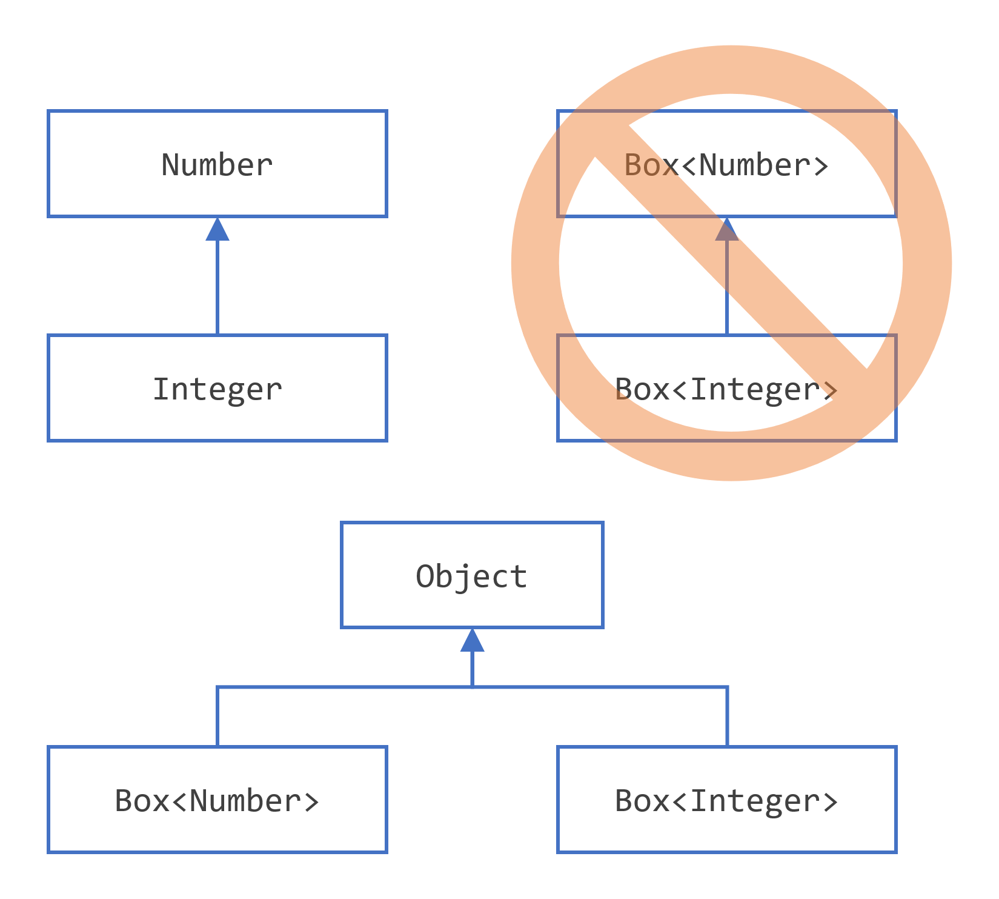
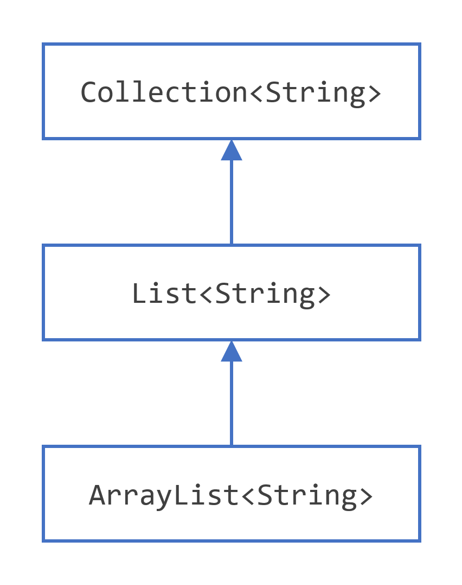
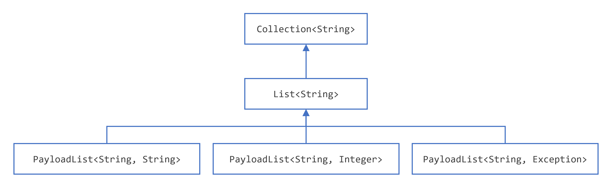

## 为什么要使用泛型？

简而言之，泛型允许类型(类和接口)在定义类、接口和方法时作为参数。 与方法声明中使用的更熟悉的形参非常相似，**类型形参**为您提供了一种使用不同输入重用相同代码的方法。 不同之处在于，形式参数的输入是值，而类型参数的输入是类型。  

使用泛型的代码比非泛型代码有很多好处:  

- 编译时更强的类型检查。Java编译器对泛型代码应用强类型检查，并在代码违反类型安全时发出错误。修复编译时错误比修复很难找到的运行时错误更容易。
- 消除转换。下面没有泛型的代码片段需要强制转换:

```java
List list = new ArrayList();
list.add("hello");
String s = (String) list.get(0);
```

当重写为使用泛型时，代码不需要强制转换：

```java
List<String> list = new ArrayList<String>();
list.add("hello");
String s = list.get(0);   // no cast
```

- 使程序员能够实现泛型算法。 通过使用泛型，程序员可以实现处理不同类型集合的泛型算法，可以自定义，类型安全且易于阅读。  

 

## 泛型

### 一个简单的盒子类

泛型类型是在类型上参数化的泛型类或接口。 下面的Box类将被修改以演示这个概念。  。

```java
public class Box {
    private Object object;

    public void set(Object object) { this.object = object; }
    public Object get() { return object; }
}
```

由于它的方法接受或返回一个Object，只要它不是原始类型之一，您可以自由地传入任何您想要的东西。 在编译时，没有办法验证类是如何使用的。 代码的一部分可能会在框中放置一个Integer，并期望从中获得Integer类型的对象，而代码的另一部分可能会错误地传入一个String，从而导致运行时错误。  

### Box类的泛型版本

一个*泛型类*的定义与格式如下：

```java
class name<T1, T2, ..., Tn> { /* ... */ }
```

类名后面是类型参数部分，由尖括号(<>)分隔。 它指定类型参数(也称为类型变量)T1, T2，… 和Tn。  

要更新Box类以使用泛型，您可以通过将代码“public class Box”更改为“public class Box<T>”来创建泛型类型声明。 这引入了`类型变量`T，它可以在类的任何地方使用。  。

有了这个改变，Box类变成:

```java
/**
 * Generic version of the Box class.
 * @param <T> the type of the value being boxed
 */
public class Box<T> {
    // T stands for "Type"
    private T t;

    public void set(T t) { this.t = t; }
    public T get() { return t; }
}
```

正如您所看到的，所有出现的Object都被t替换。类型变量可以是您指定的任何非原语类型:任何类类型、任何接口类型、任何数组类型，甚至是另一个类型变量。  

同样的技术也可以用于创建泛型接口。  

### 类型参数命名约定

按照惯例，类型参数名称是单一的大写字母。 这与您已经知道的变量命名约定形成了鲜明的对比，并且有很好的理由:如果没有这种约定，就很难区分类型变量和普通类或接口名之间的区别。  

最常用的类型参数名称是：

- E - 元素（被 Java 集合框架广泛使用）
- K - 键
- N - 数字
- T - 类型
- V - 值
- S、U、V 等 - 第 2、3、4 种类型
- 您将在 Java SE API 和本节的其余部分看到这些名称。

### 调用和实例化泛型类型

要在你的代码中引用泛型Box类，你必须执行泛型类型调用，它用一些具体的值替换T，比如Integer:  

```java
Box<Integer> integerBox;
```

您可以认为泛型类型调用类似于普通方法调用，但不是将参数传递给方法，而是将类型参数(在本例中为Integer)传递给Box类本身。  

> **Type Parameter*和*Type Argument*术语*：许多开发人员交替使用术语“*type parameter*”和“*type argument”，但这些术语并不相同。编码时，提供*type arguments*以创建参数化类型。因此，`T`in`Foo<T>`是一个*type parameter* ，[`String`](https://docs.oracle.com/en/java/javase/17/docs/api/java.base/java/lang/String.html)in`Foo<String> f`是一个*type argument*。本节在使用这些术语时遵守此定义。

与任何其他变量声明一样，这段代码实际上并不创建一个新的Box对象。 它简单地声明了integerBox将保存一个对“Box of Integer”的引用，这就是Box<Integer>是如何被读取的。  

泛型类型的调用通常称为**参数化类型**。

要实例化这个类，像往常一样使用new关键字，但是在类名和括号之间放置<Integer>:  

```java
Box<Integer> integerBox = new Box<Integer>();
```

### Diamond

在 Java SE 7 及更高版本中，`<>`只要编译器可以从上下文中确定或推断类型参数，就可以将调用泛型类的构造函数所需的类型参数替换为空的类型参数集 ( )。这对尖括号 ，`<>`非正式地称为菱形。例如，您可以`Box<Integer>`使用以下语句创建一个实例：

```java
Box<Integer> integerBox = new Box<>();
```

有关菱形符号和类型推断的更多信息，请参阅本教程的类型推断部分。

### 多个类型参数

如前所述，泛型类可以有多个类型参数。 例如，泛型OrderedPair类，它实现了泛型Pair接口:  ：

```java
public interface Pair<K, V> {
    public K getKey();
    public V getValue();
}

public class OrderedPair<K, V> implements Pair<K, V> {

    private K key;
    private V value;

    public OrderedPair(K key, V value) {
    this.key = key;
    this.value = value;
    }

    public K getKey()    { return key; }
    public V getValue() { return value; }
}
```

以下语句创建了该类的两个实例`OrderedPair`：

```java
Pair<String, Integer> p1 = new OrderedPair<String, Integer>("Even", 8);
Pair<String, String>  p2 = new OrderedPair<String, String>("hello", "world");
```

代码，new OrderedPair<String, Integer>()，实例化K为String, V为Integer。 因此，OrderedPair构造函数的参数类型分别是String和Integer。 由于自动装箱，将String和int传递给类是有效的。  

正如Diamond一节中提到的，因为Java编译器可以从OrderedPair<String, Integer>声明中推断出K和V类型，所以这些语句可以用Diamond表示法缩短:  

```java
OrderedPair<String, Integer> p1 = new OrderedPair<>("Even", 8);
OrderedPair<String, String>  p2 = new OrderedPair<>("hello", "world");
```

要创建泛型接口，请遵循与创建泛型类相同的约定。  。

### 参数化类型

您还可以用参数化类型(即List<String>)替换类型参数(即K或V)。 例如，使用OrderedPair<K, V>示例:  

```java
OrderedPair<String, Box<Integer>> p = new OrderedPair<>("primes", new Box<Integer>(...));
```

## 原始类型

原始类型是不带任何类型参数的泛型类或接口的名称。 例如，给定泛型Box类:  

```java
public class Box<T> {
    public void set(T t) { /* ... */ }
    // ...
}
```

要创建一个参数化类型Box<T>，你需要为形式类型参数T提供一个实际的类型实参:  

```java
Box<Integer> intBox = new Box<>();
```

如果省略了实际的类型参数，则创建一个原始类型Box<T>:  

```java
Box rawBox = new Box();
```

因此，Box是泛型类型Box<T>的原始类型。 但是，非泛型类或接口类型不是原始类型。 

原始类型出现在遗留代码中，因为许多API类(如Collections类)在JDK 5.0之前不是泛型的。 当使用原始类型时，你本质上得到了泛型前的行为——Box给了你对象。 为了向后兼容，允许将参数化类型赋值给它的原始类型:  

```java
Box<String> stringBox = new Box<>();
Box rawBox = stringBox;               // OK
```

但是，如果将原始类型分配给参数化类型，则会收到警告：

```java
Box rawBox = new Box();           // rawBox is a raw type of Box<T>
Box<Integer> intBox = rawBox;     // warning: unchecked conversion
```

如果你使用原始类型来调用在相应的泛型类型中定义的泛型方法，你也会得到警告:  

```java
Box<String> stringBox = new Box<>();
Box rawBox = stringBox;
rawBox.set(8);  // warning: unchecked invocation to set(T)
```

该警告显示原始类型绕过泛型类型检查，将不安全代码的捕获延迟到运行时。 因此，您应该避免使用原始类型。  

Type Erasure部分有关于Java编译器如何使用原始类型的更多信息。  。

### 未经检查的错误消息

正如前面提到的，当混合使用遗留代码和通用代码时，你可能会遇到类似如下的警告消息:  

```shell
Note: Example.java uses unchecked or unsafe operations.
Note: Recompile with -Xlint:unchecked for details.
```

使用对原始类型进行操作的旧 API 时可能会发生这种情况，如下例所示：

```java
public class WarningDemo {
    public static void main(String[] args){
        Box<Integer> bi;
        bi = createBox();
    }

    static Box createBox(){
        return new Box();
    }
}
```

术语“未检查”意味着编译器没有足够的类型信息来执行确保类型安全所需的所有类型检查。 默认情况下，“unchecked”警告是禁用的，尽管编译器会给出提示。 要查看所有“unchecked”的警告，请使用-Xlint:unchecked重新编译。  

使用-Xlint:unchecked重新编译前一个示例会显示以下额外信息:  

```shell
WarningDemo.java:4: warning: [unchecked] unchecked conversion
found   : Box
required: Box<java.lang.Integer>
        bi = createBox();
                      ^
1 warning
```

要完全禁用未检查的警告，请使用-Xlint:-unchecked标志。 @SuppressWarnings("unchecked")注释将抑制未检查的警告。 如果您不熟悉@SuppressWarnings语法，请参阅注释一节。  


## 泛型方法

泛型方法是引入它们自己的类型参数的方法。 这类似于声明泛型类型，但是类型参数的作用域仅限于声明它的方法。 允许使用静态和非静态泛型方法，以及泛型类构造函数。  

泛型方法的语法包括一组类型参数，它们位于尖括号内，出现在方法的返回类型之前。 对于静态泛型方法，类型参数段必须出现在方法的返回类型之前。  

Util类包含一个泛型方法compare，用于比较两个Pair对象:  

```java
public class Util {
    public static <K, V> boolean compare(Pair<K, V> p1, Pair<K, V> p2) {
        return p1.getKey().equals(p2.getKey()) &&
               p1.getValue().equals(p2.getValue());
    }
}

public class Pair<K, V> {

    private K key;
    private V value;

    public Pair(K key, V value) {
        this.key = key;
        this.value = value;
    }

    public void setKey(K key) { this.key = key; }
    public void setValue(V value) { this.value = value; }
    public K getKey()   { return key; }
    public V getValue() { return value; }
}
```

调用此方法的完整语法如下:  

```java
Pair<Integer, String> p1 = new Pair<>(1, "apple");
Pair<Integer, String> p2 = new Pair<>(2, "pear");
boolean same = Util.<Integer, String>compare(p1, p2);
```

该类型已显式提供，如粗体所示。 通常，这可以省略，编译器会推断出需要的类型:  

```java
Pair<Integer, String> p1 = new Pair<>(1, "apple");
Pair<Integer, String> p2 = new Pair<>(2, "pear");
boolean same = Util.compare(p1, p2);
```

这个特性称为类型推断，允许您将泛型方法作为普通方法调用，而不需要在尖括号之间指定类型。 这个主题将在下面的类型推断部分中进一步讨论。  


 

## 有界类型参数

有时，您可能希望限制可作为参数化类型的类型参数使用的类型。 例如，对数字进行操作的方法可能只希望接受Number或其子类的实例。 这就是有界类型参数的作用。  

要声明有界类型参数，请列出类型参数的名称，后跟extends关键字，后跟它的上界，在本例中为Number。 注意，在此上下文中，extends在一般意义上表示“扩展”(如在类中)或“实现”(如在接口中)。  

```java
public class Box<T> {

    private T t;          

    public void set(T t) {
        this.t = t;
    }

    public T get() {
        return t;
    }

    public <U extends Number> void inspect(U u){
        System.out.println("T: " + t.getClass().getName());
        System.out.println("U: " + u.getClass().getName());
    }

    public static void main(String[] args) {
        Box<Integer> integerBox = new Box<Integer>();
        integerBox.set(new Integer(10));
        integerBox.inspect("some text"); // error: this is still String!
    }
}
```

通过修改泛型方法来包含这个有界类型参数，编译将会失败，因为inspect调用仍然包含一个String:  

```shell
Box.java:21: <U>inspect(U) in Box<java.lang.Integer> cannot
  be applied to (java.lang.String)
                        integerBox.inspect("10");
                                  ^
1 error
```

除了限制你可以用来实例化泛型类型的类型外，有界类型参数允许你调用在边界中定义的方法:  

```java
public class NaturalNumber<T extends Integer> {

    private T n;

    public NaturalNumber(T n)  { this.n = n; }

    public boolean isEven() {
        return n.intValue() % 2 == 0;
    }

    // ...
}
```

isEven()方法通过n调用Integer类中定义的intValue()方法。  

### 多重边界

前面的例子演示了类型形参使用单个边界，但类型形参可以有多个边界:  ：

```java
<T extends B1 & B2 & B3>
```

具有多个边界的类型变量是边界中列出的所有类型的子类型。 如果其中一个边界是类，则必须首先指定它。 例如:  

```java
Class A { /* ... */ }
interface B { /* ... */ }
interface C { /* ... */ }

class D <T extends A & B & C> { /* ... */ }
```

如果没有首先指定绑定的A，你会得到一个编译时错误:  

```java
class D <T extends B & A & C> { /* ... */ }  // compile-time error
```


## 泛型方法和有界类型参数

有界类型参数是实现泛型算法的关键。 考虑以下方法，它计算数组T[]中大于指定元素elem的元素数。  

```java
public static <T> int countGreaterThan(T[] anArray, T elem) {
    int count = 0;
    for (T e : anArray)
        if (e > elem)  // compiler error
            ++count;
    return count;
}
```

该方法的实现是直接的，但它不编译，因为大于运算符（`>`）仅适用于原始类型如`short`，`int`，`double`，`long`，`float`，`byte`，和`char`。您不能使用`>`运算符来比较对象。要解决此问题，请使用受[`Comparable`](https://docs.oracle.com/en/java/javase/17/docs/api/java.base/java/lang/Comparable.html)接口限制的类型参数：

```java
public interface Comparable<T> {
    public int compareTo(T o);
}
```

结果代码将是：

```java
public static <T extends Comparable<T>> int countGreaterThan(T[] anArray, T elem) {
    int count = 0;
    for (T e : anArray)
        if (e.compareTo(elem) > 0)
            ++count;
    return count;
}
```

## 泛型、继承和子类型

正如您已经知道的，可以将一种类型的对象分配给另一种类型的对象，前提是这些类型是兼容的。 例如，你可以将一个Integer赋值给一个Object，因为Object是Integer的超类型之一:  

```java
Object someObject = new Object();
Integer someInteger = new Integer(10);
someObject = someInteger;   // OK
```

在面向对象的术语中，这被称为“is a”关系。 因为Integer是一种Object，所以允许赋值。 但是Integer也是Number的一种，所以下面的代码也是有效的:  

```java
public void someMethod(Number n) { /* ... */ }

someMethod(new Integer(10));   // OK
someMethod(new Double(10.1));   // OK
```

泛型也是如此。 你可以执行一个泛型类型调用，将Number作为它的类型参数传递，如果参数与Number兼容，任何后续的add调用都将被允许:  

```java
Box<Number> box = new Box<Number>();
box.add(new Integer(10));   // OK
box.add(new Double(10.1));  // OK
```

现在考虑以下方法：

```java
public void boxTest(Box<Number> n) { /* ... */ }
```

它接受什么类型的参数？通过查看其签名，您可以看到它接受类型为 的单个参数`Box<Number>`。但是，这是什么意思？正如您所料，您是否可以传入`Box<Integer>`或`Box<Double>`？答案是“否”，因为`Box<Integer>`和`Box<Double>`不是 `Box<Number>`的子类型。

当使用泛型编程时，这是一个常见的误解，但这是一个需要学习的重要概念。 Box<Integer>不是Box<Number>的子类型，即使Integer是Number的子类型。  



子类型化参数化类型。

> 注:给定两个具体类型A和B(例如，Number和Integer)， MyClass<A>与MyClass<B>没有关系，无论A和B是否相关。 MyClass<A>和MyClass<B>的共同父类是Object。  

有关当类型参数相关时如何在两个泛型类之间创建类似子类型的关系的信息，请参阅[通配符和子](https://dev.java/learn/wildcards/)类型部分。

### 泛型类和子类型

您可以通过扩展或实现泛型类或接口的子类型。一个类或接口的类型参数与另一个类或接口的类型参数之间的关系由 extends 和 implements 子句确定。

以Collections类为例，ArrayList<E>实现了List<E>，而List<E>扩展了Collection<E>。 所以ArrayList<String>是List<String>的子类型，而List<String>是Collection<String>的子类型。 只要不改变类型参数，类型之间的子类型关系就会被保留。  



示例集合层次结构。

现在，假设我们想定义自己的列表接口PayloadList，它将泛型类型P的可选值与每个元素关联起来。 它的声明可能是这样的:  

```java
interface PayloadList<E,P> extends List<E> {
  void setPayload(int index, P val);
  ...
}
```

以下PayloadList的参数化是List<String>的子类型:  

- `PayloadList<String,String>`
- `PayloadList<String,Integer>`
- `PayloadList<String,Exception>`



示例有效负载层次结构。