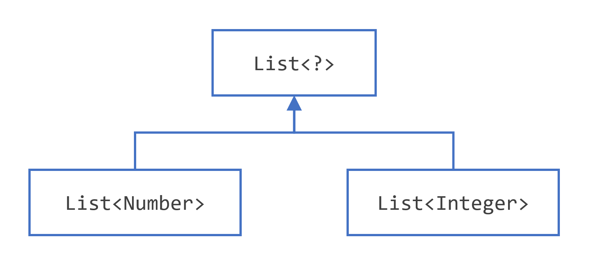

## 上界通配符

您可以使用上限通配符来放宽对变量的限制。例如，假设你想要写上工作的方法`List<Integer>`，`List<Double>`以及`List<Number>`; 您可以通过使用上限通配符来实现这一点。

要声明一个上界通配符，请使用通配符字符('?')，后跟extends关键字，再后跟它的上界。 注意，在此上下文中，extends在一般意义上表示“扩展”(如在类中)或“实现”(如在接口中)。  

要编写用于Number列表和Number的子类型(如Integer、Double和Float)的方法，需要指定List<? extends Number>。 术语List<Number>比List<? extends Number>，因为前者只匹配类型为Number的列表，而后者匹配类型为Number的列表或其任何子类。  

考虑以下处理方法：

```java
public static void process(List<? extends Foo> list) { /* ... */ }
```

上限通配符 ，`<? extends Foo>`其中`Foo`是任何类型，匹配Foo和Foo的任何子类型。 process方法可以访问Foo类型的列表元素:  ：

```java
public static void process(List<? extends Foo> list) {
    for (Foo elem : list) {
        // ...
    }
}
```

在`foreach`子句中，`elem`变量迭代列表中的每个元素。`Foo`类中定义的任何方法现在都可以用于`elem`.

该`sumOfList()`方法返回列表中数字的总和：

```java
public static double sumOfList(List<? extends Number> list) {
    double s = 0.0;
    for (Number n : list)
        s += n.doubleValue();
    return s;
}
```

以下代码使用[`Integer`](https://docs.oracle.com/en/java/javase/17/docs/api/java.base/java/lang/Integer.html)对象列表打印`sum = 6.0`：

```java
List<Integer> li = Arrays.asList(1, 2, 3);
System.out.println("sum = " + sumOfList(li));
```

[`Double`](https://docs.oracle.com/en/java/javase/17/docs/api/java.base/java/lang/Double.html)值列表可以使用相同的`sumOfList()`方法。以下代码打印`sum = 7.0`：

```java
List<Double> ld = Arrays.asList(1.2, 2.3, 3.5);
System.out.println("sum = " + sumOfList(ld));
```


## 无界通配符

无界通配符类型使用通配符 ( `?`)指定，例如，`List<?>`。这称为未知类型的列表。在两种情况下，无界通配符是一种有用的方法：

- 如果您正在编写可以使用[`Object`](https://docs.oracle.com/en/java/javase/17/docs/api/java.base/java/lang/Object.html)类中提供的功能实现的方法。
- 当代码使用泛型类中不依赖于类型参数的方法时。例如，[`List.size()`](https://docs.oracle.com/en/java/javase/17/docs/api/java.base/java/util/List.html#size())或[`List.clear()`](https://docs.oracle.com/en/java/javase/17/docs/api/java.base/java/util/List.html#clear())。事实上，`Class<?>`之所以经常使用，是因为中的大多数方法`Class<T>`都不依赖于`T`.

考虑以下方法`printList()`：

```java
public static void printList(List<Object> list) {
    for (Object elem : list)
        System.out.println(elem + " ");
    System.out.println();
}
```

printList()的目标是打印任何类型的列表，但它无法实现这个目标——它只打印一个Object实例的列表; 它不能打印List<Integer>， List<String>， List<Double>等等，因为它们不是List<Object>的子类型。 要编写一个通用的printList()方法，使用List<? >:  

```java
public static void printList(List<?> list) {
    for (Object elem: list)
        System.out.print(elem + " ");
    System.out.println();
}
```

因为对于任何具体类型`A`，`List<A>`都是 的子类型`List<?>`，所以可以使用`printList()`打印任何类型的列表：

```java
List<Integer> li = Arrays.asList(1, 2, 3);
List<String>  ls = Arrays.asList("one", "two", "three");
printList(li);
printList(ls);
```

> 注意:本节的示例中使用了Arrays.asList()方法。 这个静态工厂方法转换指定的数组并返回一个固定大小的列表。   

需要注意的是List<Object>和List<? >不一样。 你可以插入一个Object，或者Object的任何子类型到一个List<Object>中。 但是您只能向List<?>中插入null。 本节末尾的“通配符使用指南”一段提供了更多关于如何确定在给定情况下应该使用哪种通配符(如果有的话)的信息。  


## 下界通配符

上界通配符部分说明了上界通配符将未知类型限制为特定类型或该类型的子类型，并使用extends关键字表示。 以类似的方式，下界通配符将未知类型限制为特定类型或该类型的超类型。  

下界通配符使用通配符字符('?')，后跟super关键字，后跟它的下界:<? super >。  

> 注意：您可以为通配符指定上限，也可以指定下限，但不能同时指定两者。

假设您要编写一个将[`Integer`](https://docs.oracle.com/en/java/javase/17/docs/api/java.base/java/lang/Integer.html)对象放入列表的方法。为了最大限度地提高灵活性，你想的方法来工作`List<Integer>`，`List<Number>`和`List<Object>`-任何可以容纳[`Integer`](https://docs.oracle.com/en/java/javase/17/docs/api/java.base/java/lang/Integer.html)值。

要编写处理Integer列表和Integer超类型(如Integer、Number和Object)的方法，需要指定List<? 超级整数>。 术语List<Integer>比List<? super Integer>，因为前者只匹配Integer类型的列表，而后者匹配任何类型的Integer超类型的列表。  

以下代码将数字 1 到 10 添加到列表的末尾：

```java
public static void addNumbers(List<? super Integer> list) {
    for (int i = 1; i <= 10; i++) {
        list.add(i);
    }
}
```

本节末尾的通配符使用准则一段提供了关于何时使用上界通配符和何时使用下界通配符的指导。  

 

## 通配符和子类型

如前几节所述，泛型类或接口并不仅仅因为它们的类型之间存在关系而相互关联。 但是，您可以使用通配符来创建泛型类或接口之间的关系。  

给定以下两个常规（非通用）类：

```java
class A { /* ... */ }
class B extends A { /* ... */ }
```

编写以下代码是合理的：

```java
B b = new B();
A a = b;
```

这个例子显示了常规类的继承遵循子类型规则:如果B继承了a，那么B就是a的子类型。这个规则不适用于泛型类型:  

```java
List<B> lb = new ArrayList<>();
List<A> la = lb;   // compile-time error
```

假设Integer是Number的子类型，List<Integer>和List<Number>之间的关系是什么?  



常见的父参数化列表。

虽然Integer是Number的子类型，但List<Integer>不是List<Number>的子类型，事实上，这两种类型并不相关。 List<Number>和List<Integer>的共同父节点是List<?>。  

为了在这些类之间创建一个关系，使代码可以通过List<Integer>的元素访问Number的方法，使用一个上界通配符:  

```java
List<? extends Integer> intList = new ArrayList<>();
List<? extends Number>  numList = intList;  // OK. List<? extends Integer> is a subtype of List<? extends Number>
```

因为Integer是Number的子类型，而numList是Number对象的列表，所以intList (Integer对象的列表)和numList之间现在存在一种关系。 下图显示了几个List类之间的关系，这些类都声明了上界通配符和下界通配符。  


​																									几个通用 List 类声明的层次结构。

本节末尾的通配符使用指南段落中有更多关于使用上界和下界通配符的后果的信息。  

 

## 通配符捕获和辅助方法

在某些情况下，编译器会推断通配符的类型。 例如，列表可以定义为list <? >，但是，在计算表达式时，编译器会从代码中推断出特定的类型。 这个场景称为通配符捕获。  。

大多数情况下，您无需担心通配符捕获，除非您看到包含短语“capture of”的错误消息。

该`WildcardError`示例在编译时产生捕获错误：

```java
import java.util.List;

public class WildcardError {

    void foo(List<?> i) {
        i.set(0, i.get(0));
    }
}
```

在本例中，编译器将i输入参数处理为Object类型。 当foo方法调用List。 set(int, E)，编译器不能确认插入到列表中的对象的类型，并产生一个错误。 当这种类型的错误发生时，通常意味着编译器认为你给变量赋了错误的类型。 由于这个原因，Java语言中添加了泛型——在编译时强制类型安全。  

该`WildcardError`示例在由 Oracle 的 JDK 7`javac`实现编译时生成以下错误：

```shell
WildcardError.java:6: error: method set in interface List<E> cannot be applied to given types;
    i.set(0, i.get(0));
     ^
  required: int,CAP#1
  found: int,Object
  reason: actual argument Object cannot be converted to CAP#1 by method invocation conversion
  where E is a type-variable:
    E extends Object declared in interface List
  where CAP#1 is a fresh type-variable:
    CAP#1 extends Object from capture of ?
1 error
```

在这个例子中，代码试图执行一个安全的操作，那么如何处理编译器错误呢? 你可以通过编写一个私有的帮助方法来捕获通配符来修复它。 在这种情况下，你可以通过创建私有helper方法fooHelper()来解决这个问题，如WildcardFixed所示:  

```java
public class WildcardFixed {

    void foo(List<?> i) {
        fooHelper(i);
    }


    // Helper method created so that the wildcard can be captured
    // through type inference.
    private <T> void fooHelper(List<T> l) {
        l.set(0, l.get(0));
    }

}
```


由于辅助方法，编译器可以使用推断来确定`T`是`CAP#1`，捕获变量，在调用。该示例现在编译成功。

按照惯例，辅助方法通常命名为`originalMethodNameHelper()`。

现在考虑一个更复杂的例子`WildcardErrorBad`：

```java
import java.util.List;

public class WildcardErrorBad {

    void swapFirst(List<? extends Number> l1, List<? extends Number> l2) {
      Number temp = l1.get(0);
      l1.set(0, l2.get(0)); // expected a CAP#1 extends Number,
                            // got a CAP#2 extends Number;
                            // same bound, but different types
      l2.set(0, temp);        // expected a CAP#1 extends Number,
                            // got a Number
    }
}
```

在此示例中，代码正在尝试不安全的操作。例如，请考虑以下`swapFirst()`方法调用：

```java
List<Integer> li = Arrays.asList(1, 2, 3);
List<Double>  ld = Arrays.asList(10.10, 20.20, 30.30);
swapFirst(li, ld);
```

虽然`List<Integer>`和`List<Double>`两者都满足 的标准`List<? extends Number>`，但从[`Integer`](https://docs.oracle.com/en/java/javase/17/docs/api/java.base/java/lang/Integer.html)值列表中取出一个项目并试图将其放入值列表中显然是不正确的[`Double`](https://docs.oracle.com/en/java/javase/17/docs/api/java.base/java/lang/Double.html)。

使用 Oracle 的 JDK`javac`编译器编译代码会产生以下错误：

```shell
WildcardErrorBad.java:7: error: method set in interface List<E> cannot be applied to given types;
      l1.set(0, l2.get(0)); // expected a CAP#1 extends Number,
        ^
  required: int,CAP#1
  found: int,Number
  reason: actual argument Number cannot be converted to CAP#1 by method invocation conversion
  where E is a type-variable:
    E extends Object declared in interface List
  where CAP#1 is a fresh type-variable:
    CAP#1 extends Number from capture of ? extends Number
WildcardErrorBad.java:10: error: method set in interface List<E> cannot be applied to given types;
      l2.set(0, temp);      // expected a CAP#1 extends Number,
        ^
  required: int,CAP#1
  found: int,Number
  reason: actual argument Number cannot be converted to CAP#1 by method invocation conversion
  where E is a type-variable:
    E extends Object declared in interface List
  where CAP#1 is a fresh type-variable:
    CAP#1 extends Number from capture of ? extends Number
WildcardErrorBad.java:15: error: method set in interface List<E> cannot be applied to given types;
        i.set(0, i.get(0));
         ^
  required: int,CAP#1
  found: int,Object
  reason: actual argument Object cannot be converted to CAP#1 by method invocation conversion
  where E is a type-variable:
    E extends Object declared in interface List
  where CAP#1 is a fresh type-variable:
    CAP#1 extends Object from capture of ?
3 errors
```


没有解决此问题的辅助方法，因为代码从根本上是错误的：从[`Integer`](https://docs.oracle.com/en/java/javase/17/docs/api/java.base/java/lang/Integer.html)值列表中取出一个项目并尝试将其放入值列表中显然是不正确的[`Double`](https://docs.oracle.com/en/java/javase/17/docs/api/java.base/java/lang/Double.html)。

 

## 通配符使用指南

在学习使用泛型编程时，比较令人困惑的一个方面是确定何时使用上界通配符和何时使用下界通配符。 本页提供了一些设计代码时需要遵循的指导原则。  

为了便于讨论，将变量看作是提供两个函数之一是有帮助的:  

- “输入”变量。“输入”变量为代码提供数据。想象一个带有两个参数的方法：`copy(src, dest)`.  src参数提供要复制的数据，所以它是“输入”参数。
- “输出”变量。“输入”变量保存在别处使用的数据。在示例中，`copy(src, dest)`dest 参数接受数据，因此它是“输出”参数。

当然，有些变量同时用于“输入”和“输出”目的——指南中也提到了这种情况。

在决定是否使用通配符以及哪种类型的通配符合适时，您可以使用“in”和“out”原则。以下列表提供了要遵循的准则：

- “输入”变量使用一个上限通配符定义，使用`extends`关键字。
- “输出”变量使用一个下界通配符定义，使用`super`关键字。
- 在“输入”变量可以使用Object类中定义的方法访问的情况下，使用无界通配符。  
- 如果代码需要同时作为“In”和“out”变量访问变量，请不要使用通配符。

这些准则不适用于方法的返回类型。应该避免使用通配符作为返回类型，因为它迫使程序员使用代码来处理通配符。

由`List<? extends ...>`定义的列表可以非正式地认为是只读的，但这并不是严格的保证。假设您有以下两个类：

```java
class NaturalNumber {

    private int i;

    public NaturalNumber(int i) { this.i = i; }
    // ...
}

class EvenNumber extends NaturalNumber {

    public EvenNumber(int i) { super(i); }
    // ...
}
```

考虑以下代码：

```java
List<EvenNumber> le = new ArrayList<>();
List<? extends NaturalNumber> ln = le;
ln.add(new NaturalNumber(35));  // compile-time error
```

因为List<EvenNumber>是List<? extends NaturalNumber>子类型，你可以将le赋值给ln。 但是你不能用ln把一个自然数加到一个偶数列表中。 列表还支持以下操作:  

- 您可以添加`null`.
- 您可以调用[`clear()`](https://docs.oracle.com/en/java/javase/17/docs/api/java.base/java/util/List.html#clear()).
- 您可以获取迭代器并调用[`remove()`](https://docs.oracle.com/en/java/javase/17/docs/api/java.base/java/util/List.html#remove(java.lang.Object)).
- 您可以捕获通配符并写入从列表中读取的元素。

您可以看到由定义的列表`List<? extends NaturalNumber>`不是严格意义上的只读，但您可能会这样认为，因为您无法在列表中存储新元素或更改现有元素。