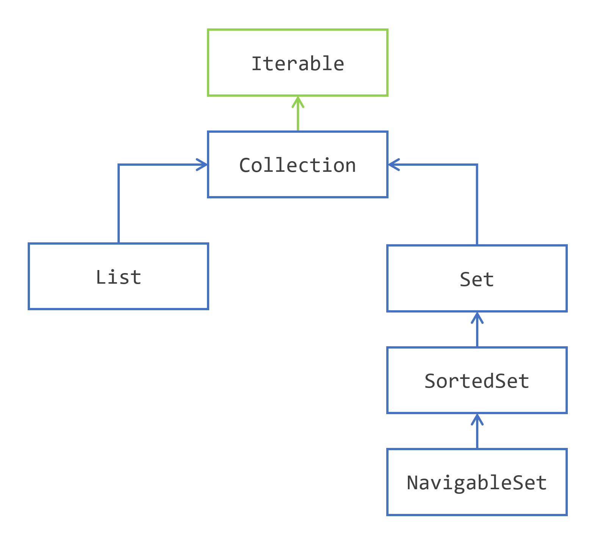

## 避免在集合层次结构中迷失

集合框架被划分为接口和类的几个层次。您需要理解的第一个内容是:Collection接口层次结构。

​																																	集合接口层次结构

请注意，某些接口已被省略，稍后您将看到。

 

## Iterable接口

这个层次结构的第一个接口是Iterable接口，它实际上不是集合框架的一部分。这里仍然值得一提，因为它是Collection接口的超接口，因此也是这个层次结构中所有接口的超接口。

Iterable接口是Java SE 5(2004)添加的。实现Iterable的对象是一个可以迭代的对象。它是在Java SE 5中与每种代码模式一起添加的。
你可能已经熟悉遍历集合元素的这种方式:

```java
Collection<String> collection = ...; 

for (String element: collection) {
    // do someting with element
}
```

您可能已经知道，可以使用此模式遍历任何集合或任何数组。事实上，Iterable的任何实例都可以在这里使用。

实现Iterable接口非常简单:你所需要做的就是提供另一个接口Iterator的实例，你将在下面看到它。

## 使用集合接口在容器中存储元素

所有其他接口都是关于在容器中存储元素。

两个接口List和Set都共享一个公共行为，该行为由Collection接口建模。Collection接口为元素容器上的一些操作建模。在不深入讨论技术细节的情况下，以下是你可以使用集合做的事情:

- 添加或删除元素；
- 测试给定元素是否存在;
- 询问包含的元素数量，或者这个集合是否为空；
- 清除此内容。

因为Collection是一组元素，所以Collection接口上也定义了set操作:

- 测试一个集合是否包含在另一个集合中；
- union;
- intersection;
- complement。

最后，Collection接口还模拟了访问元素的不同方式:

- 您可以通过使用迭代器迭代集合的元素；
- 您可以在这些元素上创建一个可以并行的流。

 当然，在List和Set中也可以使用所有这些操作。 那么普通的Collection实例和Set或List实例之间有什么区别呢?  

## 使用List扩展集合

List和Collection的不同之处在于，列表会记住添加元素的顺序。  

第一个结果是，如果您迭代列表的元素，您将得到的第一个元素就是第一个添加的元素。 然后您将得到第二个，以此类推，直到所有元素都被看到。 所以迭代元素的顺序总是相同的，它是由添加元素的顺序决定的。 普通的Collection和set都没有这种保证。  

> 事实证明，集合框架提供的Set的某些实现碰巧总是以相同的顺序遍历元素。 这是一个偶然的影响，您的代码不应该依赖于这种行为。  

还有第二个结果，可能不像第一个那么清楚，那就是列表的元素都有一个索引。 查询Collection的第一个元素没有意义。 查询List的第一个元素是有意义的，因为列表会记住这一点。  

正如您将看到的，List接口向Collection接口添加了新操作。 由于列表的元素有一个索引，您可以对该索引执行以下操作。  

- 获取特定索引处的元素，或将其删除
- 在特定位置插入元素或替换元素
- 获取两个索引之间范围的元素。

## 使用 Set 扩展集合

Set集合和Collection的区别在于，在Set中不能有副本。 同一类的多个实例可以在Collection中相等，甚至可以多次使用同一个实例。 这在Set中是不允许的。 实现的责任是如何实现的，您将在本教程的后面看到这一点，您将在本教程的后面看到。  

这种行为的后果之一是，向Set中添加元素可能会失败。

然后您可能会问自己:我可以有一个防止重复的容器吗?哪些元素有索引?答案没那么简单。集合框架为您提供了一个Set的实现，使用该实现，您将始终以相同的顺序遍历元素，但这些元素没有索引，所以这个类没有实现List。

这种行为上的差异不会在Set接口中带来任何新操作。 

## 使用 SortedSet 和 NavigableSet 对 Set 的元素进行排序

Set接口本身有两个扩展:SortedSet和NavigableSet。  

SortedSet接口维护按升序排序的元素。 同样，如何执行是实现的责任，稍后您将看到这一点。  

为了能够对它们进行排序，SortedSet需要比较元素。 它是如何做到这一点的? Java语言为此定义了两种标准机制。  

- 您的元素可以实现Comparable接口，并提供一个compareTo()方法  
- 你给SortedSet一个Comparator以便它可以比较它们。  

即使您的元素是Comparable，您仍然可以在构建SortedSet时提供Comparator。 如果您需要按照与compareTo()方法中实现的顺序不同的顺序对元素进行排序，这可能会证明是有用的。  

> *sorting* 和*ordering*有什么区别? List保持元素的添加顺序，SortedSet保持元素的排序。 对元素进行*Sorting* 意味着，在给定的比较逻辑意义上，遍历集合时得到的第一个元素将是最低的一个。 *Ordering* 元素意味着您在列表中添加它们的顺序将在列表的整个生命周期中保持不变。 所以你在遍历一个列表时得到的第一个元素就是第一个被添加到列表中的元素。  

SortedSet向Set添加了几个操作。 下面是对SortedSet可以做的事情。  

- 你可以得到集合中最小的元素和最大的元素  
- 您可以提取一个headSet和一个tailSet的所有元素小于或大于给定的元素。  

对SortedSet的元素进行迭代，从最小的元素到最大的元素。  。

NavigableSet不会改变SortedSet的行为。 它在SortedSet上添加了几个非常有用的操作，其中包括按降序迭代元素的可能性。 稍后你会看到更多的细节。  