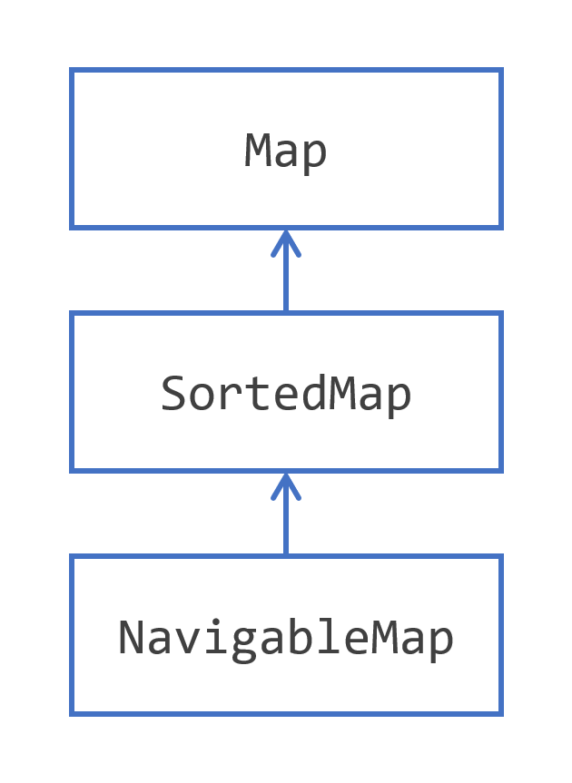

## 介绍Map层次结构

Collections Framework 提供的第二个主要结构是一个非常经典的数据结构的实现：hashmap 结构。这个概念并不新鲜，并且是构建化数据的基础，无论是否在内存中。它是如何工作的以及它是如何在集合框架中实现的？

hashmap 是一种能够存储键值对的结构。值是您的应用程序需要处理的任何对象，而键是可以表示该对象的东西。

假设您需要创建一个必须处理发票的应用程序，该应用程序由Invoice类的实例表示。 那么您的值就是这些发票实例，您的键可以是Invoice号。 每张发票都有一个编号，并且这个编号在所有发票中是唯一的。  

一般来说，每个值都绑定到一个键，就像发票绑定到它的发票号码一样。 如果您有一个给定的键，您可以检索该值。 键通常是一个简单的对象:想想由几个字符或数字组成的字符串。 另一方面，值可以根据需要复杂。 这就是创建散列映射的目的:您可以操作键，将它们从应用程序的一个部分移动到另一个部分，通过网络传输它们，并且当您需要完整的对象时，可以使用它的键检索它。  

在您看到Map接口的所有细节之前，您需要记住以下概念。  

- hashmap 可以存储键值对
- 键充当给定值的符号
- 键是一个简单的对象，值可以根据需要变得复杂
- 键在哈希图中是唯一的，值不必是唯一的
- 存储在hashmap中的每个值都必须绑定到一个键，映射中的键-值对构成该映射的一个条目  
- 键可用于检索其绑定值。

集合框架为您提供了实现这个概念的Map接口，以及两个扩展，SortedMap和NavigableMap，如下图所示。  



​																											Map接口层次结构

这个层次结构非常简单，看起来像集合层次结构，有SortedSet和NavigableSet。 实际上，SortedMap与SortedSet具有相同的语义:SortedMap是一种映射，它保持其键值对按键排序。 NavigableMap也是一样:这个接口添加的方法与NavigableSet添加到SortedSet的方法是相同的。  

JDK 为您提供了多种[`Map`](https://docs.oracle.com/en/java/javase/17/docs/api/java.base/java/util/Map.html)接口实现，使用最广泛的是[`HashMap`](https://docs.oracle.com/en/java/javase/17/docs/api/java.base/java/util/HashMap.html)类。

这是另外两个实现。

- LinkedHashMap是一个具有内部结构的HashMap，用于保持键值对的顺序。 对键或键值对进行迭代将遵循添加键值对的顺序。  
- IdentityHashMap是一个专门化的Map，只能在非常精确的情况下使用。 此实现并不打算在应用程序中普遍使用。 与使用equals()和hashCode()来比较键对象不同，该实现只使用相等操作符(==)来比较对这些键的引用。 只有在你确定这是你需要的时候，才要小心使用它。  

你可能听说过multimaps。 Multimap是一个概念，一个键可以与多个值相关联。 集合框架不直接支持这个概念。 不过，这个特性可能很有用，您将在本教程的后面看到如何使用实际上是值列表的值创建映射。 这个模式允许您创建类似multimap的结构。  

## 使用集合的便利工厂方法来创建映射  

正如您已经看到的，Java SE 9向List和Set接口添加了方法来创建不可变的列表和集合。  

在Map接口上有这样的方法，可以创建不可变映射和不可变条目。  

您可以使用以下模式轻松创建Map。

```java
Map<Integer, String> map = 
    Map.of(
        1, "one", 
        2, "two",
        3, "three"
    );
```

但是有一个警告：如果键值对不超过 10 个，则只能使用此模式。

如果你有更多，那么你需要使用另一种模式：

```java
Map.Entry<Integer, String> e1 = Map.entry(1, "one");
Map.Entry<Integer, String> e2 = Map.entry(2, "two");
Map.Entry<Integer, String> e3 = Map.entry(3, "three");

Map<Integer, String> map = Map.ofEntries(e1, e2, e3);
```

你也可以这样写这个模式，并使用静态导入来进一步提高它的可读性。

```java
Map<Integer, String> map3 = 
    Map.ofEntries(
        entry(1, "one"),
        entry(2, "two"),
        entry(3, "three")
    );
```

这些工厂方法创建的记录和条目有一些限制，就像set一样:  

- 您得到的映射和记录都是不可变对象  
- 不允许空记录、空键和空值
- 尝试以这种方式创建具有重复键的映射是没有意义的，所以作为警告，您将在映射创建时获得一个IllegalArgumentException。  

 

## 在Map中存储键/值对

键与其绑定值之间的关系遵循这两个简单的规则。

- 一个键只能绑定一个值
- 一个值可以绑定到多个键。
这给map的内容带来了几个后果。  

- 所有键的集合不能有任何重复，所以它的结构是 [`Set`](https://docs.oracle.com/en/java/javase/17/docs/api/java.base/java/util/Set.html)
- 所有键/值对的集合也不能有重复，所以它也有一个结构 [`Set`](https://docs.oracle.com/en/java/javase/17/docs/api/java.base/java/util/Set.html)
- 所有值的集合可能有重复，因此它具有普通[`Collection`](https://docs.oracle.com/en/java/javase/17/docs/api/java.base/java/util/Collection.html).

然后，您可以在map上定义以下操作：

- 在map放置一个键/值对。如果键已经在映射中定义，这可能会失败
- 从键中获取值
- 从map中删除键及其值。

您还可以定义经典的类似集合的操作：

- 检查map是否为空
- 获取ap中包含的键值对的数量
- 将另一张ap的所有内容放入此ap
- 清除ap内容。

所有这些操作和概念都在[`Map`](https://docs.oracle.com/en/java/javase/17/docs/api/java.base/java/util/Map.html)接口中实现，以及您将在下面看到的其他一些操作和概念。

 

## 探索map接口

Map接口是在JDK中建模Map概念的基类型。  

在为映射选择键的类型时，您应该非常小心。 简而言之，选择可变键是不被禁止的，但却是危险和不被鼓励的。 一旦一个键被添加到映射中，改变它可能导致改变它的哈希码值和它的标识。 这可能会使您的键值对无法恢复，或者在查询映射时可能会得到不同的值。 您将在后面的示例中看到这一点。  

在[`Map`](https://docs.oracle.com/en/java/javase/17/docs/api/java.base/java/util/Map.html)定义了一个构件接口：[`Map.Entry`](https://docs.oracle.com/en/java/javase/17/docs/api/java.base/java/util/Map.Entry.html)一个键-值对建模。该接口定义了三种访问键和值的方法：

- [`getKey()`](https://docs.oracle.com/en/java/javase/17/docs/api/java.base/java/util/Map.Entry.html#getKey()): 读取key；
- [`getValue()`](https://docs.oracle.com/en/java/javase/17/docs/api/java.base/java/util/Map.Entry.html#getValue())和[`setValue(value)`](https://docs.oracle.com/en/java/javase/17/docs/api/java.base/java/util/Map.Entry.html#setValue(V)): 读取和更新绑定到该键的值。

[`Map.Entry`](https://docs.oracle.com/en/java/javase/17/docs/api/java.base/java/util/Map.Entry.html)您可以从给定map获得的对象是map内容的视图。因此，修改条目对象的值会反映在map中，反之亦然。这就是您不能更改此对象中的键的原因：它可能会损坏您的map