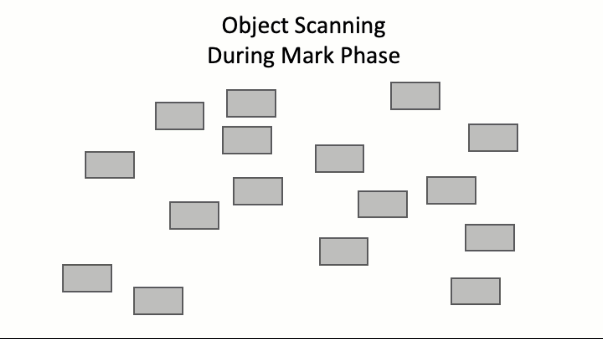
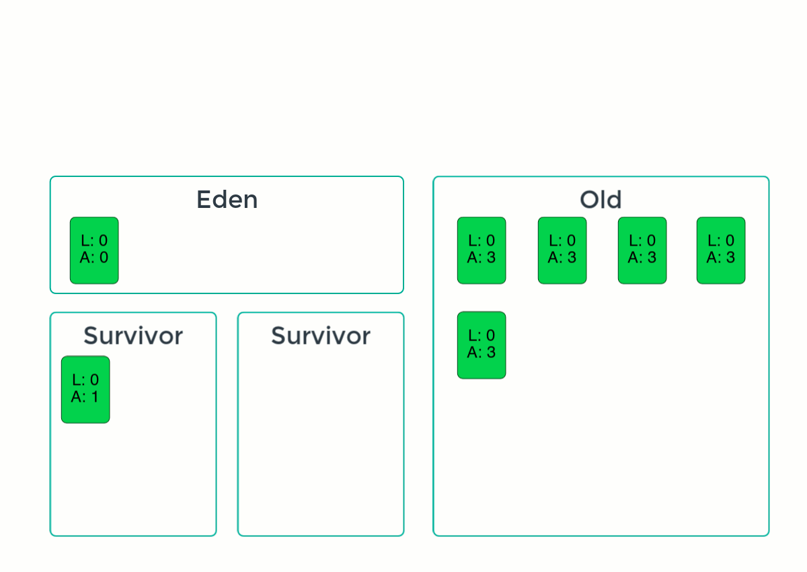

## Java中的垃圾收集

在前一节中，我们了解了Java使用垃圾收集器进行内存管理。但是垃圾收集器实际上是如何工作的呢?我们将在本节中对此进行更深入的研究。

## 分代垃圾收集器的类型

在HotSpot JVM中，垃圾收集器不是一个统一的概念，而是有多个实现。使用哪种垃圾收集器实现将取决于可用的硬件资源和应用程序的性能需求。

- **Serial Garbage Collector** **串行垃圾收集器**- 在单个线程上执行所有垃圾收集。具有较高的暂停时间，但资源使用较低。最好在只有一个处理器的系统上使用。
- **Parallel Garbage Collector**  **并行垃圾收集器**- 类似于串行垃圾收集器，但通过使用多个线程执行工作来减少暂停时间。
- **Concurrent Mark Sweep (CMS) Garbage Collector** **并发标记清除 (CMS) 垃圾收集器**（在JDK 9中已弃用，在JDK 14中移除)-在应用程序运行时设置后台进程跟踪对象使用情况，从而减少垃圾收集的暂停时间  。
- **Garbage First (G1) Garbage Collector** **垃圾优先 (G1) 垃圾收集器**(自JDK 9以来默认)-改进并取代了CMS GC。 G1非常适合访问大量内存的多处理器机器。
- **Z GC**(jdk11的实验，jdk15的生产)-超低延迟GC，也可以用于使用multi-terabyte堆的应用程序。 GC的内部实现和行为与列出的其他垃圾收集器明显不同，对其行为的描述将在另一篇文章中处理。  

 

## 堆内存

堆内存是由JVM控制的内存分配。 JVM可用的堆大小主要由-Xms<value>和-Xmx<value> JVM参数控制，分别设置初始堆大小和最大堆大小。  

当JVM中的任何线程创建一个对象时，它们被存储在堆中。 因此，存储在堆中的对象不是线程安全的。 这与局部变量相反，局部变量分配在栈内存中，是线程安全的，并在栈离开作用域时自动清除。  

如果堆内存已满，当JVM试图为新对象分配空间时，它将导致JVM抛出java.lang.OutOfMemoryError异常。 对于Java中的大多数垃圾收集器实现，堆内存根据对象的“年龄”被划分为多个区域。 区域的数量和类型取决于垃圾收集器的具体实现。  

### 分代垃圾收集

Java中的大多数垃圾收集器都实现为分代垃圾收集器(除Z GC外的所有垃圾收集器)。 分代垃圾收集器背后的思想是，大多数对象的寿命都很短，需要在创建后很快删除。 或者，随着一个物体的年龄增长，它变得越来越不可能成为删除的候选者。 分代垃圾收集器将堆划分为多个区域，新对象位于检查频率较高的年轻区域中，而长期存在的对象位于检查频率较低的旧区域中。  

通过将堆划分为多个区域，可以减少与垃圾收集相关的系统暂停时间，提高JVM上运行的应用程序的吞吐量和响应能力。 垃圾收集器可以进一步调整以支持特定的特性; 吞吐量、响应性、资源使用情况等等，这取决于应用程序的需求。  

#### 堆区域

如前所述，分代垃圾收集器中的内存堆被划分为多个区域。让我们更详细地了解这些区域。

- **Young Region** **年轻区域**- 顾名思义，年轻区域是包含最近创建的对象的堆区域。Young Region 本身又细分为更多的区域。
  - **Eden Space** **伊甸空间** - 在初始创建时，对象存储在堆的 Eden 区域中，直到其第一次垃圾回收。
  - **Survivor Spaces** **幸存者空间**- 被垃圾收集而幸存的对象被提升到幸存者区域。分代收集器有多个幸存区域，目的是提高垃圾收集器的效率。在垃圾回收期间，仍引用伊甸空间或占用幸存者空间中的对象，或者复制或移动到空的幸存者空间。
- **Old Region** **老年区**- 如果一个对象在垃圾收集中幸存，获得足够的“年龄”，它将被提升到旧区。
- **Permanent/Metaspace Region** **永久/元空间区域**- 最后一个区域是永久或元空间区域。存储在此处的对象通常是 JVM 元数据、核心系统类和其他数据，这些数据通常存在于 JVM 生命周期的整个期间。垃圾收集器通常只在堆达到临界消耗内存阈值时才检查存储在该区域中的对象。

 

## 垃圾收集过程

在高层次上，垃圾回收分为三个阶段；标记、清扫和压缩。这些步骤中的每一个都有不同的职责。不过请注意，根据垃圾收集器实现的不同，每个阶段中可能还有这里没有介绍的子阶段。  

### 标记

在创建对象时，VM给每个对象一个1位的标记值，初始值设为false(0)。这个值被垃圾收集器用来标记一个对象是否可达。 在垃圾收集开始时，垃圾收集器遍历对象图并将它可以到达的任何对象标记为true(1)。  

垃圾收集器并不逐个扫描每个对象，而是从“根”对象开始扫描。 根对象的例子有: 局部变量、静态类字段、活动Java线程和JNI引用。 下面的动画展示了对象标记阶段的样子:  

### Sweep

在扫描阶段，所有不可达的对象，即当前标记位为假(0)的对象，将被移除。  

### 压缩

垃圾收集的最后一个阶段是压缩阶段。 伊甸区域或已占用的幸存者区域中的活动对象被移动和/或复制到空的幸存者区域。 如果幸存者区域中的对象获得了足够的使用权，则将其移动或复制到旧区域。  

### 垃圾收集暂停

在垃圾回收期间，JVM 中的部分甚至全部处理可能会暂停，这些被称为 Stop-the-World 事件。正如在堆内存部分的介绍中提到的，存储在堆内存中的对象不是线程安全的。这反过来意味着在垃圾收集期间，JVM 的一部分或全部必须暂停一段时间，同时垃圾收集器工作以防止在检查对象的使用、删除、移动或复制时发生错误。

JDK Flight Recorder (JFR) 和 Visual VM 等工具可用于监控垃圾收集暂停的频率和持续时间。如何调整垃圾收集器超出了本教程的范围，但是监控垃圾收集器的行为，然后通过 JVM 参数对其进行调整，可能是提高应用程序性能的关键方法。

### 垃圾回收类型

就像堆内存有不同的区域一样，垃圾回收也有不同的类型。

- **Minor** - Minor垃圾收集只扫描堆内存的Young区域。 Minor型垃圾收集非常频繁地发生，并且通常具有非常低的暂停时间。  。
- **Major**- Major垃圾收集扫描堆内存的年轻和老年区域。 主要垃圾收集发生的频率要比Minor垃圾收集低得多，通常是由VM中的特定条件触发的，例如，当使用了堆内存阈值时。 由于正在扫描的堆的很大一部分，明显较长的暂停时间与major垃圾收集相关联。  
- **Full** - 一个完整的垃圾回收是指扫描整个堆、Young、Old 和 Permanent/Metaspace 区域。与major 垃圾回收一样，full垃圾回收通常是基于条件的，例如当大量堆内存被消耗或由系统管理员手动执行时。与major垃圾回收一样，很长的暂停时间与full垃圾回收相关。

下面的动画形象地展示了垃圾收集的样子：

