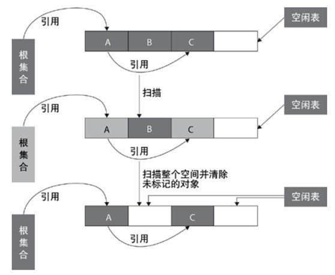

#### 一、分析对象是否存活的两种算法: 

##### 1.1、引用计数法: 

给堆中的每一个对象添加一个计数器，这个计数器表示了他被引用的次数。当次数为0的时候，就进行回收。但是这种算法有一个缺点，他在循环调用的时候，可能对象实际上已经是不会被用到了，但是由于某两个对象之间还存在着没有意义的互相调用而导致不能回收。 

##### 1.2、可达性算法 Gc root: 

当堆中的某个对象，在方法区中存在他的静态成员或者常量对象，或者在jvm栈的栈帧中的本地变量表中被引用，又或者他是在本地方法栈中JNI的引用对象。那么他就是存活的对象，回收时就遍历eden区回收那些没有被标记的对象

#### 二、垃圾回收算法：

##### 2.1、标记清除算法：

该方法分为标记和清除两个阶段，标记就是把所有GC Roots可达对象，然后把没有标记的对象进行回收。
缺点是：回收后，堆中内存碎片化，内存空间不连续，导致新添加一个对象时，明明有足够的内存空间却因为空间不连续不能存放。

**适用场合**：
存活对象较多的情况下比较高效
适用于年老代（即旧生代）
**缺点**：
容易产生内存碎片，再来一个比较大的对象时（典型情况：该对象的大小大于空闲表中的每一块儿大小但是小于其中两块儿的和），会提前触发垃圾回收
扫描了整个空间两次（第一次：标记存活对象；第二次：清除没有标记的对象）

##### 2.2、复制算法：

复制算法一般用在young区中，因为young中对象朝生夕死数量少，使用复制算法拷贝时效率比较高。young又分为Eden,s1,s2区，比例为8：1：1，始终有大量的空间创建对象，剩下较小空间存放回收后存活的对象。 为新对象申请空间，当Eden区满的时候，会触发第一次 young gc，若gc后Eden还是没有足够空间存储新对象，将Eden中存活对象放入s1中 Eden区再次触发young gc，会对Eden,s1进行垃圾回收，若gc后Eden还是没有足够空间存储新对象，回收后还存活的对象复制到s2中，清空s1 Eden区再次触发young gc ,会对Eden，s2进行垃圾回收，若gc后Eden还是没有足够空间存储新对象，回收后还存活的对象复制到s1中，清空s2. 有两个问题： （1）每次gc后，是不是要先判断Eden 区gc后能不能放下新对象，能的话把新对象放入Eden中，然后结束，不能的话才把存活对象复制到survive中？ （2）如果Eden和s1中存活对象往s2复制的时候没有足够内存，是不是复制全部的s1存活对象和部分Eden中存活对象？ 

**适用场合：**
存活对象较少的情况下比较高效
扫描了整个空间一次（标记存活对象并复制移动）
适**用于年轻代（即新生代）**：基本上98%的对象是"朝生夕死"的，存活下来的会很少
**缺点：**
需要一块儿空的内存空间
需要复制移动对象

##### 2.3、标记整理算法 

与标记-清理算法类似，只是后续步骤是让所有存活的对象移动到一端，然后直接清除掉端边界以外的内存。一般用在old区中。解决内存碎片化问题

##### 2.4、分代收集算法

分代收集算法就是目前虚拟机使用的回收算法，它解决了标记整理不适用于老年代的问题，将内存分为各个年代。一般情况下将堆区划分为老年代（Tenured Generation）和新生代（Young Generation），在堆区之外还有一个代就是永久代（Permanet Generation）。

