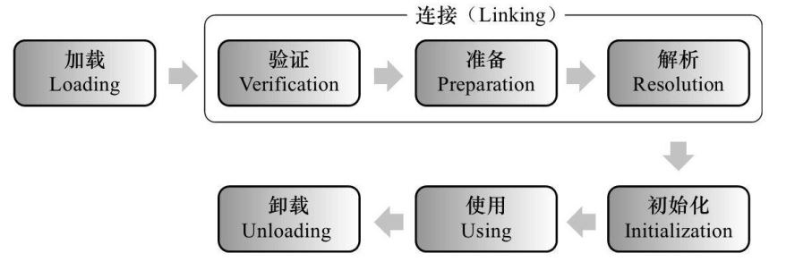

JVM 类加载机制分为五个部分：加载，验证，准备，解析，初始化，下面我们就分别来看一下这五个过程

一、加载

是指把类的.class文件中的数据读入到内存中，通常是创建一个字节数组读入.class文件，然后产生与所加载类对应的java.lang.Class对象。作为方法区这个类的各种数据的入口.加载完成后，Class对象还不完整，所以此时的类还不可用。

二、验证

这一阶段的主要目的是为了确保 Class 文件的字节流中包含的信息是否符合当前虚拟机的要求，并且不会危害虚拟机自身的安全。

三、准备

准备阶段是正式为类变量分配内存并设置类变量的初始值阶段，即在方法区中分配这些变量所使用的内存空间。注意这里所说的初始值概念

四、解析

解析阶段是指虚拟机将常量池中的符号引用替换为直接引用的过程

> 符号引用：符号引用与虚拟机实现的布局无关，引用的目标并不一定要已经加载到内存中。各种虚拟机实现的内存布局可以各不相同，但是它们能接受的符号引用必须是一致的，因为符号引用的字面量形式明确定义在 Java 虚拟机规范的 Class 文件格式中。
>
> 直接引用：直接引用可以是指向目标的指针，相对偏移量或是一个能间接定位到目标的句柄。如果有了直接引用，那引用的目标必定已经在内存中存在。

五、初始化

