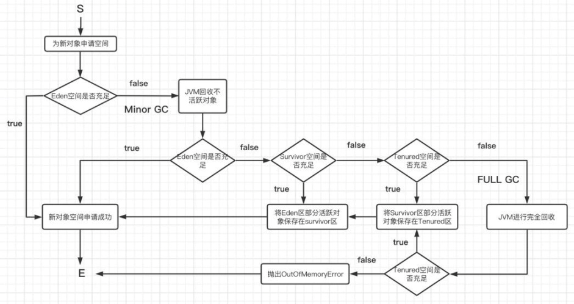

一、找垃圾：

引用计数法，看有几个引用指向某个对象，若0个引用指向该对象，则该对象是垃圾，但是存在循环引用的问题，会内存泄漏，导致内存溢出。

 可达性分析算法，遍历GC Root可达的对象，不可达的就是垃圾 

二、什么时候收垃圾： 

Eden区或者s区不够用 老年代不够 方法区不够 System.gc手动回收 

三、怎么回收垃圾：

可以在young使用复制算法回收垃圾 

可以在old区使用标记整理算法回收垃圾

