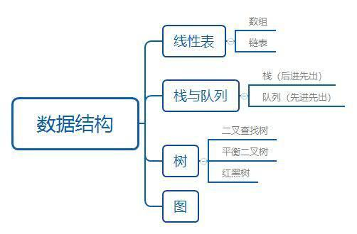
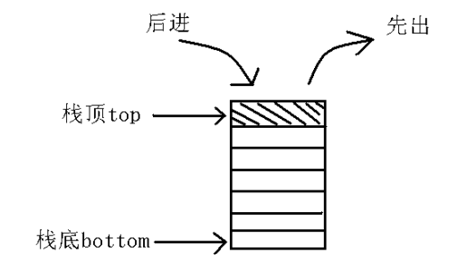
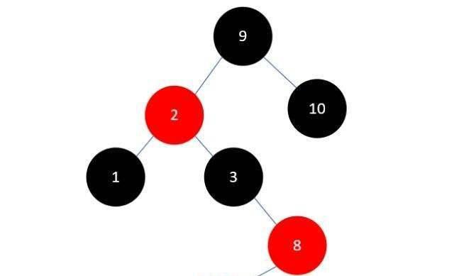

#### 一、线性表（重点）

线性表是由N个元素组成的有序序列，也是最常见的一种数据结构。重点有两个数组和链表。

##### 1、数组

数组是一种存储单元连续，用来存储固定大小元素的线性表。java中对应的集合实现，比如ArrayList。

##### 2、链表

链表又分单链表和双链表，是在物理存储单元上非连续、非顺序的存储结构，数据元素的逻辑顺序是通过链表中的指针链接次序实现的。java中对应的集合实现，比如LinkedList。

#### 二、栈与队列

##### 1、栈

栈，是一种运算受限的线性表，重点掌握其后进先出（LIFO）的特点。表的末端叫栈顶，基本操作有push(进栈)和pop(出栈)。java中stack就是简单的栈实现。

##### 2、队列

队列也是一种操作受限制的线性表，重点掌握其先进先出(FIFO)的特点。表的前端只允许进行删除操作，表的后端进行插入操作。进行插入操作的端称为队尾，进行删除操作的端称为队头。java中很多Queue的实现，消息中间件的队列本质也是基于此的。

#### 三、树（重点）

在非线性结构里面，树是非常非常重要的一种数据结构。基于其本身的结构优势，尤其在查找领域，应用广泛，其中又以二叉树最为重要。树的话我们这里只重点说一下二叉树。

##### 1、二叉搜索树

二叉搜索树又叫二叉查找树，又叫二叉排序树。性质如下：(1) 若左子树不空，则左子树上所有结点的值均小于它的根结点的值；(2) 若右子树不空，则右子树上所有结点的值均大于它的根结点的值；(3) 左、右子树也分别为二叉排序树；(4) 没有键值相等的结点。

##### 2、平衡二叉树

平衡二叉树又叫AVL树。性质如下：它的左子树和右子树都是平衡二叉树，且左子树和右子树的深度之差的绝对值不超过1。

##### 3、红黑树

红黑树是一种特殊的平衡二叉树，它保证在最坏情况下基本动态集合操作的事件复杂度为O(log n)。

红黑树放弃了追求完全平衡，追求大致平衡，在与平衡二叉树的时间复杂度相差不大的情况下，保证每次插入最多只需要三次旋转就能达到平衡，实现起来也更为简单。平衡二叉树追求绝对平衡，条件比较苛刻，实现起来比较麻烦，每次插入新节点之后需要旋转的次数不能预知。

#### 四、图

图是比线性表和树更复杂的数据结构，面试中基本不太会问到，大家有兴建的可以自己去了解下。