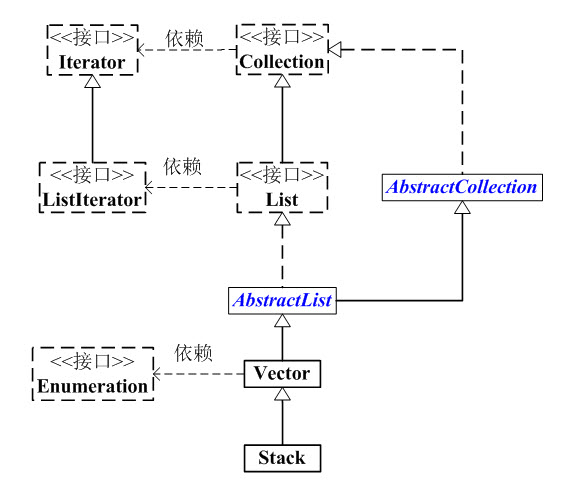

#### **Stack和Collection的关系如下图**：

[


#### Stack的API

```java
boolean        empty()
synchronized E peek() //返回栈顶元素，不执行删除操作
synchronized E pop() //返回栈顶元素，并将其从栈中删除
             E push(E object)//push函数：将元素存入栈顶
synchronized int search(Object o)
```

#### Stack源码解析

```java
1 package java.util;
 2 
 3 public
 4 class Stack<E> extends Vector<E> {
 5     // 版本ID。这个用于版本升级控制，这里不须理会！
 6     private static final long serialVersionUID = 1224463164541339165L;
 7 
 8     // 构造函数
 9     public Stack() {
10     }
11 
12     // push函数：将元素存入栈顶
13     public E push(E item) {
14         // 将元素存入栈顶。
15         // addElement()的实现在Vector.java中
16         addElement(item);
17 
18         return item;
19     }
20 
21     // pop函数：返回栈顶元素，并将其从栈中删除
22     public synchronized E pop() {
23         E    obj;
24         int    len = size();
25 
26         obj = peek();
27         // 删除栈顶元素，removeElementAt()的实现在Vector.java中
28         removeElementAt(len - 1);
29 
30         return obj;
31     }
32 
33     // peek函数：返回栈顶元素，不执行删除操作
34     public synchronized E peek() {
35         int    len = size();
36 
37         if (len == 0)
38             throw new EmptyStackException();
39         // 返回栈顶元素，elementAt()具体实现在Vector.java中
40         return elementAt(len - 1);
41     }
42 
43     // 栈是否为空
44     public boolean empty() {
45         return size() == 0;
46     }
47 
48     // 查找“元素o”在栈中的位置：由栈底向栈顶方向数
49     public synchronized int search(Object o) {
50         // 获取元素索引，elementAt()具体实现在Vector.java中
51         int i = lastIndexOf(o);
52 
53         if (i >= 0) {
54             return size() - i;
55         }
56         return -1;
57     }
58 }
```

```java
public class StackTest {
    public static void main(String[] args) {
        Stack<String> stack = new Stack<>();

        //在顶部插入一个元素
        stack.push("1");
        stack.push("2");
        stack.push("3");

        stack.add("4");

        //查看此堆栈顶部的对象，而不将其从堆栈中删除。
        System.out.println(stack.peek());

        //返回并移除栈顶元素
        System.out.println(stack.pop());
        System.out.println(stack.pop());
        System.out.println(stack.pop());
        System.out.println(stack.pop());

    }
}
```

