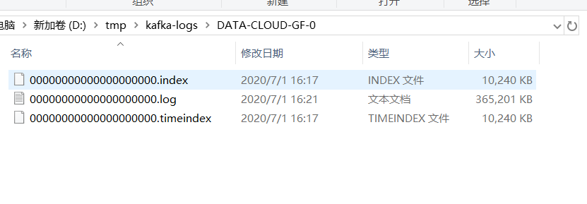

- Broker：消息中间件处理结点，一个Kafka节点就是一个broker，多个broker能够组成一个Kafka集群。

- Topic：一类消息，比如page view日志、click日志等都能够以topic的形式存在。Kafka集群能够同一时候负责多个topic的分发。

- Partition：topic物理上的分组。一个topic能够分为多个partition，每一个partition是一个有序的队列。

- Segment：partition物理上由多个segment组成。以下有具体说明。

  > segment file组成：由2大部分组成。分别为index file和data file，此2个文件一一相应，成对出现，后缀”.index”和“.log”分别表示为segment索引文件、数据文件.

> segment文件命名规则：partion全局的第一个segment从0開始，兴许每一个segment文件名称为上一个segment文件最后一条消息的offset值。
>
> 数值最大为64位long大小。19位数字字符长度，没有数字用0填充。

- offset：每一个partition都由一系列有序的、不可变的消息组成，这些消息被连续的追加到partition中。partition中的每一个消息都有一个连续的序列号叫做offset,用于partition中唯一标识的这条消息。