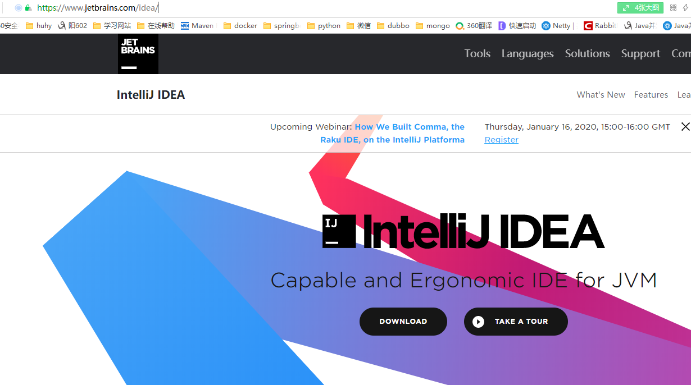
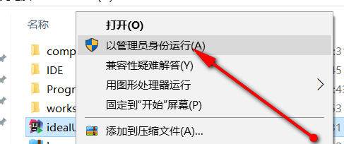
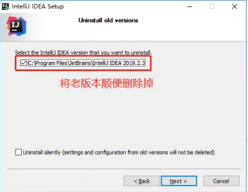
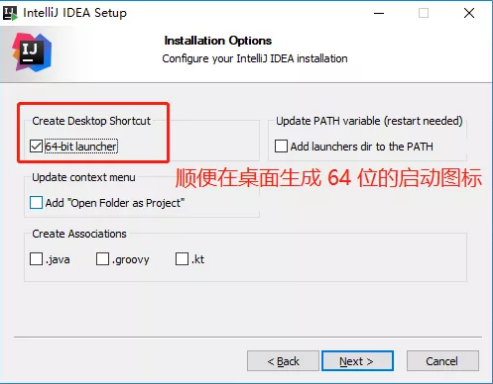
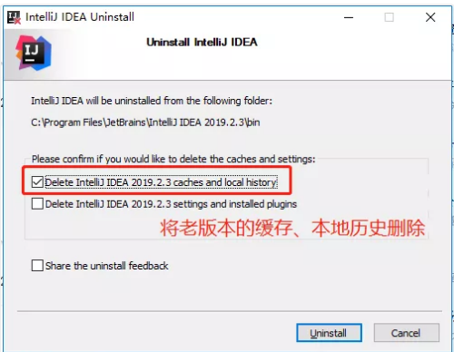
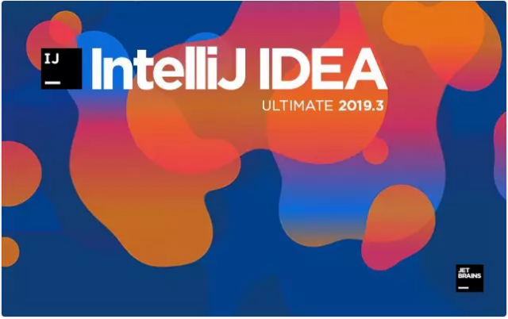
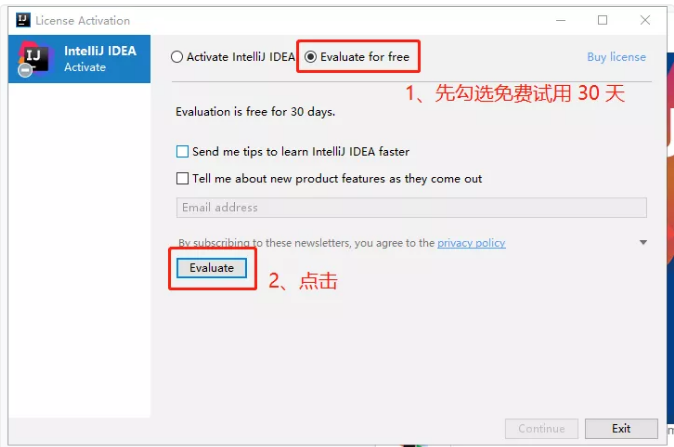
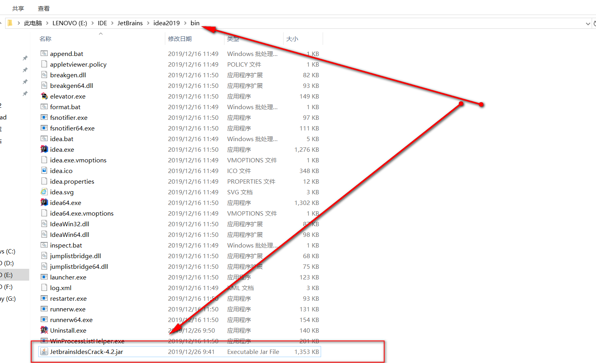
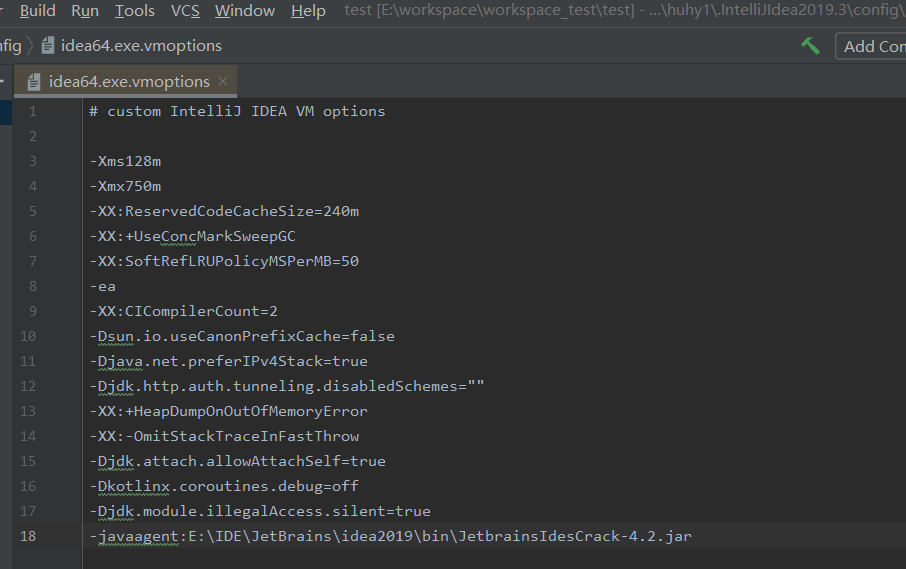
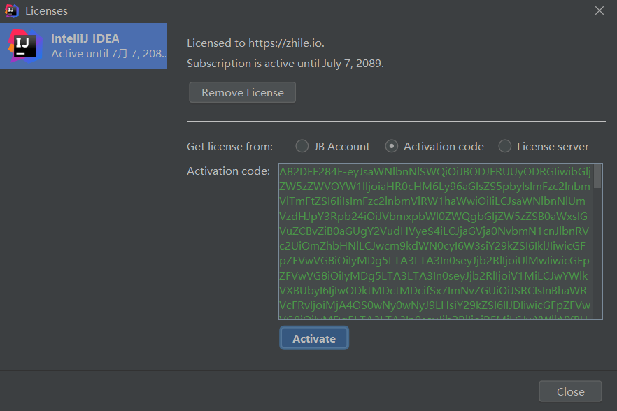

下载安装：

官网地址：https://www.jetbrains.com/idea/

　　　　

 

点击download进行下载： 注意有三个版本，我标注一下，希望有助于大家的理解

| Community 社区版 | 免费 | 功能有限制                        | http://idea-intellij.com/intellij-community/ |
| ---------------- | ---- | --------------------------------- | -------------------------------------------- |
| Ultimate 终极版  | 收费 | 功能无限制                        | http://idea-intellij.com/intellij-ultimate/  |
| EAP 终极版       | 免费 | 功能无限制 但是每隔30天要重装一次 | http://idea-intellij.com/intellij-eap/       |

我选择的 Ultimate 终极版 下载，下载好如下：　　　　

 注意，安装的时候尽量选择　管理员身份安装：防止后续权限不够出现一些未知问题

　　　　　　

 

　　我这之前是安装过 IDEA 2019.2 版本的，所以提示是否删除老版本，这里我们选择删除老版本：

　　　　


> 注意: 若你第一次安装，是没有这一步的，跳过看后面即可~

继续点击下一步，这里我的电脑是 64 位的，顺便将 64 位的 IDEA 启动图标生成到桌面上：

　　　　

点击下一步，这里又弹出卸载老版本 IDEA 2019.2.3 可以做的操作，如果是第一次安装，则没有这一步，看下面步骤即可~

这里由于我之前安装有老版本的 IDEA, 选择将老版本的缓存、本地历史也删除掉：

　　

 

> 注意：很多小伙伴激活失败，很可能是之前老版本的遗留缓存导致的，在升级的时候，一定记住要给删除掉，否则，可能导致激活失败的情况~

继续点击下一步，启动 IDEA 2019.3, 启动成功后，我们可以看到 IDEA 新的欢迎界面如下:

　　

##  激活：

　　在激活之前，**不需要修改host配置文件**

　　***\*重点：激活码需要结合破解补丁，一起使用，请参考下面步骤\****

　　先选择适用30天***\*
\****

　　****

##  配置破解补丁

进去过后，我们随便建个项目，点击菜单栏 **Help -> Edit Custom VM Options**:

**注意：切记一定要通过 IDEA 来修改 .vmoptions 文件，不要手动直接去修改，现在 IDEA 针对反破解已经越来越严格了~**

　　　　

 

 

 　　　配置：注意不要含有中文，尽量不要含有空格

　　　　　　****

 

 

 　　　破解完成，重启idea即可

## 重启之后。填上激活码，我提供一个：

[](javascript:void(0);)

```
A82DEE284F-eyJsaWNlbnNlSWQiOiJBODJERUUyODRGIiwibGljZW5zZWVOYW1lIjoiaHR0cHM6Ly96aGlsZS5pbyIsImFzc2lnbmVlTmFtZSI6IiIsImFzc2lnbmVlRW1haWwiOiIiLCJsaWNlbnNlUmVzdHJpY3Rpb24iOiJVbmxpbWl0ZWQgbGljZW5zZSB0aWxsIGVuZCBvZiB0aGUgY2VudHVyeS4iLCJjaGVja0NvbmN1cnJlbnRVc2UiOmZhbHNlLCJwcm9kdWN0cyI6W3siY29kZSI6IklJIiwicGFpZFVwVG8iOiIyMDg5LTA3LTA3In0seyJjb2RlIjoiUlMwIiwicGFpZFVwVG8iOiIyMDg5LTA3LTA3In0seyJjb2RlIjoiV1MiLCJwYWlkVXBUbyI6IjIwODktMDctMDcifSx7ImNvZGUiOiJSRCIsInBhaWRVcFRvIjoiMjA4OS0wNy0wNyJ9LHsiY29kZSI6IlJDIiwicGFpZFVwVG8iOiIyMDg5LTA3LTA3In0seyJjb2RlIjoiREMiLCJwYWlkVXBUbyI6IjIwODktMDctMDcifSx7ImNvZGUiOiJEQiIsInBhaWRVcFRvIjoiMjA4OS0wNy0wNyJ9LHsiY29kZSI6IlJNIiwicGFpZFVwVG8iOiIyMDg5LTA3LTA3In0seyJjb2RlIjoiRE0iLCJwYWlkVXBUbyI6IjIwODktMDctMDcifSx7ImNvZGUiOiJBQyIsInBhaWRVcFRvIjoiMjA4OS0wNy0wNyJ9LHsiY29kZSI6IkRQTiIsInBhaWRVcFRvIjoiMjA4OS0wNy0wNyJ9LHsiY29kZSI6IkdPIiwicGFpZFVwVG8iOiIyMDg5LTA3LTA3In0seyJjb2RlIjoiUFMiLCJwYWlkVXBUbyI6IjIwODktMDctMDcifSx7ImNvZGUiOiJDTCIsInBhaWRVcFRvIjoiMjA4OS0wNy0wNyJ9LHsiY29kZSI6IlBDIiwicGFpZFVwVG8iOiIyMDg5LTA3LTA3In0seyJjb2RlIjoiUlNVIiwicGFpZFVwVG8iOiIyMDg5LTA3LTA3In1dLCJoYXNoIjoiODkwNzA3MC8wIiwiZ3JhY2VQZXJpb2REYXlzIjowLCJhdXRvUHJvbG9uZ2F0ZWQiOmZhbHNlLCJpc0F1dG9Qcm9sb25nYXRlZCI6ZmFsc2V9-5epo90Xs7KIIBb8ckoxnB/AZQ8Ev7rFrNqwFhBAsQYsQyhvqf1FcYdmlecFWJBHSWZU9b41kvsN4bwAHT5PiznOTmfvGv1MuOzMO0VOXZlc+edepemgpt+t3GUHvfGtzWFYeKeyCk+CLA9BqUzHRTgl2uBoIMNqh5izlDmejIwUHLl39QOyzHiTYNehnVN7GW5+QUeimTr/koVUgK8xofu59Tv8rcdiwIXwTo71LcU2z2P+T3R81fwKkt34evy7kRch4NIQUQUno//Pl3V0rInm3B2oFq9YBygPUdBUbdH/KHROyohZRD8SaZJO6kUT0BNvtDPKF4mCT1saWM38jkw==-MIIElTCCAn2gAwIBAgIBCTANBgkqhkiG9w0BAQsFADAYMRYwFAYDVQQDDA1KZXRQcm9maWxlIENBMB4XDTE4MTEwMTEyMjk0NloXDTIwMTEwMjEyMjk0NlowaDELMAkGA1UEBhMCQ1oxDjAMBgNVBAgMBU51c2xlMQ8wDQYDVQQHDAZQcmFndWUxGTAXBgNVBAoMEEpldEJyYWlucyBzLnIuby4xHTAbBgNVBAMMFHByb2QzeS1mcm9tLTIwMTgxMTAxMIIBIjANBgkqhkiG9w0BAQEFAAOCAQ8AMIIBCgKCAQEA5ndaik1GD0nyTdqkZgURQZGW+RGxCdBITPXIwpjhhaD0SXGa4XSZBEBoiPdY6XV6pOfUJeyfi9dXsY4MmT0D+sKoST3rSw96xaf9FXPvOjn4prMTdj3Ji3CyQrGWeQU2nzYqFrp1QYNLAbaViHRKuJrYHI6GCvqCbJe0LQ8qqUiVMA9wG/PQwScpNmTF9Kp2Iej+Z5OUxF33zzm+vg/nYV31HLF7fJUAplI/1nM+ZG8K+AXWgYKChtknl3sW9PCQa3a3imPL9GVToUNxc0wcuTil8mqveWcSQCHYxsIaUajWLpFzoO2AhK4mfYBSStAqEjoXRTuj17mo8Q6M2SHOcwIDAQABo4GZMIGWMAkGA1UdEwQCMAAwHQYDVR0OBBYEFGEpG9oZGcfLMGNBkY7SgHiMGgTcMEgGA1UdIwRBMD+AFKOetkhnQhI2Qb1t4Lm0oFKLl/GzoRykGjAYMRYwFAYDVQQDDA1KZXRQcm9maWxlIENBggkA0myxg7KDeeEwEwYDVR0lBAwwCgYIKwYBBQUHAwEwCwYDVR0PBAQDAgWgMA0GCSqGSIb3DQEBCwUAA4ICAQBonMu8oa3vmNAa4RQP8gPGlX3SQaA3WCRUAj6Zrlk8AesKV1YSkh5D2l+yUk6njysgzfr1bIR5xF8eup5xXc4/G7NtVYRSMvrd6rfQcHOyK5UFJLm+8utmyMIDrZOzLQuTsT8NxFpbCVCfV5wNRu4rChrCuArYVGaKbmp9ymkw1PU6+HoO5i2wU3ikTmRv8IRjrlSStyNzXpnPTwt7bja19ousk56r40SmlmC04GdDHErr0ei2UbjUua5kw71Qn9g02tL9fERI2sSRjQrvPbn9INwRWl5+k05mlKekbtbu2ev2woJFZK4WEXAd/GaAdeZZdumv8T2idDFL7cAirJwcrbfpawPeXr52oKTPnXfi0l5+g9Gnt/wfiXCrPElX6ycTR6iL3GC2VR4jTz6YatT4Ntz59/THOT7NJQhr6AyLkhhJCdkzE2cob/KouVp4ivV7Q3Fc6HX7eepHAAF/DpxwgOrg9smX6coXLgfp0b1RU2u/tUNID04rpNxTMueTtrT8WSskqvaJd3RH8r7cnRj6Y2hltkja82HlpDURDxDTRvv+krbwMr26SB/40BjpMUrDRCeKuiBahC0DCoU/4+ze1l94wVUhdkCfL0GpJrMSCDEK+XEurU18Hb7WT+ThXbkdl6VpFdHsRvqAnhR2g4b+Qzgidmuky5NUZVfEaZqV/g==
```

[](javascript:void(0);)

　　到这就激活完成了

　　

 

------

 

破解包下载地址：　 

链接：https://pan.baidu.com/s/13ZL9kqGHZKicTSzHTCjekg

提取码：6cqf